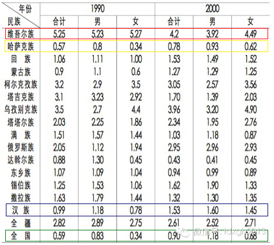

**维吾尔族历来离婚率一直远远高于全国平均水平，但是，随着经济发展和城市化进程，维吾尔族的离婚率不仅没有随之增长，反而“逆势”下降，这种奇特现象背后是什么原因？**

**  
**

文| I_Issak

  

在2012年，当美国人民迎来了离婚率连续第三年的增长时，美国各大媒体为此消息振奋不已，纷纷刊文讴歌美国社会终于“回到正轨”——这绝非刻薄的反讽，多个科学研究
已经证明离婚率往往与经济增长成正比，因此，离婚率的稳健增长，是美国经济脱身衰退泥潭，步入复苏大道的有力证明。

  

2009年，笼罩在经济衰退的阴影中的美国，离婚率曾一度达到40年来的最低水平。纽约时报专栏作家Ross Douthat将此解读为美国家庭共度难关的决心，是困
难时期的“一线希望”，然而事实上，人们不过是衡量了一下离婚带来的成本，发现请律师和分居的代价，以及家庭主妇在萧条经济中寻找一份能糊口的工作，都比暂时忍受同床
异梦要痛苦得多——在经济困难的年代，人们会倾向于推迟做一些人生中重要的选择，比如结婚、离婚以及生子。

  

离婚率增长伴随经济增长的状况同样也适用于中国。1985年，中国每千人口中的离婚数是0.4，而到了2012年则已经增长到2.3。除了经济的增长，以及婚姻观的变
化之外，离婚手续的简化也是造成离婚率飙升的原因之一。

  

说到中国的离婚率就不得不提到维吾尔族。这不仅仅是因为维吾尔人在离婚率方面常年领跑全国，更是因为在中国经济飞速增长，民族政策一片大好的的前提下，维吾尔人离婚率
连年不升反降，与全国离婚率的变化趋势形成鲜明对比。

  

早在1955年，新疆的离婚率水平就已经在惊人的4.36%，经过连年稳步的下降，在1982年、1990年和2000年分别下降到3.56%、2.82%和2.61
%，分别比同期的全国水平高6.03、4.78和2.27倍，稳居全国离婚率地区排行首位。在新疆各民族中，维吾尔人的离婚率最高，1990年5.25%和2000年
4.2%的数据足以令人瞠目。以维吾尔人为主要人口的和田地区，1995和1999年的离婚率在6.83%和6.29%。

  

1990年及2000年新疆各主要民族离婚率

  

与全民信仰伊斯兰教，文化趋于保守的维吾尔人类似，爱尔兰人受保守的天主教文化影响颇深，以至于直到1996年才废除了禁止离婚的宪法条款。即使在今天，爱尔兰仍然拥
有欧洲地区最低的离婚率。即便如此，爱尔兰离婚率的增长趋势十分惊人，从2002年到2012年的十年间，该国离婚人口增长了两倍有余，而这是经济增长以及旧观念的瓦
解带来的必然结果。

  

相比中国和爱尔兰符合直观预期的离婚率变化，维吾尔人的离婚率显得与经验背道而驰。造成维吾尔人超高的离婚率的原因，是维吾尔人独特的文化构成以及民俗习惯。而离婚率
连年来的下降，则是维吾尔人的经济和文化变迁所带来的必然后果。

  

诸多针对维吾尔离婚问题的研究都指出，维吾尔人受伊斯兰文化影响深重，其对维吾尔婚姻文化的渗透源远流长，并占据主导地位。伊斯兰教允许一夫多妻制，男性在婚姻中拥有
绝对的控制权。只要男方意欲，只需说出一句“塔拉克”就可以单方面终结婚姻。这些习俗虽然已经受到现代婚姻制度和法律的打击，但是依然在维吾尔群体中处于野火烧不尽的
状态。然而事实上，这是对伊斯兰文化对维吾尔文化影响的错误评估。

  

不可否认，伊斯兰文化是维吾尔文化的重要组成部分，但是在历史上，维吾尔族一直都是一个相当世俗化的族群。在上世纪80年代，中国刚刚开始向世界开放的岁月里，伊犁地
区的维吾尔人是中国的时尚先锋，行走在乌鲁木齐街头的维吾尔女性穿着时髦，洋气十足。南疆的妇女虽不如北疆同胞那般紧跟潮流，但传统的伊斯兰长袍和头巾尚属罕见。

  

长期以来，维吾尔人虽然有在宴会中男女分桌而餐的习俗，但是男女之间仍然有大量的接触和社交的机会，男女间在街头偶遇并聊天闲扯是平常的事，这和汉族传统文化中对女性
深居简出的要求有极大的不同。女性在家庭中有相当的话事权，在婚姻法实施之前，一夫多妻在维吾尔人当中属于极个别现象。

诺贝尔经济学奖获得者贝克尔认为，人们结婚是为了在婚姻中获得最大化的收益。维吾尔人应该是对这一理论最务实的践行者。无论是自由结合或是父母包办，男女双方及其家人
都对婚姻的快乐感有一个最低期待，当这种期待没有被满足时，维吾尔人会毫不犹豫的用离婚来解决问题——而离婚本身在维吾尔文化中并不被视为一个负面的概念，婚姻的解体
是稀松平常的事，离婚双方也不会因为离婚而受到社会压力，再婚时自身竞争力也不会因为离婚史而被削弱。维吾尔社会对离婚的宽容，事实上鼓励了人们的离婚行为。当一方提
出离婚，另一方鲜有坚持不离的。和田地区的离婚总数中协议离婚的比重（58.7%）远多于全国水平（39.1%），正是这种离婚观的体现。

  

当然，伊斯兰教对维吾尔族的婚姻观念并非没有影响，比如婚前性行为在传统维吾尔社会中就是一个绝对的禁忌。因此在一些案例中，婚姻事实上成为了使性合法化的工具——虽
然几乎不会有人承认这一点。根据徐安琪等对1998年和田地区离婚案件的抽样统计，男女双方属于偶然相识进而结合的占61.5%，平均恋爱时间不到半年，独一无二的数
字背后的原因，大概就是性观念的保守和婚姻观念的超前构成一种怪异组合。

  

此外，因为维吾尔家庭通常是由一代（夫妻）或两代人（夫妻、子女）构成的小家庭，与汉人（尤其南方人）几世同堂的大家庭聚居方式不同，离婚所带来的人际关系重组的成本
也比汉人要低得多，这在很大程度上降低了离婚的心理负担。离婚往往是夫妻双方的事，极少牵扯七大姑八大姨，倒是与维吾尔人载歌载舞、热热闹闹的结婚场面有很大区别。

  

在西方的社会的传统观念中，离婚即便不被视为弥天大罪，至少也是人生中难以启齿的不光彩之事。因此在订婚时，为了防止男方悔婚而削弱女方在婚姻市场上的竞争力，便产生
了以昂贵的钻戒做订婚信物的传统，从外部稳固婚姻的基础（见大象公会《爱她就送她石头做的脑白金》）。

  

正如上文所述，维吾尔女性在考虑结婚时显然不存在类似的担忧，因此在传统的维吾尔社会中，结婚所需要付出的物质成本相当低廉。一般来说，男方的彩礼主要是衣料和首饰，
女方则需要陪送基本的生活必需品，酒宴的成本也并不高昂，如果男女双方属于再婚，则需要付出的钱财更少。低廉的结婚成本降低了男女双方在离婚时的沮丧感，而婚姻质量的
普遍低下反过来维持了彩礼和嫁妆始终处于一个相对低的位置。与维吾尔人形成鲜明对比的，是聘礼高昂的哈萨克民族，这大概也是为什么，哈萨克族是新疆唯一一个离婚率处于
全国平均线以下的民族。

  

然而从长远来看，维吾尔人的结婚成本正变得越来越高，尤其在乌鲁木齐等大城市中，在各阶层民众当中已经形成了不成文的聘礼和嫁妆标准，首饰的纯度变得越来越高，现金的
厚度变得越来越厚，“生活必需品”的定义也从锅碗瓢盆变成了冰箱彩电，婚房的价格早已今非昔比，这都使得夫妻双方在考虑离婚时开始有所顾忌，因为他们很可能甚至结不起
第二次婚。此外，随着婚姻制度的健全和夫妻共同财产的增长，财产分配等问题也使得人们的离婚不如那个空手来空手去的时代潇洒。

  

此外，一方面，西方以及汉族社会对离婚趋于否定的态度也逐渐渗入到维吾尔社会当中，成为维吾尔婚姻观当中的一部分。这使得人们开始更多的寻求除离婚以外的手段解决婚姻
中遇到的问题，因为离婚会为今后的社会活动以及恋爱嫁娶造成深远的负面影响。

  

另一方面，在近十年的时间内，维吾尔人的文化实际上是经历了一场保守化、伊斯兰化的过程。最直观的感受是，无论在城市还是乡村中，维吾尔妇女的服饰明显变得保守，着长
袍、蒙面的妇女随处可见，而在维吾尔男性中，对酒类的排斥显得越发强烈，至少在表面上是如此。在这样的背景下，离婚便显得更像是拿神圣的婚姻盟誓当作儿戏。

  

这种观念的变迁也表现在维吾尔男女离婚率的变化上。根据一项1982年喀什地区维吾尔人口婚姻状况的抽样调查，男性离婚率是7.3%，而女性离婚率是5.68%。19
90年，全疆维吾尔人口男性离婚率也是高于女性离婚率，这意味着一个离婚女性对应多个离婚男性，反映了当时维吾尔女性在婚姻市场上有着更大的话语权。

  

而这种趋势在2000年的人口普查中发生了变化，维吾尔人口中女性离婚率超过了男性离婚率，这说明女性受离婚的影响变大，在婚姻市场中的地位被削弱，典型的保守社会中
男尊女卑的两性定位在婚姻中得到体现。

  

这样看来，中国的经济发展带来维吾尔人的经济发展，经济发展带来离婚率的增长，经济发展同时又会带来文化的开放，文化的开放会导致离婚率的增长，这几个命题中，大概是
有哪条实际上并不成立，否则没法解释维吾尔人令人困惑的离婚率变化。

  

[大象公会所有文章均为原创，版权归大象公会所有。如希望转载，请事前联系我们：bd@idaxiang.org ]

  

———————————————  

**大象公会微社区上线了，入口就在左下角“阅读原文”中，点击进入来吐槽发帖！**

  

[阅读原文](http://mp.weixin.qq.com/s?__biz=MjM5NzQwNjcyMQ==&mid=201273245&idx=1&sn
=1bb223ff9d732308236bda2bd40331b0&scene=1#rd)

