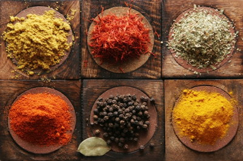
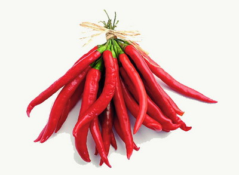
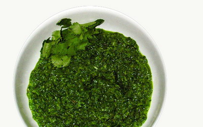
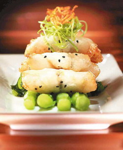

**为什么有的地方口味重，有的地方口味清淡，口味偏好存在穷人重口味，富人淡口味之别吗？**

  

文/黄章晋 I_Isaak

  

川菜的口味特征可用麻辣来描述，贵州菜可用酸辣来描述，湖南菜则可用干辣来描述，但你能用最简短的词描述兰州拉面、沙县小吃、天津煎饼、麦当劳、肯德基的味道么？而日
本料理、广东海鲜、潮汕菜之类，更不可能用最简短的词来概括其味道特征。

  

从传播角度来说，特征越是单一、鲜明、强烈的东西，辨识度就越高，越容易在同类中获得更多注意力。辣或许是我们能感知的味道中辨识度最高、刺激性最强的，以辣为特征的
菜系很容易优先获得人们的注意力，让人们得出中国人口味在变辣的结论。

**特征越是单一、鲜明、强烈的东西，辨识度就越高**

  

而粤菜、潮汕菜、日本料理这类味道丰富细腻微妙的饮食，无论怎么扩张，我们都很难用某某味道征服中国这样的话来概括。与之相似的还有欧洲葡萄酒与北京二锅头，尽管品酒
师和经销商们发明了无数似是而非的词来形容它精妙无穷的口味，事实上除了古怪的酸涩之外，没有人能说得清它的味道，二锅头的“辣”就直截了当得多。

  

**【神圣万能的辛辣】**

什么是辣味？《重口味胜利的逻辑》给出了经典的科普解释：

## 辣其实并不是一种味觉，而是一种类似触觉的感觉。辣椒素是直接刺激口腔黏膜和三叉神经而引起的一种被烧灼的疼痛感，与纯粹依靠味蕾来转换刺激信号的甜、酸、苦、
鲜等其他味觉有着根本的区别。辣带给我们神经的刺激与被火烧灼伤时热的痛觉是同类。

  

既然辣是一种疼痛，嗜辣又是怎么会事？

  

有科学家提出用benign masochism（良性自虐）的理论解释为什么人类喜欢辣椒对口腔产生的疼痛、灼烧感——当人类吃下一口辣椒时，趋利避害的本能告诉我
们自己正身处危险之中，然而理性又告诉我们自己很安全，这种安全享受危险的感觉，能给人带来极大的快感。这和一些人喜欢玩过山车或者看恐怖电影是同样的道理。

**良性自虐理论或许可以解释人类为什么嗜辣**

  

从效用上说，辣是调味品中最具有遮蔽性的味道——请想象一下在大闸蟹、高级刺身和鱼子酱中加入红辣椒后的味道。它确实是所有追求丰富细致味觉菜式的敌人。但如果想弱化
食物中不喜欢的味道，大约找不到比辣椒更便宜、高效的办法了。

  

所以，人们通常倾向于从辣椒的效用上解释为什么有的地方嗜辣。譬如，有人认为嗜辣除了刺激食欲，主要是用来掩盖食材不新鲜的味道。但我们今天已很难从中国嗜辣地区找到
这一用途的可信证据。

  

不过，在嗜辣的印度南部，我们倒是可以看到它重要的效用：这些地方虽被算作稻作区，但有些地方的穷人实际上经常要食用木薯、芋头之类带有气味且难以下咽的食物。没有以
辛辣著称的咖喱，这些粗糙的食物确实难以下咽。

  

在十七世纪辣椒传入印度前，咖喱的特点就是辛辣且香味浓郁，只不过辛辣味由姜黄提供，辣椒传入后，它立即成为咖喱中提供辛辣味道的主力。印度每个地方都有不同的咖喱配
方，但辣椒和姜黄的地位是固定不变的。

**辛辣的咖喱是当时印度穷人下咽粗糙食物的好帮手**

  

辣椒传入中国几乎与印度同时，它从传入中国到被广泛接受，正好与清中叶人口大规模增长、生活水平不断下降同步。而川、贵、两湖、赣这些地区在辣椒传入中国时，刚刚经历
了大规模移民迁入，即“江西填湖广，湖广填四川”。在饮食偏好被打碎重组，且处于食物不断匮乏的地区，或许比其他地方更容易广泛接受辣椒。

  

然而，以辛辣的效用来解释地域性嗜辣偏好，最多只能说具有某种相关性，很难得出像日照强度决定一个地区是否嗜辣这样的因果结论。某个原因会导致更容易接受辛辣，不等于
接受辛辣就一定是这个原因。

  

另外，形成某个口味偏好有时完全不需要任何实际效用，只需要旁边有一个偏好强烈到已上升为文化的邻居。

  

譬如印度北部的小麦耕作区，有些居民的饮食带有北方游牧民族祖先的习惯，他们喜欢的饼和奶的“正宗”吃法都与咖喱无缘，食物中也鲜有印度南方那些难以下咽的东西，但这
些入侵者的后裔甚至会把咖喱加到牛奶中，只不过口味要比南方清淡一些。

  

民间对辛辣口味的效用解释更不可信。所谓吃辣防潮去湿这种说法，非常符合拟物思维下人们对世界的观察。问题是，民间口口相传的经验观察是非常不靠谱的，譬如东北过去曾
用“一猪二熊三老虎”来为猛兽排行，若真是如此，动物学家可以集体自杀了。

  

吃辣防潮去湿折射的其实是中国传统哲学，而印度人认为辛辣可以调身体、养肠胃之类，折射的则是印度哲学。印度有些说法与中国正好相反，比如姜的刺激性之于毛发的关系，
中国人认为涂抹姜可以刺激毛发生长，而印度女性涂抹姜黄的一个功能，则是为了抑制毛发。

**吃辣防潮去湿折射的其实是中国传统哲学**

  

民间对口味偏好的功能解释很容易上升到文化高度。在印度，咖喱中的姜黄，因为历史最悠久且在各地咖喱中均是最重要成分，被上升到驱邪、驱魔的高度，在印度传统医学中几
乎是万能的，它的黄色也被赋予特殊地位，中国更不含糊，“不辣不革命”。

  

**【穷口味与富口味】**

然而，不同地区相似的口味偏好，有时确实有相似的外部环境规律。

  

工业革命前，腌制、熏制、发酵是保存食物的有限手段，越是无法保证任何时候都可获得新鲜食材的地区，越偏好大量使用腌制、熏制、发酵食物；而偏好辛辣等刺激性风味的地
区，往往是过去相对缺少优质食物来源的地区。

  

如果一个地区具备上述两个特征，它形成的口味很容易被认为是重口味的。

  

而在物流便利或优质食材相对更丰富的地区，确实会形成较少使用刺激性调味品的饮食偏好，往往更容易将食材能否体现原汁原味上升为烹饪的审美标准。

  

但这并不一定都意味着烹饪讲究原汁原味的地方，一定就比烹饪时相对重口味的地方富裕。譬如蒙古人传统的羊肉烹饪方式，都是清水里撒一把盐煮着吃，讲究新鲜和原汁原味，
而哈萨克人除了水煮，也偶尔烤制，到了中亚再往西，羊肉多烤制，会加入大量调料。并且越是富裕发达地区越是如此。

  

刺激性调味品可以增强食欲，通常对富有的人来说，这不是一个值得追求的目标（但古波斯的贵族们也曾把食量当成男子气和勇武的象征），把原汁原味与重口味上升到富人与穷
人格调差别的，也是上层社会人士。公元前四世纪的古希腊美食家阿切斯特拉图（Archestratus），以六步格诗的形式留下来的《奢侈人生》，可算这种“腔调”的
最早代表。

**《奢侈人生》，作者阿切斯特拉图**

  

曾走遍整个古希腊世界的阿切斯特拉图相信，高端的烹饪必须奉行极简主义，选用最好的食材并配以最少的作料，而偏爱调料则被他视为“极端贫困的标志”。奶酪这种希腊人常
用的食物放在鱼里，会被他认为是对其原味的玷污。

  

当时的希腊上层社会，因为哺乳动物主要用于祭祀神祇，认为哺乳动物是下等人才会吃的东西，上等人应该吃鱼。所以阿切斯特拉图存世的62段诗中，有48个和鱼有关。当然
，他认为鱼应当保持原味，只能撒一点孜然及少量的盐。

  

但是，如果辛辣刺激的调味品是稀缺物，格调或许会反过来。生活在公元元年前后古罗马的贵族阿毗丘斯（Apicius）留下了一本叫《关于烹饪》的指南。书中500份食
谱中，有400个是关于调味汁的——疆域辽阔的罗马人有机会接触和获得远方各种香料，于是更多昂贵的调味品就成了身份和品位的象征。

****罗马传统酱汁garum****

**在古罗马，更多的调味品象征身份与品味**

**  
**

尽管由各种香料混合而成的咖喱是印度穷人下饭时必不可少的帮手，但对中世纪的欧洲人来说，香料则是昂贵的奢侈品。直达印度的海上路线被打通后，欧洲上层社会立即变成重
口味。当时一本食谱这样记载：30毫升胡椒、30毫升桂皮粉、30毫升生姜粉及四分之一个丁香和四分之一个藏红花即可做成万能酱料，“可以和所有食物搭配”。这个贵族
调料配方比印度穷人的咖喱配方口味要重得多。

  

直到香料变得便宜，咖喱味在欧洲才不再是高端象征，但仍以富人的口味传到日本——受印度影响喜欢吃咖喱的英国人，在当时日本眼中是值得全方位效法的富人，不过，经过欧
洲人二传，咖喱落户日本后，已经顺应日本口味变得非常清淡了。

**欧洲贸易者收获胡椒的场面，取自《马可**波罗游记》**

  

另外，很晚才出现的川菜、湘菜，在其形成之初都是口味清淡的——两者都始于官宦私家菜，川菜得益于淮扬、杭帮菜和更早的满洲厨师，而湘菜则得益于江苏菜、潮汕菜（详见
**大象公会《美食的政治经济学》**）。

  

当两者走出豪门，与本地大众口味相结合时，才逐渐开始变得重口味。而且正宗的成都菜馆是不那么辣的，真正辣的川菜，其实是下河菜。它或许是穷吃重口味，富吃淡口味的注
解。

  

**【穷吃穷口味，富吃富口味】**

今天，重口味已经在高端西餐中无处可寻，西餐评价体系又一次回归了阿切斯特拉图的极简主义烹饪哲学，甚至对于神户和牛、鲷鱼刺身等高端食材，烹饪流程已经被全盘抛弃，
生吃才被认为是对这等食材的起码尊重。

**极简主义烹饪哲学今天重新回归大众视野**

  

当然，这个前提是已经不会有什么新的口味，从地球的某个角落突然冒出来，忽然成为只供少数人把玩的极品美食——就像胡椒和辣椒刚被欧洲人发现后的一段时间一样。

  

中餐的整体评价标准似乎与西餐评价标准的变迁并不同步，而且中国并未出现显著的口味阶级差别——如果只吃中餐，在北京月薪三千和月薪三万的人，吃的东西基本不会有太大
的差别，二三线城市更是如此。

  

今天中餐的面貌和格局，其实只是近三十年发展的产物，其从业主力是职业规划极不稳定的流动人口，而无论是西方还是以美食著称的日本、香港，支撑其餐饮业的骨干人群，往
往是职业世代相袭的。

  

前者相对是民工文化，而后者则是匠人文化。所以，整体上西餐、日本料理都是有名厨概念而无名菜概念，对食材潜在味觉想象力的开发才是其烹饪的精髓，而中餐有名菜概念而
无名厨概念，这时候要想味道，最大的帮手只有调料，而调料中效果最显著的，当然是辣椒。

**纪录片《寿司之神》是日本匠人精神的典型体现**

  

然而，即便你认为穷地方多重口味，富地方多口味清淡，而饮食口味总是因为人口流动流动由穷地方向富地方传播，也应当注意到外来“入侵者”在口味上向本地人的妥协，对外
地的家乡菜不正宗的指控，正是这种妥协性适应的结果。

  

另一种口味的调和，则是洋品牌快餐及少数成功的中国学生由中心城市向偏远地区的逆袭，它们的扩张与劳动力流向无关，凭借的是资本尤其是管理上的绝对优势。口味上，它们
往往寡淡到几乎无法描述的程度。

  

不过，这种建立在以科学手段研究人类口味的基础上的口味，或许对多数成年人没有吸引力——除了甜味和富含油脂等高热量食物的味道，是人进化过程中形成的无法抗拒的诱惑
外，各种地域性偏好的重口味，都是后天被妈妈从小“矫正”培养出来的（见**大象公会《美味还是重口味，妈妈说了算》**），但口味还在形成的儿童对它完全无法抵抗。

  

我们还应当敏锐看到，焦虑的中产阶级正在积淀和孕育新的饮食标准——我们现在偶尔能在电梯间看到黑猪肉广告，阳澄湖大闸蟹莫名其妙地成为instagram必拍菜品，
北、上、广、深极少数高端中餐，也开始强调名厨。

  

与此同时，油多味重的川菜在横扫中国时，也在北、上、广、深一小批中产阶级食客心中被打上了“地沟油菜系”的歧视性标签。而没有任何地域性色彩，与重口味绝缘的新派菜
餐馆，也在城市新中产阶层的追捧下悄然成长。

**新派菜餐馆正逐渐受到追捧**

  

除了中餐本身的悄然变化，西餐和日本料理虽然价格高昂，却俘虏了越来越多中国高收入人群的口舌。这种逆劳动力流向的饮食文化的传播，除了资本的推动力外，另一个原因，
就是收入与口味偏好的阶级分化。

  

谁能说中国没有穷吃穷口味，富吃富口味的现象呢？

  

**版权声明**

****大象公会所有文章均为原创，****  

****版权归大象公会所有。如希望转载，****

****请事前联系我们：****

bd@idaxiang.org

****知识 | 见识 | 见闻****

阅读

__ 举报

[阅读原文](http://mp.weixin.qq.com/s?__biz=MjM5NzQwNjcyMQ==&mid=207162225&idx=1&sn
=aa7e5f3a6b910e88696f3ed6bb79e295&scene=0#rd)

