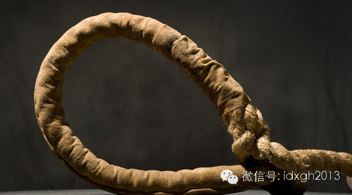
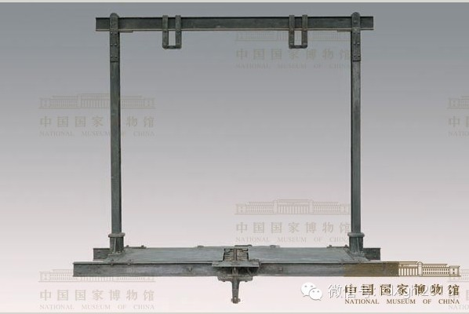
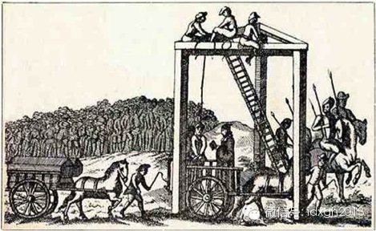
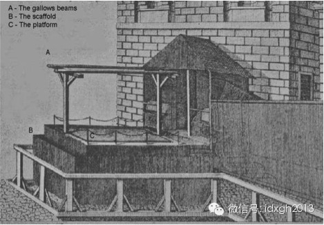
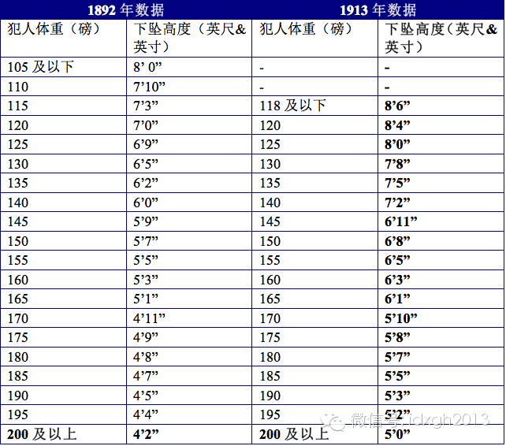

李大钊在绞刑架上受刑三次曾被描述为反动派的故意，事实上，可瞬间致死的自由下坠式绞刑，是人道主义发明，只是不易掌握。为保证死的迅速且体面，英国曾不断修订体重与
绳长的对比数据。

    

文/ I_Issak

  

1919年4月15日，袁世凯心腹洪述祖因谋杀宋教仁而被判死刑。

  

在死刑判决前不久，时任北洋政府大总统黎元洪已下令废除斩首的行刑方式，并从意大利进口了一台绞架，因此洪述祖就成了中国司法史上死于绞刑的第一人。

  

然而，刽子手显然缺少执行绞刑的经验，即便在处决之前，刽子手们曾用一条大胖狗练手，但是，当洪述祖脚下的踏板被抽出后，他的身体在下坠一段距离之后即刻身首分离，场
面惨不忍睹。

  

即便在八年之后以绞刑处决李大钊等人时，他们还是没能很好的驾驭执行绞刑的要领——李大钊竟前后被来回绞了三次才最终得以安息，这大概是死于绞刑者最大的噩梦。值得一
说的是，李与洪均死于同一绞刑架，它现存于中国历史博物馆，为国家一级文物，编号0001。

  

_历史博物馆收藏的李大钊绞刑架（图片来源：中国国家博物馆）_

_  
_

_ _

_李大钊的绞刑架照片_

  

中国刽子手的糟糕表现未必会遭同行耻笑。英国人是现代绞刑的发明者和推广者，拥有举世无双的绞刑技术，但历史上同样有过无数失败的行刑案例。

  

《绞刑架的阴影》一书中写道：“死刑在英国历史中是如此重要，以致许多卓越的人都不能想象没有死刑的未来。“早在公元五世纪，日耳曼部落盎格鲁、撒克逊就将绞刑架带到
了如今的英国，绞刑在英国的历史和英国人身份认同的形成一般久远。

  

十一世纪英国国王“征服者”威廉废除了对除偷猎皇鹿之外的所有罪名的死刑判决，而用阉割等其它致残方式取而代之。但他的幼子亨利一世登基后很快恢复了死刑，除绞刑最为
常见外，水煮、火烧等刑罚也不算鲜见。

  

在十九世纪，共有222个罪名可以将一个人送上绞架，包括“冒领残废军人抚恤金”罪及针对7-14岁儿童的“怀有明显恶心”罪。这为英国绞刑技术的提高和进步提供了源
源不断的实验材料。  

  

英国当时的绞刑，还是全球最通行的悬挂式，窒息是唯一致死原因。而中国和有些国家的绞刑，则是由刽子手徒手、借助机械以及畜力拉紧绳索两端等方式，以阻断颈动脉致大脑
缺氧死亡，其过程较为迅速。相比之下，悬挂式处决的过程要缓慢痛苦得多。

  

也许因为吊在绳索上扭曲挣扎有损贵族的形象，斩首是处决贵族的常用手段——英王查理一世（1649）、苏格兰女王玛丽一世（1587）等等都是斩首处决，领受绞刑的是
平民（这与古代中国相反，因绞刑能保持身体的完整，它通常用于较体面的赐死）。

  

早期，一棵分叉的树就能构成一个悬挂式绞架，犯人或者被刽子手以拖拉的方式悬挂起来，或者是在马车或梯子之上套好绳索之后被移去支撑物（与常见的上吊自杀的方式相类似
）。当处决任务繁重时，这种原始的绞架便显得力不从心，因此很快被由两棵树（或者立柱）和一根横梁组成的绞架取代，方便同时处决数人。需要在案发当地处决罪犯以平息民
愤时，结构类似的可拆卸绞架被投入使用。

  

_由两棵树（或者立柱）和一根横梁组成的绞架_

  

1571年，追求效率的伦敦人在泰伯恩行刑场树立了“三棵树绞架（tripletree gallows）”，创新的结构带来了惊人的效率，伦敦人曾在此同时处决24
个犯人。三棵树绞架一直效力到1759年，最终因为其固定结构造成交通拥堵，被可拆卸绞架取代。

  

_三棵树绞架_

  

英国最后一个被悬挂处决的犯人是约翰**亨利**约翰逊，他在第一次被处决时因绳索脱落，十分钟后再被悬挂一次。当时记载说他挣扎4分钟后才最终断气。因此，当罪犯被
悬挂起来，亲友们为减少其痛苦而抱住犯人身体向下拽的场景并不鲜见。

  

悬挂式处决死亡过程漫长的缺点，倒是救了几个幸运儿的命。一个著名的例子发生在1705年，被吊上三棵树绞架的犯人吊了15分钟后竟然还在挣扎，围观群众忍不住高喊“
缓刑”。获准免死后，生命力旺盛的的犯人很快在临近一个小屋内恢复了元气。当被问道双脚离地时的经历时，他说一开始很快就感受不到任何痛苦，被解救下来后，才感到“无
法忍受的剧痛”，以至于他“几乎希望那些把他解下绳索的人被吊上去”。

  

这些案例，意味着绞刑技术尚有太多需要提高的地方。另外，十九世纪英国反对死刑的情绪蔓延，可判死刑的罪名已减少到4个（包括谋杀、在皇家码头纵火、叛国和用武力在海
上劫持）。寻求更人道处决方式的英国人开始用科学的眼光审视绞刑，他们发现颈椎的断裂可造成瞬间死亡。这一发现很快被用在绞架的设计中。

  

在1783年12月9日的纽盖特刑场，9男1女共十位犯人被同时送上一个结构像盒子、由两根横梁组成的新型绞架，站在一个10英尺长，8英尺宽的平台之上。当他们的脖
子被套上绳索之后，行刑官触动杠杆机关，犯人们脚下的平台瞬间被抽空。犯人的身体在自由下坠几尺距离之后，被紧绷的绳索猛然拽止。清晰可闻的劲椎断裂声意味着犯人是瞬
时死亡的。

  

_第一台长坠式绞架_

  

新式绞架的干净利落使它声名大噪，很快在英国全境普及开来。由于新型绞架的首要目标是造成犯人的颈椎断裂，各地行刑官都尝试将犯人身体下坠的距离拉长，这也是为什么这
种绞架被称为长坠式（long drop）绞架。

  

长坠式绞架的杀人机理在于，当犯人以自由落体状态下坠，突然被绷紧的绳索拽住时，相当于巨大的力量猛其颈部。如果绳结（由金属环构成）被正确的置于犯人下巴左侧，则他
的身体停止下坠时，头部会向后仰去。配合足够的拽力，其劲椎会从第二和第三节处断开，造成瞬间昏迷和迅速死亡。

  

如果金属环的位置不准确，犯人的头部向前倾，则作用力会集中在气管，造成犯人最终死于漫长的窒息过程。事实上，让绳索的力量作用于劲椎并最终造成死亡的，是最后15厘
米左右的下坠，而这个过程通常仅需要0.02到0.03秒。可见，正确执行的长坠式绞刑是一种理想的行刑手段。

  

然而，“正确”二字实际上非常难把握，犯人的体重以及绳索长度的不同，会直接影响作用在颈部的拽力。拽力太大，则犯人很可能会身首分离；拽力太小，犯人的劲椎不能被瞬
间拽断。洪述祖和李大钊就是长坠式绞刑两个失败的极端案例。

  

塞缪尔**霍顿神父是历史上第一个给总结出体重与绳长公式的人。基于长时间观察，他在1866年发表的论文《关于绞刑，从机械和生理学角度》中提出，“用2240除以
犯人的体重（以磅为单位），即可得到理想的绳长”。

  

霍顿的意见得到官方的重视。然而，他给出的常数系数太大，以至于身首分离的状况经常出现在刑场。这对犯人来说虽然甚至是一件好事，因为死于窒息而不是颈椎断裂的可能性
大大降低，但在英国人看来，身首异处的惨象实在不够体面。

  

1886年，受英国政府委托，阿伯德尔公爵开始研究英国的绞刑，他的重要任务之一就是提供一个犯人体重和绳长的对应关系表。阿伯德尔公爵最终保留了霍顿的公式，只是将
他提出的常数系数调整为1260（112磅以上）和1120（112磅以下）。

  

经过更多论证及教训之后，英国内政部最终拿出一张完整的参考表，常数系数被进一步降低到840。事实证明这是一次矫枉过正——缩短的绳长导致一些犯人遭受长时间折磨后
才窒息死去，1913年，常数系数又被调整到1000。不过人类骨骼、体格各异，行刑者有时还是要依赖个人经验。1939年后，通常的做法是在1913年表的基础上再
加9英寸左右的绳长。

  

_1892年和1913年体重和绳长对比表_

  

不过，保证死刑的迅速和体面，还需要丰富的经验，人们至今都无法制作一个精确的对应表，以保证万无一失。文献显示，除英国外，上个世纪以绞刑处决犯人的国家都出过各种
意外。

  

最近的例子是萨达姆。2006年12月30日，侯赛因**萨达姆因反人类罪在伊拉克被绞刑处决。下坠之后，现场人员听到一声脆响，意味着萨达姆的颈椎断裂，死亡迅速。
但后来传出的录像显示，萨达姆脖子上有一道撕裂伤口，处决用绳长过长了。而萨达姆曾经的部下巴尔赞**易卜拉欣2007年1月15日被处决时，头部不幸被完全拽落。

  

除了绳长和绳索的固定之外，犯人肢体的固定也至关重要——在1883年的一次处决中，绳子缠在了犯人的手臂上，最终缩短了下坠的距离，导致行刑官不得不将犯人拉上来再
扔下去一次（倒霉的犯人最终还是死于窒息）。

  

1850年之前，犯人的手通常从手腕处被绑在体前，再从手肘处固定在身体两侧，这样的绑法方便让犯人在行刑前进行祷告，但也容易在犯人挣扎时导致类似1883年的悲剧
，此后，将手腕固定在体侧的绑法流行开来。后来在1890年代，将手绑在身后的方式因其操作便利成为主流。

  

在悬挂式绞刑处决的年代，大概因为悬挂着的犯人猛蹬的双腿能给围观群众带来视觉刺激，犯人的腿部一般不做固定——除非为防止身着裙子的女性犯人走光而将其腿部捆绑并紧
。在长坠式处决中，为防止犯人横跨活动平台而破坏死刑进程，将犯人的脚踝绑在一起成为标准操作。

  

英国对绞刑技术的完善最终成为一个文化输出：随着殖民地的开辟，绞刑也被介绍到澳大利亚、加拿大、南非、爱尔兰、印度、香港、新加坡、马来西亚等国家和地区。明治维新
时期的日本在1880年用绞刑代替斩首，并在控制朝鲜后将绞刑技术带到朝鲜半岛。

  

1964年8月13日早晨8点，同时分别在利物浦和曼彻斯特处决的两个犯人成为英国最后两个被处决的人。1999年，随着欧洲人权公约第六条的修改，死刑在英国被正式
废除。

  

与英国人终于明白人道主义并不在于仔细计算绳子的长短不同，伊朗等一些国家至今都在用悬挂式公开处决的方式，处决包括孩子和政治犯在内的各类罪犯。伊朗虽然在处决手法
上臭名昭著（伊朗在古波斯时代就曾采用悬挂式的绞刑，历史有2500年之久），但是在处决数量上还只有做千年老二的份。

  

[大象公会所有文章均为原创，版权归大象公会所有。如希望转载，请事前联系我们：bd@idaxiang.org ]

  

[阅读原文](http://mp.weixin.qq.com/s?__biz=MjM5NzQwNjcyMQ==&mid=200398999&idx=1&sn
=4558d38bfcf851fbcfe68c1c063a6e44&scene=1#rd)

