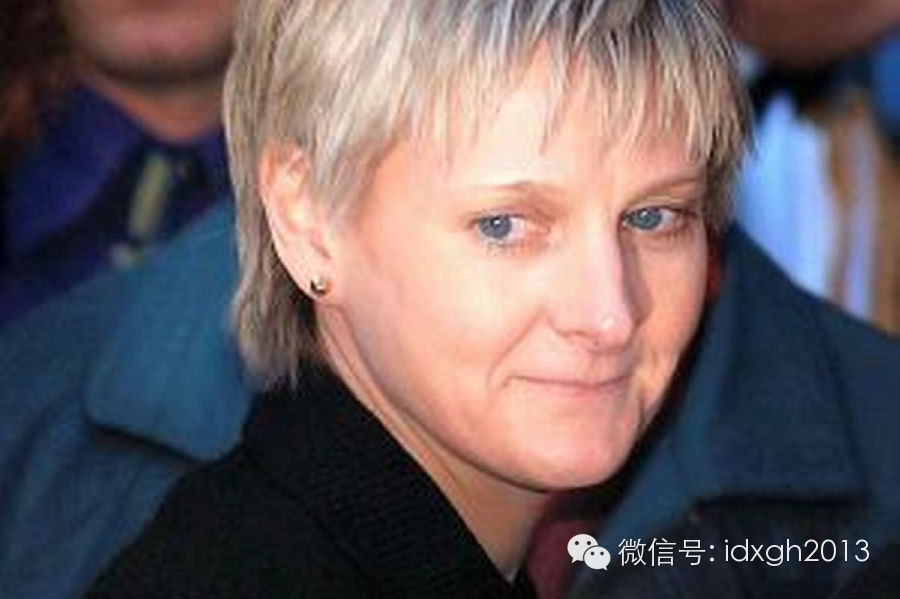
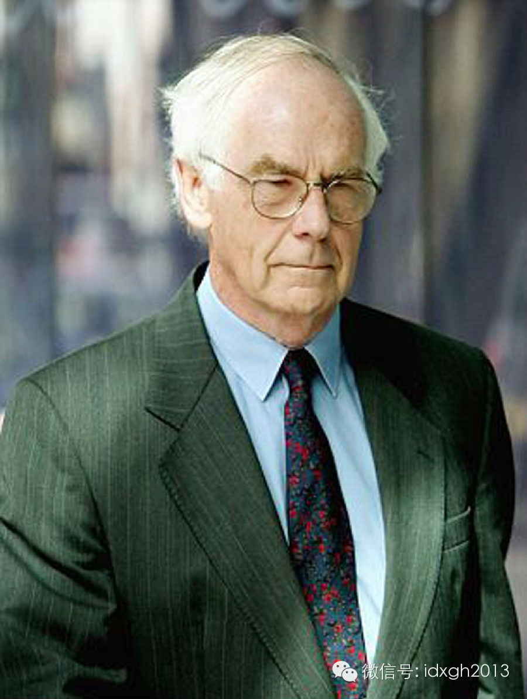

**一位母亲被法庭认定为杀害了自己的孩子，随后事情又戏剧性地出现转折，这一切全都是因为统计学的计算。**

  

文/胡贲

  

1999年底，全英国媒体都像疯了一样报道一位冷血杀手：34岁的英国女律师萨利**克拉克被控谋杀自己两个亲生孩子。她的第一个孩子在三个月大时原因不明猝死。一年
以后，第二个孩子也在两个月大时原因不明猝死。

  

当时，医学界才刚刚开始注意到一个被称为“婴儿猝死综合征”（SIDS）的现象。也就是在发病前完全健康，在死亡以后的尸检中也无法检出病理原因的婴儿突然死亡案例。

  

萨利的第一个儿子，在尸检后就被确认为是一例“婴儿猝死综合征”病例，但她第二个孩子猝死时，负责尸检的医生对这位母亲产生了强烈怀疑，遂向警方举报。

  

控方找不到直接的证据：在两次婴儿死亡事件中，这位母亲都是单独和婴儿在一起。在与婴儿的接触中，无论是医院还是邻居都表示，他们看上去都非常健康活泼，看不出有受到
虐待的迹象。

  

和一般人对杀婴母亲的刻板印象不同，萨利并不出身底层——她是一名律师，家庭优渥，十分漂亮。

  

一个工作生活中处处受人尊敬，金发碧眼的白人女性，实际上却很可能是亲手杀害自己两个孩子的冷血杀人狂。这种社会案件，总是更能引起人们的兴趣（**见大象公会往期文
章《为什么漂亮的女人更容易失踪》**）。

  

萨利•克拉克（Sally Clark)

  

由于缺少可靠的人证、物证，最终参与萨利一案的10名陪审团成员，只能通过听取一连串的医学专家证人的证词，以判断萨利是否有罪，而出庭的专家证人各执一词。

  

本来，这种局面应对律师出身的萨利有利，但不幸的是，她碰上了英国儿科权威罗伊**梅铎，梅铎刚被女王封爵，声名正旺，并且拥有权威的统计研究——“婴儿突然死亡的秘
密调查”（CESDI）。

  

这是梅铎爵士受英国政府委托，率领一只跨领域的团队，仔细研究了4万4千多个样本后刚刚完成的研究成果，正好运用到萨利案件上。法庭上，梅铎爵士根据报告得出推论：

  

◤对于萨利家这样，母亲大于27岁，家庭无人失业，无人抽烟的家庭，出现婴儿突然死亡综合征的概率是1/8543，但如果连续出现两起，这概率则为1/7300万。◢

  

梅铎爵士一头白发、仪表堂堂，仿佛绝对权威的象征。当时媒体报道称，令人尊敬的梅铎爵士出现在陪审团面前时，以不容置疑的牛津口音，一字一句念出其专著《儿童虐待的基
础知识（ABCs of Child Abuse）》中的一句话：一个死婴是不幸，两个死婴很可疑，三个死婴就是谋杀！

  

他在《儿童虐待的基础知识》中，根据临床研究得出结论：没有证据表明婴儿猝死综合征有家庭聚集的现象，但儿童虐待案件却几乎总是有家庭因素：一个虐待过老大的母亲，很
大可能性会虐待老二、老三。

  

梅铎爵士的上述结论，被总结为“梅铎定律”，其在20世纪90年代对英国的检察机关和社会工作机构影响深远：对那些有着两个或以上婴儿猝死病例的家庭，社工和警方都以
“有罪推定”的方式处理：除非有其他证据证明，否则这些人都有极大的可能虐待，甚至故意杀害自己的孩子。

  

梅铎爵士的推理逻辑如下：

  

  1. 统计表明，萨利这种家庭出现婴儿猝死的概率是1/8543。所以，萨利的婴儿猝死的概率是1/8543。

  

  2. 一个婴儿猝死的概率是1/8543的话，那么同一个家庭两个婴儿连续死于婴儿猝死综合征的概率就应该是1/（8543××8543）。

  

  3. 这个概率实在是太低了，因此，我们有理由对萨利进行有罪推定。而萨利和她的辩护团队拿不出证明萨利没有杀害自己婴儿的证据。

  

罗伊**梅铎（Sir Roy Meadow）

  

这个论点听上去没有任何问题：如果中国婴儿出现兔唇的概率是1/10万，那么你未出生的小宝宝出现兔唇的概率不就是1/10万？如果一个人连续中了两次福彩双色球，那
就肯定有猫腻对吧？而一个犯罪现场的DNA如果和一个犯罪分子的DNA基因库中的某个DNA样本匹配，而匹配的概率是1/200万的话，那么这个人就有很大的犯罪可能
。

  

难道不是吗？

  

在此之前，梅铎爵士已经多次作为专家证人在类似的案件中出庭，他不容置疑的权威地位决定了案情的走向——萨利也不例外，既然萨利和她的辩护团队拿不出证明萨利没有杀害
婴儿的证据，那么萨利就是凶手！

  

萨利**克拉克的上诉被驳回。但案情在接下来出现奇迹般转折。由于案情诡异，加之萨利的美貌和优渥出身，以及媒体大面积报道，梅铎爵士的证词迅速得到学术领域的广泛关
注。

  

于是，一个看似毫不相干的专家群体介入了萨利案。英国皇家统计协会发表了一份新闻声明，公开指责梅铎爵士推理的每一步，都犯下了在统计学界广为人知的错误。在声明的最
后，皇家统计学会甚至一改老派英国机构的外交辞令和说话给人留余地的英国绅士范儿，用斩钉截铁的口吻表示：

  

◤尽管很多科学家都对统计学方法有某种程度的认识，但统计学依然是一个专业领域。皇家协会敦促法院能保证在法庭上使用统计学证据时，必须是由经过适当认证的专家来呈现
，就和其他专业领域在作为法庭证据时的情况一样。◢

  

那么梅铎爵士犯了哪些统计学错误呢？

  

首先，梅铎爵士假设，因为他的调查研究结果显示，萨利类型家庭出现婴儿猝死的概率是1/8543，那么萨利的孩子猝死概率就是1/8543。这是典型的“环境谬误”。
亦即，假设总体的概率，就是个体的概率。

  

这就好比说，中国人出现兔唇的概率是1/10万，那么你的孩子出现兔唇的概率也是1/10万。实际上，你的孩子出现兔唇的概率到底是100%还是25%，或者无限小，
取决于你和你配偶的基因，与中国人整体的发病率没有直接联系。

  

梅铎爵士犯下的第二个统计学错误，则是“独立性谬误”，亦即，在需要证明独立性时，却假设独立性先验存在。

  

婴儿猝死并不是掷骰子，尽管婴儿猝死的概率太小，研究不易，科学家们现在依然无法确定导致婴儿突然猝死的生理和病理过程。但是，这肯定是某种原因导致的，而在一个家庭
里，这种原因可能是持续影响的：这或者是因为萨利夫妻的基因问题，或者是家庭的环境问题。

  

根据梅铎爵士的计算，如果一个家庭连续出现两起婴儿死亡的概率是1/7300万的话，英国的历史上就应该显示，大约每100年才会有一起“一个家庭连续出现两起婴儿猝
死的案件”。

  

实际上，就在萨利案宣判后几个星期，英国医学期刊（British Medical Journal）刊登了一篇论文，以数据显示英国大约每年都会出现一起“一个家庭
连续出现两起婴儿猝死”的案件。而梅铎爵士自己就曾在多次类似的案件中作为专家证人出庭作证。

  

第三个统计错误，则是著名的“检察官谬误”，当DNA检测手段被大规模应用于刑侦工作中时，人们才注意到这一错误。在DNA检测的早期，人们并不是对全基因组进行测序
，而是采取片段比对的方式，这时，DNA比对命中的概率大约是数万分之一。这当然也是一个非常小的小概率事件，但是，当DNA样本库足够大时，命中的概率就会非常大了
。

  

我们假设DNA比对命中的概率是1/10000。当DNA样本库达到20000个样本时，任意一个DNA片段在这个样本库中命中的概率计算方式如下：

  

  

也就是说，在一个20000人的样本库中，任何DNA都有86%的可能性命中。这也很好理解：尽管每一个人抽中福彩大乐透的可能性是数百万分之一，但是，我们几乎每一
期都会开出中奖的用户。

  

梅铎爵士的逻辑是“因为一个家庭连续发生两起婴儿促使的概率实在太低了，因此发生这件事情的家庭就很可疑”，这就比如说：“因为中福彩大乐透的概率实在太低了，所以你
家隔壁邻居中了福彩大乐透就非常可疑”。

  

事实是，每期卖出那么多彩票，总得有人中福彩大乐透。英国每年出生那么多婴儿，总得有人中“连续两个小孩猝死”的乐透。20世纪90年代初，英国和美国的法庭都在多个
判例中确认了“检察官谬误”的地位，对DNA证据的使用进行了规定。但这些原则却并没有在本次审判中使用。

  

统计学应用上的争论，让“杀婴事件”案情两次逆转，最终，由于皇家统计协会的报告，2003年，萨利**克拉克赢得了第二次上诉，并且英国法庭重启了243个类似案件
的调查，目前能查到至少有4起案件因此而改变判决。

  

但对萨利来说，一切都太晚了，2007年，这位失去了两个孩子，还被当成杀人恶魔的母亲，因为酗酒过度而死于家中，年仅42岁。

  

而我们的梅铎爵士，从此失去了成为法庭专家证人的资格，作为儿科权威，他依然安度晚年。

  

> 版权声明：  

> 大象公会所有文章均为原创，版权归大象公会所有。如希望转载，请事前联系我们： bd@idaxiang.org

大象公会：知识、见识、见闻

微信：idxgh2013

微博：@大象公会

投稿：letters@idaxiang.org

商务合作：bd@idaxiang.org

举报

[阅读原文](http://mp.weixin.qq.com/s?__biz=MjM5NzQwNjcyMQ==&mid=205005116&idx=1&sn
=5d5274a3ad2a6179c0a040ba6a225910&scene=0#rd)

