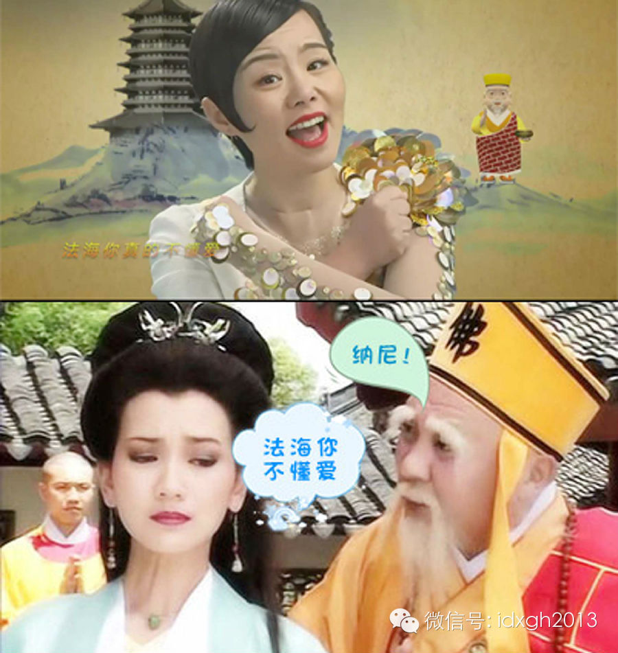
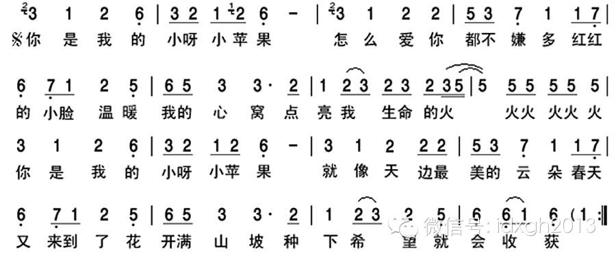
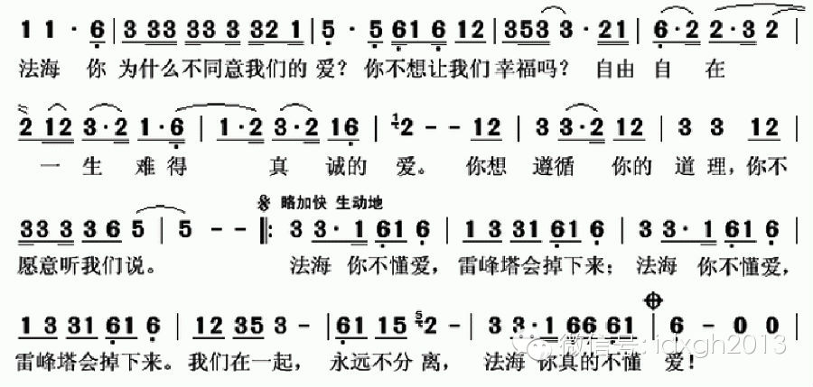
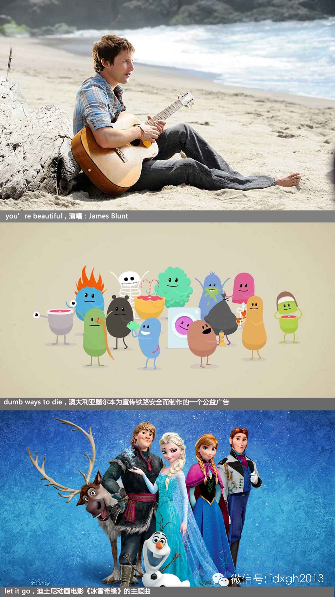

**“你是我的小呀小苹果”，看到这句话时，你是否情不自禁唱出声？是否曾试图摆脱旋律循环，却无计可施？为什么会这样？**

  

文/郑子宁

  

又一曲梦魇产生了。

  

继《爱情买卖》《最炫民族风》等之后，作为“神曲”风向标的广场舞舞者，今夏跳起了《小苹果》。

  

很多人并不喜欢这段旋律，但麻烦的是，却无法摆脱其在脑海中盘旋。试一试大声读出这句话：“你是我的小呀小苹果”，就知道问题有多大。

  

因为《小苹果》走进了军营。它甚至惊动了《环球时报》。

  

该报评论文章《“小苹果”不能进军营》根据该曲编导是一位金姓韩国人，火眼金睛地挖掘出它可能是美国的阴谋：“二战后，美国在文化上成功改造了日韩青年，让他们去男性
化，娱乐、审美、心智变得儿童化。目前，这种美国主导的文化改造正通过韩流日风，影响中国青年。这一点值得中国有关部门高度重视和警惕。”

  

《法海你不懂爱》在2013年初风靡一时，有大量以此为主题的二次创作

  

为什么这些神曲容易在脑中循环？它们的特点是什么？当循环发生后，有没有快速摆脱的解药？

  

**【精神病或正常现象？】**

  

令人欣慰的是，神曲现象不止发生在中国。

  

德文中对此有个形象的称呼：Ohrwurm，字面义为“耳虫”——不断回响的旋律正如皮肤上爬动的小虫子，让耳朵直犯痒痒。这个词在80年代开始被英文吸纳：earw
orm，或者转译为更严重的词汇：brainworm（脑虫）。

  

一项对芬兰12420位网民的调查统计显示：91.7%的人每周至少会经历一次耳虫，33.2%的人每天一次，26.1%的倒霉蛋更是一天会数次被袭击。同时，15.
1%的人认为耳虫使人烦恼，在各种感官刺激中高居第一，超出第二的幻视（7.4%）一倍余。严重的耳虫足以困扰生活，效果堪比强迫症。

  

本质上，神曲贯脑属于一种不可控的听觉意象：没有实际听觉刺激时，大脑仍循环想象出声音。这种无意识认知在一定程度上可被认为是幻听。

  

神曲往往搭配着令人印象深刻的舞姿

  

可以肯定的是，耳虫和跟音乐接触有正相关，音乐家是受耳虫侵扰最多的人群。但由于工作的特殊性，许多音乐家反倒觉得耳虫是一种享受，至少可以启发灵感。

  

丹尼尔**列维京在2006年的研究中总结，耳虫旋律一般为15~30秒，这得到了2010年《英国心理学杂志》一篇文章的确认。部分研究表明，女性和年轻人相对男性
和老年人更加容易招耳虫，强迫症患者遭遇耳虫现象比常人略多。只是这些观察尚未达到统计学显著性要求，需要进一步确认。

  

进一步的研究其实十分困难。对于科学界，缺乏客观标准来衡量耳虫这种主观想象。截至目前，其发生机理目前并没有合理解释。虽然通过对大脑活动的检测，确认处理耳虫的和
处理真实声音的脑区一致，但究竟由具体哪些区域生成仍存疑。并且，耳虫的触发机理、不同人群的触发差异，也众说纷纭。

  

但时间并不等人，诸多音乐人奋力工作，神曲源源不断的出现，一些基本原则也逐渐被人们掌握。

  

**【如何制造洗脑旋律】**

  

理论上，任何音乐都可能变成耳虫。但相对来讲，一些旋律更容易成为“洗脑病毒性旋律”。

  

**第一个特征，简单。**

  

大脑能够自行回放音乐，先决条件是其已被记忆。同时，人脑记忆功能有限，超过半分钟不易记住。所以，令人头晕目眩的复杂旋律固然动听，却很少成为耳虫。

  

这也是为什么earworm在80年代后引入英国——几十年的发展后，流行音乐的领地已完全超旋律复杂的古典音乐。

  

《小苹果》乐谱中，最受抱怨（欢迎）的“你是我的小呀小苹果”，长度相当短，旋律以“你是我的”、“小呀小苹果”为两个小节，内部均为波浪形下行的旋律，没有受过音乐
训练的人也能很快掌握。

  

“你是我的小呀小苹果”简谱，旋律波动下行的趋势很明显

  

“法海你不懂爱，雷锋塔会掉下来”的旋律也相当简单，前后自成单位，前几个字调子较平，接下来先低后扬再低，简单明了，朗朗上口。

  

“法海你不懂爱，雷峰塔会掉下来”简谱

  

**简单原则外，重复是另一个重要特征。**

  

反复的刺激，是人脑记忆的重要方式。一般歌曲中，重复数次的副歌往往更能被人记住。

  

仍以“你是我的小呀小苹果”为例，前后共八拍，之内旋律却颇有重复之处，前后两小节旋律上基本一致，该段旋律在副歌中仍然重复，故而在整首歌中频率极高。

  

同样，《法海你不懂爱》中“法海你不懂爱”、“雷峰塔会掉下来”两分句旋律的近似度比“你是我的”和“小呀小苹果”更高，除了“法”所占的一拍被“雷锋”瓜分，使节拍
微调，两分句的旋律没有任何区别。并且这一旋律会演唱两遍，之后“法海你真的不懂爱”旋律也极为近似，整个副歌绝大部分时间都在重复这一段旋律。

  

**最后，有歌词也是洗脑旋律的重要特征。**

  

研究显示，七成以上的耳虫现象都由带词的歌曲引发。不妨做一个小实验：请您试试在不唱出声也不默唱的情况下，将《义勇军进行曲》的歌词背诵出来。完成后，再把所有歌词
里的字都换成“啦”，哼出全曲的曲调。

  

这一实验比多数人预想的难很多，因为词曲结合往往会给记忆提供很大的帮助，比单独记词和记曲都要容易。《小苹果》、《法海你不懂爱》的歌词非常简单，和旋律合拍，最有
利于“过耳不忘”。

  

说到耳虫，当年的红歌是绝对不应被遗忘的，它们最典型的特征就是旋律简单不断重复，它的神奇之处不在当时任何人都可以迅速学会，而是几十年后的今天，那些海外生活多年
的老知青，不管他们有多痛恨文革，但在碰到激动想要引吭高歌时，一张嘴发现自己唱的竟然是红歌。

  

**【解药？】**

  

如果知道“洗脑病毒性旋律”的特点，是否意味着能有方法驱逐耳虫？

  

遗憾的是，由于对耳虫现象的研究和理解并不透彻，究竟什么旋律会成“洗脑病毒性旋律”的总结还是相当粗浅和不精确，目前并没有明确有疗效的治疗方法。一些专家建议服用
强迫症药，做其他事情分散注意力，并没有科学证明。

  

但反过来，这也是人们的幸运——作曲家同样无法掌握其规律，无法分析出神曲制造公式，也就无法量产“洗脑病毒性旋律”。

  

目前来看，只有远离洗脑旋律，减少听到的机会，是最有效的办法。通常，数天后这些耳虫会消失。但是，神曲的传播机制越来越成熟，互联网上的病毒传播，配以广场舞、理发
店的线下播放，想要摆脱不听到这些旋律十分困难。

  

或许，用洋神曲取代汉语神曲是个不错的办法。多听一听“you’re beautiful”、“dumb ways todie”、“let it
go”，虽然可能造成双曲循环，但是至少听起来提升了逼格。

  

所谓的洋神曲

  

> 版权声明：  

> 大象公会所有文章均为原创，版权归大象公会所有。如希望转载，请事前联系我们： bd@idaxiang.org

大象公会：知识、见识、见闻

微信：idxgh2013

微博：@大象公会

投稿：letters@idaxiang.org

商务合作：bd@idaxiang.org

  

  

  

举报

[阅读原文](http://mp.weixin.qq.com/s?__biz=MjM5NzQwNjcyMQ==&mid=205199553&idx=1&sn
=261e6b674c8f8afb3e3453bffa15054a&scene=0#rd)

