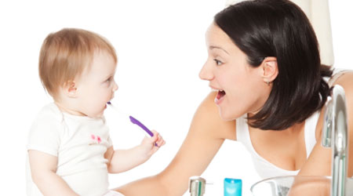
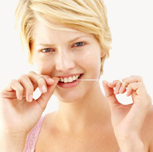
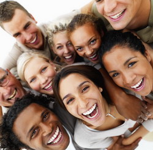
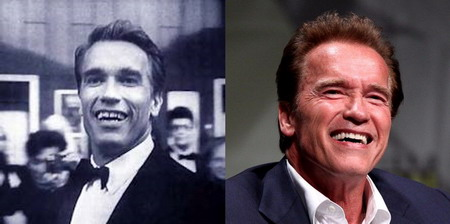
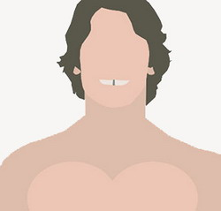
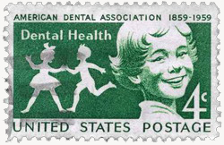
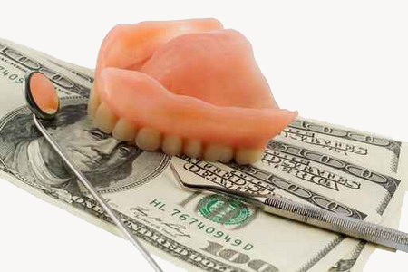
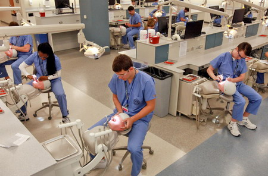
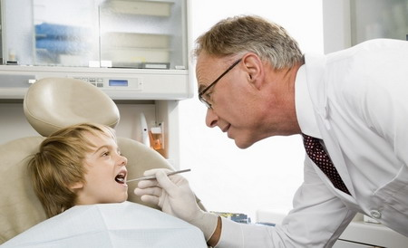
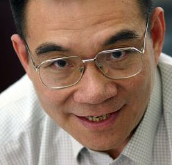

**西方公认美国人的牙齿要明显好于其他国家，其中有文化原因，但最关键的也许是保险制度的差别，世界上没有免费的午餐。**  

  

文/黄懽

  

美国人的牙齿明显好于其他西方国家，甚至它是识别美国人和其他西方国家人的最明显区别，BBC在谈论美国人的牙齿时，曾引用一位爱尔兰学生的感慨：“你很容易辨别出哪
些是美国人，即使让他们穿上爱尔兰人的服饰也能认出来，因为他们有个显著特点：**都有着一口整齐而洁白的牙齿**。”

  

英国媒体曾比较过英美两国明星的牙，英国明星的牙齿在颜色和整齐度上明显逊色于美国同行，英国人的牙齿属于自然的美白整齐，而美国人的牙不但白而且光洁晶莹，其整齐程
度堪称完美。

**美国人的牙不但白而且光洁晶莹，其整齐程度堪称完美**

  

为什么美国人的牙齿最好？

  

****【健康的牙与社交的牙】****

美国人对牙齿的在意，是从婴儿长出第一颗牙开始的，父母就会给宝宝刷牙，换上恒牙后，会检查牙齿是否错位，及时矫正。

**美国人对牙齿的在意，是从婴儿长出第一颗牙齿开始的**

  

欧洲人也非常重视牙齿，他们会从小就开始培养孩子正确维护牙齿的习惯，譬如丹麦家长每年都会带孩子到医院，除了看牙，还会以扮成大白兔的游戏方式，由医生护士教会孩子
如何维护牙齿健康。

  

他们普遍养成了牙齿健康三条原则的习惯：**每天刷两次牙，每次两分钟；每天用牙线；半年洗一次牙。**牙线很重要，因为牙刷毛再细也刷不到两个牙齿之间的缝隙。但中
国人多数没有使用牙线的习惯。

  

良好的生活习惯是保护牙齿成本最低、效益最高的方式。因为牙病和多数现代病症一样，是生活方式造成的，如果治病无法改变生活习惯，它还会复发，健康归根到底要靠一个人
生活习惯的养成。

**与欧美国家不同，多数中国人没有使用牙线的习惯**

  

欧洲人对牙齿的维护主要是从健康角度着眼，而很多美国人则将它上升到了社交需求的高度。美国人觉得牙不只是健康，还要漂亮。总得来说，美国人比其他只要求牙齿健康的人
牙齿更好。

  

美国是个人至上、特别注重个人表现的社会，美国人从小就接受社交能力和自信的鼓励培养，这使得他们都看上去个个都像是善于推销自己的推销员。美式社交文化会培养出注重
外表的意识。

  

社交活跃度与牙齿美观的关联性，在西方国家很容易观察到：通常，政客、演员、销售公关这种社交比较多的职业，多会比较重视牙齿。

  

美国人认为，好的牙齿不仅关乎健康，更是一个社交必备条件。55%的美国人认为在社交场合中，微笑最为关键。73%的美国人认为不管一个人的笑容有多迷人，糟糕的牙齿
也会毁了这一切。二分之一的美国人平均一年会见两次牙医。

**微笑在美国人的社会交往中至关重要**

  

牙科被认为是奢侈的医疗消费，它是健康里最后的10%。全世界范围内，口腔健康花费在整体健康花费中一般少于6%。蒙古最低，约在0.5%，而美国最高，约在8%。2
009年美国人在口腔健康上花费了一千亿美元。

  

然而，文化习惯上的因素恐怕远没有这么大。欧洲人和美国人看牙的频率并无显著区别，只是美国人能花费更多的金钱用于牙齿，当然这与他们不断攀升的好牙标准有关——无论
是哪个国家发明的最先进最昂贵的牙科技术，总是在美国大规模应用。

  

欧洲人敏锐地注意到，一些欧洲人到美国发展一段时间后，他们的牙齿很快就变得像美国人一样漂亮。这种短期内发生的变化，很难用周围的美国人教会他采用更好的牙科技术来
解释。

**施瓦辛格自家乡奥地利去到美国之后，牙齿大有改观**

**初到美国时，媒体为施瓦辛格绘制的漫画形象，亮点自寻**

  

****【“公费”牙与“自费”牙】****

美国人在牙齿上的支出比欧美其他国家的人更高，最重要的是，美国人看牙全部是“自费”，而欧洲人和加拿大人看牙是“公费”的。——美国人看牙的支出完全来自商业保险，
而欧洲和加拿大则是国家保险。

  

国家保险与商业保险之别，或许是造成美国人与欧洲人牙齿明显不同的最大原因。

  

国家保险很难像商业保险一样设置各种极为灵活的险种，也很难将最新技术运用纳入险种。它善于解决的只是一般性和普适性的问题，但解决不了进一步和个人化的需求，譬如美
观问题。

  

——国外牙科有一个很明显的划分，一个是病人，一个是客户，前者是牙有病，后者就是为了美观。发达国家，医生会引导客户去把牙做得更漂亮。中国的市场，例如莆田系的成
功，也说明牙齿美观有较大市场。

  

但一个国家保险主导的社会很难像商业保险主导的市场那样对牙齿美观精益求精。因为国家保险把价格规定好了，医生只能使用最普通的材料或技术，无法做更细致周到的服务。

**早在1859年，美国就已成立了牙医协会（ADA）**

**  
**

发达国家牙医收入构成中，大约二成是疾病，八成是美观。美观上的可选择性很大，一颗牙冠，不同技术和材质，会导致视觉上真不真，在不同灯光下与其他牙是否一样，效果差
别很大。而国家保险通常覆盖面很窄。

  

例如在日本，如果要用到传统技术的黄金，国家补贴的就多，但要用到最新的瓷等材料，补贴就少，它抑制了最新技术的推广运用。即使在丹麦这种洗牙、补牙都包括在国家保险
的高福利国家，要追求进一步美观，牙科保险也一般是私人的。

  

医生一般按工作时间来计薪，由于国家保险的预算总数不足，在衡量解决客户需求与收入的平衡时，他们会自动把工作简化，能解决基本问题就行。

  

在牙科医疗上，如果说欧洲、日本等国的保险可能是80（国家）和20（商业）的区别，则美国几乎是0和100的区别，因为美国牙科多是商业保险。

  

美国牙科商业保险大都是定额的，覆盖项目也不同，像洗牙这种可能是全额的，但再高级一点，矫正、种植就会有覆盖面区别，做牙冠时，在材料上也有覆盖面的选择。一般基本
保险覆盖面50%、80%、100%等不同选项。

  

商业保险在保费设计上非常精确，譬如保险公司非常支持洗牙，因为维护好了牙齿，以后的赔付也会少，但一个人若是老不去洗牙，可能还会增加保费。如果是牙齿有问题的老年
人，也会设置较高的门槛。

**与其他国家相比，美国人看牙全部是“自费”**

**  
**

商业保险也不能解决全部市场需求，有人发现自己交200美元保费，封顶可能是1000美元，而自己选择的项目保险都不覆盖，有钱人干脆就选择纯自费。

  

国家保险对商业保险带有强烈的“挤出效应”。如果国家保险覆盖面较宽，则商业保险的市场就非常小。美国虽有远比中国等第三世界更完备的国家保险，但制度设计上使之只便
利退休者或穷人，一般年轻能挣钱的，都会买商业保险。

  

事实上，无论是国家保险还是商业保险，羊毛都出在羊身上，覆盖面极宽的国家保险，其支出来源还是纳税人，已经在纳税时为自己的牙齿出过钱的欧洲人，大多数当然不会额外
再购买商业保险。

  

除非他们到了美国。

**  
**

****【牙医两重天】****

不同保险体制对牙科医生群体的影响是显而易见的。欧洲、日本、加拿大的牙医大部分做国家保险业务，由于保费有限，只能像流水线上的工人一样每天拼数量。日本牙医业内就
有普遍的“四十岁一病”，就是高强度的工作累出来的。

  

日本、英国牙医的梦想，就是不做国家保险的生意，去做商业保险的生意。而美国牙医的梦想则更进一步，不做商业保险的生意，只做自费的生意——美国的明星和富豪多不会购
买商业保险，而是自费看牙医。

  

相比欧洲和日本同行，美国牙科医生的收入和待遇极为丰厚，经常会有在医生40岁、50岁后重新进修考牙医执照，因为哪怕只能在退休前工作10年，也能比前20年的报酬
还高。

  

有时技术创新能为牙医带来极高收入，比如一个叫米尔•多夫曼的医生，创造了一个新的牙齿美白技术，在参加一个真人秀节目展示后，其技术产品的销售就从3600万美元涨
到一亿多美元。

  

收入高自然进入门槛高。美国在牙医教育上把控较严。只有30余所专业口腔学校毕业生才被认可。而且牙科学院费用都很高，每年学费约5-7万美元。公立学校相对较低，尤
其对本州或本市的学生，如加州的UCLA等。

** **

**美国牙科教育临床模拟教室**

  

因为高学费，学业贷款在牙医专业中比较常见，一般情况下，每个贷款的学生在毕业后负担额度在15万美元左右。不过，相对他们将来的收入，这笔贷款负担并不算重。

  

得益于保险体制和市场，美国牙医就业渠道较广，这让他们在某种程度有自己选择病人的机会，一些人愿意去接有保险的病人，因为收入很稳定；一些则只愿意接高端的自费客户
，但市场竞争激烈。

  

美国开诊所的程序非常简便，准备好第二天就能开张。而中国则相反，开一个诊所要盖无数公章。这或许是中西质量控制理念的差别，西方是建立在高质量的教育上，人的素质是
第一位，而中国则认为，严密的行政监管远比医学教育更能提高医生的技术和责任心。

  

欧美国家，一个家庭可能几代人都找一个私人诊所的牙医，因为医生的饭碗建立在熟人社会的职业口碑上，这种牢固的信任纽带，使得顾客有极高的医从性，而医生也会尽力把病
人治好。

  

在医院的稳定性上，欧洲和美国相似，连锁医院的稳定性低于医生个人开办的诊所稳定性。2008年英国金融危机爆发后，第一个倒闭的牙科医院是最大的连锁医院，第二个倒
闭的是第二大连锁医院。

**在欧美国家，牙医的饭碗建立在熟人社会的职业口碑上**

  

美国人整体上享有更好的牙科技术和服务，主要应得益于商业保险设计上的精密细致，但美国人也并非人人都有完美的牙齿——低收入人群对牙齿的保护意识低于中高收入人群。
在一年没有看过牙医的美国人中，60%把昂贵的牙科保险列为首要阻碍因素。

  

有趣的是，欧洲人到了美国后牙齿会变得很漂亮，但不少中国人到了美国后牙齿却依然如故，虽然他们并不缺钱，也许是他们到了美国后依然有一颗中国心的缘故。

  

**版权声明**

****大象公会所有文章均为原创，****  

****版权归大象公会所有。如希望转载，****

****请事前联系我们：****

bd@idaxiang.org

****知识 | 见识 | 见闻****

阅读

__ 举报

[阅读原文](http://mp.weixin.qq.com/s?__biz=MjM5NzQwNjcyMQ==&mid=206815827&idx=1&sn
=8d89a744ac046eb293c952918cf15e2b&scene=0#rd)

