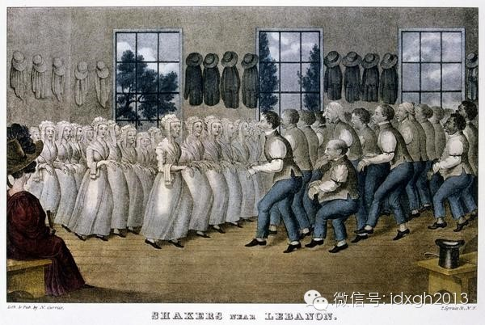
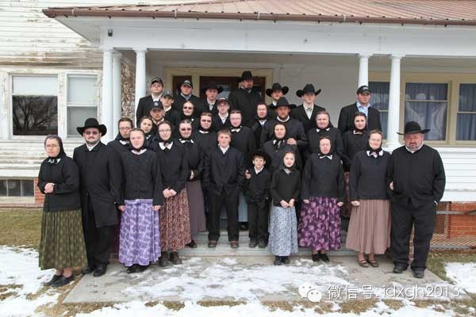

**真正的共产社会有很多苛刻标准和要求，这不但使得这种社会理想实践很难存续，甚至很难出现真正的共产社会，而美国胡特人不但成功做到这一点，并且成为全球人口扩张最快的人群，他们何以能如此？**

  

文/ 辉格

共产主义是20世纪影响最大的社会实验，推动这场实验的人，曾为它披上哲学、经济学和社会学的外衣，这让它看起来颇为现代，然而，这些外衣所包裹的意识形态和社会理想
——平等、互助、分享、财产共有——却远不是现代的，至少在基督教世界，它有着古老的渊源，只不过早先它所披戴的，通常是宗教和神学的外衣。

  

15世纪晚期，印刷机让乡下穷秀才们[1]也能直接读到圣经了，宗教改革随之风起云涌，大小教派遍地开花，其中半数以上都有着共产主义倾向，在此后的四个世纪里，许多
教派将它们的社会理想付诸实践，创立了各种形式的共产社区，而空旷肥沃且远离世俗旧政权的新大陆，恰好为这些社会实验提供了理想条件。

  

然而随着历次工业革命的推进，市场日益发达，特别是铁路和城市化的发展，这些共产社会大都没有经受住现代市场社会的高度流动性所带来的冲击，到上世纪初已纷纷衰败、瓦
解或者变质，比如一度颇成气候的震颤派（Shakers）[2]曾在美国建立了20多个共产社区，但存续至今的只有缅因州的萨巴斯代湖（Sabbathday
Lake）村，该村在2009年已只剩三个人。

  

_ __正在跳集体舞的震颤派信徒_

  

不过，它们中有一个成功抵御了工业革命和现代化的冲击，再洗礼派（Anabaptists）的一个分支胡特尔人（Hutterites），在四百多年中始终维持着共产
制度，除家具和少量日用品外，一切财产共有，生产由集体安排，生活资料统一分配，吃饭在公共食堂，三岁以上即开始接受集体教育，作息举止服饰发型皆有严格规定，整齐划
一。

  

胡特尔社会不仅维持了下来，而且非常兴旺，在过去几代已成为全球人口增长最快的社群，从1870年代迁居北美时的四百多人增长到了2010年的四万多人（这还没算上流
失到主流社会的人口）；这是一个难得的实验案例，清晰而纯粹，考察学习一下它的成功经验，或许有助于解释为何其他实验都失败了，也可以帮助我们理解现代主流社会为何是
我们所见到的样子。

【排除诱惑】

人类只要保有探索、创造和模仿的自由，其需求便永无止境，因而资源永远是稀缺的，所有现代共产实验都从物质极大丰富、各取所需的许诺开始，却无一例外以提倡艰苦朴素、
批判资产阶级腐朽生活方式而告终，在资源稀缺的前提下，平等只能通过向下对齐而实现，供需只能借助对探索和创造的压制而得以平衡。

  

为此，胡特尔社会禁止一切奢侈消费，采取极端避世的姿态，以种种规定排除外部诱惑：远离外人，集中居住，禁止收音机、电视、唱片和网络，整个社区只有一部公共电话，电
脑只能在工作场合使用，教育全部在社区内进行，且到九年级为止，除了极少量零花钱，个人很少有可支配现金，而且消费项目受教规严格限制。

【关闭潘多拉之盒】

知识、好奇心和反思是开启潘朵拉之盒的祸首，想得越多，越难以忍受沉闷单调一成不变的朴素生活，所有胡特尔人都只受过初中教育，也很少接触现代媒体，几百年的封闭离世
生活已让他们习惯于只做不想，连神学思考也早已停止，面对年轻人提问，长老们只会重复教条，从不解释为什么，只告诉你该怎么做。

  

对外部信息的隔膜也体现在他们的语言上，胡特尔人至今仍以其发源地的德语蒂罗尔方言为母语；思想的停止也可从另一点看出：他们所保存的作为其精神指南的宗教典籍，由另
一种古老德语写成，如今的胡特尔人已很难读懂，但他们并不介意，只管念诵就行了。

_胡特尔人_

【邓巴数】

财产共有、集体生产和资源共享这些核心特征，决定了共产社会是一种特殊的互惠型社会，而互惠关系的维持，需要一种全面而无孔不入的社会监督机制来执行社会规范，为此，
要么建立奥威尔式的警察国家，要么由社会成员相互监督，后者要求所有社会成员相互熟识，从而使得个人的一举一动都处于社会舆论的约束之下。

  

进化人类学家罗宾**邓巴（Robin Dunbar）指出，基于人类的认知局限，这样的监督机制只有在规模小于150[3]人的小社会才可能实现，邓巴在说明这一点
时，举的一个例子正是胡特尔，胡特尔社区的规模在60-140人，每当人口接近上限时，就像细胞分裂那样均分为二，这一机制确保了其规模始终维持熟人小社会的水平。

【亲选择】

和一般互惠型社会不同的是，共产社会的平等原则还需要其成员表现出强烈利他性（strong reciprocity），而不仅仅是互惠利他（reciprocala
ltruism），即，要求他们即便在没有预期回报的情况下也愿意为他人做出牺牲；经验表明，没有特殊动机的情况下，这是很难做到的，而亲选择（kin
selection）恰好提供了这样的动机：假如帮助对象是近亲，人们就比较容易表现出强利他行为。

  

胡特尔正是以父系家族为构成基础的亲属社会，每个社区由十来个扩展家庭组成，包含少则一两个多则四五个姓氏；北美胡特尔人一共只有18个姓氏（现存14个），不与外人
通婚，所以每个社区都是少数几个有着长期通婚关系的家族的合作群体；亲选择无疑起到了减少冲突、强化合作互惠的作用。

  

相比之下，震颤派过于进步，废除了婚姻与家庭，实行独身禁欲主义，禁止性生活和生育，于是就失去了血缘纽带对社区的凝聚作用。

【避免等级化】

共产制度的一大困境是，既要贯彻平等共享原则，同时其共产和集体性质又需要一个中央权力机构来组织生产和实施分配，可是权力组织一旦建立，平等就很难维持了，掌权者总
是会为革命事业而多啃鸡腿，而一旦出现等级分化，艰苦朴素平等共享的伦理原则就成了空话，游戏重点又回到争权夺利和努力向上爬，于是社会规范也自然会围绕资源与权力竞
争而重建。

  

胡特尔人将社区规模限制在邓巴数之下的做法，在维系社会规范的同时也避免了等级分化，社区之间没有更高层权力机构，社区内由六位长老组成决策机构，下设十来位奶牛长、
家禽长之类的业务主管，这就确保了每个父系家族都有几位长老，每个扩展家庭都至少有一位业务主管。

  

这样一来，地位分化只发生在性别和年龄段之间，每位男性在其盛年期都有望担任某个职位，如果他表现出一些进取心和领导能力，也很可能成为长老，不会出现某个人既有野心
又有能力却得不到机会施展的情况，而后者正是社会不满和政治冲突的主要来源。

  

重要的是，在一举一动都处于众人监视之下的熟人社会中，如此轻微的地位分化不会导致生活水平上的差距，当上主管和长老唯一的好处是少干点体力活，这不足以为争权夺利提
供激励。

【压力释放口】

在这种价值观整齐划一，行动上一切听指挥，生活上无处不被注视的社会，必定会有一些不满分子，尤其是年轻人，把他们强留在社会中，只会带来冲突和危险；假如这种社会是
奥威尔式的，解决方案便是定期大清洗，但胡特尔不是极权社会，他们是绝对和平主义者，他们的解决方案是去留自便。

  

这与再洗礼派的核心教义有关：他们不承认对未成年人的洗礼，认为接受洗礼加入教会的决定必须由心智成熟健全的成年人在经过慎重考虑之后才能做出[4]，胡特尔人通常在
19-22岁之间接受洗礼，从而获得社区完全成员资格，并承担起遵守全部规范的责任，而在次之前，他可以选择推迟入教或者离开，即便在入教之后，他也随时可以退出，只
是后者会被视为叛教而遭忌避（shunning），而前者只是被当作普通外人对待。

  

去留自便的做法，短期效果是让不满者离开从而释放社会压力、消除潜在冲突源，在长期则起着筛选作用，不断剔除其性格与胡特尔社会不相容的成员。

  

对社会规范的不满和对权威的挑战最集中的表现是青春期躁动，对此胡特尔人也有应对机制，在15岁离开学校到接受洗礼之前这几年，年轻人被视为未成熟不懂事而豁免了遵守
某些规范的责任，比如喝酒、抽烟、打牌、去附近镇上玩，只要不太过分就会得到容忍。

_一个胡特尔社区_

【实用主义】

任何社会运动最初都由一群理想主义者领导，而一旦开始真正动手建立组织、展开行动、创建社会，理想主义者就会逐渐被实用主义者所取代，否则运动很快就会失败，但这一替
代过程未必顺利，许多教派会面临一个矛盾：一方面需要保持理想主义色彩以便不断吸纳狂热分子去传教，但同时组织的维系和运营需要它转向实用主义。

  

一个教派若主要依靠传教和吸纳新教徒而发展壮大，就很难完成实用主义转型，因而组织和制度很难稳定下来，理想主义者都有自己的想法，而且非常狂热而坚定，很容易争吵不
休却拿不出可行方案。

  

胡特尔人没这问题，因为他们不传教，发展壮大全靠子宫，所以几代人之后，理想主义者便消失殆尽，他们也没有职业教士，牧师由社区长老充任，通常对神学毫无兴趣，也读不
懂多少经典，教义在他们眼里不过是一套沿袭已久的行为规范。

【接纳新技术】

胡特尔的实用主义也体现在他们对待现代技术的态度上，尽管在消费、穿着和生活方式上非常简朴而守旧，并尽量杜绝媒体、娱乐、奢侈品等外部诱惑，但他们并不拒绝新技术，
只要有助于提高生产率，会毫不犹豫加以采纳。

  

积极采纳新技术，加上劳动力成本低，胡特尔人经营的集体农场在北美极具竞争力，也正因此才能让他们维持了极高的生育率（1950-80年代高峰期人口年增长率达4.1
2%），并不断买入土地建立新社区；他们的高增长率，也得益于对现代医疗技术的接受。

【暂时解除的人口压力】

社会压力最根本的来源是人口压力，但在胡特尔人迁居北美后的一百多年里，这一压力暂时解除了，所以我们才会看到每18年翻一番的极限增长率，北美大平原广袤空旷肥沃而
又廉价的土地，为胡特尔这样勤劳节俭而又自甘寂寞的农场经营者提供了极为理想的环境，那里的自然条件与他们迁往北美前所在的乌克兰也很相似，20世纪的城市化浪潮吸走
大量农民更为他们腾出了发展空间。

  

实际上，直到1950年代现代化大型农场兴起在美国之前，胡特尔集体农场比美国的传统家庭农场更具规模优势，所以在1980年代之前的一个世纪中，他们的人口和社区数
量都是在毫无压力的条件下迅速膨胀，避免了资源稀缺性转变为社会内部的压力和冲突，直到80年代，大型农场带来的土地价格上涨才开始让胡特尔人感觉到压力，也正是从那
时起，生育率开始显著下降；假如地价继续上扬，人口压力持续提高，胡特尔模式是否能够继续存在下去，还不好说。

  

_北美胡特尔定居点分布示意图_

【自由环境】

尽管胡特尔人奉行离世隔绝的教条，但他们的成功离不开所在大社会提供的优越条件，若没有现代医疗，就算放开了生，也不会有这么高的增长率，若没有现代市场可出售其农产
品，他们顶多能够过上勉强自足的生活而无法扩张，若不采纳现代农业设备，他们的农场也不可能盈利从而为获取新土地而积累资金。

  

更重要的是文化和制度环境，胡特尔奉行的绝对和平主义让他们放弃了自卫能力，若不是身处北美大平原这样文化宽容、社会压力宽松、民风淳朴和善的社会，将难以自保，若没
有现代司法体系所提供的普遍安全保障，甚至可能被灭掉。

  

像再洗礼派这样拒绝融入主流社会、拒服兵役、抵制义务教育、拒绝医保和社会福利的非主流小教派，是绝大多数政府所无法容忍的，只有在美国和加拿大这样宽容而自由的社会
，他们才找到了容身之所，并且兴旺发达。

  

胡特尔的故事告诉我们，在一个自由社会，你甚至可以实现共产主义理想。

注：

[1]许多新教教派的创立者或领袖人物大多是低级教士或粗通文墨的手工业者或小商人。

[2]震颤派（Shakers）是从源自英格兰的贵格派（Quakers）中分化出的一个激进教派，因其信徒在做礼拜时常狂喜至全身颤栗而得名。

[3]150这个数字因而被称为邓巴数（Dunbar's number）。

[4]所以该教派早期传播时常为入教者的重新施洗，并因此而得名。

  

> 版权声明：  
大象公会所有文章均为原创，版权归大象公会所有。如希望转载，请事前联系我们： bd@idaxiang.org

大象公会：知识、见识、见闻

微信：idxgh2013

微博：@大象公会

投稿：letters@idaxiang.org

商务合作：bd@idaxiang.org

  

[阅读原文](http://mp.weixin.qq.com/s?__biz=MjM5NzQwNjcyMQ==&mid=202492209&idx=1&sn
=5c676e216d627a5ce0d9a59f6270a7d2&scene=0#rd)

