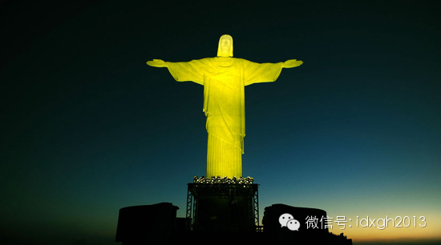

**耶稣长发、长须、清瘦的标准相貌并非一开始就定型，耶稣相貌的变化，其实是基督教世界观念史的产物，而且，伴随着基督教的全球传播，耶稣还出现过肤色、相貌气质截然不同的各种非主流形象。  
**

  

文/刘大可

  

清瘦的面庞，披散的长发，络腮的胡子，深邃的双眼，这是今天人们熟悉的耶稣的标准相貌。不过，它只是古罗马以来一系列宗教和艺术活动的最终结果，耶稣的形象并非一直如
此。

符号和异教神

  

从公元元年前后传说耶稣出生，到公元313年罗马皇帝君士坦丁一世颁布《米兰诏书》将基督教立为罗马国教，是基督教最早期的发展阶段。

  

在此期间，基督教一方面延续了大量犹太教传统，譬如像伊斯兰教一样严格杜绝偶像崇拜；另一方面，基督教因为受镇压、清洗只能在社会底层暗中传教，缺乏塑像条件，所以绝
少有描绘耶稣相貌的艺术作品，就连《新约》的四福音书里也没有耶稣相貌的描写，只有《启示录》里讲述了作者看见基督的幻觉：

  

“灯台中间，有一位好像人子，身穿长衣，直垂到脚，胸间束着金带。他的头与发皆白，如白羊毛，如雪。眼目如同火焰。脚好像在炉中锻炼光明的铜。声音如同众水的声音。他
右手拿着七星。从他口中出来一把两刃的利剑。面貌如同烈日放光。”

  

现存最早的基督教艺术品来自2世纪罗马墓葬壁画，这时基督教逐渐传播到了上层社会，一些富有的基督徒会在自己的陵寝中用符号记录信仰——此时耶稣的Logo通常是一条
鱼，即“耶稣鱼”，有时也会用孔雀和船锚。

  

   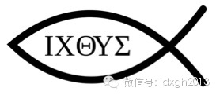

耶稣鱼符号，中央的5个希腊字母分别是“耶稣、基督、神的、儿子、救世主”的首字母，有时可以略去。它是早期基督徒的接头暗号，一个人画一个弧线，另一个人如果也是基
督徒，就再画一条弧线补完成鱼。

  

这些基督徒的墓穴壁画中开始出现了人物，耶稣的形象逐渐与罗马人原先崇拜的神灵形象融合，到3世纪，罗马朱立家族的墓穴中就出现了将耶稣与太阳神索尔融合起来的镶嵌画
：

   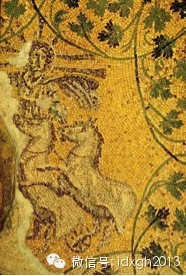

朱立家族的墓穴镶嵌画，光芒和双轮马车来自罗马的太阳神索尔，周围环绕的葡萄树叶则来自《约翰福音》里的真葡萄树，表明耶稣与太阳神发生了合体。

  

在3世纪罗马，耶稣最常见的形象则是“好牧人”像，一个放牧绵羊，并将其中一头扛在肩上的少年牧童。

  

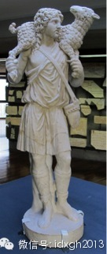

_好牧人像，3世纪的罗马，藏于梵蒂冈博物馆_

_  
_

与后世描述作品不同，“好牧人”是圣经里的暗喻而并非耶稣本人：耶稣是一个牧羊人，信徒都是他的绵羊，耶稣为了自己的羊而献出生命。但扛着羊的形象原本是希腊罗马神话
体系里，为农神赫尔墨斯献祭的常见图示。

  

此外，耶稣作为圣婴的图画也开始出现，最早的耶稣画像创作于公元235年的叙利亚，他被描绘成一个年轻的贤者，穿着希腊式长袍和披带——后者在希腊罗马社会中用来象征
较高的地位，今日教宗肩上仍然围有此物，效果酷似清朝后妃领口那根丝带。

  

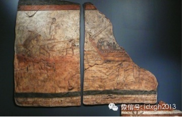  

叙利亚著名古城“杜拉欧罗普斯”出土壁画，创作于公元235年，左半块的站立人像是已知最早的耶稣像，描绘他治愈麻风病人的神迹。

  

基督教早期艺术中，耶稣形象很接近一个传奇英雄，还没有头顶光环这样的神迹；人们对他的想象也往往依照自己习惯的文化背景，很少考虑他犹太人的真实身份。

  

**【少年神童渐老成】**

**  
**

基督教成为罗马国教后，基督教的艺术渐渐丰富起来。不过此时耶稣是一个年轻人，短头发，偶尔也会有胡子，甚至还会用魔杖——魔杖在当时还没有被斥为异教工具，被看作是
力量的象征。

   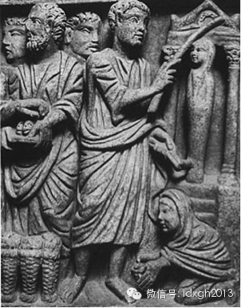

430年前后，罗马圣萨比那教堂门上的石刻，耶稣用魔杖复活拿撒勒。

  

不过，这时另一种耶稣形象开始出现，这就是现代长胡子的耶稣原型，比如这张现存最早的清晰可辨的耶稣生平事迹图，《拿撒勒的复活》：

  

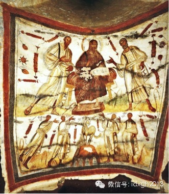

_现存最早的容颜可辨的耶稣像（罗马的马赛琳娜斯和彼得墓出土）_

_  
_

在这幅4世纪的壁画里，耶稣已成为一个成年男子，身边站着圣彼得和圣保罗。他的背后出第一次现了表示神圣的光晕，也第一次长出垂胸的胡子。希腊神王宙斯或者称罗马的朱
庇特，以及各位希腊哲人，都是用这样的络腮胡子表示至高地位——耶稣的胡子要比门徒的胡子更长——胡子的长度可展示其发起神迹的超能力。

  

随着基督教作为国教的地位日渐巩固，耶稣的形象在此基础上又有了新的变化——他变成了一个罗马皇帝：

  

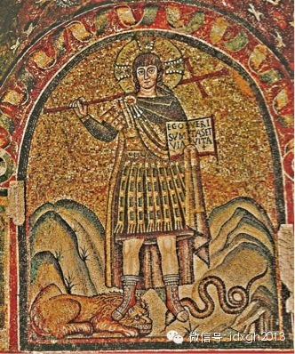

_帝王造型的耶稣像（540年前后，意大利拉文纳）_

_  
_

少年版的耶稣穿上了罗马贵族的戎装，肩扛十字架，头顶十字架光环，脚踩象征恶魔的狮子和蛇，俨然一副君主派头——这是“少年神童”版耶稣在早期基督教艺术中的尾声，随
着基督教与政治的联系越来越紧密，耶稣的形象越来越老成，长胡子的圣贤像日渐成为主导。

  

6世纪的蜡画，《全能的主耶稣》，埃及西奈半岛圣凯瑟琳修道院出土。

  

上面这张耶稣像除了长发、络腮须以及头顶上的十字光圈特征外，最引人注目的是耶稣明显不对称的面部容貌——这是基督教教义里的一个热点，即耶稣是神还是人：右脸眼睛更
小，面颊更丰满，像一个精力充沛的年轻人；左脸眼睛更大，面颊更骨感，更像一个威严的长者。

  

这是表现耶稣的双重属性，他既是一个完全的人，又是一个完全的神。这种抽象神秘的说辞，透露出基督教开始吸纳希腊哲学中的形而上学部分，不再是那个单纯的闪族宗教了。

  

而最终给了胡须长者权威力量的，则是一系列中世纪的圣物和神迹，其中就包括那件妇孺皆知的神迹，“都灵裹尸布”。

  

**【长者形象逐渐确立】**

  

中世纪是一个神权不断巩固的漫长时代。出于各种不可思议的原因，圣物和奇迹如雨后春笋般地出现在整个基督教世界里。

  

其中一类圣物与耶稣的容貌极有关系，称作“Acheiropoieta”，意思是“不经人手而成的画像”。指的是耶稣显神迹让自己的面容浮现在物体上，并流传下来的圣
物，最著名的有三件，“维罗妮卡的面纱”（Veil of Veronica）、“埃德萨之图”（Image of
Edessa），以及最著名的“都灵裹尸布”（Shroud of Turin）。

  

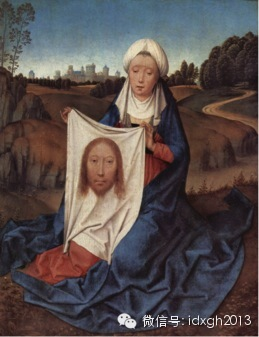  

_汉斯**梅林姆1470年绘制的《维罗妮卡持其面纱》_

_  
_

“维罗妮卡的面纱”在《福音书》里并无来源，相传耶路撒冷的女圣徒维罗妮卡看到耶稣扛着十字架走在赴死的道路上，便用面纱擦拭耶稣脸上的血迹和汗水——结果耶稣的脸就
印在了她的面纱上，这就是维罗妮卡的面纱。

  

从4世纪起就有人声称此实物存在，据称7世纪时它被保存在圣伯多禄广场上的一处神龛，但直到12世纪才真的有人看见了这块圣物，而且不止一块，大概就是图上那个样子，
一个长发络腮胡子的男人头像，往往还带有荆棘冠。

  

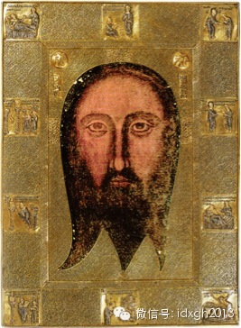  

_保存于热亚那的圣面孔，被认为是埃德萨之图的现存版本之一_

_  
_

“埃德萨之图”源自4世纪出现的耶稣生平故事，讲的是耶稣为美索不达米亚地区古城埃德萨的国王治病的故事。最初的版本，是耶稣给国王写了一封信，就把他的病治好了。后
来变成耶稣派使徒达太画了自己的画像送给国王；到6世纪，变成了耶稣把擦脸布送去——上面奇迹地印下了耶稣的面容，然后治好了国王的病。

  

后面的故事更离奇，据说就靠着这件圣物，埃德萨抵抗住了波斯萨珊帝国的进攻。到10世纪，“埃德萨之图”被转移到拜占庭帝国的首都君士坦丁堡，随后在1204年的第四
次十字军东征中被洗劫，最后安置在巴黎——从此西欧人开始坚信耶稣的长者相貌——但据称法国大革命后此图丢失，现存的热亚那版是拜占庭皇帝14世纪所赠，研究者发现那
是木版拓印的。

  

“维罗妮卡的面纱”和“埃德萨之图”在中世纪享有盛誉，东正教由于更保守和集权的制度，耶稣的长者形象很早就固定下来，而在天主教的管辖区内，少年版和长者版的耶稣像
，乃至好牧人的耶稣像，都共存了几百年，但由于这些圣物出现，长者版才成为主流。

  

更著名的“都灵裹尸布”直到14世纪末才出现，此前，人们都认为“埃德萨之图”的真身就是耶稣的裹尸布，谁料到1390年后却出现了一个加大版。

  

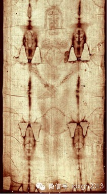

_都灵裹尸布的上半段，现藏于意大利的都灵教堂_

_  
_

这块裹尸布最早出现于法国的利雷，据称耶稣死后曾用此布包裹，上面隐约有一个长发长须者的印迹。由于这件物品保存完好，今日仍受宗教和历史学者的密切关注，更有数不清
的研究结果——由于主题和篇幅限制，这里不讨论其真伪。它显示到了中世纪结束时，耶稣的形象已被锁定为长发、络腮胡、形容瘦削的长者。

  

**【文艺复兴之后——艺术家塑造的生动形象】**

**  
**

中世纪之后，西方迎来了文艺复兴，这个艺术家大放异彩的时代，耶稣的形象也发生了巨大的改观。

  

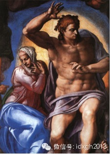  

米开朗基罗1537年至1541年间的《最后的审判》局部，圣母和基督。

  

在米开朗基罗《最后的审判里》，强调解剖的米开朗基罗非常复古地抛弃了几百年来积累形成的长者形象，耶稣变成一个阿波罗式的“太阳神”——米开朗基罗的大胆举动尽管受
到罗马教廷的抗议，却仍然成功地将这一杰作留在了西斯廷壁上。

  

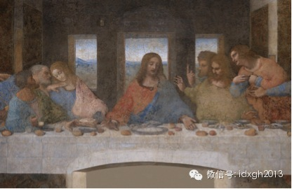

达芬奇1495-1498年所作《最后的晚餐》，米兰的恩宠圣母的多明我会院食堂墙壁上。

  

达芬奇对耶稣像的革新要小得多也含蓄得多，在《最后的晚餐》，耶稣仍是长发长须，但头顶不再有光环，像一个温和的凡人——这是文艺复兴后的一大变革，即便是神圣的形象
也有了人的感情。

这个大背景下，耶稣受难像在文艺复兴之后变得多见起来，到了戏剧化的巴洛克时期，就有了一些经典的杰作。

  

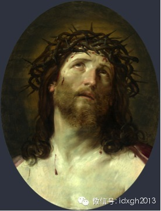

_圭多**雷尼《带荆棘冠的基督头像》，1640年作，藏于卢浮宫_

_  
_

这副画中基督相貌依然保持传统形象，但整幅画面都强烈渲染着人类的感情，这种竭力渲染耶稣曾经蒙受的苦难的做法，就是要提醒人们耶稣为了拯救人类曾经蒙受怎样的苦难，
所以在巴洛克的教堂里，十字架上的耶稣也就变得格外多见。

  

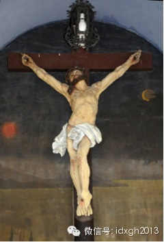

_巴洛克早期雕塑家Christian Trebinger所做耶稣受难像_

  

到18世纪，耶稣的形象已相当稳定：褐色及肩长发、络腮胡、瘦脸、深邃的眼睛，身上的衣服要么是受难时的白色裹尸布，要么是亚麻的袍子，艺术家对耶稣的塑造更多的集中
于他的神情和举止，以及出现耶稣的场景上。

  

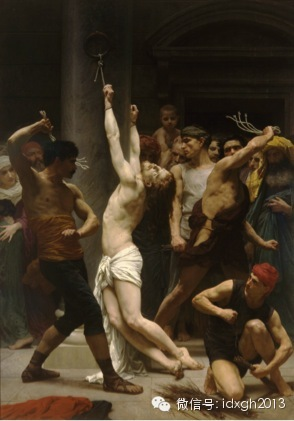

_威廉**布格罗1880年作品，《鞭打基督》_

_  
_

当然，在已经确定下来的耶稣形象里，仍然存在着一些细微的变革，比如这个：

  

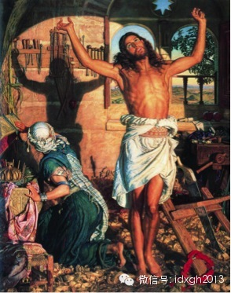

_威廉**霍尔曼**亨特从1870年起耗时3年完成的《死亡之影》_

_  
_

在威廉**霍尔曼**亨特的画中，虽然耶稣也是长须长发，却画的是当木匠的青年耶稣，他劳动之余伸了个懒腰，影子投在身后的木工架上预示了未来受难的样子；圣母玛丽亚
也被墙上的影子吓了一跳。

  

相比文艺复兴以来耶稣消瘦的形象，画中的耶稣肌肉结实饱满，这与当时基督教运动中的强身派暗合，即认为耶稣在具有一切内在美的同时，外表也应当同样美好，不可能是一副
瘦骨嶙峋的模样。

  

**【非主流的耶稣形象】**

**  
**

耶稣的相貌是一部基督教世界的观念史。它曾融合了犹太人的神话、古希腊的哲学、罗马帝国的政治结构，随着宗教改革又逐渐汇入人类的情感与精神。这个过程在可以预见的将
来，都不会停止。

  

另外，地理大发现之后，基督教在向全球传播的过程中，为了迁就当地居民的观念，耶稣的形象也曾做过相当大的本土化妥协，于是出现了从肤色、相貌、衣着和气质都截然不同
的各种非主流形象。

  

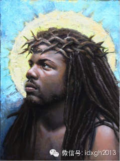

殖民地时期，很多黑人在传教士的努力下信仰了基督教，经过几个世纪以来发展，黑人对基督教有了自己的理解，特别是在非洲大陆上的某些黑人基督教信仰中，耶稣也变成了一
个黑人。

  

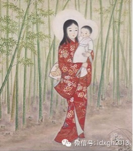

江户时代，基督教传入日本后，出现了日本版的圣母玛利亚和圣婴耶稣。

  

   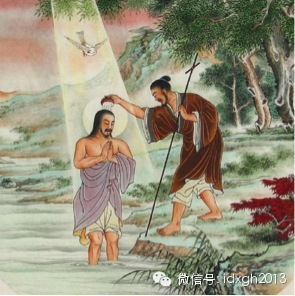

_  清代《耶稣受洗》_

_  
_

清代，西方传教士将基督教带入中国，耶稣的相貌开始向中国古代的圣贤看齐。这幅清代《耶稣受洗》图中，站在河中的爷们就是耶稣，给他淋水的是约翰。清末洪秀全建立了拜
上帝教，用的就是这类的耶稣像。

  

如果朝鲜官方允许西方传教士在朝鲜传教，耶稣是否会变得体态丰腴，留着主席头、穿着敞开的风衣站在山巅指点三千里江山？

  

[大象公会所有文章均为原创，版权归大象公会所有。如希望转载，请事前联系我们：bd@idaxiang.org ]

———————————————  

**大象公会微社区上线了，来吐槽发帖！**

  

[阅读原文](http://mp.weixin.qq.com/s?__biz=MjM5NzQwNjcyMQ==&mid=201341261&idx=1&sn
=f5c3d52e3889f0934405011370f82b91&scene=1#rd)

