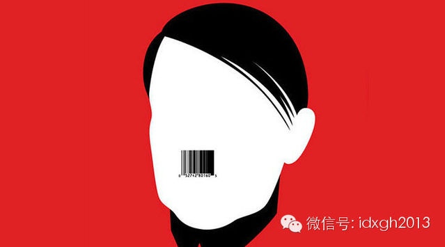
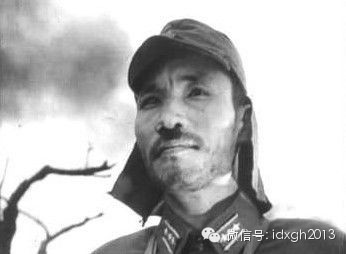
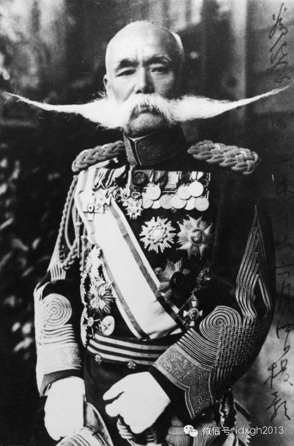
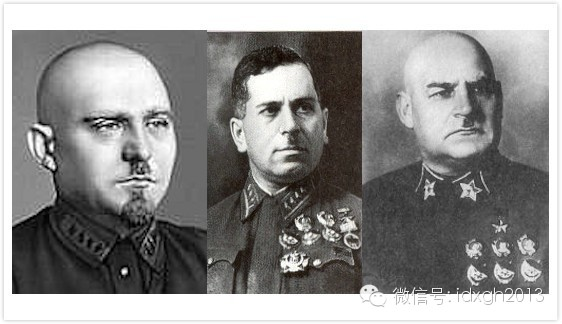
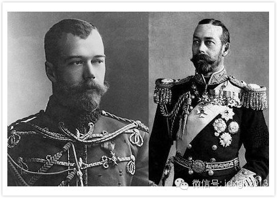
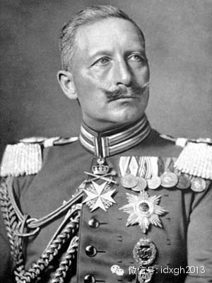
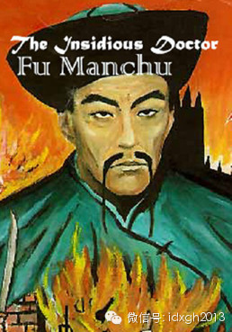
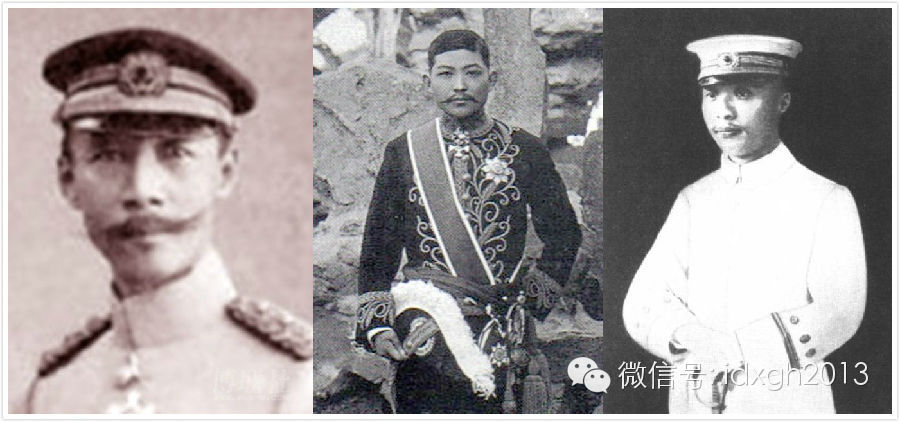
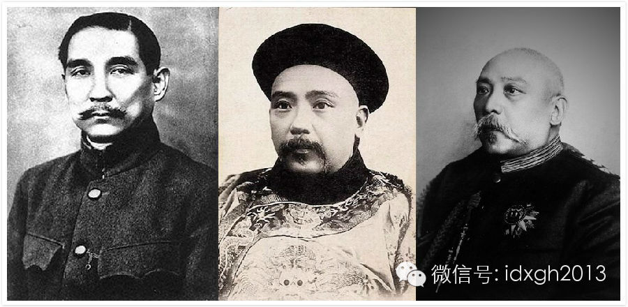
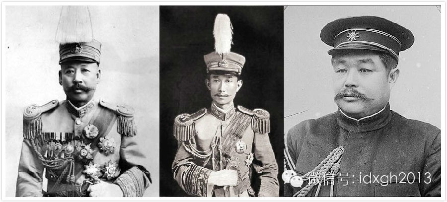

胡须造型虽然是时尚的产物，但在特殊时代，它很难避免政治的影响。而八字须、牛角胡、仁丹胡更成了特定的政治符号。

  

文|潘游

  

影视剧中鬼子军官的上唇中央部分，往往有着厚厚的胡子。这种被称为“板刷胡”或“仁丹胡”的胡子造型，以人中为中心，宽度大约2-3厘米。日本在欧陆上的盟友纳粹德国
的元首，更是以被称为板刷胡的经典形象闻名于世。  

  

_如果元首剃掉胡子……_

_  
_或许是希特勒的形象过分深入人心，这种为方便佩戴防毒面具改进自“八字胡”的“板刷胡”，日后不幸成了法西斯和军国主义的标识，导致影视剧中必为鬼子贴上这幅“身份
标签”。

  

  
_“鬼子”的经典形象_

_  
_

其实，二战前及战中的日本政要、军官们，蓄板刷胡的并不多。包括东条英机、昭和天皇在内的蓄须要人，留下的影像资料中，八角胡都占据了压倒比例。它深入中国人心，或许
是当时只有日本人才留这种胡子的缘故。

  

日本人的胡须造型其实是西风东渐的产物。战国时期，武士就有蓄须的传统，明治维新打开国门，日本人的胡须迅速向西方看齐，八字胡、牛角胡挂在明治时期风云人物的唇上，
随后一直追紧随欧洲的潮流风尚变化。

  

_长冈外史著名的胡子_

_  
_在同期的纳粹德国，像希特勒那样留板刷胡的纳粹要员比例也并不多。世人容易忽略的一个历史事实是，真正流行板刷胡的国家，其实是苏联。

  
  _从左至右：别洛夫、施特恩、库里克_

_  
_

二战结束前，全球范围内的男性依旧流行蓄须的风潮，不过已经是19世纪中期骤起胡须风潮的强弩之末；而板刷胡、八字胡本身，也是十九世纪更“饱满”造型的简化版本。

  

【蓄须的复辟】

  

从文艺复兴到十九世纪中期，蓄胡须的欧美名人比例并不大。从雕塑以及油画作品，可以看出启蒙先驱、美国国父、法国波旁王朝的大多数君主乃至拿破仑，都有着剃须后青青的
脸皮。

  

蓄须习惯突然在19世纪中叶重新盛行。至今我们可以在教科书中一窥当年的胜景——近代科学各个细分学科的奠基人们，乃至艺术家、革命家、君主都留着大胡子。

  

胡须在19世纪中叶的复兴，原因颇为复杂。研究男性形象的美国社会学家德怀特•鲁宾逊，曾指出人们广泛接受大胡子同时，硬币的另一面——“理性主义”年代的拒绝剃须运
动。

  

1847年，作家威廉•亨斯洛出书抨击刮胡子是“致命的时髦”，导致了谋杀和自杀率的增长，显得对宗教不虔诚并带来了道德沦丧，丢失尚武精神且传播疾病。后来者当然有
理由指出亨斯洛的归纳总结完全错误，并且违背事实。

  

出于对那个年代致命的结核病的恐惧，以及工业革命导致的大量用煤，当时西欧犹如今天的北京一般被雾霾笼罩。人们以为浓密的胡须（至少是上唇胡须）可以像鼻毛一样过滤空
气，保护呼吸道。而现今对胡须的色谱仪分析表明，胡须上有几十种来自工业废气的有害物质，以及隐藏在不停分泌油脂的胡须中的微生物，凡此种种均可能吸入体内，危害健康
。

  

拒绝剃须的卫生理由当然是荒谬的，但在对病理学知之甚少的时代，这种解释像张悟本的绿豆茄子理论一样获得了大众的追捧。坚持“蓄须养生”的专家非常多，他们也能不期然
地说对一些事实。比如“当人们刮胡子的时候，疾病也许就趁虚而入”这一点：底层劳苦大众因经济及卫生条件所限，配套的剃须泡沫、面霜不完备，剃须用具亦藏污纳垢。所以
，剃须中刮破皮肤甚至感染治病的情况亦不少见。

  

至于尚武精神，拒绝剃须论者认为：萨克逊人的胡子意味着男子气概，没胡子的诺曼人则道德败坏。在当时的言论风气中，罗马帝国的崩溃都被认为是刮胡子的直接后果，剃须且
爱洗澡的罗马人娘里娘气，被有胡子的蛮族彻底打垮。

  

其实，希腊罗马人剃须才是尚武善战的表现，因军人来自公民的缘故，罗马军队远比蛮族讲求组织纪律性。在此基础上组建的步兵方阵以近战闻名，且可实现复杂的战术意图。剃
掉胡须不仅可以避免在近战中比敌人抓住胡子，并能做出敌我识别。

  

汉语中，“胡”也指胡人，这与罗马人拉丁语中的“胡须”（Bart）一词有巧合。拉丁语中的胡须至今还是现代英语、法语、德语中野蛮一词的词根。

  

另外一个可能被忽略的原因是——工业革命带来了第一批成规模的都市中产劳动者，坐在办公室的职员无法像农夫、矿工那样靠肌肉线条展示男子气概。胡子作为男性第二性征的
主要标志，可以暗示拥有者的强势，由此，胡须自然当仁不让复辟了。

  

【君主主义的荣光】

  

十九世纪中叶逐渐发展成熟的照相技术，以及覆盖范围越来越广的报纸塑造了民众对于政治人物的观感。往往仅存在于油画中的国家元首形象，降至普罗大众可看到的街头读物之
上。这是不同于以往的一个全新维度，技术的发展为大众提供了风尚的范式，加速了传播。

  

英王乔治五世、沙皇尼古拉二世、德皇威廉二世，有着接近的相貌和同样夸张的胡须。作为表兄弟，这也容易理解。乔治五世是英国女王维多利亚的孙子，其母是尼古拉二世的姨
妈，而威廉二世则是维多利亚的外孙。

_沙皇尼古拉二世（左）、英王乔治五世（右）_

_  
_

英王、沙皇前两者都有着类似“凡•戴克式”的胡须造型，德皇则以向上翘起的造型独具一格。凡•戴克，从名字就可以猜出是荷兰人。查理一世时期的宫廷画家，在查理一世1
649年被砍头前，凡•戴克为其画下了诸多肖像。查理一世的胡须造型，成为19世纪中叶以后，蓄须时代君王模仿的范本。

  

对世界胡须造型影响最大的，当然是德国末代皇帝威廉二世，他的牛角胡是“凡•戴克式”的升级版，剃掉了下唇部分以及络腮部分的胡须，胡须两端用油脂固定住，刻意向上高
高挑起。

  

  
_德皇威廉二世_

_  
_

这种干练而趾高气扬的牛角胡维护起来颇为不易，但在德国军界颇为流行。威廉的牛角胡和昂着下巴的狂傲造型，是当时德国军国主义最好的形象广告。

  

德国作为后起之秀，不仅用铁与血解决了统一问题，一举崛起为欧陆第一列强，并且国家治理秩序井然。它理所当然成为全世界面临治理危机的失败国家的“彼岸”。以德为师的
落后国家，军政要人多会留威廉二世的牛角胡，它甚至成为权威的象征，譬如斯大林就留着不那么夸张的牛角胡。

  

【从军阀胡到刮胡子】

  

清末，中国人的胡须在西方是被高度脸谱化的。虽然“傅满洲”的形象，在上世纪二三十年代的好莱坞才搬上银幕，但细长下垂的“鲶鱼”胡须、三角眼、高颧骨的瘦脸，早在十
九世纪中西交流发生时，就已成为标准的满洲脸谱。甚至被当作黄祸的拟人化形象。

  

  
_好莱坞塑造的傅满洲_

_  
_

满洲脸被认为严重缺乏阳刚之气，处于当时西方世界歧视链条的较低位置。清末，领风气之先的外交界和军界开始流行威廉的牛角胡。比如后来在五四运动时被称为三大卖国贼之
一的陆宗舆就留着牛角胡。而清末新军的高级将官中，不但袁世凯手下纷纷留起牛角胡，八旗出身的荫昌和宗室出身的良弼，也因为留洋经历留着牛角胡，只不过良弼毛发不盛，
其牛角胡若有若无。

  

_从左至右：荫昌、陆宗舆、良弼_

_  
_

进入民国，牛角胡几乎成了军界要员的标配，没有牛角胡简直不好意思称大帅。袁世凯的胡须在清末还是自然下垂，到了民国，胡子两端就开始微微上卷。不但袁世凯及手下如此
，孙中山一度也留起了牛角胡。

  

  
_  从左至右：孙中山、袁世凯（清末）、袁世凯（民国）_

_  
_

一战德国战败，牛角胡的发明人威廉二世退位后流亡荷兰，曾全球盛行一时的牛角胡迅速式微，北洋军阀们的胡子也开始自然下垂。

  

  
_从左至右：曹锟、蔡锷、黎元洪_

_  
_

不过，这些蓄着醒目胡子的军阀被脸上很少留胡子的国民党赶下历史舞台。不知是否胡子已成为军阀象征，还是一战后西方政要脸上日趋干净，蒋介石政权的军政要员中，除阎锡
山外，大部分人的胡子都不会超过蒋介石的规模。

  

这段时期中国人的胡子似乎失去了模仿对象。有时，胡子甚至会伤害到敏感的民族情绪——由于日本西化彻底、距离中国更近，往往扮演着中国学习外来文明的中转站角色，西式
胡子有时会让人联想起日本，原本留着牛角胡的鲁迅就曾在《论胡须》中批评中国人脆弱敏感的民族心理。

  

“大约确乎是游历孔庙的时候……有历代帝王像，其中有一张是宋太祖或是什么宗，我也记不清楚了……胡子向上翘起的。于是一位名士就毅然决然地说：‘这都是日本人假造的
，你看这胡子就是日本式的胡子。’”鲁迅讽刺道：“日本人何其不惮烦，孳孳汲汲地造了这许多从汉到唐的假古董，来埋在中国的齐鲁燕晋秦陇巴蜀的深山邃谷废墟荒地里？”

  

不过，胡子问题纠结中国人感情的历史并不长。因为留着少许胡须的国民党又被胡子更少的中共赶下了历史舞台，在“刮胡子”表示批评之意通行全国的年代，除贺龙等少数首长
外，很大程度上，中共是与胡须无缘的，流风所及，甚至八十年代小青年留胡子都是“二流子”的象征。

  

也许，是毛泽东从斯大林那里学到了领袖的标准发型，却无法继承斯大林的胡子的缘故吧。

  

[大象公会所有文章均为原创，版权归大象公会所有。如希望转载，请事前联系我们：bd@idaxiang.org ]  

  

[阅读原文](http://mp.weixin.qq.com/s?__biz=MjM5NzQwNjcyMQ==&mid=200486270&idx=1&sn
=c0f86a96bb002319edcbc723536f7c16&scene=1#rd)

