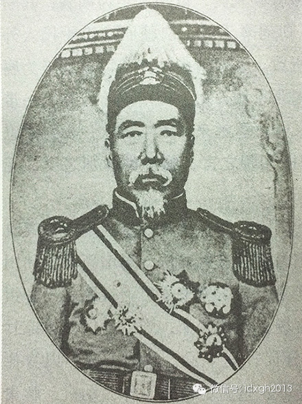
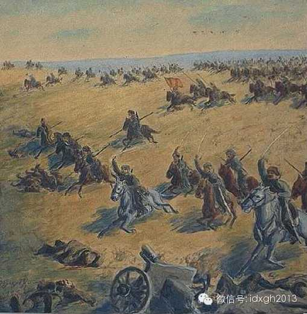
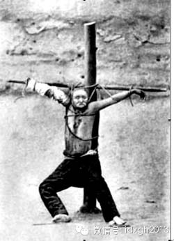
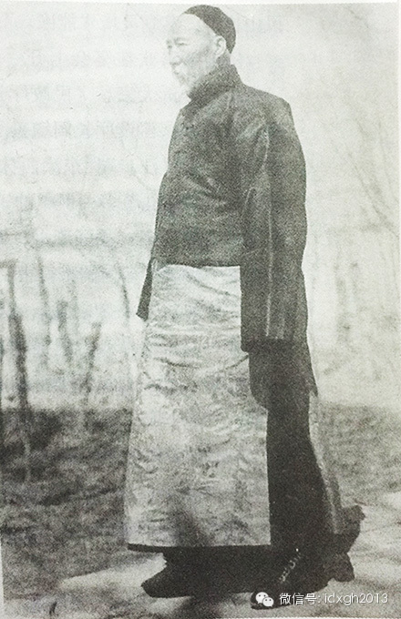

**在一些新疆本地老人心中，杨增新拥有近乎神话般的地位。在中国各地陷入战乱时，杨增新治下的新疆保持了17年的安定平稳。3月6日，是他诞辰150周年纪念。**  
  
文/黄章晋  
  
1928年7月7日下午二时许，新疆省政府主席杨增新在出席新疆俄文法政专门学校毕业典礼的午宴上遭刺客袭击，身中七枪，只留下一句“你们想干什么”便当场身亡，时年
64岁。

  

当日下午七时，政务厅长金树仁等人组织卫兵反击，活捉主谋前外交特派员樊耀南等人，未经审判便以酷刑处决了樊耀南。

  
4天后，《大公报》评论道：“新疆自民元以来已成独立割据之势。前任省长杨增新氏，更以闭关政策与中央相绝，其政治设施无一非满清遗制，人民处于樊笼之中，备受压迫之
苦，但鸣怨无处，反抗无力，只有忍气吞声而受之。民国十七年北伐军抵北平，杨仍犹豫观望，有志之士樊耀南者，集合同志将杨击毙，以为改革新疆之初步。”

  
《大公报》的文章为后世定下了评价杨增新的调子。无论是国民政府还是后来的红色政权，多将杨增新身上贴上满清旧官僚、割据军阀、保守落后分子等标签，将其意外身亡，视
为阻挡了时代潮流的必然。

  

但历史像是故意与《大公报》的乐观开了个玩笑。杨死之时，“全省人民巷哭野祭，女人孺子亦相向而哭”。杨增新“我死后新疆必乱”的预言变成了残酷事实。之后，新疆迅速
陷入动荡战乱，几乎不为中华所有。这个动荡的历史舞台成就了盛世才、马仲英等传奇枭雄后，杨增新反而少被人提起。

  
但杨增新并未在民间记忆中消失。1990年代出版的《维吾尔族历史》一书，作者刘志霄在沿用杨增新是落后象征的评价时，提供的事实资料却与此相悖，并不断提到“当地老
百姓在相当长的时间里继续怀念杨增新本人和杨增新时期”，称百姓提到杨时皆敬称为“杨将军”。

  

这个“相当长的时间”，也许大大超出我们通常理解的尺度——长期从事新疆研究的社科院研究员杨镰谈到一个故事，1986年他在若羌县遇到百岁罗布人库万•库都鲁克，老
人谈到“老将军”便泪水夺眶而出。杨在民间的声誉甚至延续到了新世纪：2004年，网上一封昌吉州的上访公开信，为强调今昔对比，第一自然段就以恭敬的语言提到“杨增
新将军”如何如何。

  
150年前诞生的这个人，为什么会在新疆留下如此声誉？  
  
【乱世崛起的独裁者】

  

_杨增新强硬提出整个新疆必须“合治”，前伊犁将军辖地塔城、阿勒泰统一划归新疆省管辖。_

  
新疆近世乱源起于辛亥革命。1910年10月10日，武昌兵变，成立新政府，通电全国号召响应。震波传到新疆，遍布军中的哥老会和革命党人摩拳擦掌。

  

当时新疆是三块互不统辖的行政区。今天的伊犁、塔城地区驻军属伊犁将军管辖，今天阿尔泰地区和蒙古国巴彦乌列盖省部分地区则归阿尔泰办事大臣主管，其余部分才是新疆省
，由巡抚管辖。

  
才上任新疆巡抚7个月的袁大化对爱新觉罗氏忠贞不二，不但拒绝向武昌政府表态，反与伊犁将军志锐（珍妃的哥哥）等地方大员策划将皇室迁到库仑（今蒙古境内）或阿勒泰（
伊犁将军辖地）。

  

12月28日夜，同盟会员刘先俊发动乌鲁木齐起义，但第二天革命党人就悬首城楼。1912年1月7日，杨赞绪率来自武昌的800新军在伊犁起事，末任伊犁将军志锐被处
决。

  
伊犁革命党人宣布“五族共和”，随即各族大军东进，与袁大化从乌鲁木齐派出西进平叛的大军乌苏相遇并打成平手。

  

当时全疆驻军在哥老会策动下纷纷哗变，袁手下已无兵可调。袁大化想起东边还有个富可敌国的哈密王夏迈合苏特，遂飞报求救。哈密王当然清楚一旦“共和”将丧失王位，立即
从部属中抽调500猎手，配发枪支马匹后千里救火。

  
但哈密王曾镇压过“冲击王府事件”，其贪婪吝啬和残暴早让乡民恨之入骨，这支民兵的领头铁木尔提出减少服役者家属劳役，遭拒绝后，铁木尔带走了军队。巴里坤驻军应邀镇
压，结果遇伏全军覆没，铁木尔被拥戴者称为“铁木尔哈里发”。

  

“哈密起义”碰倒了维吾尔人民大起义的第一块骨牌，接着，吐鲁番地区的二堡、火焰山、葡萄沟等地相继发生农民起义。新疆已不可收拾。

  
这时，宣布“反正”并出任大总统的袁世凯一纸“速停战”的电报飞到乌苏前线，袁大化只好“咸与维新”，与伊犁方面的杨赞绪议和，袁巡抚变成袁都督。

  

但刚刚屠杀过革命党的袁大化很难获革命党人信任，而此时各驻军哥老会门徒谋杀长官之风如烈性传染病。袁大化无力制止，心灰意冷下提出辞职，推荐袁鸿祐为继任者，孰料还
未得中央正式批准任命，袁鸿祐夫妇又被哥老会门徒杀害。于是，收拾新疆乱局的重任便落到了时任镇迪道兼提法使杨增新肩上。

  
杨增新，字鼎臣，1864年3月6日出生于云南蒙自，1907年任新疆陆军小学堂总办时，已在甘肃多民族地区历练十余年。

  

_杨增新戎装像_

  

入疆后，在平息冲击哈密王府事件中，杨增新展示了其熟悉边地民情的经验和灵活手腕。调任乌鲁木齐负责掌管新训练的警察后，他严密监控革命党人，为迅速挫败乌鲁木齐起义
立下大功。鉴于汉族军中遍布哥老会和革命党，杨增新建议袁大化立即着手训练穆斯林军队，以防不测。杨增新上台后，这支以回族为主的军队成为其权力筹码。

  
杨增新担任都督后，第一件事是解决与伊犁革命党人的权力分配。他强硬提出：整个新疆必须“合治”，前伊犁将军辖地塔城、阿勒泰统一划归新疆省管辖。

  

由于袁世凯做中央靠山，在杨增新施压和分化下，伊犁革命党人被迫与新疆省政府签定《新——伊和议条约》。新疆与伊犁统一为一个整体。革命党领袖杨赞绪被安排到喀什噶尔
后，不久又被杨增新用回族军官马福兴挤走。

  
杨增新用排挤和遣散方式解决了革命党人的麻烦后，依靠临时由当地穆斯林组建的“新军”武力镇压哥老会。当时新疆各地有哥老会成员近10万人，哗变会匪杀害长官后，失去
约束，互相攻击，骚扰地方无恶不作，不断引发民族矛盾。省府对新疆大部分地区失去实际控制。从1914年始查禁哥老会，到1918年完全扑灭，杨增新共斩杀了哥老会头
目178人。

  
对新疆另一乱源维吾尔农民起义，杨增新的态度是安抚而非武力镇压。而当时官员多持相反意见，主张尽早剿灭，以免酿成1860年代的大混乱。

  

杨增新认为，只要解决伊犁起义，农民不满当地贵族霸占水源的吐鲁番起义可顺利平息。杨增新派员往铁木尔营地传达杨增新招抚之意，希望其部众交出武器，投诚受抚，既往不
咎。同时发函希望哈密王减少对部民的盘剥和压榨。

  
虽然在居中调停反复谈判之时，杨增新深恶极端专制落后贪婪且反复无常的哈密王室，但权衡利弊，只能迁就。杨调集军队向义军施加压力，派出手下穆斯林军官再往铁木尔军中
，手捧《古兰经》发誓：铁木耳部众安全可绝对获保障，成员全体编入杨的新军，起义军回乡可每月只服2日劳役。哈密起义军遂被集体收编，铁木耳改汉名“铁正元”。哈密义
军受招不久，吐鲁番义军随即接受招安。

  

半年后，铁木耳准备返回家乡再次讨伐哈密王。杨增新得知消息后，立即将铁木耳逮捕处决。余众遣返，但这些人在半途遇伏，全部被杀。

  
1916年，袁世凯称帝，蔡锷在云南起兵讨袁，蔡锷派人入疆劝说杨增新起兵响应，曾向袁世凯上过劝进表的杨增新置之不理。说客便游说杨手下云南籍的护卫军营长夏鼎、督
署卫队营长李寅等人。

  

元宵节前日，杨大宴宾客，众人正欢宴，杨突然高呼：“砍夏鼎！”卫兵闪出，当场斩杀夏鼎。杨增新又手指李寅：“砍李寅！”李又被乱刀砍死。杨谈笑自若，其杀人不眨眼的
恶名由此而来。

  
虽然杨增新用谈判将伊犁地区并入新疆省，但当时阿尔泰地方（简称阿山）尚属中央直属。1919年春哥老会残余在阿山发动兵变，杨增新巧妙诛杀叛兵头目，顺势将阿山并为
新疆省的一个道。

  

新疆全省统一，杨增新成为塞外王国的绝对独裁者。

  

【力挽狂澜三万里】

  
_1920年5月，新疆省与俄罗斯联邦土耳其斯坦合众国签署的议定书，是中国与邻国签署的第一个平等条约。_

  
杨增新上台后，最大的难题不是山头林立四处战火，而是沙俄。

  
虽然左宗棠收复新疆后，1884年新疆设省，但沙俄靠一系列不平等条约，基本上控制了新疆。最直观的是其领事馆护卫军队数量完全不受限制，如喀什噶尔沙俄领事馆驻军一
度高达3000人，他们刻意在喀什噶尔大街人多时耀武扬威地出操，每天两次。

  
根据中俄《改订陆路通商章程》，俄商在新疆贩卖进出口货物可暂不纳税，不但每年损失一百五十万两白银的税源，更导致本土商人无法与俄商竞争。而英国根据最惠国待遇也享
有此特权。不平等条约还带来另一个严重后果，由于俄国侨民享有种种特权，不但诱使大量边民改换国籍，且极易导致民间冲突。1912年6月，和田州策勒村爆发俄侨被杀事
件。

  
所谓被杀的俄国侨民，其实只有一个原籍浩罕的乌兹别克人，靠代办沙俄侨民证收取回扣发家。该俄侨贪得无厌，竟对拒绝购买侨民证的中国村民断绝水源、上门殴打威胁。因为
有沙俄领事馆和商团保护，冲突中受伤的维吾尔村民只能集体上访，当地汉族官员实地查访，该俄侨闭门不出开枪打死数人。众怒，搬来柴草将该俄侨住宅焚毁，30名购买了俄
国侨民证的村民丧生火海。

  
沙俄闻讯立即派兵500侵入喀什境内，8月，俄军炸开喀什城北门，入城挑衅，月底又增兵千人进驻喀什。

  

杨增新迅速派出道歉官员分头出门，同时将地方官员全数撤职逮捕，但拒绝了沙俄提出的荒谬的杀人数字。俄国驻喀什噶尔领事竟直接带兵，行军千里到和田“追查凶手”。

  

最后，此案以逮捕审判了178人，赔偿7万余两白银方才了结。以当时情形，引起英、俄两国舆论巨大影响的事件，能不判处一人死刑而安抚沙俄怒火实属不易。

  
1912年5月，刚独立的蒙古国依仗沙俄支持，入侵阿山科布多，8月，攻陷科布多城。当时新疆尚未平定，且阿山并非新疆辖地，但接中央电令后，杨增新料蒙古人吞并科布
多后意在并吞阿山，为此不惜倾尽全省财力，不断抽调新疆省军，防范蒙古兵。

  

1913年7月，新疆省军两次击退蒙古军入侵，毙300余人。蒙古兵未再深入。由于财政窘迫缺少支援，杨增新只能守土。科布多未收复的失地，变成今日蒙古国巴彦乌列盖
省一部。

  
真正的考验在后面。1916年7月，沙俄中亚爆发民族大起义，沙俄残酷镇压导致当年秋出现大规模难民潮——30多万哈萨克人、吉尔吉斯人（即中国的柯尔克孜族）越过中
俄边境强行进入新疆，其中伊犁一地就高达16万人，而当时新疆人口不过300万，根本无力阻拦安置如此之多的携带枪支的难民。

  

_中亚暴动_

  
杨增新认为，解决难民的办法是“釜底抽薪”，经反复谈判交涉，俄国同意“赦免”难民。1917年开始大规模遣返难民，但沙俄屠杀被遣返难民，又导致第二次难民潮，一直
延续到年底爆发十月革命。

  

截止1919年3月，新疆共遣返难民30万人，对那些不愿回国的人，杨增新于1927年下令予以中国国籍。

  
十月革命造就了第三次难民潮。1919年5月开始，随着红军节节胜利，白军和俄眷不断逃入新疆境内。1920年，白军开始成建制逃入新疆，较大规模的有：1920年3
月，巴奇赤率军11000人，马9000，难民8000自塔城地区入境；5月，阿连阔夫率3000人自伊犁入境；1921年5月，诺维阔夫率2000骑兵自塔城入境，
并侵入腹地。

  
俄国内战成为新疆最严峻的考验。

  
1918年，协约国决定武装干涉苏俄。新疆地理位置特殊，不但北京不断下令，英、日来客不断游说杨增新，允诺出钱出枪，把新疆变成反苏俄基地，日本更提出派一个师团驻
扎新疆。驻伊犁的旧俄国领事馆也俨然以临时政府自居，号召新疆境内的俄国难民入伍参军。

  
杨增新对俄国内战的看法完全不同于北京政府，通过与苏俄新政权非正式谈判接触，他认为布尔什维克必胜，对北京和英国公使要求他对经济极为困难的苏俄实施贸易禁运的命令
，一概不予理睬。杨认为，新疆应对俄国内战严守中立，遵循国际公法，绝不能给白军提供各种方便。

  
对入境白俄武装军民，杨增新下令一律缴械，不得以新疆为基地攻击红军。对解除武装的白军，想方设法将之拆散，就近安置边境地区以便遣返。

  

1919年后，窜入新疆的白俄军队数量越来越多，而新疆省军总数不足1万。到了1921年，进入新疆境内的白俄军队数量已高达4万余人，集中在伊犁、塔城、阿山地区，
未服从缴械命令且保持组织完整性者约2万人，不断骚扰地方，甚至公然策动蒙古上层贵族叛乱。

  
1920年5月，苏俄红军照会要求入境剿匪，保证任务完成后立即退兵。杨增新认为“我国只可顺天，不可逆天”，1921年初与红军秘密达成口头协议，准许红军入境，双
方合作征讨白军。红军两次入境作战，10月，新疆有组织白军被全数肃清消灭。红军果然守约迅速退出新疆。

  
对那些被分散安置留在中国的白军，杨增新极为提防。可惜杨死后，继任者金树仁把白俄重新武装起来，改为归化军，结果为日后新疆增添了新的乱源。

  
修改中俄不平等的通商条约是杨增新的夙愿。由于条约规定修约不能晚于1920年8月24日，杨一再呈文催促，但北京承认的俄旧政权已经垮台，他转而与新政权谈判。杨增
新利用与苏俄新政权的合作历史，以及苏俄急于获得承认的心理，以满足苏俄引渡要求换对方让步，谈判极为顺利。

  

1920年5月，新疆省与俄罗斯联邦土耳其斯坦合众国签署议定书，废除了免税和领事裁判权等不平等条款，是中国与邻国签署的第一个平等条约。

  
1921年4月，杨增新通知英国，由于中俄修约，英国商人根据最惠国待遇免税的特权也被取消。

  
杨增新与苏俄谈判的另一收获，是在中亚设置领事馆。1916年，沙俄在镇压民族地区起义时，屠杀六千华人。为使中亚地区十余万华人得到领事馆保护，杨增新提出沙俄在新
疆有五个领事馆，以对等原则，应允许在安集延等地设置五个领事馆，沙俄以距军事基地过近为由拒绝。

  

1921年，苏俄要求恢复沙俄时代五个驻新疆领事馆，杨乘势旧事重提，经反复谈判，1924年双方达成协议——互设五个领事馆。

  

【莫教祸水向西流】

  
_杨阻断共产主义传播极为成功，苏俄在中国各地遍撒共产主义种子，唯独在最近的新疆却一无所获。_

  
杨增新较早预见到苏俄新政权必将战胜沙俄旧政权，并认为俄国革命，是由社会贫富差异巨大，权贵过于腐败所致。但杨增新认为，布尔什维克是危险的过激主义，将之视为对新
疆社会安定的最大威胁。

  
新疆十月革命后，俄国境内有数千华人参加红军，苏俄政权选拔部分有文化的人员在社会主义传习所进行为期六个月的培训，分别派往中国各地。

  

新疆毗邻苏俄，成为马列主义对外主攻地区。1919年，新疆就在多地侦知苏俄派出汉、回、维吾尔族骨干渗透新疆鼓吹革命的消息。杨增新感叹：“过激派之主义、社会党之
潮流，已骎骎乎输入我国，驯至有不可遏之势。”  

  
为及时获知苏俄消息，杨增新委派在中亚经商的维吾尔族富商代为眼线刺探情报。

  

1924年，新疆与苏联在通商谈判时达成一致协议，双方互相不支持任何以反对对方政体为目标的政治煽动行为。但直至1927年2月，共产国际才放弃向新疆派遣维吾尔族
干部的努力。

  
为阻断马列主义的传播，杨增新1920年就开始采取严密的信息审查和阻断手段。新疆与苏俄只开放尼勘卡一个口岸作为人员和贸易往来通道，对过境人员，严格检查，禁止一
切包含鼓吹工人平民革命、社会均产、无政府主义等内容的资料进入新疆。同时四处派员对各地出现的宣传活动严厉禁止并收缴材料。

  
杨增新在内地进入新疆的星星峡关卡设置稽查人员，施行严格的文化封锁和信息检查制度。杨阻断共产主义传播极为成功，苏俄在中国各地遍撒共产主义种子，唯独在最近的新疆
却一无所获。

  

但信息封锁政策也最为后世诟病。当时内地输往新疆的邮件和印刷品皆需检查，邮件甚至要拆开两次，部分信件送杨增新亲自过目。《大公报》、《申报》、《新闻报》禁止在新
疆发行。

  
为研究了解马列主义，杨增新曾请苏俄领事馆翻译每周两次见面，详细讲解《资本论》的内容，杨增新在叹服列宁事业之英伟的同时，更坚定地认为，煽动阶级斗争的仇恨之论，
有违中国人调和中庸精神，不适于中国国情。不过，马列著作似乎也误导了杨增新，他感慨“中国幸无大工厂，否则革命遍地。”

  
杨认为，只有专注社会治理才能有效俄防范共产主义，“非抱定民生主义，使国民皆注重实业，无以救天下穷乏，即无以止天下之乱，望政府兼筹并进，不宜偏重军事一途。如至
四海困穷……纵使兵满全国，亦断不能维持。”

  
1916年杨增新酒宴上当众斩杀云南籍军官夏鼎、李寅后解释其理由：内地政党、国体纷争一旦引入新疆，必引发不可收拾的祸乱。“诛一二不屑之子”，实乃不得已而为之。

  

1924年，为杨增新排挤革命党立下大功的喀什噶尔长官马福兴，被杨增新突袭抓捕并处决。杨认为马福兴曾有的如下行为将祸乱新疆：擅自扩军、随意加税任免官员、与旧俄
领事馆密议出兵讨伐红军、暗称“喀什噶尔帕夏”、与北京政府曹锟暗中联络。

  

_行刑前的马福兴_

  
杨增新对内地主义、政党纷争颇不以为然，曾云“穷兵黩武，寡人之妻，独人父母……今之人开口言同胞，而无日不戕杀同胞”。

  

由于政权更迭频繁，杨增新抱定只认庙，不认神的态度，无论中央政府何人上台，杨增新在表示“新疆以拥护中央为天职”的同时，对新疆事务一概我行我素，既不听令，也不接
受委派官员。

  
为防中原战乱纷争祸水西流，杨增新甚至命令，非经其本人同意，内地人不可从星星峡关卡入新疆。杨认为，内地社会动荡，民无恒产、恒心，新疆孤悬塞外，不远万里克服艰难
入疆者，多半是胆大妄为的冒险家，而新疆多一不安分游民，则多一祸乱种子。

  

【老子的小政府】

  
_近代中国人普遍有兴建大型企业标榜现代化成就的强烈冲动，唯独杨增新是罕见的异数。_

  
杨增新服膺儒家修身之道和老子“无为而治”的治国之道。与内地大小政权不断加税、增兵、扩权相反，杨的治理之道是减税、裁军、缩权。他曾自夸道：“十年以来，从未加赋
税，从未借债，人民负担尚轻，是以外人过激主义遂难输入。”

  
当时环境下，新疆做到这点极为不易。

  

自左宗棠收复新疆始，新疆的国家机器运转皆需仰赖内地协饷，庚子赔款后清廷财力不足，但每年也高达240万两（不含伊犁、阿山地区）。辛亥革命后，内地各自为政，新疆
从此断绝了内地财政支援。新疆维持财政平衡、保持物价稳定的难度，高于中国任何一地。

  
杨增新上台时，为平息战乱、遣返革命党人，新疆财政已造成巨额亏空。1913年，新疆军费支出为557万两，而财政收入仅80万两。后经系统清理财政，1916年财政
收入上升到了330万两，但顾及人民负担，财政平衡只能靠大幅削减支出。

  
1912年，杨增新改组全疆行政体系，将府、厅、州、县一律改为县治，裁撤了迪化（乌鲁木齐）、伊犁两府和霍尔果斯通判。新疆省设37县，一等县6个，二等县17个，
三等县17个。一等县全部科长科员12人（不含雇员），二、三等县全部科长科员6人。

  

裁撤下来的冗员，杨增新安排垦荒或改营经商，并在公文中提醒在职官员“从速自谋生路，不要存做官之心”。

  
1912年新疆战事初平，杨增新开始大规模裁剪兵员。此举深刻改变了新疆驻军的构成——新疆驻军多由内地汉人组成，大规模裁撤重组后，省军变成了本地穆斯林为主的多民
族混合军队。杨增新认为，“以本省之人为本省之兵，则招之来可以麾之去，他省之人为本省之兵，则聚之易不免散之难”，化解了新疆出现军阀的可能。

  
到了1916年，新疆省军编制3万，实际常不足1万。由于极度压缩军费，新疆省军被称为“叫化子军”，甚至不少士兵所持枪支是涂墨染色的木制假枪。杨增新对百姓嘲笑省
军的破败不但不以为意，反施行更灵活的寓兵于民的政策：农忙时节，放开营门让士兵自行充任耕作劳力，农闲时节同样打开营门，让饥馑者以当兵为名混口饭吃。

  
在杨增新看来，对内施以善治，防止过激主义煽动，对外不妄生事端，信守公法，即便只有象征性的军队，亦可保一方平安。反之，“自治潮流日盛一日，断非快枪快炮所能压制
。”

  

经济上，杨增新同样奉行“无为而治”。他对经济发展的注意力，主要在督导开渠垦荒，发展农业之利，而不在工业。杨任内值得一提的工业成就，多为维吾尔人兴建的民营轻工
企业，譬如阿图什的穆萨巴尤夫家族皮革厂的产品成功打入欧洲市场。而通常是工业命脉象征的官营重工业企业，则乏善可陈。

  

杨认为新疆投资重工业断无法与苏俄争雄，只有农牧轻工业方才可行。但选派学生出洋留学，也不以回国后兴建官营现代企业为目的，而是学成后让他们回到民间自行改良传统技
艺。

  
杨增新认为官方只须教导百姓改良，官方投资办厂应当审慎，不然近于垄断且易造成亏损，于贫民生计无益。

  

新疆吉木萨尔、巴里坤两个军马场的“企业改制”遵循的也是同一思路。历代军马场皆属官办，但历经反复整顿，军马场依然亏损严重。杨增新决定将全部官马租赁给土尔扈特牧
民经营，施行“铁畜制”，即每100匹官马，每年报交仔马10匹，只要保证基本马品质数量，其余归牧民所有。此举让双方均大获其利。

  
近代中国人普遍有兴建大型企业标榜现代化成就的强烈冲动，唯独杨增新是罕见的异数。其任内现代工业的成就远不如后来盛世才时代，这或许是杨被诟病为落伍保守的最大因素
。只不过，盛世才的工业成就，建立在巨额苏联外债、大量出卖国家权益和巨额财政补贴的基础上。

  
不过，杨增新虽勉力将小政府模式推到极致，仍无法真正解决财政平衡问题。

  

自1912年至1927年，新疆累计财政赤字4960万元，解决亏空只剩超额发行纸币一途。杨增新也承认新疆人民的负担并不轻，斯文•赫定提到，杨增新对他说，虽然新
疆有300万各族人民，但从总的税收情况看，这个省住着800万人。

  

【须将各种族人民揉成一团】

  
_杨增新是近世新疆唯一一个将当地穆斯林武装当作拱卫政权的统治者。_

  
时人将杨增新的统治术总结为，让不同民族不同地区的人互相牵制，杨则精心在各力量之间搞平衡。杨增新本人亦将此当作经验传授。处理民族事务时，杨增新最常用的关键词是
“羁縻”，比之盛世才时代“民族平等”、“民族团结”、“民族代表”等让人亲切熟悉的词，“羁縻”一词带有浓烈的陈腐气息。

  

_戴瓜皮帽、穿皮鞋的新旧混合的杨增新_

  
杨增新政府中，只有前清旧官僚，没有“民族代表”，但却是近世新疆唯一一个将当地穆斯林武装当作拱卫政权的统治者。

  

他对此的解释，并没有一句民族平等之类的漂亮话：“前清同治年间，回疆多事，官兵多用汉人以剿抚回缠，乃民国成立以来，缠回皆助共和，相安无事。而汉族则游民会匪到处
戕官，见猱升木，几至不可收拾，非利用回缠不足以维持秩序而救目前之急况。”

  
杨增新也是近世新疆统治者中唯一一个学习维吾尔语的。他能讲不太流利的维吾尔语，并一再督促各县知事学习维吾尔语，否则“不惟难以联络地方之感情，洞达人民之隐屈。”

  

为解决语言人才不足，新疆建立了一所学制为两年的“缠文研究所”，为杨培养了一批符合其政治理念的双语干部。

  
历任新疆统治者中，少有人像杨增新这样重视少数民族语言问题，不但语言不通成为杨增新拒绝内地派遣军校毕业生的理由之一，是否会说维吾尔语，也在后来成为杨增新整饬吏
治的目标。他的一切目的就是“新疆至于今日其情形已极危险，须将各种族人民揉成一团，不使生心外向”。

  
杨增新以国家分裂的后果来提醒新疆官员身负特殊职责：“念西藏以自治，非独藏人之罪也，我汉官之不肖，迫西藏以自治，而后英人得而乘之也。”，外蒙亦同此理。

  
汉官治理新疆，最棘手是宗教问题。但杨增新认为恰恰应当利用宗教：“查缠民笃信宗教，尊重阿訇为牢不可破之习惯，假使缠民不信宗教，不敬阿訇，便不免无所忌惮非专恃官
法所能维持。”。

  
杨增新奉行宗教不干预策略。新疆建省后一直有官员指派阿訇的习惯，杨增新告诫官员不可随意更换阿訇甚至刑责阿訇。

  

官员不再干预宗教后，地下宗教法庭很快公开化，杨增新认为官方与宗教法庭的这种职能分工是好事：百姓发生刑事案多会找官府，而一般的民事纠纷、财产公证都会找伊斯兰教
机构。社会矛盾转交给更熟悉民情民俗的宗教机构处置，反而减少了官方裁断失误和不必要的事务。杨增新很早就注意到，官府多次无法裁决的纠纷，经阿訇抱经盟誓，可当场解
决。

  
对宗教机构和人士来说，公开化为其开辟了财源，其地位上升，对官方的态度会更加温和，是属于你敬我一尺，我敬你一丈的关系。杨增新本人在一切公众场合刻意烘托宗教人士
的地位，他的座位两边必然都是留给维吾尔族大阿訇和回族大阿訇的。

  

杨增新认为，新疆宗教情况远比陕甘简单，没有教派门宦之争。为保持这一局面，杨增采取了特殊的宗教干预主义——严禁西北门宦进入新疆，严禁私立道堂，以免陕甘宁地区悲
剧在新疆重演。但杨增新的政策并不僵硬，对已在新疆取得势力的门宦，则会加以笼络控制。本着同样的因素考虑，杨增新严禁聘请国外教员入境，禁止土耳其人讲授古兰经。

  
杨增新对新疆宗教问题的态度，并非全然出于“羁縻”之策。作为一个博览群书的孔孟弟子，他竟提出一神教比中国的多神崇拜更先进的观点。因为儒家社会，只有天子才可祀天
，百姓不得祀天，而基督教、伊斯兰教人人可直接祭拜上天而有所敬畏。

  

【西出阳关无好人】

  
_杨增新认为“有坏官无坏百姓”，可发动百姓直接监督现任官员，于是有了“邮禀”举报制。_

  
杨增新上台后，对新疆吏治曾如是评论：“查前清吏治以新疆极为腐败，而新疆吏治又以南疆极为腐败——南疆回缠纷纷投入外籍，其原因虽极为复杂，然多由官吏之虐民所致。
”他认为新疆吏治腐败的原因是，官员“多自万里而来，其来既难，归亦不易。一旦得官，即以回缠为鱼肉，横征暴敛，为全国所无。”故杨增新认为西出阳关无好人。

  
杨增新整顿吏治的思路是：严惩、教化、监督、高薪。

  
从新疆设省到杨增新上台，近30年间无一基层官员因贪污被参。杨增新认为不严厉肃整便无法让官员有基本的廉耻和畏惧，不制定标准则无从促进官员有所为。杨上任不久，亲
自制定了一套对基层知事区别良莠考核标准的评级制度，分甲乙末三等，据此奖掖提拔或予以惩罚。

  
1914年，经舆论准备，杨通报奖励了三位知事，其中一人上报中央授予勋章。但更多官员受到惩罚。仅喀什下属12县就撤职11人，贪污亏空罪行最严重的迪化（乌鲁木齐
）、伊宁两县知事，遭枪决。至1918年，遭枪决、遣送出境的官吏多达17人。

  
杨增新认为，官员不肖，在新疆会有极大危害：“若以暴易暴，回缠虽愚，必不能束手待毙，以听汉官之宰割。”根据1915年中央政府颁布的《官吏犯赃治罪条例》，杨增新
定下贪污公款达到500元者可处以死刑的规定，此数字成为新疆后世遵循的贪官量刑惯例。

  
杨增新虽然经常口称“共和”，但又认为“共和与专制无优劣”，他对辛亥革命以来中国的乱局失望已极。在他看来，西方的选举制、政党制均非良制，内心渴盼的理想是圣贤专
制。

  
尊孔被杨增新视为官员教化的最重要手段，凡官员上任，必亲率众人在孔庙跪拜发誓，遵循圣贤教导，做好百姓的父母官。为了让手下官吏德、才精进，杨增新亲自辑录清代一批
政声卓著基层州、县官员的学治论文，汇编为《学治要言》，印发给各级官吏，后又编著《学治要言续编》。

  
新疆天高地阔，官员外放即为一方诸侯，外人无法约束，杨增新认为“有坏官无坏百姓”，可发动百姓直接监督现任官员，于是有了“邮禀”举报制。

  

该举报制规定：但凡官员遭举报，轻则立即查办，重则先撤后查，仅凭供词雷厉风行，倘若查无实据，不追究控告者责任。汉族百姓控告官员，需面呈诉状，维吾尔百姓控告官员
，只需贴上邮票寄来，无需躬递。

  
“邮禀”举报制极大的震撼了官场风气。以至于北京政府派往新疆考察财政的谢彬认为，新疆的肃贪运动有矫枉过正之嫌，以至于有刁民利用它来挟制基层官员。

  

杨增新虽然极为强调官员修身养性，但也认为新疆吏治腐败的部分原因是薪俸过低不切实际。当时新疆财政虽然极为困难，但杨增新在一番裁撤惩罚后，力排众议大幅提高官员薪
资，将其整体水平提高到内地同级官僚的近十倍。

  
为造就一批符合杨增新政治理念的官员，1916年，杨设立“政治研究所”，主要任务是培养县级主官，学员为即将上任的知事或县佐，其必修课程有外交、财政、警察、实业
、法律等，此外还有关于新疆地理、历史、风土、人情的知识。将外交置于第一是因为新疆地处边陲，毗邻英、俄，外商、外侨遍布全疆，稍有不慎即起衅端。

  
杨增始终认为内地客籍官员管辖本地土著不是长久之计，他也始终不肯信任内地派来的新派人物。他甚至认为，共和时代，自治是世界潮流，新疆稳定，全赖当地人民认为“代治
”优于“自治”。“用新疆之人以守新疆，此增新素来办事宗旨”，并非杨增新挂在嘴边的漂亮话。

  
为实现“不致借材异地”的理想，1920年杨增新创办了蒙哈学校，招收蒙哈上层子弟，准备造就一批忠于自己政权的蒙哈干部。

  

1923年创办俄文法政专门学校时，杨增新派代表告诫学生：“你们都是本地人，将来毕业后，都有做县长的资格，你们要好好读书”。该学校的学生被反复灌输“以本地人才
治本省之事业”。杨增新非常重视这个寄托了他新疆未来的学校。不仅免收各种学杂费，学生每月还另发二十两省票津贴。

  
但是，杨增新没有等到他们成才的那一天。1928年7月7日，杨增新在法政专门学校毕业典礼上遇刺身亡。

  
也许，斯文•赫定对杨增新的评价最为全面：“杨增新学问渊博，眼光远大，心胸恢弘，手腕灵活，他如果生长在欧洲的社会，必是一个伟大人物。他是一个代表中国旧社会、旧
文化、旧道德、旧传统的最后一个典型人物。”

  

_杨增新的墓碑_

  

**[大象公会所有文章均为原创，版权归大象公会所有。如希望转载，请事前联系我们：bd@idaxiang.org ]**

** **

[阅读原文](http://mp.weixin.qq.com/s?__biz=MjM5NzQwNjcyMQ==&mid=200791923&idx=1&sn
=61f538bddaa522188b9dc4dd1f7adbaf&scene=1#rd)

