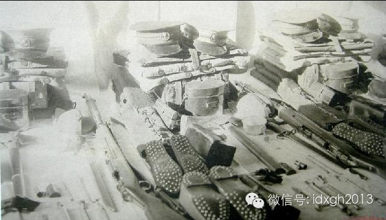
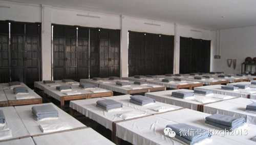
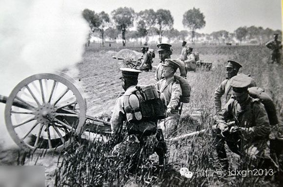
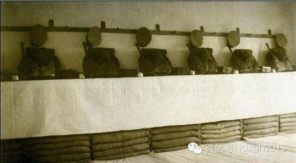
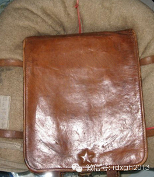
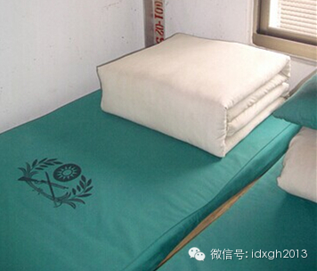
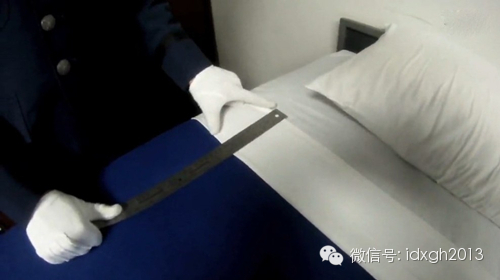
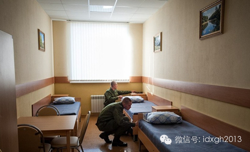
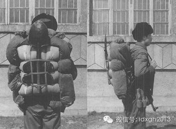

****

**解放军使用的大棉被其实很难叠整齐，但他们却叠出了全世界最高水平。他们是怎么做到这一点的，是向谁学习的？**

  

文/思明洲  

  

长2米，宽1.5米的棉被，三分钟内折成长0.5米，宽0.45米，高0.17米的方块，不但要见棱见角，并且误差不许超过0.5厘米。这是解放军有些部队叠被子的标
准。解放军招牌式的风纪和训练，除了钟表一样精确的踢正步，也许就是被子叠得像刀切出来的豆腐块了。

  

一支军队叠被子的水平，与战斗力有关吗？

  

【被子的威力】

  

电影《火烧圆明园》中一处细节很考究，通州八里桥之战，英法联军都背着捆扎整齐的背包，而清军士兵身上只携带着武器。前者是近现代军队的标准装扮，后者则是古代军队的
标准行装。古代军队士兵通常不随身携带被褥，而是由类似行李队的组织运输。

  

士兵随身背负被褥始于文艺复兴后的欧洲军队。当时装备了滑膛枪的欧洲军队，典型战斗模式是士兵站直排成横队，踩着鼓点迎着对方前进，进入射程后才开火。这种排队“自杀
式”的近距离互射和刺刀互捅，需要非常强悍的意志和纪律，为此必须让这些年轻农民工人和无业游民组成的士兵害怕军纪甚于死亡。军队内务就成了培养团队精神，纪律性和绝
对服从的绝佳办法。

  

收拾床铺也是内务的一个重要组成部分。工业化生产使当时欧洲军队配发了统一的制服、背包、军靴和军毯。欧洲军队每天早晨需要将毯子叠的非常整齐，以接受士官的严格检查
，如有误少不了饿饭和棍棒殴打。

  

而清朝军队实际是支业余军队。大部分士兵都是和老婆孩子一起住在军营附近的家里，早饭后才溜达到军营，操场上耍一会就跑到市场摆摊或喝茶下棋去了，根本就不存在内务训
练。清军对付老百姓没问题，但面对西方军队时，其意志力非常薄弱。清军不敌英军，并非一般人认为的大刀长矛够不着英军，英国对两次鸦片战争的描述是，几乎每次交战清军
都是在英军端着刺刀集团冲锋时瞬间崩溃。

  

甲午战争后，袁世凯开始模仿西式练兵。清末新军是中国第一支重视叠被子的军队。新军士兵一入伍，就要进行6个月徒手训练和讲课，其中一项内容就是内务。新军内务规定，
所有制服被褥，脸盆牙刷都统一配发。士兵半个月理发一次，用茶麸洗头，勤剪指甲。起床后立刻整顿内务，叠折毡被，一律整齐美观。

  

军官要随时检查内务，他们手带白色手套，检查被子是否叠整齐，一旦发现问题，便要接受处罚。以后无论袁世凯小站新军还是新军衍生出的北洋军，都遵循了把被子叠成豆腐块
的做法。

  

_清末新军已拥有了皮军靴、皮背包，还学会了叠豆腐块_  

_  
_

由于甲午战争和日俄战争，中国人对日本军事推崇备至，纷纷到日本学习军事。日本对内务更是变态，从早晨起床到晚上就寝，士兵绝对不能再坐或躺在床上，如果违法会被处罚
举枪或练习站姿瞄准。今天，日军被子叠成方块这项传统被自卫队继承了下来。

  

【解放军的师承】

  

解放军叠被子是从黄埔军校学来的。当年黄埔军校纪律非常严格，生活节奏非常紧张。早上军号一响，马上起床、穿衣、梳洗，将被子叠得方方正正像个豆腐块，摆在木板床正中
央。10分钟内一切要收拾完毕，然后操练。有大量中高级军官毕业于黄埔军校，自然学会了叠被子内务。

  

_黄埔军校的被子___

清末新军和早期北洋军由于经费稳定且军队人数较少，都是日本式的皮背包加军毯模式。而绝大部分国民党军和全部共产党军全部都是穿草鞋、布鞋，背着被子，穿土布军装。他
们实际上是一支基于农村低水平经济的军队，所以不光是要叠豆腐块，还要背着被子行军，且不配备野战背包。  

  

_北洋军的行装不低于同期的西方和日本，已实现专用军用背包和军毯的组合___

  

_北洋军的宿舍，清一色的豆腐块___

  

_旧日本陆军背包和军毯携行方式_

  

不过，从清末到中华人民共和国成立，叠被子的水平与今天相比是两个层次。而且直到今天，解放军内务条例中也没有规定必须把被子叠豆腐块，只是说保持环境，整齐清洁，空
气新鲜。每天早上整理内务只给不超过30分钟时间。连级首长一周检查一次内务卫生。

  

转折点是1960年代，解放军全军学习空军内务卫生的活动。军队各单位到当时被誉为亚洲最干净营区的空军大院参观学习，学习的主要内容之一，就是叠被子。再后来，这种
内务整理、评比便逐渐被作为一种部队基层管理、基层建设的基本内容保留下来，并且要求越来越高。

  

_台湾陆军部队的被子，台湾海军陆战队用睡袋并不叠被子___

_  
_

整理内务，把被子叠成豆腐块本来是件锻炼纪律性较差大男孩的好办法。欧洲国家和日本的军被实际上都是毛毯，非常容易叠出漂亮的外形，行军时卷起来绑在背包上也很方便。

  

中国由于经济不发达，军被长期用的是大棉被，厚棉被很难叠成豆腐块。解放军的被子虽然材料上先天不足，但在效果上，才是真正把被子叠得像刀切出来的豆腐，他们是如何做
到这一点的？

  

【最高的叠被子水平】  

  

只要是用被子而非睡袋的军队，大都会要求把被子叠得整整齐齐。台湾军队叠被子的标准是，正面后面和2个侧面，要各压出6条中心线，压线的时候两手以手刀形，以手掌温度
熨出平整线条，最好两侧面再以右手小指尖各挑出6个角，再将多余的皱褶藏在弯角内。

  

_ _

_美军对内务要求很严格_  

  

_俄罗斯军队不叠豆腐块，他们更喜欢把寝具平铺在床上_

  

解放军叠被子的标准就更为严格。不少部队已经将叠豆腐块变成一种神圣的仪式。不光是被子要叠豆腐块，洗脸毛巾，军大衣都要叠成豆腐块。有些要求被子高度必须控制在（1
7±±0.5）厘米范围，为了把误差控制在0.5厘米范围内，每人都准备了塑料尺，这当然难不倒解放军。  

  

比如，他们平时都不敢晒被子，因为晒后松膨的棉被不易控制尺寸。所以被子大多都是潮湿的。这样被子很容易被叠成标准豆腐块。有些人睡觉也把豆腐块被子供在那里，导致睡
眠不好。《解放军报》曾报道，某些部队不光是要求被子如豆腐块般保持一致，还要求战士把洗脸毛巾也一律叠成“豆腐块”摆放在脸盆内，久而久之，一些细菌开始在毛巾上滋
生繁殖。

  

把被子叠到解放军的水平不是件容易的事。被子里的棉花必须压实，尽可能去掉里面的空气，把它折叠成大致的方形，需要相当的细心。但外表要像刀切般整齐，要用拇指和食指
仔细捋，不断修边。有人会在被子里夹木板，还有人发现在被子上浇一点水才容易见棱见角。

  

不得不说，使用棉被，不仅整理内务不方便，行军时也麻烦，叠豆腐块的一个重要原因就是背上行军方便，有利于执行紧急任务，特别是宽三长四的折叠方式，便于折叠和捆扎。

  

1990年代初期以前，解放军行装没有什么技术含量，士兵肩上挂的各种肩带多达十几条。手榴弹袋、挎包、胸挂弹药装具、防毒面具包、水壶、背包、枪械等，出发前要往身
上挂好多件物品，极易遗漏物品，或者挂错顺序导致使用不便；同时荷载分布极不合理。最后还要背一床被子，被子上再捆绑上工兵锹和胶鞋。

  

武装过河更是麻烦。比如拿床被子，就需要先在岸边把雨衣胶面朝下摊开，把棉被放在中间，再将鞋袜、挂包等均匀放在中间，使重量平均分布，再进行包扎。包扎时，先叠雨衣
的上部，向前卷成条状，再把两旁多余的部分叠在上面，并用带子扎紧。最后把工兵锹插在底部的带子里面，做成一个浮包。甚至用3把工兵锹和2根木棍把3个浮包插在底部，
再用带子固定，放在三脚架上用绳索扎好，由2人推送过河。到了对岸再全部解开，重新打包。

  

_90__年代初期最常见的棉被褥，用背带三横两竖捆绑打包_

_  
_

如今，解放军已有了新式野战背包，但问题是如果背上被子，就没地方背野战背包。如果塞进野战包，又会占据一半空间，非常不便。叠豆腐块的根源是便于背着行军打仗，现反
而成为缺点，背着被子行军的做法正逐步被淘汰。

  

一些部队已开始放弃叠被子，转而如俄军、美军一样，军被由折叠改为平铺，床上物品铺放整齐有序，由下至上依次为床垫、皮褥子、褥子、被子、军毯。或许它是解放军被子文
化的一种新趋势。

  

军营平时住宿叠豆腐块，是规范内务、锻炼新兵的一种手段，也是值得作为军队传统保留的文化。至于有的部队能精确到不超过0.5厘米这样赏心悦目的水准，或许它可以像仪
仗队专门练习踢正步一样，单独成为建制，专门训练叠被子，定期向公众表演绝活。

  

  

> 版权声明：  
大象公会所有文章均为原创，版权归大象公会所有。如希望转载，请事前联系我们： bd@idaxiang.org

大象公会：知识、见识、见闻

微信：idxgh2013

微博：@大象公会

投稿：letters@idaxiang.org

商务合作：bd@idaxiang.org

  

[阅读原文](http://mp.weixin.qq.com/s?__biz=MjM5NzQwNjcyMQ==&mid=202835712&idx=1&sn
=0727b7bdd9d474ecd021ba8ce21ad805&scene=0#rd)

