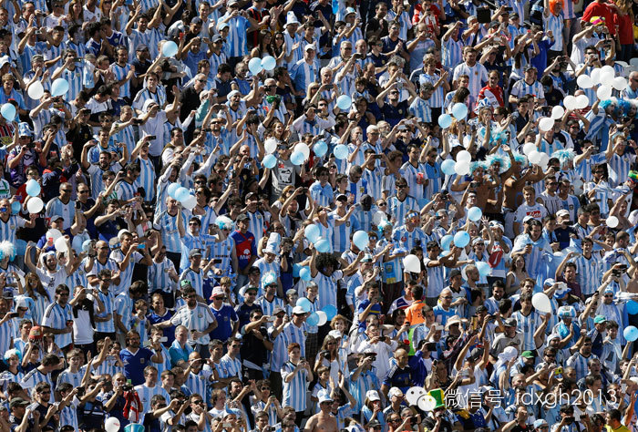
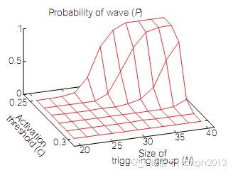
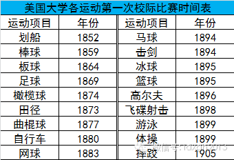
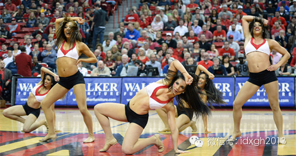
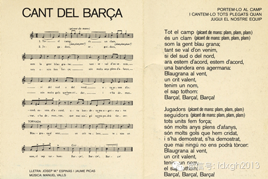
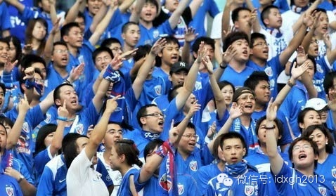
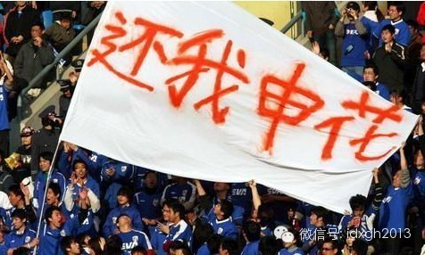
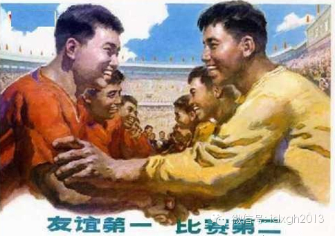
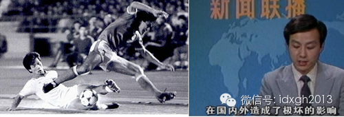

**足球场上壮观的人浪、口号、拉拉队最早是谁发明的？为什么中国足球场上的欢呼多是“牛X”“傻X”，为什么中超球队的队歌几乎无人传唱？**

  

文/杜修琪

  

“人浪”是足球场最常见的欢呼方式，本届世界杯上几乎场场出现。巨大的体育场内，一排排观众渐次起立，犹如海浪卷过看台。

  

2014年世界杯阿根廷球迷用蓝色气球制造的人浪

  

很多人认为，“人浪”起源于1986年墨西哥世界杯。CCTV解说员刘建宏、段暄等就常如此介绍。“人浪”的名称似乎也支持该说法，北美地区之外的英语国家，称其为M
exican Wave：墨西哥波浪。

  

这是因为墨西哥球迷更加热情奔放，在发达的欧美联赛外拓展了新的体育潮流？

  

事实并非如此。“人浪”最早出现在美国，并广泛传播于北美，只是在1986年世界杯上，墨西哥人借世界杯的影响力抢走了它的冠名权。

  

除了“人浪”，球场欢呼文化中拉拉队、DJ、队歌、队徽等都发源于美国，而最早的俱乐部、职业球队出现在英国。今天世界各国的体育文化，几乎都是建立在英美大众体育的
框架上。

  

**【看台上的技术活】**

  

我们可以从“人浪”的历史讲起。

  

1970年代末，“人浪”就零星出现在美国的体育场。很快，美国的大学联赛就接过了“人浪”的旗帜，发扬光大。这并不令人意外，之前欢呼文化的另一重要部分——拉拉队
，就出现在1877年的普林斯顿，然后得到大学联赛、职业联赛推广。

  

所有大学中，密歇根大学的“人浪”最为出名，除达到105000人的宏大规模，它的球迷还增加了“沉默人浪”、“嘘声人浪”、“快速人浪”、“缓慢人浪”等玩法，以调
整气氛，呼应赛场的变化。

  

不过，当时的“人浪”形式和今天不同。一种是两侧看台的球迷呼应着相继起立，中间的球迷保持不动；另一种是自下而上的进行，而不是顺时针渐次卷过看台。

  

今天的“人浪”形式，源于1980年代一场冰球比赛的失误：部分球迷的起立明显晚于其他人。此时，旁边的球迷突发灵感，跟进了这一趋势，这种失误造成了新的视觉效果，
环场一周的现代“人浪”从此诞生。

  

新的“人浪”形式虽不如之前丰富，但更稳定、流畅，它解决了20世纪体育史上一个重要的问题——如何能动员众多球迷热烈而又有序地欢呼，因此很快被北美其他国家效仿，
这才有了墨西哥1986年的大出风头。

  

“人浪”本质上是一项群体技术。能发明人浪这种欢呼形式，前提是观众群体必须有强烈的团队认同，并且有强大的自发组织能力，大学联赛和高度商业化的联赛都能塑造出这样
的观众群体。

“人浪”发生的可能性与组织者数量、现场活跃程度之间的关系。世界范围内，球迷协会都是其重要的组织者。

  

拉拉队和人浪、队歌等欢呼文化最早都出现在北美大学联赛。1906年就创始的NCAA（美国大学生体育联盟），在各成员高校均有校园体育协会；球队宣传、后勤保障，乃
至拉拉队员选拔都由他们负责，有效地提高了球迷的动员能力。最初，北美的体育场都有体育协会的工作人员挥舞着旗帜，绕着球场奔跑来引领“人浪”。

  

  

NCAA全国各高校比赛很容易让先进的组织经验在协会间流传。零星出现——组织者吸纳——形成特色——全局推广，这是拉拉队、人浪等欢呼形式共同的发展脉络，它也适用
于其他运动。NBA球场播音员、拉拉队、大屏幕三者协作的动员方法，网球、斯诺克等对球场声音的高度控制，都由社会组织能力更发达的美国和欧洲发明，最后成为世界性的
欢呼文化。

  

NCAA拉拉队表演

  

**【口号，歌曲，队标】**

  

最早的队歌也出现在美国。1885年，波士顿学院的TJ**赫尔利创作的“为了波士顿”，被引为院歌，接着在体育比赛中传唱。美国人对大学的高度认同，很快让几乎每一
所NCAA球队都有了自己的歌曲。

  

它转而影响了职业体育。在商业运作和大众传媒的支持下，热爱集会，喜欢结社的美国人将体育的社会凝聚作用发挥到了新高度——由校际认同推广到区域级别。

  

欧洲的欢呼文化也非常发达，同样也是地区性社会认同的重要纽带。西甲的巴塞罗那队，队歌“El Cant del
Barçça”由加泰罗尼亚语写成，标识加泰罗尼亚地区的独特文化。德国的拜仁慕尼黑，球迷创作的歌曲名为“Stern des
Suudens（南部之星）”，体现的是对德国南部地域性认同。

  

1974年，巴塞罗那队队歌

  

中国球迷这种欢呼文化的差距在国际赛场尚不显著。尽管口号只有“中国队，加油！”略显单一，但队歌（国歌）、队标（国旗）倒还算齐备，凭借人数优势尚可不落下风。一旦
到了俱乐部赛场，这种差距就十分明显。

  

无论是甲A还是中超，多年来几乎没有大众熟悉的球队队标，甚至很多球队的名字都无法让人记住，因为球队的冠名都卖给了赞助商，除长春泰亚等极少数例外，中国职业足球队
会因赞助商更替而频繁易名。

  

赞助商把球队当成广告牌的做法，使得球队很难建立稳固的球迷认同。1990年代初，很多中国意甲球迷因为电视转播已能熟练地哼唱AC米兰等队的队歌，中国甲A各球队很
快也有了名义上的队歌，只是它们几乎没有被流传。

  

或许是因为缺少球迷认同的原因，中国足球联赛的口号品种极为稀少，从商业联赛推广开始，“傻X”和“牛X”这种无人刻意推广的口号，很快风行中国（广东球迷更喜欢用拖
长的“丢”来表达）。而中国国家队的比赛，1990年代最常见的口号则是“XXX，下课”。

  

2000年后稍有改善，经职业化改革的中超和CBA，在中国已经是最能调动地域归属感的体育活动，某种程度上形成了一定的欢呼文化。2001年前后，上海的蓝魔拉拉队
等已初见规模，北京的绿色狂飙也开始组织。这些球迷协会渐渐形成了统一的服装和标语。

  

但过程非常坎坷并充满不确定性。2004年，上海蓝魔被足协叫停，最后在申花成为其主管，上海足协对其注册之后，经过两个月限期整改才恢复。现在上海申花又改名上海绿
地，这支曾经中国最发达的拉拉队，也要面临队名更迭带来的认同上的困惑。

  

  

上海蓝魔拉拉队

  

至于看台上，传统的“加油”和咒骂之外，方言的融入多少丰富了中国的球迷口号，譬如山西的“闹他”、四川的“雄起”，但这些口号并没有因体育评论员们的赞许而被推广。
2012年，又出现了“换苏伟”这种新颖形式。

  

2013年广州恒大夺取亚冠，天河体育场全场合唱《海阔天空》，无数人热泪盈眶。虽然这是一首流行歌曲，并不是队歌。但至少这是一首粤语歌曲。对于大多数连市花都无法
顺利评选的中国城市来说，多一点地域认同，都是奢侈。

  

**【世界最文明的观众】**

  

不过，相比曾经连比分都不能提的体育文化，没有像样的欢呼并不是最糟糕的。

  

1970年8月16日，CCTV转播中国队与朝鲜队的乒乓球比赛，一旦碰到要出现比分的场景，镜头立刻被切换。解说员忙着念卡片上中国和朝鲜的友好邦交历史，每局比赛
的比分不播报，最后的输赢也不播报。观众为双方的进球都报以鼓掌，最后，比赛在友好的氛围中结束。

  

这是文革中第一次恢复国际比赛直播。此种友好的转播模式持续了一年，直到1971年4月，美国乒乓球队来华才播报比分。

  

早期的体育宣传海报

  

除乒乓球赛场上的“友谊第一，比赛第二”，六七十年代篮球场上也有一句口号：“讲友谊，为双方鼓掌”，这种不分主客，进球一律鼓掌的奇特文化，往往让来访的东方阵营和
第三世界友好国家的球队，在比赛结束后才能理解是怎么回事。  

  

绿军装、劳动布、的确良们占据看台，面色紧张的书记、指导员们保证赛场观众席上的纪律，于是，整齐划一的鼓掌是球场文化的唯一标识。20世纪初由教会学校引入中国的拉
拉队、贴彩带、乐队助威等体育文化，早已消失得干干净净。  

  

因为体育早已与娱乐无关，而是一项庄严的国家事业——“发展体育运动，增强人民体质”，所有比赛都被纳入国家行政体系管理，它只允许培养国家层面的集体意识，不可能给
各种天然的小集体认同留下任何空间。

  

这时的中国观众大概是全世界最文明的观众，不激动、无感情倾向、为所有运动员平等地加油助威。通常篮球、足球等大型比赛，赛前双方会互相表示致敬学习，比赛时，麦克风
前的广播员不分青红皂白鼓动观众为双方加油。对于现场观众，很大程度上播音员扮演的是后来CCTV春晚的领掌员角色。

  

集体主义文化杜绝个人英雄主义的出风头，所以球场上不可能为某个球星鼓掌，落后一方经常会获得掌声鼓励。一般来说，最容易引发表扬和致敬的，不是耀眼的技术性表现，而
是体现了一不怕死二不怕苦的革命精神的行为——譬如受伤不下火线之类。

  

这种集体主义欢呼文化影响了一代中国人，球场观众的表情多少像安了一个开关，除非听到广播指令，否则公共场合不知如何表达心情。这种情形随着文革结束才大为改观。19
80年代后，体育比赛逐渐增多，外来体育项目也在增加，涉及国家荣誉的对外比赛，人们已无须考虑政治觉悟，可以尽情释放自己的热情。

  

1985年5月19日中国足球队输给香港队后，北京发生了球迷骚乱。次日《人民日报》和《新闻联播》强调“这次违法事件是首都自建国以来体育比赛中发生的一起最恶劣的
事件，性质是严重的，在国内外造成了极坏的影响，损害了国家的声誉”，评论员认为“人民群众特别是青年精神文明教育不够”，骚乱被定性为“有组织的破坏活动”。

  

5.19事件后，新闻联播对此进行了报道

  

5.19事件是中国球场文化的一个重要分水岭。“文明看球”不但是官方的看法，也是文化人的看法。作家刘心武在其报告文学《5.19长镜头》结尾写道：“倘若5.19
那天球赛结束，看台上的中国观众都心平气和地为双方的精彩表演鼓掌，然后极有秩序地、迅速地鱼贯而出，并纷纷微笑着各自回家，全世界和我们自己，对我们这个民族该做出
怎样的评价呢？”

  

此事件影响之一，是此后国内足球比赛时球场边上站着一排背对球场的武警。不过，率领香港队意外战胜中国队的郭家明教练却认为球迷骚乱不但是正常现象甚至有积极的象征意
义：“从在球场里面看这个球迷反映，已经看到我们中国的开放已经到那个地步。”

  

随着体育文化在中国的日渐复苏，“加油”显然已经不够用了，但新的口号并未形成。1959年曾被取消的拳击比赛经过一番思想解放后重新出现在中国赛场。这种紧张刺激的
比赛确实令观众十分投入，但人们不懂得拳击技术，而且“加油”不足以表达观众的兴奋，最后，赛场人们本能地喊出了最响亮的口号——“打死他，打死他！”

  

相比之下，“换苏伟”确实是很大的进步。

  

\--------------------------------------------------------------------------

**大象公会首部精选合集，等你来赐名**

各位朋友，感谢这半年来对我们的喜爱与信任。我们阅读了每一条留言和来信。

  

8月中下旬，大象公会首部文章精选合集即将出版，我们对文章的内容以及配图做了深度修改，但还没想出合适书名，特来向您请教。

  

7月20号前，请帮我们转发并写下您觉得适合大象的书名。我们将选出其中3位朋友，以特殊礼物表示谢意。

\--------------------------------------------------------------------------

  

> 版权声明：  
大象公会所有文章均为原创，版权归大象公会所有。如希望转载，请事前联系我们： bd@idaxiang.org

大象公会：知识、见识、见闻

微信：idxgh2013

微博：@大象公会

投稿：letters@idaxiang.org

商务合作：bd@idaxiang.org

[阅读原文](http://mp.weixin.qq.com/s?__biz=MjM5NzQwNjcyMQ==&mid=203382831&idx=1&sn
=d80800e346015284c212e0f849aa2d3e&scene=0#rd)

