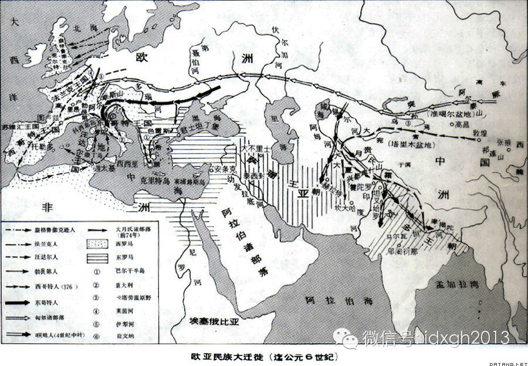
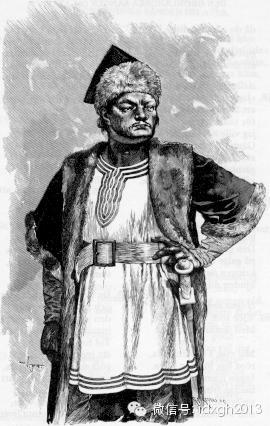
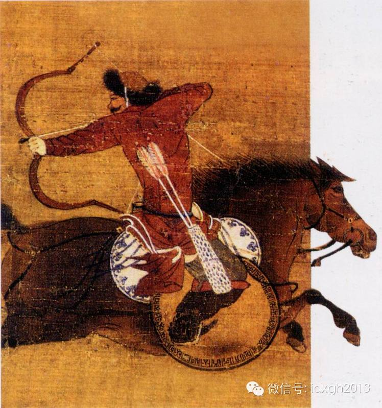
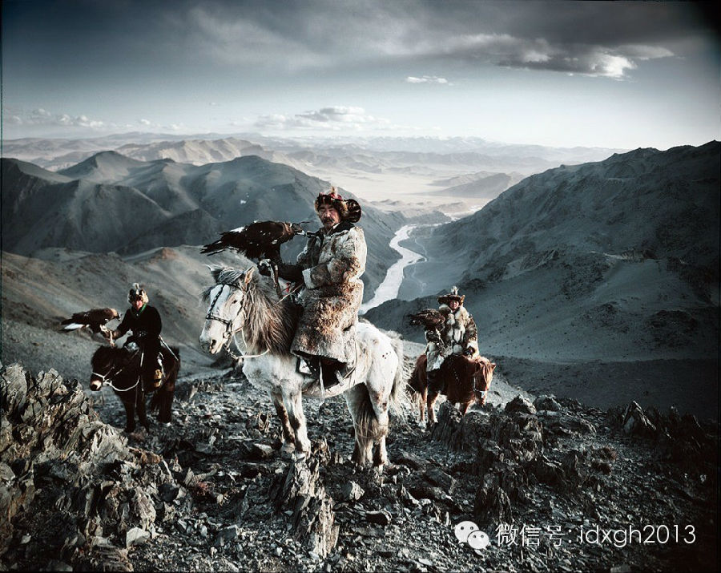
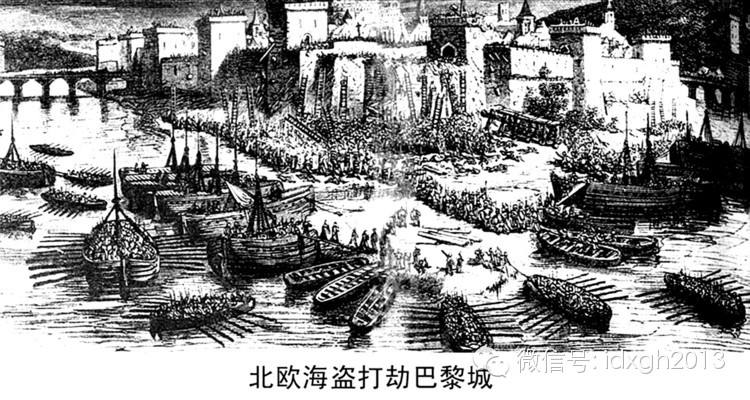
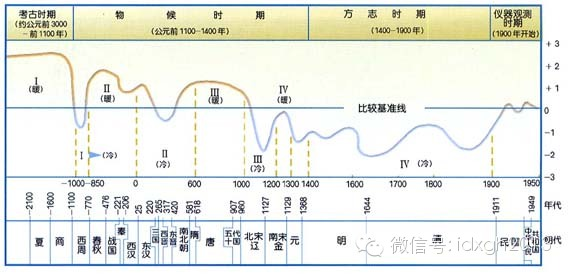

**《长城：恐惧的纪念碑》中提到，“蛮族”通常只满足于劫掠和勒索。那么，又是什么因素促使他们夺取定居人的领土和政权，甚至主导了中原王朝的更迭？**

  

文/黄章晋

  

成吉思汗曾在遗训中告诫子孙，绝不可因为贪恋物质财富，离开草原变成定居人。但他的子孙大部分成为广大定居民族的新主人，并让这些定居民族的基因混进了蒙古人的血液。

  

蒙元入侵，也许是中原历史上最黑暗的时刻，但并不是第一次。

  

**【第一次神州陆沉】**

  

四世纪的东西方，游牧人大规模入侵定居人的家园。无论是东汉的长城，还是罗马人的长城，都未能阻挡游牧人的入侵浪潮。

  

公元350年前后，一个有着东方长相的游牧民族越过横亘乌克兰和白俄罗斯的普里皮亚季大沼泽，登上欧洲历史舞台。他们迫使原来骚扰罗马帝国的诸日耳曼蛮族，因为恐惧逃
入罗马帝国寻求庇护，最终引发成蛮族入侵罗马帝国的狂潮。

  

_欧亚民族大迁徙（迄公元6世纪）_

  

今天，一般都认为入侵欧洲的“匈人”（hun），就是中国史书上记载的匈奴。他们的入侵在阿提拉（406年—453年）统一匈奴各部时达到顶点：阿提拉的多民族混合大
军曾兵临法国的奥尔良地区、两次入侵巴尔干半岛、包围过君士坦丁堡、攻陷过西罗马帝国首都拉文纳。

  

匈奴人在欧洲的肆虐，不过是几十年前中原浩劫的翻版。游牧人在中原制造的灾难，无论在时间还是强度上，都远超过阿提拉之于欧洲。将中国的这段历史称之为“神州陆沉”，
恰如其分。

  

304年，南匈奴单于於夫罗之孙刘渊，率南迁依附于中原的匈奴人造反，自称汉光文帝，拉开了诸游牧民族在中原轮番称帝的序幕。此时距匈奴人在欧洲登场还有50年。自刘
渊始，一波又一波的游牧民族入侵浪潮将中原变成血海，史称“五胡乱华”。

  

383年，阿提拉出生的20年前，东晋政权在淝水之战击败了氐人苻健率领的多民族混合大军，保存了中原文明的半壁江山。而欧洲版的淝水之战则发生在451年——阿提拉
大军在夏隆（今译作香槟沙隆，位于法国东北部）被罗马帝国击败。

  

_阿提拉肖像——《诗体埃达》插图（来源：维基百科）_

  

453年，阿提拉以游牧君主的经典方式暴毙之后，匈奴人的势力迅速退回东欧草原。草原民族对欧洲的鞭挞和蹂躏，不过20年历史，对中原地区的荼毒，则长达130余年。

  

四世纪，游牧民族对定居民族的入侵浪潮，是所有生活在北方草原地带蛮族的集体行为。当时罗马人感概，各种从来不曾听过名字的野蛮人，潮水一般不断冲出森林或草原。

  

在中国，游牧民族南下始于三世纪的东汉末，原属匈奴的各部落不断南下内附，除匈奴外，羌人、氐人、羯人以及诸杂胡也同样以惊人的速度内迁，改变了部分地区的民族构成。

  

西晋时，北方的秦、雍、并三个州，已成为羌、氐、匈奴聚居地。这种主动内附的情形，在西汉对匈奴军事优势最明显的时候却未出现。

**  **

**【当草原气候变冷】**

  

北方游牧民族大规模主动内附南迁，是不是气候的原因呢。

  

竺可桢在《中国近五千年来气候变迁的初步研究》中曾研究总结：东汉开始，气候趋于变冷，到了曹丕225年军事演习时，出现淮河结冰的记载，“第三世纪后半叶，特别是公
元280—289年这十年间达到顶点。当时每年阴历4月份降霜，估计那时的年平均温度比现在低1-2℃。”

  

游牧民族不断大规模南迁，必然造成与汉人及官方的摩擦冲突。最后，有了官方历史教科书中称少数民族不堪压迫而起义暴动——晋朝司马氏家族自相残杀的“八王之乱”。与其
说这是“五胡乱华”的诱因，不如说正好给了他们一个功成名就的好时机。

  

北方游牧人上一次大规模入侵中原，是西周时代——犬戎联合北方游牧人攻陷周朝首都镐京，周幽王及太子被杀。

  

不过，西周灭亡前后的一个多世纪，正是气候变得寒冷的小冰期，比“五胡乱华”时期的气温更低。也是历史记载中胡人入侵最频繁的时期。

  

但十二世纪的气候比前两次更寒冷，草原地带旱情加剧。宋人不幸连续遇到了几波蛮族兴灭。先是野蛮的契丹人突然被更野蛮的女真人攻灭，接着，更野蛮的蒙古人又在女真背后
崛起。

  

北宋灭亡时，正是这个小冰期最寒冷的时候。稍后气温有所回升，当气候再度转冷时，宋人面对的敌人已经由女真变成了蒙古。

  

自成吉思汗建立“大蒙古国”始，其赫赫武功为后人津津乐道，但少有人留意，当时蒙古高原正持续遭受罕见的自然灾害。

  

——在拔都西征欧洲的1240年，蒙古草原的干旱曾使野草自燃，史称“牛马十死八九，民不聊生”。

  

蒙古人占领华北后，一度有杀尽无用的汉人、将农田全部变成草原的想法。它有落后愚昧的因素，也有北方草原已无法承载游牧人的原因。元史载，自成吉思汗建国至灭宋，北方
草原地区被迫南下的贫民数量高达近九十万户。

  

_蒙古兵_

  

明末女真人再度崛起的十七世纪，又是小冰期——东北亚地区极端气候最严重的时代，比引发游牧人大规模迁移的三、四世纪和十二世纪都要冷。

  

满清起兵犯明的理由之一是：明廷曾要求女真部落退出柴河、三岔、抚安的农耕区。因当时的气候原因，女真社会的经济生活已极度脆弱。

  

史料记载，十七世纪上半叶临近辽东的朝鲜北方几个道，因气候缘故，传统农业区的居民几乎已无法以农事为生，只好越过鸭绿江采集人参。而刚刚统一各女真部落并入侵过朝鲜
半岛的满清政权，严厉禁止朝鲜山民越境采集人参。国境线上处挂着被杀的朝鲜山民的头颅，但越境采参仍屡禁不止。

  

竺可桢曾总结：“任何最冷的时期，似乎都是从东亚太平洋海岸开始，寒冷波动向西传播到欧洲和非洲的大西洋海岸，同时也有从北向南传播的趋势。”

  

这个现象除了能解释“五胡乱华”早于匈奴人入侵欧洲，还与游牧民族大规模迁徙征战规律有很强的对应关系。

  

比如，进入中原建立政权的鲜卑人、契丹人、女真人、蒙古人、满洲人，其兴起之地几乎都源自蒙古高原东端及兴安岭一线，而主体部落起源于蒙古高原西端的匈奴和突厥，虽然
曾有过辽阔的帝国，但都不曾入主中原建立政权。

  

如果用气候因素解释，因为天气变冷，都是自东向西、自北向南传递，它使得游牧民族或渔猎民族的迁徙和征伐，都是自东向西，罕见自西向东扩张的情形。而有些民族在中原建
立政权，是因为中原在他们向西向南的前进路上，但中原并不在突厥和匈奴向西向南前进的路线上。

  

_雪山顶的游牧民族_

**  
**

**【气候变暖同样是灾难】**

  

经常扮演抢劫定居人角色的，并不只是游牧人，蛮族人的入侵，也并非是在寒冷时期。

  

对住在邻近大草原的定居民族来说，八世纪到十一世纪是全球气候温暖的黄金时代，游牧人尽管有强大的帝国，但上帝之鞭却始终没有真正挥下来。长期统治亚欧大草原的突厥人
，对定居民族没有表现出强烈的侵略性和破坏性。

  

但是，住在远离欧亚大草原的西欧，这时却遭遇前所未有的频繁入侵洗劫。这些残暴而亢奋的抢劫者，同样来自北方，只不过不是骑马而是乘船四处劫掠。这就是维京海盗。

  

草原上的入侵者，其识别特征是矮小的蒙古马、强硬的复合弓和神乎其技的射术，而来自北欧斯堪的纳维亚的维京人，其识别特征是龙头船、粗大笨重的矛、剑、战斧以及其战斗
中对痛苦和疲惫的惊人耐受力。

  

维京人最初与外界的交道，只是与俄罗斯人小规模的贸易。八世纪后期开始，这些以放牧、打渔和农耕为生的人，突然变成了残暴贪婪的海盗。

  

西欧各国邻海而河流密布的地形，不利于游牧民族移动，但对维京海盗来说，却是四通八达的坦途。此前一个世纪，维京人学会了在船上装帆，借助风力他们能抵达靠划船无法抵
达的远方。  

  

维京人的龙头船很轻便，没有水道时，他们甚至可以扛着他战船前进。维京人在气候温和适宜的小暖期，不断拓展抢劫范围，最南他们曾抵达红海，向东他们曾抵达巴格达。

  

游牧人一般选在秋高马肥、天气转凉的季节起兵，盛夏天气转暖时，游牧人则撤回凉爽的草原。维京人入侵的时节与游牧人相反，天气暖和时他们扬帆出海，天气转冷时，他们北
返回家过冬。

  

最初，维京人偏好小规模抢劫修道院，因为那里会有各种财宝，随着抢劫经验的丰富，维京人不再每年有规律性地定期往返地小规模抢劫。

  

公元871年，维京人沿塞纳河逆流而上进抵巴黎，将之包围了两年之久，公元907年，8万维京海盗横贯欧洲大陆围攻君士坦丁堡，这两次都获得了令他们满意的赎金。

  

_北欧海盗打劫巴黎城_

  

维京人突然爆发的破坏性，如果气候变迁是重要因素的话，他们不是因气候转冷被迫离开家乡，而是气候转暖，人口大量增长。有历史学家估计，八世纪斯堪的纳维亚地区总人口
近200万人，九世纪始，奉行一夫多妻、生子成群的维京人，因为人口压力不断向外扩张。

  

维京人填补了游牧民族打劫的空白，他们为祸最严重的地区，是游牧民族的铁蹄无法抵达之处。维京人抢掠的足迹遍及英国、比利时、荷兰、意大利、西班牙、葡萄牙、法国、俄
罗斯乃至伊斯兰世界。不列颠岛由于不幸位于维京人出海打劫的航线上，成为荼毒最甚的地区。

  

维京人的抢劫热情持续了三百年，他们甚至先于哥伦布五百年登陆北美。不过，等到严寒气候来临，蒙古人登上历史舞台时，在远离本土的那些北方和西方孤岛上的定居点，维京
居民都没有生存下来。

  

就像游牧人改变了东亚和中亚地区的民族构成一样，维京人也改变了西欧沿海地区的民族构成。在法国，他们变成了诺曼底人，在俄罗斯，他们变成了罗斯人，在英格兰，维京后
代威廉一世1066年成了新的国王。

  

**【气候与王朝更迭】**

  

赶跑了蒙古人的明王朝，对北方游牧民族的防范异乎往代，它不但修造了中国历史上最长最坚固的长城，在对外用兵上也不惜血本。但在女真人在满洲崛起时，关内又爆发了大规
模的农民起义。

  

_明宫蜡像馆中的土木堡之变_

  

明王朝同时遭遇了中国王朝更迭的两大动力来源：农民起义和北方民族入侵。

  

按教科书的标准说法，农民起义的主要原因，是土地私有制下，土地有被不断兼并的趋势，到了一定阶段，大批失去土地的农民流离失所，最终社会矛盾会激发到爆发起义的地步
。而每个新王朝建立后，又会重新分配土地，然后循环往复。

  

不过，美籍史学家赵冈的《中国土地制度史》通过文献收集整理发现，自宋至民国，小土地私有制下的中国，土地分配的基尼系数长期稳定，并不存在周期性的不断增大然后又重
新开始的循环。因为即便存在土地不断兼并的趋势，由于中国没有家产长子继承制的习惯，一代人辛苦兼并的土地到了下一代又会被分散。

  

历史记载中，与流民大量出现相伴的，是土地抛荒。这些土地并未被邻居乘机兼并，故基尼系数未见变化。农民抛荒的直接原因是无法承受沉重的税赋，种田还不若抛弃田产当流
民。

  

史家习惯将农民不堪税赋沉重的原因归结官府的横征暴敛，但在强调官府不恤民情时，会言及此时自然灾害已导致农民颗粒无收。虽然强调自然灾害有为官方卸责的嫌疑，但历史
上出现大规模抛荒，很多时候却恰与气候史上持续灾荒年岁重合。

  

我们很难想象2008年南方冰灾发生在传统农业社会是怎样的结果。但2008年冰灾波及最南的地方，是粤北山区，但1245年，热带的广州亦曾发生过雪灾，史载“大雪
三日，积盈尺余，炎方所未有也。”那正是被称为全球“小冰期”一个极端天气的例子。

  

今天的气象学家认为，始于中世纪止于19世纪末的“小冰期”，与“正常”气温相比，平均气温只降了1℃，但对农业社会却影响巨大：广州大雪时，福州荔枝全部冻死；此前
，因为气候变冷，江南的双季稻消失；唐朝时，陕西曾大面积培育柑桔。

  

十三世纪，不但陕西柑桔消失，连专供皇室享用柑桔的江西，也已不产柑桔了。同时，中国传统纺织原料桑树的生长北线，向南方退缩了2个纬度，棉花在中国的大面积推广和最
终替代了桑麻。

  

唐朝的灭亡，通常的说法是统治者的腐败造成大饥荒，最后被黄巢起义摧毁。但现代历史研究表明，发生农民大起义的九世纪，近百年的降雨量都低于正常年份，应当说，持续的
干旱直接导致了普遍的大饥荒和空前规模的流民。

  

而推翻元朝的朱元璋更是饥民的典型，虽蒙元统治之残暴与腐朽异乎往代，但元末水旱交替、黄河改道，蒙古人短短的统治期内基本没有友好的天气。从忽必烈登基始，元朝官方
记载的赈灾频率就不断加大。江南鱼米之乡的太湖竟在十四世纪的元代几度冰冻数尺，许多南方的树木被冻死。

  

明末李自成起义，天气的原因来得远比明王朝的腐朽更直接。明末，华北遭遇的旱灾从1627年持续到1652年，即便是再开明的王朝恐怕也架不住如此长期的大饥荒。而此
前在辽东于女真的战事，不但耗空了明廷且几乎征用了全社会的壮丁。

  

十三世纪至二十世纪期间，最冷的是十七世纪。小冰期寒冷的冬季分别出现在如下时段：1470—1520年、1620—1720年和1840—1890年间，而相对温暖
的冬季则分别出现在1550－1600年和1720－1830年。有心的读者自可对照此组数据看看中国历史，是否与治乱循环与气候有某种契合性。

  

_4000年气温变化朝代对应图_

_  
_

如果游牧民族南下是上帝之鞭，而这根鞭子掌握在气候变化的自然之手，我们会发现，这些文明人的征服者，有的人只建立过风一般来去的帝国，譬如阿提拉，有的人则建立了数
百年的稳固江山，譬如成吉思汗黄金家族，譬如爱新觉罗家族。是后者有更优秀指挥能力和他们军队的战斗力更强吗？

  

1619年，一位统四十万蒙古兵的成吉思汗后人遇上了一位统兵三万的敌手，猜猜看他们谁会赢？是成为成吉思汗还是草原上无数被遗忘可汗，关键因素在他们身上体现得最为
明显。请留意后续文章“历史偏爱有制度的莽夫”。

  

[大象公会所有文章均为原创，版权归大象公会所有。如希望转载，请事前联系我们：bd@idaxiang.org ]  

[阅读原文](http://mp.weixin.qq.com/s?__biz=MjM5NzQwNjcyMQ==&mid=200431439&idx=1&sn
=1fac53d1c4cc8e12b0855f695930b7a8&scene=1#rd)

