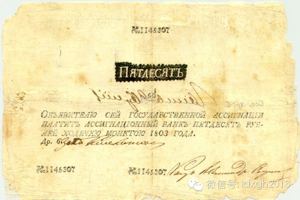
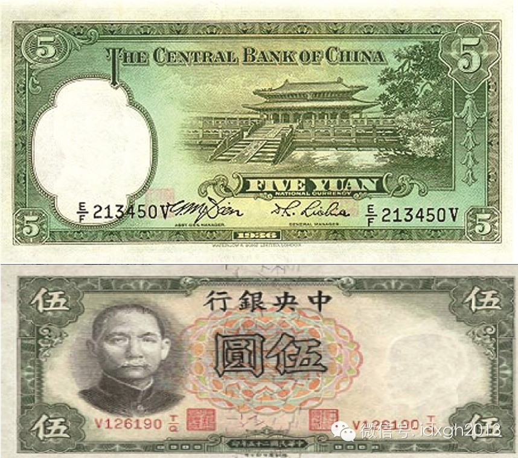
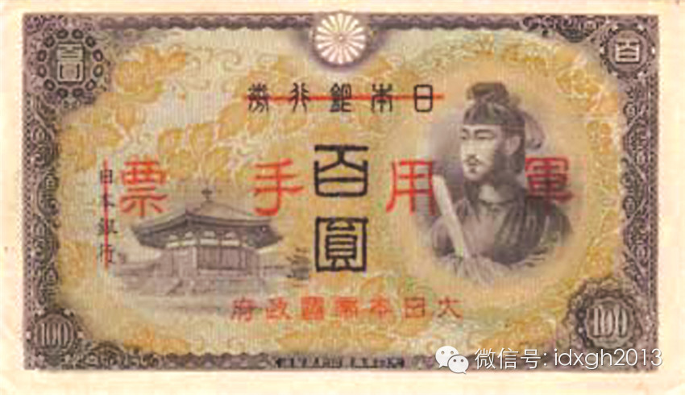
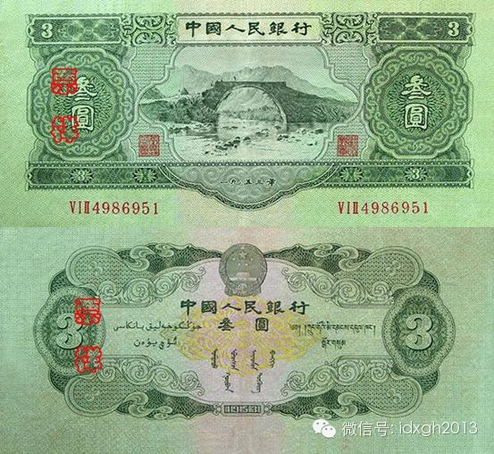
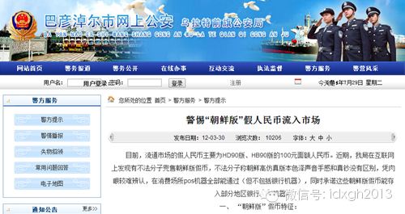
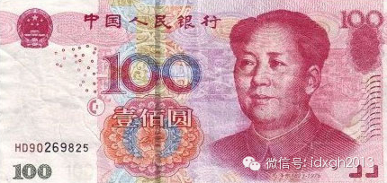

**近世以来，国与国之间的战争早已不限于战场，大量伪造对方货币来搞垮对方经济，曾是列强们经常使用的“黑招”，这对防伪是极大的挑战。当然，有的国家制造假钞，并无搞垮对方的意图，仅仅是为了让自己活下来。**

  

文/阎京生

  

自纸币诞生之日起，伪造钞票就如影随形。钞票技术发展史就是一部防伪史。各国钞票都集中了其最顶尖的人才和技术，虽然伪造者的技术也在不断进步，但个人或地下组织的力
量毕竟无法与国家和正规组织相比，伪钞与真钞通常还是有极大的距离。

  

然而，当国家成为伪钞的制造者时——它通常只是为了打击对方金融，破坏对方财政，一国的货币发行当局才面临着真正的考验和挑战。

  

较早伪造对方货币破坏金融的是英国。美国独立战争期间（1775年—1783年），英王乔治三世曾下令伪造北美殖民地发行的“大陆券”，以破坏北美造反者的经济。法国
大革命期间（1789年—1799年），英国又伪造了大量法国教会地产券（以没收的教会地产作抵押的革命政府纸币），同时规定凡是私人擅自伪造这种货币者均判处死刑。

  

不久拿破仑也如法炮制，1806年法国击败奥匈帝国占领维也纳后，没收了维也纳国家银行的印钞原版，在巴黎和意大利等地印制了一批质量非常好的奥地利钞票。法俄开战后
，拿破仑还下令伪造卢布，除了面值、号码和签名（当时的钞票都是一张张地手工签名）外几乎没有什么图案的卢布非常容易仿造。拿破仑还想伪造英国钞票，但没能实现。

  

1803年俄国的50卢布纸币

  

第一次世界大战时，英国曾伪造过德国、奥匈帝国和土耳其帝国这三个主要敌国的钞票，效果不明。

  

**【德国的“伯恩哈德行动”】**

  

一战期间曾积极伪造对方货币的英国，在二战似乎无所作为，反而成为德国的受害者。不过，战争期间英格兰银行不得不对在流通市场中发现的假英镑数量保持缄默，因为安德鲁
行动的目的之一正是在英国国民中引起恐慌，使英镑贬值。

  

德国伪造英镑的行动因其主管军官的姓氏而被称为“伯恩哈德行动”，但德国档案中该计划真正的名字是“安德鲁行动”。最早提出发行大量假英镑来搞垮英国经济的是狂热的纳
粹分子阿尔弗雷德**瑙约克斯。纳粹党卫军高官海德里希很欣赏这个念头，并将美元也列入伪造目标。由于当时美、德并未国开战，希特勒否决了伪造美元提议。

  

阿尔弗雷德**瑙约克斯

  

海德里希将这项任务交给了帝国中央保安总局第四局。1942年夏，党卫军在萨克森豪森集中营开设了印刷伪钞的工厂，伯恩哈德**克鲁格少校领导伪造工作，这也是“伯恩
哈德行动”一名的由来。纳粹为此集中了德国最优秀的雕刻专家、造纸技术专家和数学专家，后者专门负责推算英镑纸币的编号规则。  

  

由于没有合适的纸张，纳粹早期造出来的印钞纸在紫外线下的颜色与真正的英镑不一样。直到1943年从土耳其买来英格兰银行造钞的专用亚麻后，才生产出合适的纸张。萨克
森豪森生产的假币分为4个等级：完美的、接近完美的、有瑕疵的和不合格的。德国最初计划将不合格品空投到英国，可最终还是将之销毁。完美的假钞储存起来供德国间谍在敌
国和中立国使用。接近完美的和有瑕疵的假币成批运往占领区，还有部分假币分配到中立国的德国大使馆兑换成当地货币。

  

德国特工曾专门携带一批假英镑前往瑞士兑换，并大胆地要求检验这些英镑的真伪（他解释说这些英镑是在黑市买来的）。经提醒，银行从中拣出了约10%的“伪币”，将剩下
的全额收下，并为这名特工的“诚实”感谢不迭。印刷精美、质量高超的假英镑甚至骗过了银行的资深职员。英国人也是通过偶然机会才发现假英镑的存在：一位英格兰银行职员
偶然发现她手中两张钞票的序列号竟然一样。

  

二战结束时，萨克森豪森工厂一共伪造了896万张纸币，面值达1.34亿镑，英格兰银行为此蒙受了巨大损失。当时德国人制造的票面值包括5、10、20、50英镑，其
中5英镑的占了40%。由于流入市场的该面额假钞数量过多，英国被迫在1943年停止流通面值10英镑以上的纸币，并在战后更换了英镑的版式。沿用了两百多年的白色票
面设计被废弃，代之以安全性更高的彩色凸版印刷。

  

**【日本“法币谋略”的失算】**

  

抗战当中，日本曾以“杉作战”的名义大规模伪造中国法币。伪造法币的念头来自日本陆军第九研究所（通称登户研究所）主任、陆军主计少佐（少校）山本宪藏。山本自小就有
伪造钞票的抱负，在“满洲国”期间，他曾花数年时间详细研究了中国内地、关外和朝鲜的货币流通情况。

  

1935年11月3日，国民党政府颁布币制改革公告，宣布除中央、中国、交通三家银行外（1936年又增加农民银行），其他银行一律不得发行货币，同时宣布改银本位为
汇兑本位，禁止银圆和白银流通，法币与英镑挂钩，法币1元等于22.5便士等措施。至此，中国货币混乱状态结束。

1936年中央银行发行的法币

  

法币制度不仅从上海的外国金融机构中回收了大量白银，对于伪蒙疆和华北自治运动，及其背后的日本人来说是一个沉重打击，因为他们手中握有的现银和地方货币无法再在中国
流通，从而防止了战略物资出口资敌的行为。  

  

山本宪藏注意到当时市面上通行的法币大多为中央、交通两家银行所发，印刷厂家为英国德纳罗公司华德路公司和美国钞票公司，这些钞票的防伪措施主要为水印和暗记，部分美
版钞票中头像部位夹有红蓝丝线，伪造应不困难。由于当时中国本土伪造货币手段落后，民众防伪钞意识并不强。

  

山本回到日本后，直接向凸版印刷株式会社经理兼巴川造纸株式会社经理井上源之丞谈他设想，并就能否造出完美的伪钞咨询了井上。井上不仅认为计划能够实现且表示愿意全面
合作。

  

山本宪藏立即将整套想法写成《法币谋略工作计划》， 交给日本陆军参谋本部第八课，报告最终被送到当时陆军大臣东条英机手中，东条亲自下令批准实行。为完成伪造法币任
务，山本从参谋本部被调至陆军第九科学研究所专门负责这一工作。

  

中国当时有4家银行可以发行法币，日本人决定集中伪造中央银行的法币，因为该银行为中国的国家银行，其法币具有国家货币的地位，即使伪造得质量差一些也不大可能被拒收
，而且即使万一泄露也可打击中央银行的信誉。

  

为达到乱真效果，日本人花费大量精力先后攻克了纸张问题和印刷防伪问题，终于在太平洋战争爆发前夕仿制出了合格的法币，在日本本土大量印刷。当时法币印刷成本为每张2
到3美分，而日本仿制的法币印刷成本只有4钱5厘，相当于前者的一半。战争期间，日本印制了面值40多亿元的法币，在中国市场上流通得很顺利。

  

然而，日本伪造的法币完全没有达到扰乱中国经济的目的。因为撤退至西南的国民政府在重庆防空洞内建立印钞厂，大量印钞自行制造了疯狂的通货膨胀，从1937年到194
4年，国统区的货币发行量增加了100多倍，达1890亿元，日本人的伪钞完全被“稀释”掉了。山本宪藏最后哀叹：“中国实在是一个令人望而生畏的国家。”

  

**【朝鲜被抹黑了】**

  

美国在二战期间也试图用伪钞破坏日本经济。当时日元使用的桑皮纸加入了若干日本特有的植物纤维，难以在美国仿造。朝鲜和台湾地区分别流通朝鲜银行券和台湾银行券，纸质
与日元相同。最后美国将目光转到日军在占领区发行的军票上。美国曾伪造过日军在菲律宾的军票，由于美方没有公开资料，伪造行动是否成功不详。  

  

日本发行的军票

  

二战结束后，官方伪造他国货币的行动也时有发生。为破坏逐渐走上亲苏道路的几内亚经济，法国特工部门曾在60年代专门印制了一批该国伪钞，质量比在捷克印制的真钞还好
，后者不适合炎热潮湿的气候，几内亚总统塞古**杜尔的头像不留神会被抹掉。捷克人后来也保留了印版，自己随心所欲地印刷几内亚钞票，在非洲采购物资。

  

类似情况也在中国发生过。1953年版第二套人民币的3元、5元和10元券系委托苏联代印。60年代初中苏关系恶化后，市面上发现了由专业印钞厂生产的伪钞（编号不符
合人民币发行规律），新疆塔城地区出现了成箱的5元和10元伪钞。最后中国人民银行被迫在1964年4月15日发布命令，30天内停止流通并紧急收回3元、5元、10
元三种面额的货币。此后虽及时设计了第三套人民币，但10元券在全中国断档达两年之久。

  

1953年版第二套人民币的3元券

  

然而，并非所有国家制造伪钞都是为了破坏敌国的经济。世界上第一个社会主义国家苏联，就开了这样的先河。1927年到1932年，苏联伪造了一批面值100美元的假钞
，它只是为境外特工提供行动经费。发起者是红军总参谋部情报局（格鲁乌）。驻纽约的格鲁乌负责人阿尔弗雷德•季尔廷主持伪造活动，活动持续了大约5年，共造出约100
0万美元的伪钞。  

  

季尔廷由于伪造美元在1928年得到了红旗勋章，并在1936年获得列宁勋章。但好景不常，季尔廷在1937年的“大清洗”中被逮捕， 1940年被判处15年徒刑，
1942年饿死在劳改营中。他的助手尼古拉斯•多岑贝格相对比较走运，1939年多岑贝格在美国被叛变的格鲁乌特工举报，多岑贝格供认了斯大林下令伪造美元的全盘计划
，以换取轻刑。最后被判刑一年零一天，1941年出狱后化名生活在佛罗里达州，1954年死于帕金森症。

  

苏联之后，不再有以解决经费问题而制造伪钞的国家，直到朝鲜接过接力棒。1990年代初，苏东剧变导致朝鲜丧失了外部输血，1990年代朝核危机爆发，朝鲜武器出口被
封堵，它可供换汇的出口物资只剩下假药、假烟和假酒，而朝鲜传统的假药市场日本到2000年前后，已全部被中国商人挤占，故1994年开始，朝鲜只好大规模出口自己生
产的美元，它和毒品一样是朝鲜今天最重要的出口物资。

  

朝鲜负责制造假钞的部门是直接向最高领导人负责的“39局”。为制造美元假钞，朝鲜人动员了可能调动的一切技术力量，朝鲜版美元的声誉超过了哥伦比亚贩毒集团生产的美
元。据2007年美国财政部统计，市面上大约有面值5000万美元的朝鲜版伪钞流通，但2011年叛逃的一位朝鲜外交官供述，他所在的大使馆仅2010年兑换出去的美
元伪钞就达3000万美元。

  

朝鲜版假美元的流通方式非常有限，往往只能靠外交官携带出境兑换，很多时候他们只能在赌场巧妙地用掉伪钞甚至只能卖给国外的黑社会组织。由于防范甚严，朝鲜无奈之下还
被迫动过外国驻朝外交官的主意——他们在朝鲜的银行提取其存入的美元时，银行给的是朝鲜人自己生产的美元。

  

** **

****

内蒙古自治区乌拉特前旗公安局官方网站的文章——警惕“朝鲜版”假人民币流入市场

****  

朝鲜官方对朝鲜制造美元的说法嗤之以鼻，认为这是公开的抹黑。事实上，朝鲜确实在伪钞问题上曾被抹黑——中国今天广泛流传着朝鲜版人民币的消息，但是，所有关于朝鲜版
人民币的消息，其实都是中国某些为了骗取小骗子的大骗子制作的钓鱼广告，没有任何证据证明朝鲜伪造过人民币，这一点上，朝鲜应该是清白的。  

  

大陆流行较多且水平较高的HD90、CE86打头的假钞，多产自台湾，台湾官方屡次破获伪造人民币的犯罪集团

  

> 版权声明：  
大象公会所有文章均为原创，版权归大象公会所有。如希望转载，请事前联系我们： bd@idaxiang.org

大象公会：知识、见识、见闻

微信：idxgh2013

微博：@大象公会

投稿：letters@idaxiang.org

商务合作：bd@idaxiang.org

[阅读原文](http://mp.weixin.qq.com/s?__biz=MjM5NzQwNjcyMQ==&mid=203705272&idx=1&sn
=b39369eaecb0f4a31111899ce7d1702f&scene=0#rd)

