**英国是纹章之国，不仅在古迹能看到纹章，大街小巷也随处可见。只有贵族，骑士等一定社会等级以上的人才能使用纹章，这是一件很荣耀的事。**

  

文/俞天任

  

下面的这几瓶苏格兰威士忌可能是苏格兰威士忌中最为人所知的品牌了：Johnnie Walker，有人管他直接叫“约翰走路”，但更多的人却是从那独有的修长的方形
瓶身而管他叫“方”，红色的就叫“红方”，黑色的叫“黑方”，绿色的叫绿方，一直到十八年藏的“金方”。

  

_图1：Johnnie Walker_

‍

  

红方是Johnnie Walker销量最大的一个品牌，每周生产300万瓶运往200多个国家销售。据说光各种商标标签纸就多达三千多种，用量的不同，酒精含量的不
同，加上在全世界各地贩卖时根据当地法律所必须加上的不同说明文字和符号，防伪标示和防走私标示，这么多种的标签纸大概确实是必要的。

  

JohnnieWalker的有名可从图1中红圈内的特殊图案得到证明——那是大英帝国女王伊丽莎白二世的标示，叫做“纹章”（  heraldic
emblem）。

  

使用这个纹章就表示这是王室的御用品（Royal  **warrant**），而且已有三年以上历史。王室徽章的证明效力自然打得过吹得天花乱坠的广告言词。如果改
朝换代，而王室还是使用这个品牌的，这个纹章就必须更改，换成新国王或新女王的纹章。请看下面这个例子：

  

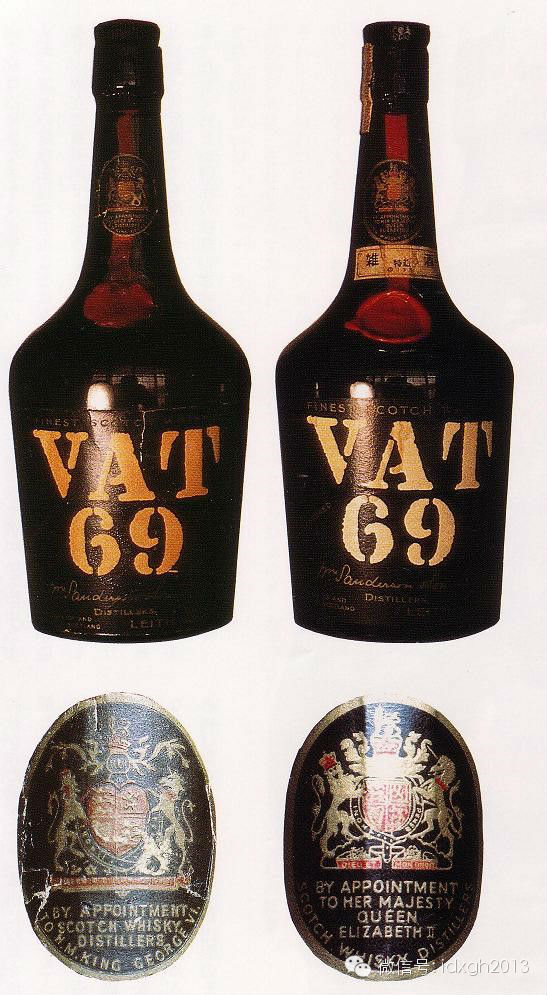

_图2.两瓶同为1952年产，而“RoyalWarrant”不同的Vat 69_  

  

图2是两瓶1952年的“Vat 69”。左边那瓶是年初的，上面的纹章是现女王的老爹乔治六世的纹章。同年2
月份伊丽莎白二世即位以后使用的纹章就改成了女王的了。文字也从“BYAPPOINTMENT TO H.M.KING GEORGE
VI”（被乔治六世国王陛下指定）改成了“BYAPPOINTMENT TO HER MAJESTY QUEEN ELIZABETH
II”（被伊丽莎白二世女王陛下指定）了。

  

欧洲人在注册商标上用纹章的不希罕，但没有像英国人那样热衷的，而英国货又以威士忌为最。看苏格兰威士忌的酒瓶，首先引人注明的就是各种各样的纹章。

  

纹章是从中世纪开始在欧洲发源的一种标示贵族身份的标志。纹章现在除了表示个人的身份之外，公司的标志也经常采用纹章的形式，比如常见的英国“三五牌”香烟上面就有公
司的纹章。

  

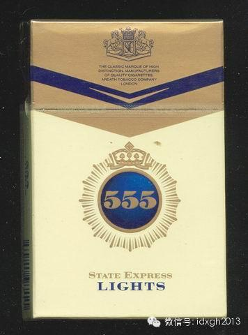

_图3.三五牌香烟上的公司商标_  

  

但是那种纹章并不是“原教旨主义”的纹章。西欧国家中君主制国家多于共和制国家，就是共和制国家在第一次世界大战前基本上也都是君主制国家，所以到现在纹章都还存在。
而且欧洲人都喜欢纹章，但像英国人那样现在还顽固坚持着原教旨主义纹章的国民倒也是绝无仅有。

  

可以回想一下纹章全盛期的盛况。看过塞万提斯的《唐**吉柯德》的人都会记得那个疯狂的唐**吉柯德在和准备和羊群作战时发出的呓语。

  

唐**吉柯德把羊群看成了向他进攻的骑士，并且一一数落着那些骑士的名字和家族和战绩，几乎花了整整四页左右的篇幅。唐**吉柯德就是从那些骑士们的盾牌上的花纹来辨
认骑士的。那些花纹就是所谓纹章。

  

英国是纹章之国，不仅是在古迹能看到纹章，大街小巷什么地方的招牌和幌子上都能找到纹章。苏格兰人直到现在还坚持着从中世纪继承下来的纹章传统，有纹章事务所（Lor
d Lyon Office）专门受理有关纹章的事务。没有纹章院（Collegeof
Arms）的正式认可，不可以乱用纹章。只有贵族，骑士等一定社会等级以上的人才能用，所以能够使用纹章是一件很荣耀的事。

  

欧洲文明以外的国家中，就日本有类似于欧洲纹章的“家纹制度”，一般都是采用植物的几何图形。

  

但和欧洲不同的是，日本是“家纹”，也就是说一个家族共用一个，根据那个图案能够判定的只是这属于哪个家族。而欧洲的纹章则是以个人为单位，父子兄弟的纹章各不相同，
看到纹章立即能判别这属于谁。像图2里面乔治六世和伊丽莎白二世父女的纹章就大不相同。

  

熟悉纹章的人从各种纹章中不仅仅能读出纹章拥有者本身的信息，而且拥有者的家族演变史都可以从纹章中读出来，所以在欧洲特别是英国有一门怪里怪气还挺有人气的学问叫“
纹章学”（ heraldry）。

  

我们就从现在在使用着的正式纹章中分量最重的英国女王伊丽莎白二世的大纹章（Achievement）开始来看这纹章到底是个什么东西。

  

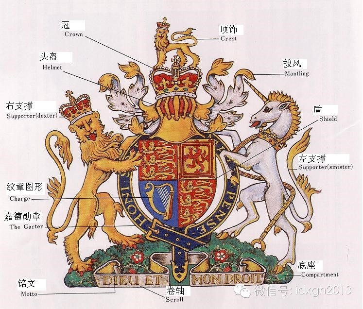

_图4.伊丽莎白女王的大纹章_  

  

大纹章最中心的部分是描着花纹盾（Shield）。那面盾本身就可以作为纹章使用，经常被称为小纹章，也是纹章的由来。在战场上只要看见了敌手的盾，就知道你面对的是
谁了，这就是西洋纹章因人而异的根本原因：在战场上你在和谁家的人相杀不重要，重要的是对手的名字，是谁和你在相杀。

  

先放下纹章的花纹来看看从小纹章构成大纹章的那些装饰品。

  

所谓大纹章就是小纹章加上装饰品以后的东西。但那些装饰品决不是可有可无或完全是出于美学考虑。那些装饰品的使用是和纹章差不多的，表示了纹章使用者的阶级层次，不能
出错，如有疏忽，“后果很严重”。

  

首先是顶饰（Crest）和冠（Crown）和头盔（Helmet）。这是从小纹章进化到大纹章时最早出来的东西。盾可以让作战的对手看清楚，但还有要其他人也能看清
楚的场合。从十三四世纪开始在骑士中流行一种游戏叫做Joust，就是骑马用长枪比武，看客不少，估计和现在的甲级足球联赛差不多。

  

这就给远处的看客带来了一个问题：因为骑士全身被胄甲包裹，看过去根本不知道是谁和谁在比赛？于是就在盾之外再加上顶饰，冠和头盔。和个人单位的盾不同的是，顶饰，冠
和头盔是家族共通。大老远一看就知道这是谁家在谁家在比武了，但是上场的是老几，还得往前再挤挤看盾牌。

  

因为顶饰是全家族通用，所以在家族背景的公司商标图案上经常用到。特别是苏格兰威士忌这种靠家族之血凝聚起来的商品就更多了。请看“WHYTE &
MACKEYS”的双狮商标：

  

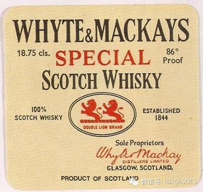

_图5. WHYTE & MACKEYS的双狮商标_  

  

这个双狮牌的由来是WHYTE家和MACKEYS家的顶饰都是狮子，于是两家的合资公司就以两头狮子作为商品标志了。

  

那两头狮子脚下的东西在纹章里叫做花边（Lace）,是从将顶饰固定在头盔上的轮子变形而来。而女王的纹章因为在顶饰和头盔之间还有冠，因此就没有了花边。

  

头盔则是在大约十六世纪开始规定在使用上的不同：国王和皇太子为金色，面向正面；各种爵士为银色，面向右面；骑士为铁色面向正面，其余人等则为铁色，面向右面。国王和
贵族再加上各种冠。这样一眼看过去就知道纹章持有人的社会等级了。

  

从头盔后面伸出来的像叶子样的东西叫做披风（Mantling）植物叶子形状的多，也有使用海藻叶子的。因为盔胄是金属做的，阳光下面晒着，里面就像个烘箱，实在太热
，所以要在外面披一层布以防太阳辐射热。这就是披风的来历。

  

拥有子爵以上爵位贵族的大纹章中盾的左右各有一个支撑，一般各家都是特定的动物或人物，偶尔也有用建筑物的。注意在纹章学里的左右是永远是从纹章持有人的方位来说的，
所以在观众看来是反的。在女王的纹章中右边是象征英格兰王家的狮子，左边是象征苏格兰王家的独角兽。

  

盾的底下有个底座（Compartment），底座上有卷轴（Scroll），卷轴上有铭文（Motto）。卷轴和铭文没有阶级限制，所有纹章均可使用。女王的铭文是
_Dieu et mon droit_ (God andmy right，上帝和正义)。

  

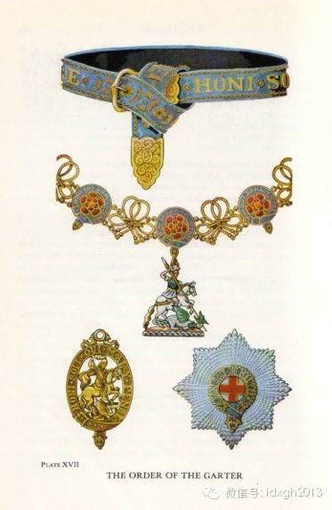

_图6. 嘉德勋章_  

  

女王的大纹章上环绕着盾牌的是一个很罕见的东西，那就是嘉德勋章。这是嘉德骑士团成员才可佩戴的勋章。嘉德勋章最主要的标志是一根印有Honisoit qui
mal y pense（Shame on him who thinks evil
ofit.心怀邪念者蒙羞）的金字的吊袜带。在正式场合下勋章佩戴者要佩戴这个吊袜带。

  

勋章怎么和吊袜带扯上了边？这不是在开玩笑，确实是吊袜带。传说1348年秋有一次爱德华三世在埃尔特姆宫殿与一位“索尔兹伯里女伯爵”跳舞时女伯爵的吊袜带突然落下
来了。许多宫廷贵人笑，而爱德华三世则将这根吊袜带拾起系在自己的腿上，并当众宣布“Honisoit qui mal y
pense”。由此这句话就成了这枚勋章的铭文。

  

嘉德骑士团是英国的最高荣誉，只有26名成员，团长为英国君主。所以这条吊袜带全世界在用着的就只有26条。

  

那么最重要的纹章图形（Charge）呢？

  

纹章最重要的部分是盾牌上面的图案（Charge）。把图四放大一下，我们来看看伊丽莎白二世女王陛下的盾牌纹章图案是怎样构成的：

  

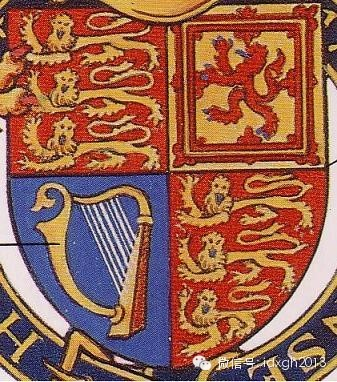

_图7.女王的纹章图案_  

  

有单一图案的纹章，但很稀少，一般在长长的年月中由于联姻，过继的原因图案变得相当复杂。以至于要把盾牌分成几个部分才能说明问题。

  

像女王的盾牌就分成了四个象限，和三角学的象限不同，纹章的象限是从观众的角度看过去以左上，右上，左下，右下的次序为第一到第四象限，和书写格式相同。女王纹章的第
一和第四象限是“红底三头金色的狮子”，这是英格兰的象征；而第二象限是“双重红框里的红狮”，这是苏格兰的象征；第三象限则是“金色的竖琴”，这是爱尔兰的象征。

  

这面大纹章是伊丽莎白女王作为“大不列颠及北爱尔兰联合王国”和“英格兰王国”的君主时使用的正式纹章。女王所拥有的纹章不止这一面，除此之外还有作为“苏格兰王国”
的君主时使用的纹章。苏格兰女王的纹章是这样的：

  

  

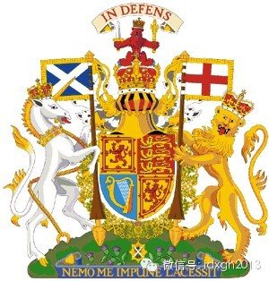

_图8. 苏格兰女王纹章_

  

看过对英格兰女王纹章的解释以后，就会知道这个纹章和英格兰女王纹章大同小异，只不过将苏格兰和英格兰对换了位置。第一和第四象限现在是苏格兰的双重方框红狮，三头红
底金狮被移到了第二象限。英格兰女王纹章中在左边次要地位的独角兽现在被移到了右边主要地位。一切在都说明：现在是苏格兰。

  

纹章还少了嘉德勋章。因为嘉德勋章是英格兰王国的勋章，使用范围严格限制在英格兰内，到了苏格兰就不能用了，所以围绕盾牌的勋章使用了苏格兰的金蓟勋章。

  

英格兰女王的纹章的顶饰是头戴王冠的金狮。金狮是英格兰，到了苏格兰也要换掉。现在作为顶饰的是头戴着王冠的苏格兰红狮。苏格兰红狮还举着剑和笏挑起一条横幅标语“I
n Defens”，那是“In My Defens God Me Defend”（守护上帝之守护）的简略。

  

这个铭文有点怪怪的，总觉得放错了地方。本应该放在英格兰女王的纹章上，因为从宗教改革以后历代英国君主都有个叫做“信仰守护者”的称号，这个称号的由来也充满着英国
式的幽默，以后再谈。不知怎么回事英格兰女王的纹章上没有这句话，反而让苏格兰的大红狮子来打着这条标语。

  

底座卷轴上的铭文是_Nemo meimpune lacessit_ (No-one wounds me with impunity，凡伤吾者必受惩罚)。

  

英格兰在历史上是极富进攻性的国家，而苏格兰则比较和平善良，不太给其他国家带来麻烦，但纹章上正好相反，苏格兰纹章极富进攻性，温良恭俭让的倒是英格兰纹章，也算“
表面纹章”吧。

  

大家可能会有疑问，这两个纹章好像都缺了样东西。对，是缺了一样东西：缺了威尔士。纹章上英格兰，苏格兰，爱尔兰都有了，唯独没有威尔士。

  

这个原因是威尔士的级别不够上纹章。大家说起英伦三岛都是英格兰，苏格兰，威尔士一起说，但其实有点不一样。现在的伊丽莎白女王是英联邦首脑，联合王国女王，英格兰女
王，苏格兰女王等数不清的称号，就没有威尔士的。因为英格兰和苏格兰是王国，而威尔士只是公国。

  

问题还不仅只因为威尔士是公国，伊丽莎白二世的称号中也不光是“女王”，她同时也是兰开斯特公爵和诺曼底公爵。但是女王不是威尔士大公。从1301年开始英国就有了一
个传统，英国君主的长子为威尔士大公 (Duck ofWales)。

  

关于这个传统有个传说，英格兰国王爱德华一世为安抚反叛的威尔士人，答应给他们一个“出生在威尔士，肯定不会说英语”的大公，当威尔士人接受这个条件后，爱德华一世抱
出了刚刚出生的王子，把威尔士人给弄了个目瞪口呆。这个婴儿就是后来的爱德华二世。

  

传说的真伪已经不可考证，但是爱德华二世倒确实是出生在威尔士的Caernarfon。现在的威尔士大公是皇太子查尔斯亲王。这就是历代英国君主的纹章上都没有威尔士
的原因。

  

英国君主的长子为威尔士大公，但也例外的。亨利八世的长子爱德华六世就没有得到过这个头衔。他即位时只有十岁，没来的及去当。

  

纹章就是一部历史。个人的纹章能够述说他的家史，当然英国君主的纹章就能够叙述英国的历史，英国君主的纹章基本图案有过很多次变化，我们选几个重要的片断来看一看英国
历史上的那一瞬间。

  

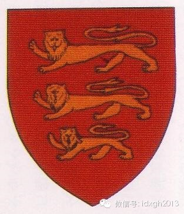

_图9.1340年前的英国国王纹章_

  

在1340年以前，英格兰国王的纹章很简单，仅仅为“红底三头金色的狮子”，这个图案到现在还代表着英格兰。但是到了1340年事情起了变化，当时的英格兰国王爱德华
三世的母亲伊莎贝尔是法国国王菲利普四世的女儿，因此爱德华三世主张：“我有法兰西王位的继承权和法兰西领土的统治权”，后来和法国打起了“百年战争”。

  

爱德华三世同时也是苏格兰人的噩梦，苏格兰有一个现在还被认为是耻辱的“不名誉的42年”的说法，就在爱德华三世的统治期间。

  

爱德华三世当然没有能够继承法国王权和领土。当时的法国比英国要发达强大得多。但作为一种精神安慰，爱德华三世在自己的纹章上加上了法国王室的象征“百合花”，来宣示
自己的权利。

  

如果注意看爱德华三世的纹章还有个让人啼笑皆非的地方：法兰西的百合花居然在纹章的第一和第四象限！也就是爱德华三世想说的是：“本王首先是法兰西国王”。

  

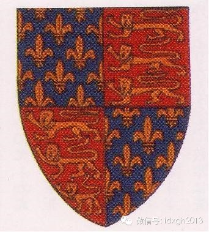

_图10. 爱德华三世的纹章_

  

这个古怪的纹章在以后的250年一直被用着，到了1603年处女王伊丽莎白一世撒手而去，英国没了国王。这时英国人把有英格兰王家血统的苏格兰国王詹姆斯六世请来同时
做英格兰国王。但英格兰历史上没有叫詹姆斯的，所以苏格兰的詹姆斯六世国王到了英格兰就被叫做詹姆斯一世国王，其实就是一个人，这叫“同君联合”（Personal 
Union）,不同的政治实体，但领袖是同一人物。这种同君联合在欧洲历史上并不稀奇，希奇的是这位詹姆斯六世居然还同时继承了爱尔兰王位，在历史上这叫做王冠联合(
Union of the Crowns)。

  

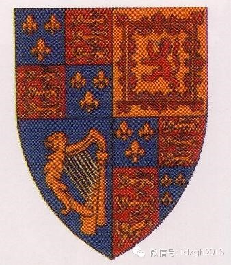

_图11. 詹姆斯一世的纹章_  

  

国王变了，当然纹章也要变。作为英格兰国王的詹姆斯一世就在自己的纹章加上了苏格兰和爱尔兰，这就形成了现在女王纹章的雏形。

  

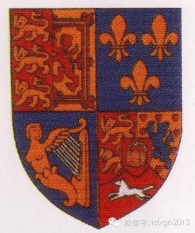

_图12. 乔治一世的纹章_

  

到了安娜女王过世之后，1714年英格兰又闹“国王荒”。这次英格兰人到汉诺威公国把他们的大公踅摸回来当了英格兰国王，叫做乔治一世。一个德国人怎么就当上英格兰国
王呢？乔治一世和英格兰有血缘关系，他的祖母是英王查理一世的妹妹，也就是那位同君联合的詹姆斯一世的女儿。

  

难道英格兰王国就找不出比这个都出了五服的外国人血缘更近的王位继承人了？倒也不是这样，巧就巧在所有比乔治一世更近的人都是天主教徒，而英国人最不感冒的就是天主教
徒。这不为了这件事到了最后爱尔兰不是还要独立吗？

  

为了说明他的由来，乔治一世把纹章改成了像图12那样。说句实在话，那位乔治一世对到这个小岛国来做国王与其说是没多大兴趣，不如说是有点恼怒。

  

为了出口恶气，乔治一世把英格兰和苏格兰放到了同一个象限，（“哼哼，挤死你们”）。然后在已经拥挤不堪的第四象限又加上一匹汉诺威王国的白马和一顶皇冠。那是一顶什
么皇冠？那是神圣罗马帝国的皇冠，为了表明自己高贵的血统，和自己治下的那些土头土脑的化外之民彻底划清界限。

  

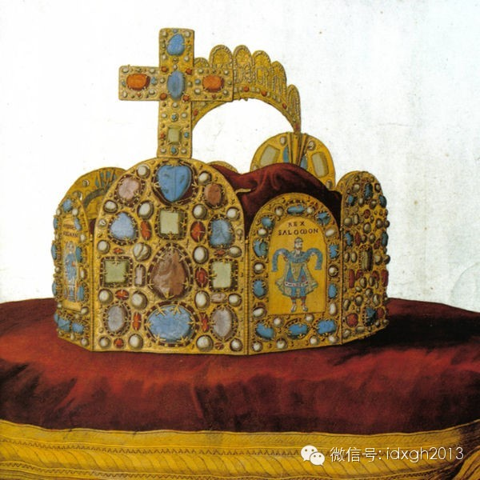

_图13. 神圣罗马帝国的皇冠_

  

乔治一世是英格兰国王，但他不少时间还是回他那汉诺威老家。英国人叫做“国王不在”，其实乔治一世就是在英国和不在也差不多。乔治一世会说家乡话德语，也会法语，就不
会他的“国语”——英语。好在那些英国乡下人好脾气，有什么事贵族们商量着就那么办了，据说这就是英国内阁制(Cabinet)的由来所在。

  

后来又出了个乔治，这次是乔治三世。乔治三世是个明白人，知道宣称对法兰西王冠拥有权利其实是在瞎胡闹，这样就在1801年正式放弃了对法兰西王冠和领土的追求，于是
从自己的纹章上去掉了百合花，爱尔兰也正式和大不列颠合并了起来。于是乔治三世的纹章上除了汉诺威的关系之外，其他部分和现在都一样了。

  

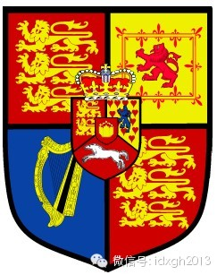

_图14. 乔治三世的纹章_

  

1837年即位的维多利亚女王标志着联合王国和汉诺威王国“同君联合”的结束，因为汉诺威没有女王。所以汉诺威不得不从英国君主的纹章上去掉了。成了下面这副样子：

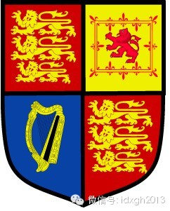

_图15. 维多利亚女王的纹章_

  

从此之后，英国君主的基本纹章就再也没有变化过。最主要的原因是时代变了，维多利亚女王时代之后其实英国君主的称号也还是有不少变化的，例如“印度皇帝”（
Emperor of
India）什么的，“英联邦”（Commonwealth）成立之后，英国君主的称号更是变幻莫测，但是在纹章上一概看不出来。不是殖民主义的年代了。

  

说句题外话，1801年乔治三世在他的纹章上抹去了百合花，但是现在的英联邦国家还有用百合花的，那就是加拿大。

  

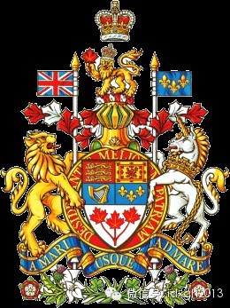

_图16. 加拿大政府的正式纹章_

  

如果有一天魁北克终于从加拿大独立出去了，估计加拿大政府首先要干的事就是把纹章改了它。

  

大家都知道王室御用的威士忌酒瓶上面有女王伊丽莎白二世的纹章，但那位女王的纹章也不止一个，用哪个也颇有点春秋笔法。一般是用女王的大纹章。但也有弄古作怪的生产厂
家用其他的女王纹章。来看下面两张照片：

  

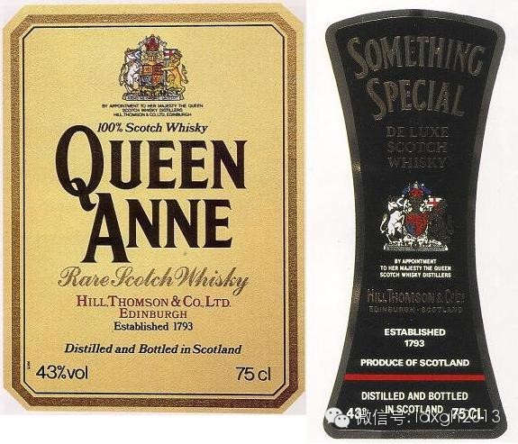

_图17.“Queen Anne”和“SomethingSpecial”的标签_  

  

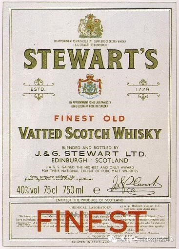

_图18. “Stewart’s”的标签_

  

这几种威士忌全是王室御用的，因此全有“BY APPOINTMENT TO HER MAJESTY
QUEEN”的字样，表示被女王陛下指定了的，同时就有了使用女王纹章的资格。但是仔细看看标签上的女王纹章，却不是像“Johnnie
Walker”那样的女王大纹章，而是图8所示的女王作为苏格兰女王是使用的纹章。这又是怎么回事？

  

这得从苏格兰人对英格兰人的感情方面来说。从好的方面说，是这几家厂家老板的苏格兰民族自豪感特别强，在他们眼里女王伊丽莎白二世仅仅是“苏格兰女王”，可如果就这样
再推定下去，这几家厂家的老板可能是“苏独分子”也不一定。

  

苏格兰从詹姆斯一世开始被英格兰同君联合统治，一直到1707年在安娜女王的治下正式和英格兰联合成立了“大不列颠”，苏格兰议会也就寿终正寝，独立的苏格兰王国从名
义上都不存在了，但是不认帐的“原教旨苏格兰人”并不在少数。

  

名义是没有了，但在意识上还是抱有强烈的独立意识。有个挺有名的口号叫做“这是苏格兰的石油（It's Scotland's oil）”，这是苏格兰国家党（SNP
）在上世纪70年代对英格兰“掠取”了北海油田的收入而喊出的“苏独”口号。恢复苏格兰议会的运动一直就没有停止过，直到布莱尔掌权以后终于苏格兰人才又有了议会。

  

这几张苏格兰威士忌的标签就充分反映了苏格兰人对“苏格兰女王”这一值得骄傲的称号的感情。

  

虽然这些年英国王室声望不如以往，但英国人对王室的感情还是比较坚定的，所以除了表示王室御用的女王纹章之外，王室其他成员的纹章也被苏格兰威士忌使用。但既然是“苏
格兰威士忌”，在使用时就会让旁观者会心地一笑。下面就是个例子：

  

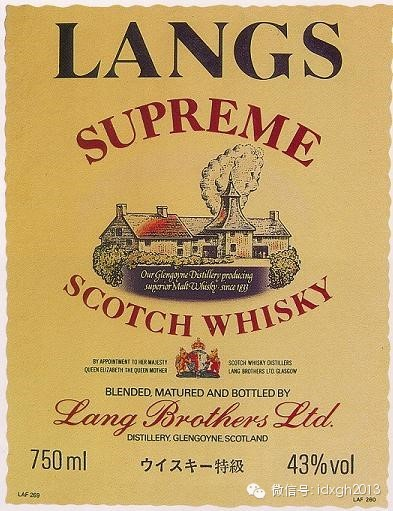

_图19. Lang兄弟公司的“LONGS”高级品上的英国王太后纹章___  

  

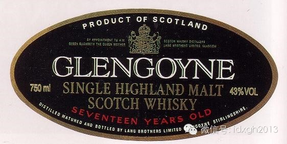

_图20. Lang兄弟公司的“GLENGOYNE”Single Malt上的英国王太后纹章_

  

说起这个Lang兄弟公司的另外一个品牌大家都应该知道，那就是“CHIVAS REGAL”，中国人叫“芝华士”。前述这两款都用了已于2002年3月以102岁高
龄去世的现女王的母后的纹章，她的名字和女王一样都叫伊丽莎白王。酒瓶上的图案太小，我们看一张放大的：

  

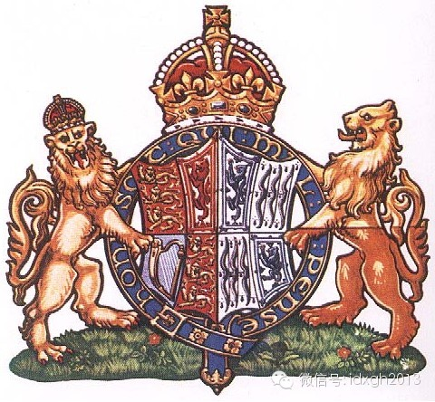

_图21. 英国伊丽莎白王太后的纹章_

  

这位英国的老王太后，她的称号本身就是一部大英帝国的衰落史：她是最后一任爱尔兰王后，也是最后一任印度皇后。她虽然生在伦敦，但却是苏格兰的豪族Bowes-Lyo
n出身，所以在苏格兰人眼里她是苏格兰的偶像。虽然皇太后因为她那生来的大小姐脾气在不少问题上受到过外界批判，但在苏格兰却是人气绝顶。据说王太后本人不喝威士忌，
只喝“Jin and Tonic”，但是威士忌厂家照用其纹章不误。

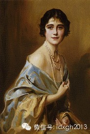

_图22. 25岁时的英国伊丽莎白王太后_

  

伊丽莎白王太后的纹章是把两块纹章合成了一块纹章。纹章的右边（从盾牌的持有人方向）是英格兰王室的纹章，而左边则是她家的纹章。王太后家的纹章很有意思，简单明了
：不是姓Bowes-Lyon吗？Bowes的意思是“弓”，而Lyon的意思是“狮”，所以纹章的设计也就特别简单，就是“弓”和“狮”。

  

但是为了强调这个家族在苏格兰的地位，把狮和弓换了换位置：在纹章最重要的第一和第四象限是象征苏格兰的“双重方框红狮”，而不是在姓氏上排在前面的“弓”。这种图解
姓氏的纹章叫做“canting　arms”，据说纹章中有大约五分之一是采用这种方法的图案设计。

  

这种有意无意暗示英格兰是“外来户”的做法并不限于苏格兰威士忌酒瓶的标签。威尔士人也一样。

  

这是Burn StewartDistillers PLC的“黑王子”品牌的威士忌。

  

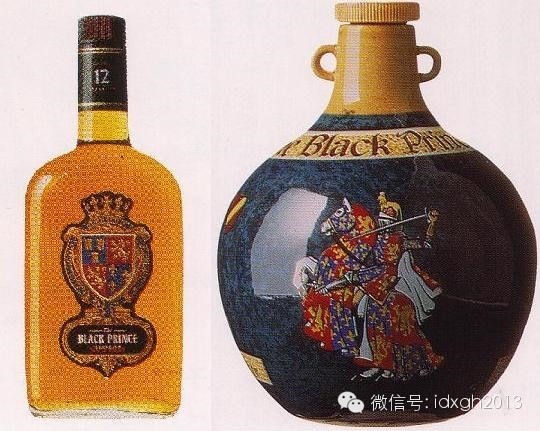

_图23.苏格兰威士忌“黑王子”_  

  

“黑王子”（The Black Prince, 1330 /06/15– 1376/06/08）是对英王爱德华三世的王子，理查二世的父亲Edward of
Woodstock的称呼。黑王子本人倒没有当过国王，因为他比他父亲还早死一年，所以王位就直接从他父亲那儿传给了他儿子。

  

这个“黑王子”这个称呼，当他在世时没人这么叫，在黑王子死了两百年以后才流传开来的。一种说法是因为黑王子身着黑色的胸甲，第一次在战场上露面时就威震四方。还有一
种说这是法国人叫出来的，因为黑王子的作战能力和他指挥的英格兰军的残暴，所到之处给法国带来的只是黑色的死亡，和那时流行欧洲各地的黑死病也没什么两样。

  

黑王子在英格兰当然有极高的人气。可是在苏格兰呢？如果留意图23.里的黑王子爱德华的纹章，很容易发现那个英格兰部分的“红底三头金狮”居然被苏格兰人偷偷地贪污掉
了两头。你真的相信这只是不当心的“Mistake”？

  

黑王子爱德华的纹章在英国不知道的人可能不多吧：

  

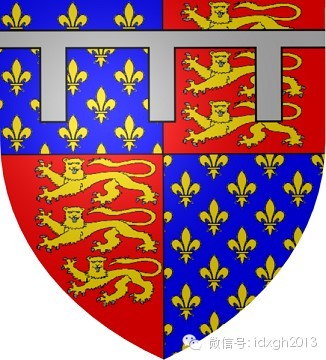

_图24. 黑王子爱德华的纹章“战斗的盾牌”_

  

这个纹章和他的父王爱德华三世的（图10.）是一样的。但是在西洋父子不能用同样的纹章，所以黑王子就在纹章上加了一个城墙的图案（three-point
label）。黑王子的这个纹章是很有名的，叫做“战斗的盾牌”（Fighting
Shield），曾让法国人闻风丧胆。但是黑王子除了赌博和杀人之外也有另外一张面孔，这可以以他另外一张同样有名的盾牌来说明：

  

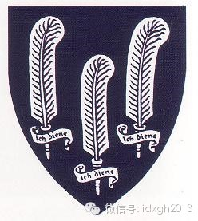

_图25. 黑王子爱德华的另一面纹章“鸵鸟盾牌”_

  

这面纹章的传说就和前面的黑王子形象完全不一样。传说在克雷西战役(Battle of
Creecy)后，黑王子打扫战场时，走到双目失明还坚持上阵抗击英军的波西米亚国王约翰的尸体前，赞扬了约翰国王的勇敢以后，取下国王头盔上的三根鸵鸟毛。

  

后来加上波西米亚国王纹章上的铭文“_Ich dien_ ( I serve，服务)”，形成了自己的另一面纹章。这面和平的纹章，黑王子自己倒不太使用，但以后的
所有威尔士大公全部在纹章上用上了这个鸵鸟标记。请看现任威尔士亲王查尔斯王太子的正式纹章。

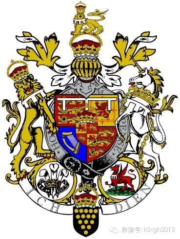

_图26. 威尔士大公查尔斯王太子的正式纹章_  

  

这个纹章的其他部分大家都很熟悉了，有几个新东西。首先是支撑物的狮子和独角兽脚下踩的两个徽章（Emblem），右边的狮子脚下踩的就是从黑王子开始的“鸵鸟徽章”
，而左边独角兽脚下踩的徽章是威尔士的象征“火龙”。

  

然后是盾牌正中间的那张小盾牌“四头狮子”，那是威尔士大公家的盾牌。然后就是为了和他母后伊丽莎白二世陛下的纹章相区别，在主盾牌和支撑物的颈上都有城墙图案。

  

但是说得这么热闹，全是英格兰人的说法。威尔士人也这么认为吗？不，威尔士人可不这么认为。

  

在威尔士人那儿，所谓“威尔士亲王”有两种：一种是现在的所谓“威尔士亲王”，另一种则是“土生土长的威尔士亲王”（the Native Prince of
Wales）,指的是爱德华二世以前的“TywysogCymru”（威尔士语，“威尔士头人”的意思）。而当威尔士人说“the Prince of
Wales”的时候，那意思就费解了。请看下面这瓶威尔士威士忌的标签：

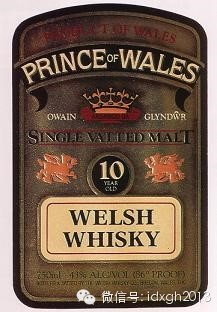

_图27. 威尔士威士忌“威尔士亲王”的标签_

  

发现了什么？号称是“威尔士亲王”的品牌，居然没有引用威尔士亲王纹章的任何元素，连人所周知的代表威尔士亲王的“鸵鸟徽章”都没有。这能算是“威尔士亲王”码？

  

但仔细看过去，在标签上部的王冠两边有“Owain Glyndŵr”的字样。Owain
Glyndŵr（1359–c.1416）是被威尔士人认可的最后一任“the Prince of
Wales”，也就是说威尔士人心目中的“威尔士亲王”，其实还是“土生土长的威尔士亲王”。外来户，不算。

  

这里举了几块与威士忌有关的英国王室的纹章。但还有一块与威士忌到没有关系但还是挺有意思的纹章没有介绍，就是伊丽莎白二世陛下的夫君，爱丁堡公爵的纹章。

  

欧洲现在还有10个君主国，过去更多。国王女王王子公主们当然也得结婚，但过去不能和老百姓结婚，于是只好到外国去找门当户对的，长而久之，这些国家的王室之间就全成
了亲戚，这个爱丁堡公爵就是一个例子。

  

他生来就是是希腊和丹麦王子（Prince ofGreece and Denmark），因为他父亲安德鲁王子也是“希腊和丹麦王子”。
希腊王子好理解，可是这个“丹麦王子”是怎么回事？原来他爷爷希腊国王乔治一世在参加工作当国王以前是丹麦王家的老二，威廉王子。

  

后来到希腊去参加工作以后也没有忘记为子孙后代留一条后路，这个“丹麦王子”的称号一直没有放弃，所以子孙后代也就一直可以用下去，什么时候也许还能用回老家去补缺当
国王。

  

应该说爱丁堡公爵的血统还不算是特别复杂的。但是要算清楚他身上流动着几个国家的王家血液也不容易。他的祖母是沙皇尼古拉一世的孙女奥尔加**康斯坦丁诺娃，他母亲阿
丽丝公主是英国女王维多利亚的曾孙女，姨妈路易**蒙巴顿又是瑞典国王古斯塔夫六世的王后。随便算了算，从爱丁堡公爵似乎还能扯出汉诺威王国，普鲁士王国，西班牙王国
等等等等。

  

这么多的血缘关系也没有给爱丁堡公爵带来什么，所以当年轻的爱丁堡公爵参加英国王家海军时就放弃了诸如“希腊王子”，“丹麦王子”之类能看不能吃的一切虚衔。老老实实
从海军士官干起。

  

据说1939年12岁的英国王位继承人伊丽莎白公主去达特茅茨的王家海军学院视察时一眼就看上了那天担任护旗手的这位18岁的英俊希腊王子。1947年时下嫁菲利普*
*蒙巴顿海军中尉。

  

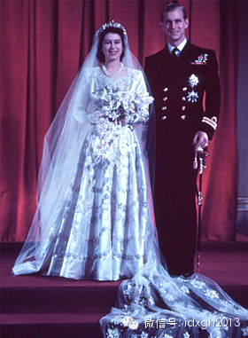

_图28. 伊丽莎白公主和菲利普中尉_

  

爱丁堡公爵也有自己的纹章：

  

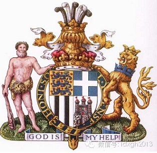

_图29. 爱丁堡公爵的纹章_

  

爱丁堡公爵的纹章和英国王室其他人的大不相同，这是因为欧洲的纹章制度男性不能继承女家的纹章，爱丁堡公爵是招女婿，所以他不能用英格兰王家的纹章。

  

爱丁堡公爵盾牌纹章的第一象限是“三头蓝狮和九颗红心”，这是从丹麦王家纹章里拿来的；第二象限是“蓝底白十字”，那是从现在已不存在的希腊王家纹章里拿来的；第三象
限的“五条黑白相间的垂直条纹”是从蒙巴顿家族的纹章里拿来的；就最后第四象限是爱丁堡公爵自己的东西：爱丁堡宫殿。

  

右支撑的野人（SAVAGE）是丹麦王室和普鲁士王室的共同支撑，左支撑的狮子则表示爱丁堡公爵也是英格兰王室的一员。环绕着盾牌的则是那条有名的嘉德勋章吊袜带。

  

下面这张照片和威士忌没什么直接关系，但能看出英国人对纹章的热爱：

  

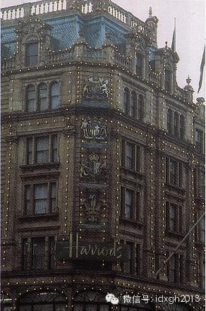

_图30. 过去的哈罗斯百货店_

  

这是原来有名的伦敦哈罗斯（HARRODS）百货店的正面照片，从上到下是女王伊丽莎白二世、爱丁堡公爵、王太后伊丽莎白的纹章和查尔斯王太子的徽章，展示着这家创立
于维多利亚女王时代的哈罗斯百货店的荣光。当年的哈罗斯向女王提供采购生活品和食品，向爱丁堡公爵提供休闲用品，向王太后提供玻璃器皿和陶瓷，向王太子提供马具。

  

但2001年后，哈罗斯就不是这种御用商了。倒不是因为1985年埃及富商莫罕默德**阿尔法德花了六亿多英镑把它买了下来，而是哈罗斯的公子托蒂是原威尔士王妃戴安
娜公主的情人。

  

老阿尔法德绝不相信戴安娜和托蒂只是死于偶然事故，他坚决认为是英国王室谋杀了他的儿子、未来的儿媳和未来的孙子或孙女。既然如此，怎么还能向杀子仇人提供东西呢？于
是买卖就不做了，现在的哈罗斯的正面也就成了这副样子：

  

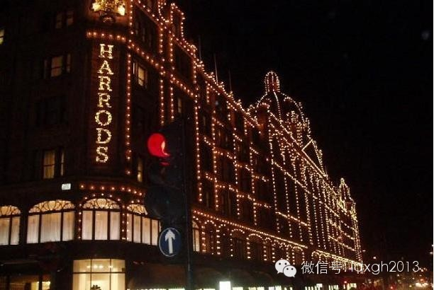

_图31. 哈罗斯百货店的夜景_  

  

[大象公会所有文章均为原创，版权归大象公会所有。如希望转载，请事前联系我们：idaxiang@idaxiang.org ]

[阅读原文](http://mp.weixin.qq.com/s?__biz=MjM5NzQwNjcyMQ==&mid=10252054&idx=1&sn=
1d1000809b7b9f708139416af0d6370a&scene=1#rd)

