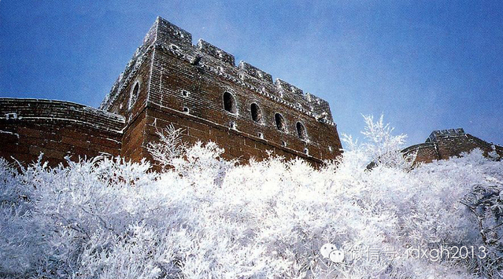
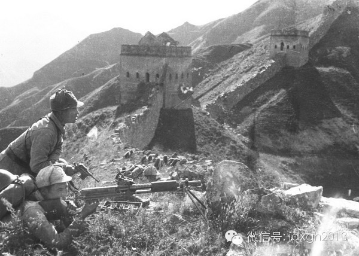
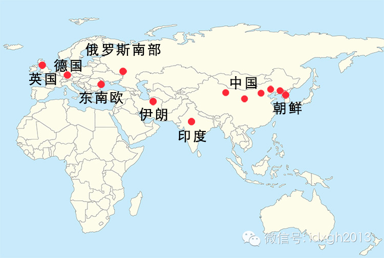
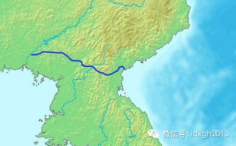
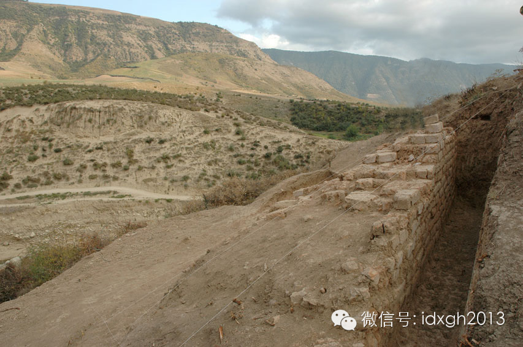
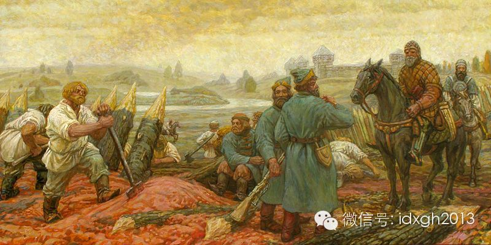
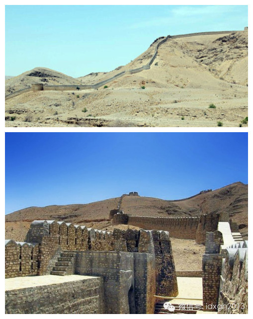
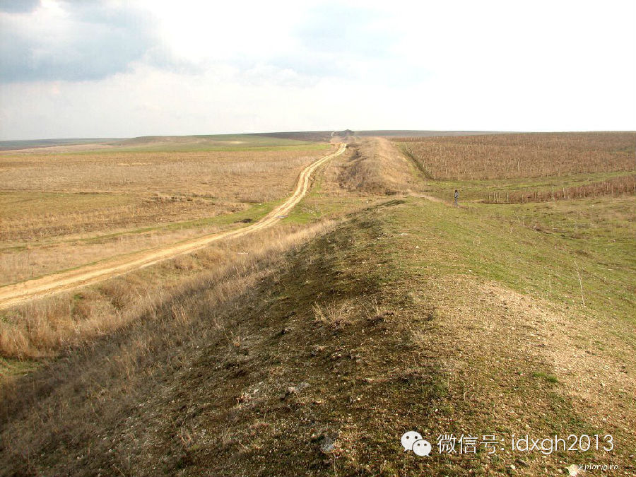
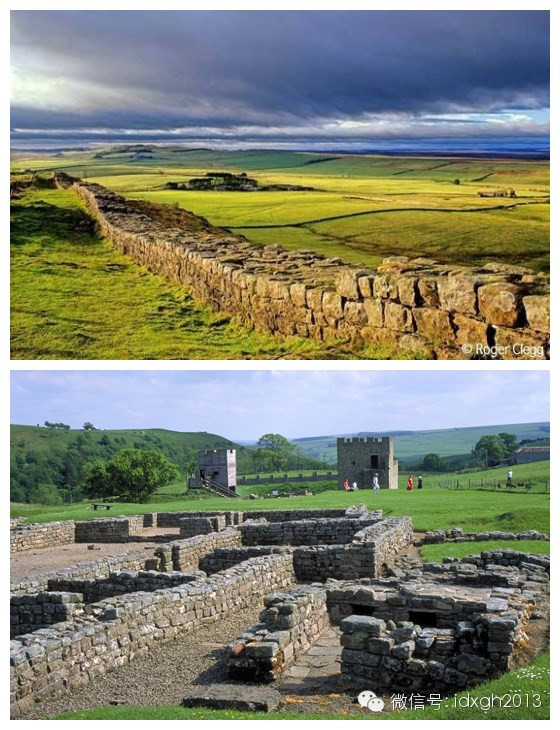
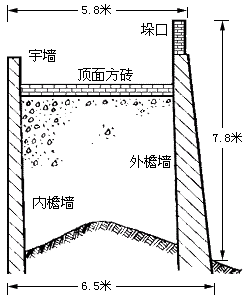

**从朝鲜半岛到欧洲，居住在亚欧大草原边缘的定居文明，都曾修筑过长城。中国长城举世闻名，是因为它的正北方洽好是草原暴力地带的中心。长城是恐惧的纪念碑。**

  

文/黄章晋

  

人类在太空、甚至月球上可以肉眼看到长城的说法，因杨利伟而终结。2003年10月，他从太空返回后，否定了这一神话。但长城在中国的神圣地位并未因此稍减，它依然是
中华民族的精神象征之一。

  

【恐惧的纪念碑】

  

在中国历史中，长城并非一直是崇高、正面的形象。自秦始皇时期，孟姜女哭长城的传说开始，无论是在民间还是文人墨客的笔下，长城更多时候是边关战死、苦役征发的象征。

  

以《饮马长城窟行》为题的诗作，历史上竟然有几十首之多。从三国的曹丕、唐朝的李世民，再到宋金时代的赵秉文，基本调子都是三国陈琳的“君独不见长城下，死人骸骨相撑
柱”。实际上这些诗作的写作时代，战乱发生在中原而非边塞。

  

满清入关后，以满蒙联姻和主动出击方式稳固边关，从未修筑长城，自然也看不上长城，文治武功最盛的康熙乾隆就是典型。

  

康熙有过“万里经营到海涯，纷纷调发逐浮夸。当时费尽生民力，天下何曾属尔家”，而乾隆亦有“金墉迤逦倚山尖，想象当时守备严。但拟天骄祛冒顿，那知民怨萃蒙恬”的诗
句。

  

当然，如此漫长的历史，不可能没有夸赞长城抵御外敌功效的诗句，譬如唐代边塞诗人褚载就有过“秦筑长城比铁军，蕃戎不敢过临洮”之句。但相比将长城视为战乱和苛政象征
的诗作，它们不但量少，而且并非流传广泛之作。

  

自秦始皇后，除唐、宋、清三朝未修筑长城外，中国历史上大部分王朝都有大规模修筑长城的行为。甚至女真入主中原建立金王朝后，为防范蒙古等蛮族，也在极北之地修造了长
城。

  

但万里长城终究未能避免五胡乱华、蒙古、女真入侵导致的神州陆沉，惨痛历史影响到后人对它的观感。鲁迅在其《长城》一文中评价道：“其实，从来不过徒然役死许多工人而
已，胡人何尝挡得住。”

  

到了近现代，拥有枪炮利器的西方列强自海上入侵，长城更失去了国防功用，彻底成为无用的历史遗迹。此时，长城开始为西方人所知，并很快有了现存长城的相关著述，对长城
的考察和研究比中国人更为详细。

  

虽然中国长城工程浩大，但西方人对它的整体评价并不甚高，认为它们在工程学上远不能与金字塔相比。

  

法国思想家伏尔泰对长城最不客气，但评价却最为准确：“中国在我们基督纪元之前两百年，就建筑了长城，但它并没有挡住鞑靼人的入侵。中国的长城是恐惧的纪念碑，埃及的
金字塔是空虚和迷信的纪念碑。它们证明的是这个民族的极大耐力，而不是卓越才智。”

  

但是，1930年代前后，日本对中国显示出迫在眉睫的侵略野心，被危亡感激发而起的民族情绪，急切需要一个唤起大众的象征物，千百年来作为国防工程的长城者才被重新关
注。

  

月球上能看到长城的说法，也恰好由此时自海外传入，1930年代初开始广泛流行。《胡适日记全编（1931-1937）》中就提到：“兄弟又见法国一本书上说，假如人
能到月亮里面去，俯视地球上的建筑，只有万里长城……”

  

1933年3月至5月，中国军队依托明长城，在义院口﹑冷口﹑喜峰口﹑古北口等地与来犯日军浴血奋战，此战被称为“长城抗战”。1935年5月，电影《风云儿女》上映
，片中由聂耳作曲、田汉填词的《义勇军进行曲》传诵全国，歌词中的“把我们的血肉筑成新的长城”，完成了将长城提升为民族精神的提炼。

  

由此，长城从千百年来的恐惧纪念碑，获得了与黄河、长江同等高度的民族图腾地位，升华为万众团结一心、绝不屈服外辱的民族精神象征。

  

_1933年的长城抗战。_  

  

【草原暴力的邻居们】

长城并非中国独有的国防工程。从亚欧大陆最东端的朝鲜半岛开始，历史上修筑过长城的地区依次有：朝鲜、中国、印度、伊朗、俄罗斯南部、东南欧一直到德国，它的最西端，
是英国北方的哈德良长城。

  

_欧亚大陆上的长城分布。_

  

为什么会出现这样一条横贯东西的长城走廊？或许用日本历史学家梅棹忠夫“文明生态论”的观点，解释起来最为容易。这一观点也能解释为什么中国修筑长城前后历时最长，耗
费的人力物力最多。

  

梅棹忠夫以亚欧大陆腹心草原地带为中心，将亚欧大陆划分为三个文明生态圈。

  

从兴安岭到东南欧的草原地带，被梅棹忠夫视为暴力之源，是人类文明的三类地区。而与之毗邻的中国、俄罗斯、印度、地中海-
伊斯兰世界，是不幸的“第二世界”，因为它们是草原暴力直接洗劫的对象。而西欧和日本则因远离游牧民族，是优越的“第一世界”。

  

梅棹忠夫用文明生态论来解释历史演进的不同：“第二世界”中那些曾拥有灿烂文化的文明古国，因为应对草原暴力的威胁，以及遭遇直接入侵的影响，几乎都变成了大一统专制
国家。

  

而“第一世界”虽然文化落后，但没有草原暴力威胁，形成了邦国和诸侯林立的分封制，它更容易转型为现代工商业社会。

  

如果将目前全世界已知的大规模长城绘制在地图上，不难发现它大致将亚欧大陆定居的农耕文明与移动的草原文明或半耕半猎文明分开，这正是梅棹忠夫第三世界与第二世界的文
明边界线。

  

对中原文明正北方的蒙古高原，梅棹忠夫曾特意强调，这里是亚欧草原暴力地带的中心，是恶魔巢穴。两千年来，草原地带出现的强大游牧帝国几乎都诞生于此，并以此为统治中
心。这或许能解释为什么紧邻蒙古高原的中原王朝，是修造长城投入心血最多的地区。

  

紧邻中国的朝鲜，在长城上的投入并不比中国少。朝鲜有两条长城，一条是十一世纪为防范契丹，由柳韶指挥修造的。它自鸭绿江到日本海，全长370公里，由石头砌成。另外
一条略短，十五世纪修筑。

  

_朝鲜“千里长城”的位置。_

  

印度现存的长城，不但是今天世界上保存最完整的长城，而且体量上也最为雄伟壮丽。这段位于印度北部拉贾斯坦邦的长城，十五世纪由梅瓦尔王朝的Rana
Kumbha修建，它曾用于抵御著名的阿克巴大帝。

  

_印度的长城。_

  

伊朗长城的长度仅次于中国，其最早的传说可追溯至中国的秦汉时期。它主要修筑于五世纪到七世纪之间，与中原相同，萨珊王朝也用它防范匈奴人和嚈噠人。今天它已成互不相
连的几段，最长的一段接近200公里。

  

_伊朗的古长城。_

  

侵略成性的沙俄曾经很喜欢修长城。与其他国家长城多在领土北方相反，俄国长城在国境线南方，因为亚欧大草原在俄罗斯（传统意义上的俄罗斯）南方——游牧入侵者来自东南
。

  

俄国人第一次修长城是在“红太阳”弗拉基米尔大公（980-1015在位）时代。这条最早的长城位于第聂伯河西岸，第一道则在苏拉河，它虽然简陋，但当时的罗斯（俄罗
斯帝国前身）人口仅600万，完成这样的工程并不容易。

  

俄国最著名的长城是“图拉鹿砦”。它得名于中心点图拉。“图拉鹿砦”主要由鹿砦、树干等架设而成，间以要塞、城堡。该长城大抵沿奥卡河修建，东起梁赞，西抵科泽利斯克
，由著名的伊凡雷帝（1530-1584）修筑。

  

_俄罗斯修建“图拉鹿砦”。_

  

当时，已装备火药武器的俄国人，对游牧人已拥有巨大优势。不过，俄国人在消灭喀山和阿斯特拉罕这两个较小汗国后，面对更大的克里木汗国，仍不得不采取守势。

  

1644年清军入关时，俄罗斯人同样面临着游牧人入侵骚扰的压力。俄国人为此再次建设大规模防线，建成了26个设防城市，修筑多条防御线。其中长达800公里的别尔哥
罗德防线最为浩大，它西起第聂伯河支流伏尔斯克拉河畔的阿赫季尔卡，中经别尔哥罗德、沃罗涅什、科兹洛夫、最后达塔姆鲍夫。

  

_巴基斯坦信德省境内的长城。_

  

【定居人的最优选择】

  

修筑长城对付野蛮人，似乎是冷兵器时代文明人共同遵守的普世价值。是否修造长城与是否有主动进取精神无关。

  

为防范北方的蛮族日耳曼人，罗马帝国于公元85年开始在北方的密林中修筑长城，其总长度约550公里。位于今天德国南部的部莱法、黑森、巴符和巴伐利亚境内。此段长城
叫罗马界墙。

  

公元98年至117年在位的图拉真，将罗马帝国疆域拓展到最大，他征服帝国东北方的达契亚（今罗马尼亚）后，在这里留下了图拉真长城，图拉真的继任者哈德良
（117年-138在位）则在英国北部留下了哈德良长城。罗马帝国最容易受攻击的三个方向都有了长城的保护。

  

_罗马尼亚境内的图拉真长城遗址。_

  

_哈德良长城。_

  

与中国长城多位于戈壁旷野和崇山峻岭不同，罗马与蛮族的自然疆域多是茂密的森林。其长城工事是一种复合工程，除了土墙、石墙外，还有壕沟、栅栏，它与固定驻扎的哨防兵
营结合在一起。

  

没错，长城未能保护罗马帝国和东汉帝国，东汉和罗马帝国修筑长城两百多年后，它们都被突如其来的野蛮人浪潮淹没。当草原上出现阿提拉、成吉思汗这种“上帝之鞭”（意为
上天对文明人的惩罚）时，长城确实无法拱卫国家安全。

  

但修筑长城，从来不是为了防范敌方夺取江山，而是为了阻止以抢劫为目的的入侵。

  

长城是明确划定两种文明疆域和实际控制区的标志。它大都修造在定居文明居住区之外，这种前置的国防工程屏障，在空间上对自身居民是一种积极的缓冲。作为主动出击时的前
进基地，便于将大规模集结人员和物资的地点尽可能靠近前方。

  

十七世纪开始俄国开始向东扩张时，采用的就是小股军队沿途修筑要塞不断前进的方式，沿途的一个个汗国倒在那些经常只有数百人的远征军面前。这与北宋与西夏作战时，以不
断构筑要塞压迫和限制西夏军队机动性的思路异曲同工。

  

即使军事力量占优，以主动出击的方式惩戒蛮族人，也很难收到制止对方零星入侵抢劫的效果。

  

汉武帝倾尽全国之力北伐匈奴，虽然卫青、霍去病等曾大批消灭匈奴主力，但汉帝国自身受创更甚，无力再战。二十年后，实力稍有恢复的匈奴又让汉军多次遭遇重大失败。零星
骚扰入侵也依然如故。

  

同样，虽然罗马帝国在主动出击时斩获不少，却也发现，修筑一道蛮族人难于翻越的长城，比起在茫茫大漠或在渺无人烟的森林中寻找敌人，成本要低得多。

  

无论是草原上飘忽不定的游牧人还是在黑森林中难觅踪影的部落，他们过的都是生产与战斗相结合的生活，转入战时的成本很低。定居文明若组织大规模军队讨伐，成本和代价极
为高昂。

  

因此，修筑长城，是最能体现定居民族财力物力和技术优势的军事手段。

  

_长城的墙身断面图。_

  

黄仁宇、吴思先生都曾以明代为例计算过长城的成本。吴思先生的计算是，大致修建1英里的长城花费白银7542两，而大军出征，八万人马一年的耗费是979万两白银，它
足够修建1300英里的长城。

  

在今天看来，中国北方有些地段的长城简陋不堪，但对缺少工具的游牧人来说，依然难于翻越——这足以打消那些小部落头领的小规模随意入侵念头。

  

即使草原上的较大政权，在大规模犯边入寇时，也只能选择最容易突破的地段，以硬拆城墙的笨办法打开一个缺口。这使得游牧人的入侵在地点和时间上有规律可循：多半选择在
天气转凉的时节。

  

除非游牧人决意夺取江山，毁灭定居文明，长城就能大大降低中原被抢劫破坏的可能。而通常情形下，游牧人只满足于偶尔打劫，以改善生活品质，并不贪恋定居民族繁华富裕的
江山和政权。

  

公元前200年，刘邦及麾下20万人在白登山被匈奴包围，公元615年隋炀帝巡游雁门被突厥包围，公元626年唐太宗渭水便桥边单骑会颉利可汗——都是被游牧人浪费的
机会。

  

那么，为什么强大的匈奴人、突厥人放弃了夺取中原江山的机会，而蒙古人和女真人却没有止步于定期抢掠财富呢？请读者留意续篇《谁在挥动上帝之鞭》。

  

[大象公会所有文章均为原创，版权归大象公会所有。如希望转载，请事前联系我们：idaxiang@idaxiang.org ]

[阅读原文](http://mp.weixin.qq.com/s?__biz=MjM5NzQwNjcyMQ==&mid=200285440&idx=1&sn
=c4217df1e53b164789b5104a9f9b1a51&scene=1#rd)

