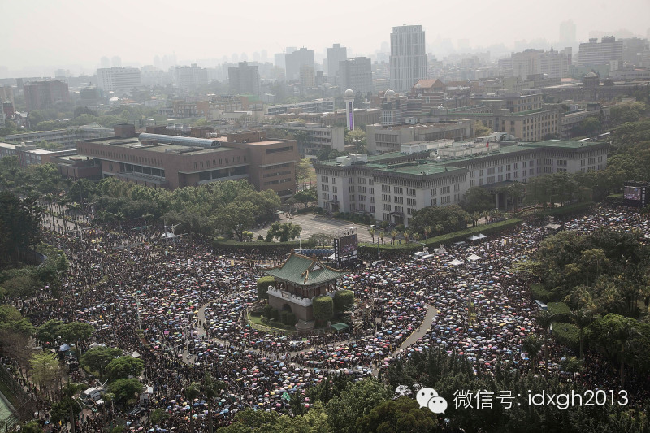
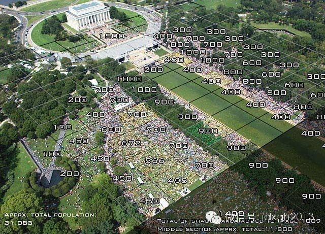
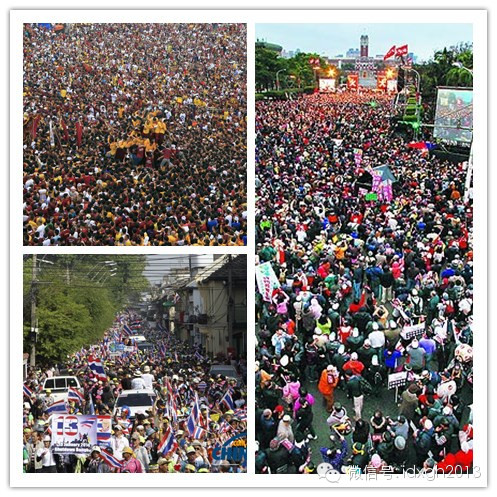
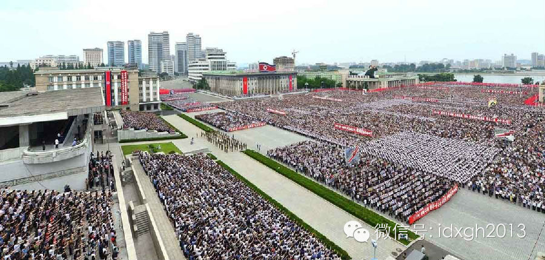
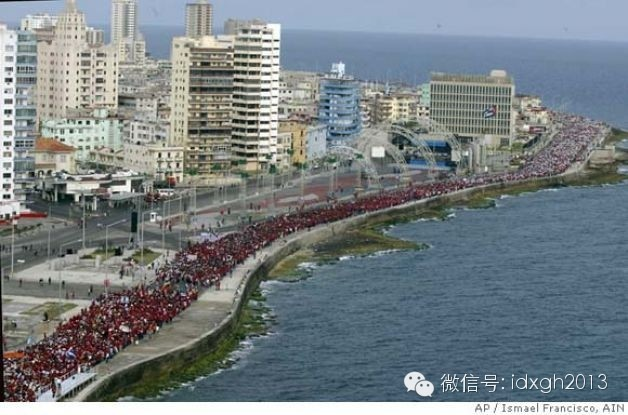

**集会人数意味着事件的重要性、民众的关注程度及其所展示的能量。长期以来，为了统计出可靠的集会、游行者总数，学者和媒体付出了不懈的努力。**

  

文/I.Issak   杜修琪

  

3月30日，台湾爆发反服贸抗议游行。下午1点，游行民众在凯达格兰大道集结。晚间7点40分左右，学生代表林飞帆宣布凯道活动告一段落，但强调占领“立法院”行动不
会停止。

  

对于前往凯道参加反服贸游行的人数，各方说法大相径庭。截至当天下午2点06分，台湾警方估计人数已突破21万人，学生团体则估计高达35万人，而台湾“警政署”公布
的统计数字则为8.1万人。

  

_反服贸游行现场。_

  

政府和组织者对集会人数各执一词的情况并不鲜见，它几乎每年都要在香港发生两次。比如在2011年的一次集会中，组织者对媒体宣布参加集会的人数为15万，而警方公布
的数字则是7.7万——几乎是组织者公布的一半。

  

集会人数意味着事件的重要性、民众的关注程度及其所展示的能量。这对组织者和政府来说，都具有不可低估的政治意义，各方所公布的数字也因此总是天差地别。然而，事实的
价值不在于服务政治。长期以来，为了获取可靠的集会人数，学者和记者们付出了不懈的努力。

  

1960年代，美国深陷在越南战争的泥潭中不可自拔，国内反战集会此起彼伏，而校园则是“重灾区”。集会人数较为可靠的计算法首先在加州大学伯克利分校诞生。

  

计算集会人数的冲动或许来自新闻学教授哈伯特**雅各布斯无意中的一瞥——从他的办公室窗外望去，底下是黑压压的人群——学生们正在校园内发动反战集会。棋盘格的水泥
地为统计创造了便利：雅各布斯挑选了几个方格，数出方格中的人数，然后计算出样本方格中的平均人数，再用这个数字乘以总方格数，就得到了集会总人数的近似值。

  

经过计算，雅各布斯将“松散人群”的密度划定在10平方英尺/人（1平方英尺=0.09平方米），“密集人群”的密度在4.5平方英尺/人。

  

正是基于这样的标准，墨尔本大学研究者雷**华生和香港大学研究者保罗**叶认为在前文提到的那次香港集会中，组织者公布的数字15万是不现实的——要在4.2万平方
米的面积上容纳15万人，则意味着人群密度会在2.7平方英尺/人。在两位研究者来看，那堪称“狂舞密度”。

  

如今，人们虽然已经可以动用卫星等工具来统计集会人数，但是雅各布斯的方法依然占据指导地位。比如亚利桑那州立大学的研究者，利用GeoEye-
1军用卫星统计2009年参加奥巴马就职典礼的人数（统计结论是80万），而纽约警方则用限制人群的围栏数，乘以每个围栏对应的平均人数，来估算集会人数。

  

_GeoEye-1卫星拍摄到的奥巴马就职典礼的高清卫星图片，左为观礼人群，右为国会大厦。_

  

当然，简单的密度乘以面积的方法也有弊端——在集会场所中，人群密度并非均质、稳定，这就意味着，为了得到更精准的数据，人们需要采用更复杂的办法。

  

2010年，著名媒体人格兰**贝克（Glenn Beck）在林肯纪念碑发动集会游行， CBS（哥伦比亚广播公司）雇佣了DDIS（DigitalDesign
and Imaging Service ）公司来计算集会人数。DDIS所用的多密度计算法，就是对雅各布斯计算方法的一次升级。

  

为了预测参与者人数，DDIS首先测量了集会地点，绘制出标志了人群可能聚集点的地图，并与之前类似事件发生时这些地点的图片互相参照。DDIS要找到人群聚集的预期
地点：冬天，会寻找避风口；夏天，则留意阴凉处。人群面向舞台、超大电视屏幕，而背对着高音喇叭。

  

事先的测算帮助DDIS选定具体的观测地点，之后，他们在集会场所的高地上升起带绳子的气球。气球带着一组远程控制摄像机升入空中，短时间内，就可在200英尺、40
0英尺和800英尺的不同高度抓取360°°的人群影像。不同高度的机位可以拍摄到树下或其他较隐蔽地点的人群。

  

随即，DDIS将合成的影像覆盖在3D模型上，开始检查人数。他们的团队用网格标出各区域的密度，接着，用区域面积乘以相应的密度，最终加总，得出集会的总人数约为8
.7万，并将统计结论的误差空间设定为10%。

  

不过，即便有如此高科技水平的统计方法，各方报出的集会人数还是相去甚远——参议员米歇尔**巴赫曼（MicheleBachmann）集会当天在舞台上宣布总人数一
百万，NBC报道的数字是30万，而格兰**贝克自己估测的数字则在30万到65万之间。

  

_DDIS测算方法图示。_

  

用图片来计算游行人数是个不错的方法——如果人们总是保持一个相对静止的状态。但是，当游行人群在不断移动时，统计者走到游行队伍之中就会变得十分必要，这也是相关课
题最新研究中的核心问题。

  

为了测量行进中的人群，统计者最常用的方法是在人群中设置一个或者两个数据采集点。

  

在第一个方法中，研究人员在游行、示威人群的中心位置设置观测点，记录给定时间内通过的人数。但这也有不足之处：一些人会在遇到研究人员前就离开了，或者躲避了研究人
员，还有人会在通过这一点之后很快离开队伍。这使得进一步用电话采访来了解参与者的游行时间变得必要，但数据仍不够准确。

  

_测算行动中的大规模人群总数绝非易事。_

  

对此，一个更快速，更准确的计算方式，是在队伍中分别开设两个计算点。两个点的研究者分别记录通过的人数，并随机提问参与者是否通过或预计通过另一个观测点。同时，研
究人员也发现，若设置观测点超过了两个，则无助于提高准确性，只会增加经费。

  

香港学者苏钥机和钟庭耀在估算2003年香港的一次集会人数时，就用了两点计算法。他们在游行的主路线轩尼诗道上，选择了近波斯富街及柯布连道的两座行人天桥，在天桥
上架设摄录机，抽样拍摄游行过程——每小时抽录四分钟后，马上把录影带运送到一个设有放映器材的地方，用定格在电视大屏幕上点算人数。

  

基于技术考虑，研究组只用了柯布连道天桥底的数据，推算游行人数，得出的数字是264000人。七月初，研究组通过电话抽样调查，发现游行者中有57%曾于轩尼诗道经
过湾仔修顿球场对开马路，75.4%于黄昏六时正在街上聚集。

  

于是，再将经过计算点的人数，除以经过天桥计算点人数的百份比之后，研究组推算出游行者总数为462000人。电话调查本身的误差率（正负4.5%）也被考虑进来，则
整体游行人数的上、下限分别为429000人和502000人。

  

至于这两个数字到底哪个更可信？这基本取决于你的政治立场。

  

使用简单的计算方法，任何人都可以进行人数统计。不过，若要做得精确，独立的学术界或许比较合适。而如果多个团体都同时进行独立和科学的人数统计，就可互相比较印证，
会令彼此的推算变得更加谨慎，数字也更趋近真实。

  

当然，香港、台湾、美国这些非政府组织的游行还都是小儿科。历史上，中国官方组织的游行不仅规模巨大，且阵型整齐，密度均匀。相比之下，朝鲜的游行经验也不逊色：每年
6月25日，都是朝鲜的“反美斗争日”，游行人数常年保持在十万级别。2005年05月17日，古巴领导人卡斯特罗亲自引领120万（超过首都哈瓦那人口总数，占全岛
的1/10）古巴民众走上街头，举行反美游行。

  

_朝鲜将每年的6月25日定为“反美斗争日”，举行大规模集会，并游行。_

_ _

_2005年5月17日，古巴120万民众在哈瓦那举行游行，要求美国政府惩办波萨达等古巴裔美国人_

  

此类游行的总人数，新闻界当天就会快速通报。而令学者们寒心的是，他们苦心研究的人数统计模型在此毫无用武之地——因为要按人头发放补贴，数字通常相当精准。

  

[大象公会所有文章均为原创，版权归大象公会所有。如希望转载，请事前联系我们：bd@idaxiang.org ]

———————————————  

**大象公会订阅号的自定义菜单上线了，左边是官网文章精选，右边是大象公会官方微社区，点击进入来吐槽发帖吧！**

  

[阅读原文](http://mp.weixin.qq.com/s?__biz=MjM5NzQwNjcyMQ==&mid=201382715&idx=1&sn
=91ae097c51eba004dd28e82e4efc5f11&scene=1#rd)

