**领袖像，可谓是“政治的艺术”与“艺术的政治”最精妙的组合结果。对于中国人，最深入人心的领袖像非“伟大领袖毛主席”莫属。这项浩大的艺术工程是如何让领袖“伟大”起来的呢？**

**  
**

文/郭子健  

  

中国人最熟悉的领袖像，莫过于天安门广场悬挂的毛泽东画像。“伟大领袖”发型过渡平稳，面部饱满，眼睛半眯，眼袋与法令纹若隐若现，慈祥与威严并存，却毫无衰老感。浅
蓝背景中渗透着红晕，象征领袖独一无二的“光芒”。整体画风一丝不苟，十分立体。  

  

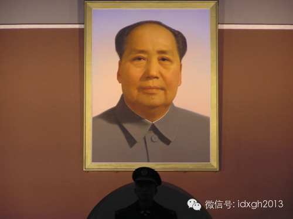

  

中国传统中，最高统治者的画像并不被广泛传播。皇帝的画像只在少数礼仪悬挂，当朝者普遍忌讳自己的画像外传。西方虽然有为领袖作像的传统，其地位并不突出，如亚历山大
大帝，头像虽被印在希腊货币上，也只是众多被敬畏英雄中的一位，受推崇程度远不如宗教人物。

  

带政治狂热意味的领袖像，出现在20世纪之后。在此之前，由于模仿西方的邮政货币制度，中国的皇帝形象开始被民众认知，光绪皇帝和后来的摄政王载沣的头像都出现在货币
上。民国初年，袁世凯也为自己制作了标准头像，“袁大头”形象就此深入人心。

  

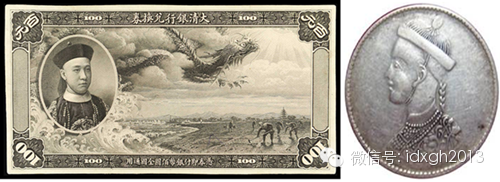

  

苏联的成立和希特勒掌权，是领袖像发展的两座里程碑。前者是人类第一次将如此深入、广泛的权力集中在单一领袖手中，因此需要相匹配的标准形象，在民众间推广；后者则借
助大众传媒的力量，将领袖像的宣传级别推到新的高度。领袖像要经过相当精细的修饰，符合其宣传所需。  

  

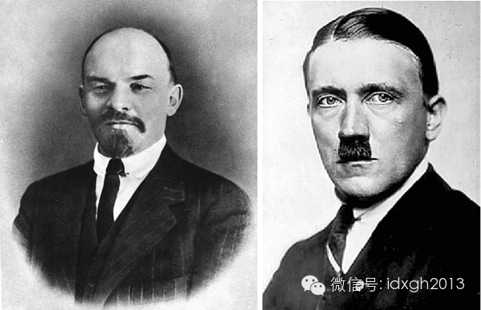

列宁与希特勒

  

新形式很快传到中国，国民政府率先采用了这一形式。1927年国民党统一全国，孙中山像被推向神坛，“总理遗像”成为一个专有名词写入党章，国民政府制定了标准样式，
规定只有经过官方审查的画像可以在市面上发售。此外，还专门制定法规对撕毁遗像的行为进行严厉惩罚，军队、政府公职人员、中小学生、社会团体等都形成了重大活动前向总
理遗像三鞠躬的仪式规范，台湾的领导人就职仪式至今沿用这一传统。

  

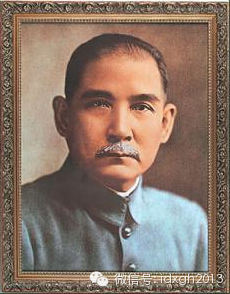

  

相比之下，共产党的起步晚了许多，由于初期权威主要来源于共产国际，30年代中共苏区货币上印的是列宁。1933年出版的《革命画集》中的一幅毛泽东素描肖像，是目前
最早的毛泽东像，但过于写实，无法和后期天安门上的完美形象媲美。

  

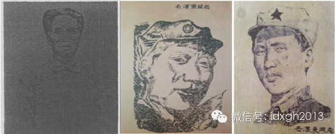

左一为1933年最早的毛泽东画像，右两幅绘制于长征前后

  

30年代，国民党为毛泽东绘制的另一类画像，甚至比这种不完美版更难堪。据当时徐肖冰、侯波回忆：朱毛“画成魔鬼或猛兽的模样……满嘴都是血，全身都是毛，杀人不眨眼
云云”。

  

这种情况在中共转战陕北之后逆转，绘画共产党领袖画的技巧逐渐超越了国民党。毛泽东相继击败王明、张闻天等人，树立起无上权威，领袖画的格局也随之发生变化。

  

1933年，延安出现第一张领导人集体画像，毛泽东虽占据前排，但与身后的朱德等人差别不大。整风运动之后，单独的毛泽东画像成为主流。1943年的一次劳模奖彰大会
，毛泽东像作为奖品，发放给前来领奖的农民代表，此时延安的毛泽东形象已随处可见。

  

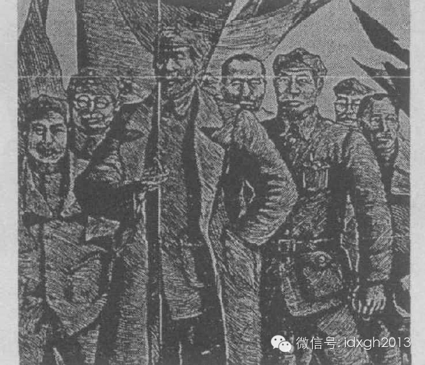

1933年，延安第一张毛泽东画像

  

当时，延安的物资有限，油画、国画难以施展，鲁迅等人在上海提倡木刻、版画为适合无产阶级的艺术，是“时代的战鼓”“革命的号角”，因此延安的毛泽东像都采用木刻。但
鲁迅等人毕竟是文人，倡导的版画也是西方表现主义风格，讲求阴影、透视，这种风格的领袖像显然不能表现正在升起的红太阳。

  

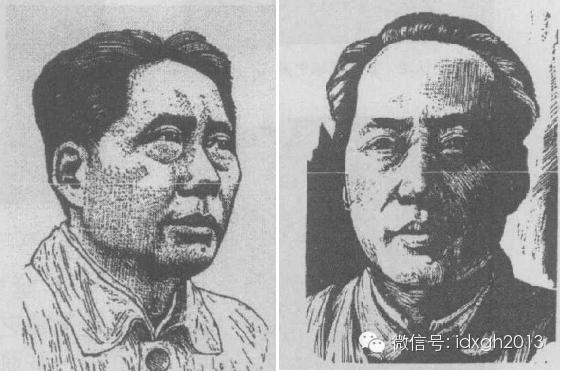

左：力群，毛泽东像，1940年；

右：林军，毛泽东像，1943年

  

关键时刻，毛泽东发表《延安文艺座谈会上的讲话》，画家们纷纷下到民间学习，在《讲话》精神指导下，整风运动初期一幅明快、喜庆的版画被绘出，与前两者相比，它没有阴
影，图案明朗，经中宣部肯定，在各地广泛推广。这是中共第一个标准版本领袖画。  

  

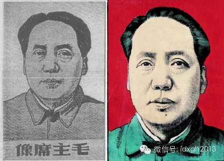

左：王式廓，毛主席像，1942年；

右：上色版本

  

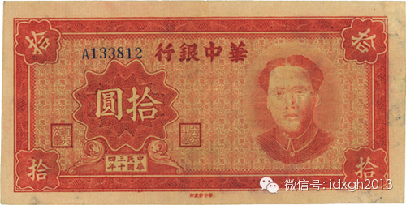

当时发行的边区货币，采用王式廓版画像

  

通过整风运动，毛泽东正式确立了党内至尊地位。比版画、木刻更正式、更尊贵的艺术形式的领袖像出现了。1942年，中央党校外墙，雕刻上了一幅毛泽东侧面浮雕。这幅浮
雕在1950年被原作者按照更“自信”、更有“思想家”特征修改后，印在无数纪念章上，成为雕塑领域的标准像。

  

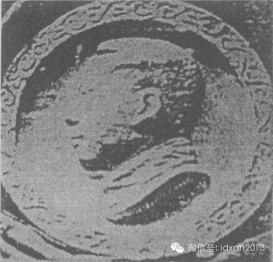

1943年，王朝闻，延安中央党校外墙毛泽东画像

  

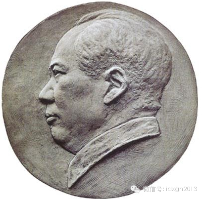

1950年，修改版本毛泽东像

  

1949年后，中国奉行外交“一边倒”政策，苏联的油画传统强势影响着中国。江丰、艾青等人提倡油画，认为中国传统画“落后、不科学，不能为政治服务”，这一时期官方
的领袖像中油画占据主流，不过，此油画并没有“现实批判主义”色彩，一些基本的油画规则都被漠视，这一新的领袖画主义在中国、朝鲜、苏联的宣传中，都很常见。

  

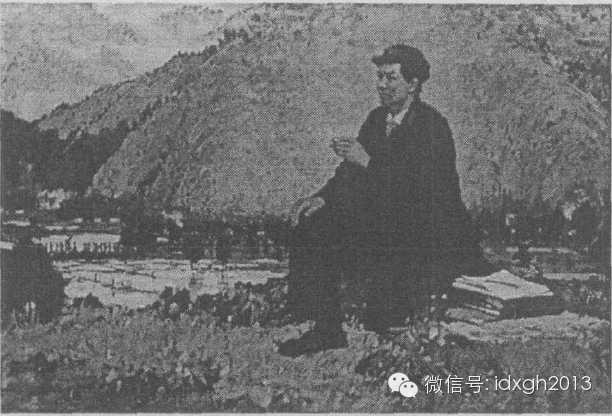

毛泽东同志在井冈山上，1959年绘制的油画

  

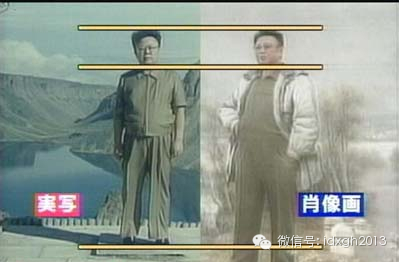

朝鲜领袖金正日的油画和现实比例

  

可是，50年代末中苏交恶，让油画变为烫手的政治问题。毛泽东在1957年曾向油画推广者江丰质问：“江丰是共产党还是国民党？”此后，国画领袖像出现，在60年代被
推广。

  

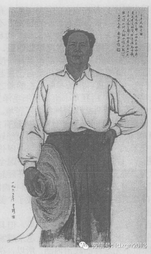

1960年，国画《主席走遍全国》

  

但普通民众并不关心油画和国画之争，精英的审美意趣此时还不能像文革时期深刻地改变他们。民众更喜欢将领袖融入年画、农历图之中，为此不惜让主席沾染一些封建色彩。

  

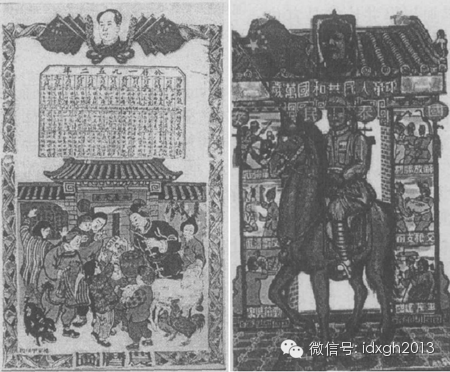

左：1952年，印有毛泽东像的农历图；右：1950年，门神画风格、骑马举旗的毛泽东像

  

这种情况，有损领袖的权威。为此，共产党先后四次确立了毛泽东的标准像。这些标准像都取材自毛泽东平日的合影，加以修改。例如，烟瘾严重的毛泽东牙齿已经发黑，修片时
要调成白色；毛泽东头上的光线，尤其是额头上有“龙骨”，需要打亮光来突出其“光辉”。去皱、磨皮和上色这些是基础功能，“亮眼”也需要运用。  

  

这些堪比修图软件的技法效果明显。毛泽东的女儿李讷在见到最后一张标准像时，给出了积极的评价：“无论在哪个方向，主席的眼睛都在看着你。”

  

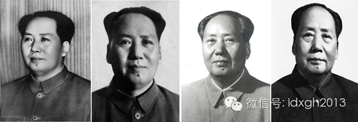

毛泽东四幅标准像

  

文革时期，这些标准像的运用发生很大变化。领袖画的技法开始走向极端，刻意造成毛泽东与周围群众在大小、高矮比例上明显的反差。毛泽东的形象从彩色逐渐向暖色过渡，红
色、黄色、棕色、橘色成为宣传画的基调。其脸部也不再有写实的线条，取而代之的是光洁的面庞，凸显其“发光发亮”的特质。  

  

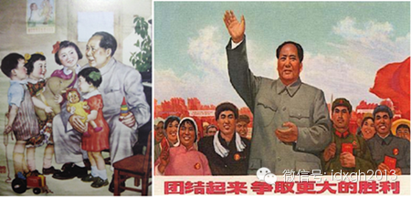

领袖像的色调与比例都有变化

  

绘画形式开始采用工笔画，一个重要的原因是它比照相甚至油画都容易修改。毛泽东到中年之后身材发福，且先天溜肩，这有损领袖权威的形象。对此，对毛泽东宣传画的肩膀做
了修改，将其画成一个直角，胸围和手臂的比例也被放大。领袖“挥巨手”的形象被塑造的魁梧有力。  

  

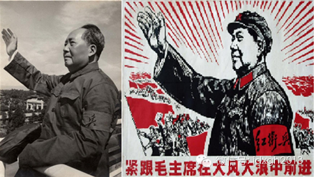

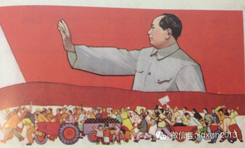

与照片相比，领袖的肩宽与臂长都发生明显变化

  

绘画描摹出来的领袖，表现出更加饱满的感情，要比单薄的相片更能打动人。因便于修改，使得它成为许多矮小瘦弱领导人的福音。身材不高的斯大林就是这一策略最大的受益者
。朝鲜已故领袖金正日的遗像仍旧采用了工笔油画的风格。比起照片中矮小瘦弱的晚年金正日，油画中丰满细腻的面部肌肉、一丝不苟的背头、洁白的牙齿都让照片修复术难以望
其项背。  

  

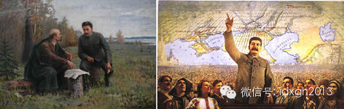

苏联画风的转变

  

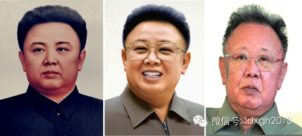

金正日照片与标准像的对比

  

文革时期，领袖像更注重细节上的政治正确。比如向哪个方向转头——只准左，不能右。虽然1967年《毛主席万岁—毛主席版画肖像汇编》选出了可以绘制的肖像，但是经历
过脚踩领袖头像被处罚的人们，自发地形成政治敏感性，向右看成为心照不宣的禁忌。  

  

早年的一些作品则因其他细节被禁止。群众挥舞的手臂挡住毛泽东的脸自然不可以。连毛泽东第三幅标准像也遭受指责：一只眼珠向上，且只露出一只耳朵，被红卫兵解读为“偏
听偏信”。领袖像的标准化在此达到顶峰，中央文革小组专门规定：“以后编印毛主席像册和说明，一定要送中央文革小组审查，不能由编印机关独断独行，违反这个纪律将受处
分。”

  

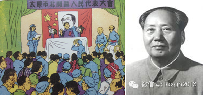

左：被挡住脸的领袖像；

右：被指为“偏听偏信”的标准像

  

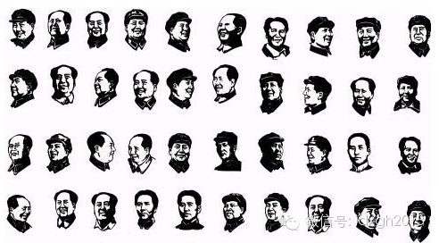

选自《毛主席版画肖像汇编》

  

1978年后，中国社会逐渐开放，曾经只有毛泽东一人的领袖画像，也逐渐加入了新人。2009年国庆阅兵，毛泽东、邓小平、江泽民、胡锦涛的大幅油画，先后从阅兵台走
过。曾经严苛的领袖像审查也变得松弛，缺乏了党的把关，各地民众想象力爆棚。毛泽东以全新的形式出现在田间地头、工地，乃至洗浴城门口，堪称中国后现代艺术的一座高峰
。

  

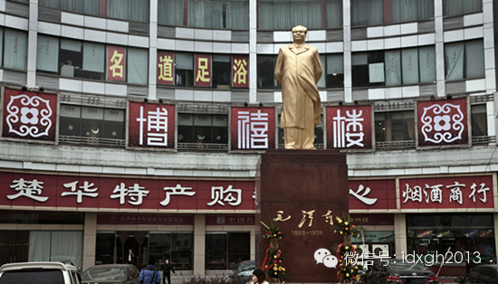

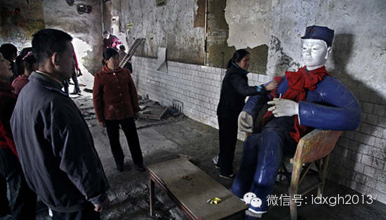

  

> 版权声明：  
大象公会所有文章均为原创，版权归大象公会所有。如希望转载，请事前联系我们： bd@idaxiang.org

大象公会：知识、见识、见闻

微信：idxgh2013

微博：@大象公会

投稿：letters@idaxiang.org

商务合作：bd@idaxiang.org

[阅读原文](http://mp.weixin.qq.com/s?__biz=MjM5NzQwNjcyMQ==&mid=203415483&idx=1&sn
=1d718c41c6de01a34a279318c45d97e3&scene=0#rd)

