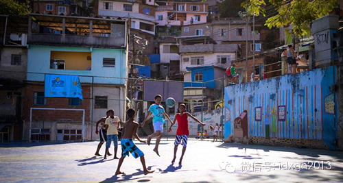
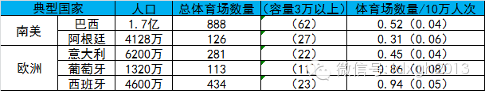
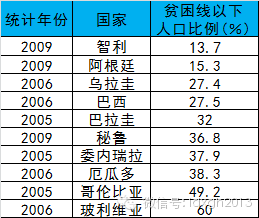
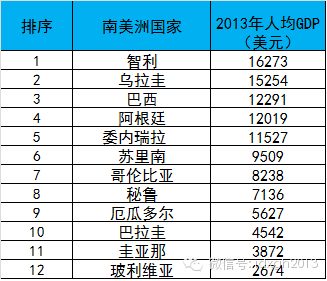
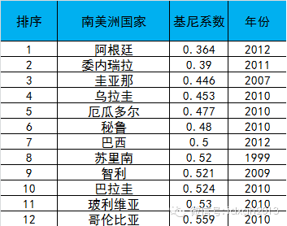

**南美球队比功利主义的欧洲球队踢得更漂亮、花哨，文化因素也许并不重要，经济和社会因素才是关键。但正因如此，南美球队正逐渐失去其技术特色。**

文/KKab 王增杰

  

喜欢南美球队的球迷，大多因其比欧洲足球有更高的观赏性。世界杯赛场上，南美球员常有更多个人脚法的展示，更灵活的盘带，以及肆意的即兴发挥，常出现天才球星神光闪现
而左右一场比赛的情形。而欧洲球队几乎从未出现马拉多纳式一个人带球越过半支球队射门这样的球星。这种风骚、率性的足球风格被称为“艺术足球”，巴西足球队，曾被冠以
全世界踢法最花哨漂亮的球队。

  

为什么南美洲的足球踢得如此风骚、漂亮？最常见的说法是，南美洲的拉丁文化本身就是奔放、热烈、自由、随性的，所以南美洲的足球员动员会在球场上表现得更为注重个人的
即兴发挥。但同样以奔放、热烈著称的西班牙、葡萄牙和意大利，足球面貌却迥异于南美球队，这里不缺个人技术出众的球员，但与南美同行喜欢炫技不同，他们更加注重效率，
绝不粘球，踢法务实而且功利。

__  

如今，南美国家有些球队已看不出多少南美特色，典型如智利、乌拉圭、阿根廷，即使是著名的巴西，也算不上最率性、风骚的球队。相对而言，哥伦比亚、秘鲁、巴拉圭等国或
许更能代表南美的典型球风。

  

近两届世界杯，巴西队未出现德尼尔森这种动辄表演“踩单车”的球员。史上踢球最风骚的罗纳尔迪尼奥进不了巴西队是风骚足球死亡的分界线，尽管他的进球依然能漂亮到排进
年度TOP10，尽管他一再表示愿意为国效力，甚至回到家乡球队某种意义上就是为了保持状态随时等候召唤，但斯科拉里还是放弃了他：一来年岁已高，二来斯科拉里这种在
欧洲风光过的主教练，对个人表演欲望强烈的球员兴趣不大，他宁愿选择长期在法甲厮混比较务实的弗雷德。

很难有公认的技术性统计数据来比较典型南美球风的强弱，只能依赖近二十年对足球赛事观察的印象。如果上述观察总结可信，那么可得出这样的结论，南美国家足球的风骚、率
性，与奔放、热烈、自由的文化相关性很弱。

南美洲球风更深的印记源自何方？相信不少资深球迷早已有了答案：贫民窟。

**【贫民窟的奇迹】**

****

贫民窟是社会贫富高度分化的典型外在特征。与其他国家贫民窟多镶嵌在城市的老城区或城市边缘不同，南美洲的贫民窟，形成于战后经济高速增长期，大量涌入城市的农村人口
多集中在城市的山上，形成一片连续的建筑聚落，物理空间上完全独立于山下的现代都市。

_巴西贫民窟的足球____  
_

以个人技术突出而著名的南美足球明星，除济科、梅西等少数例外，大都来自社会底层的贫民窟。从贝利、马拉多纳、加林查、罗马里奥、罗纳尔多、里瓦尔多、德尼尔森、罗纳
尔迪尼奥，到苏亚雷斯、内马尔等——如有必要，这个名单还可以开得更长。

  

  

与欧洲同行不同，这些南美球星少年时代的足球基础，多练就于平民窟街道的空地上或粗糙简陋的足球场上，这种近乎踢野球的环境，塑造了他们更注重个人盘带和控球技术，而
不太在意团队战术配合的风格。

在赛场上，南美球员往往表现得更“独”，如果自己有一线进球可能，不会轻易把球传给机会更好的同伴。较晚才接受正规比赛规则的约束，也使他们通常更容易沾染不太好的小
动作和表演假摔的毛病。本届世界杯上啃咬意大利运动员的乌拉圭球星苏亚雷斯已是第三次咬人，在1986年世界杯，乌拉圭队更因表现粗野狂放被欧洲人称为“足球垃圾”。

  

_南美与欧洲国家的体育场数量_

此外，南美贫困少年的娱乐极为单一，在浓郁足球文化的社会，足球不但是仅剩的娱乐，而且是摆脱贫困晋身富裕阶层的捷径，这与欧洲球员的兴趣导向截然不同，且欧洲球员更
少依赖体育改变命运。因此，南美足球少年远比欧洲竞争残酷激烈，容易有更好的个人技术。

经济因素促使南美穷孩子们更热衷于足球，这可以解释为什么有黑人血统的球员比例大大高于他们在人口中所占的比例——他们在南美的经济地位相对白人更低。黑人球员在体质
特征上确实在某些体育运动中占有相当优势，但足球并不明显。

南美足球的情形并非孤例，它似乎也可以解释美国篮球被黑人垄断而具有更高的炫技观赏性，以及黑人少年对体育运动的热爱为何集中于篮球、橄榄球、棒球等极学习门槛低、职
业收入较高的类别上，而经济收益较低、学习门槛很高的体育运动,黑人参与比例则很低。

职业拳击风水轮流转更能佐证这一点。在美国黑人垄断重量级拳坛之前，统治者是爱尔兰裔美国人，当时处于社会最底层的爱尔兰裔更愿从事这种高风险高回报的职业。黑人垄断
拳击重量级霸主半个世纪后，人们甚至认为他们天生适合拳击，是不可动摇的。但2000年后，来自前苏联和东欧的巨人颠覆了这个神话——这些新的统治者比美国黑人更乐于
选择这项高危职业。

___俄罗斯巨人__瓦鲁耶夫___

__

来自贫民窟的南美球星，不但球风和球技风骚、率性，成名后的个人生活方式也是如此。他们喜欢出入夜店，频繁更换明星美女，酗酒，生活毫无节律，甚至吸毒（如马拉多纳）
——成名后先去欧洲淘金，把最好的年华奉献给欧洲球场和夜店欢场，废物了就回国踢球或执教，这条金光闪闪的人生之路，是激励贫民窟孩子们前赴后继投身足球的最大动力。

欧洲的少年足球天才们被俱乐部发掘后，接受训练时不能中断正常学业。荷兰球星博格坎普曾回忆，他在12岁时就承受了一名普通职业球员的所受的压力。没有时间外出游玩，
他不吸烟也不喝酒。周六晚上和周日呆在训练营里面做功课，每周有2到3次训练。

_球星博格坎普_

__

自幼接受俱乐部的严格管理，使欧洲球员们成年后的生活更加规律。很多人在适合泡妞的大好年华早早结婚生子，成为模范丈夫，即使是早年出身于下层社会的贝克汉姆、鲁尼、
菲戈、阿隆索、齐达内等，亦是如此。

**【风骚足球的褪色】**

被称为球星摇篮的南美贫民窟，今天的面貌已与人们的刻板印象有了很大不同，巴西、阿根廷很多街区的贫民窟并不比中国大都市城乡结合部的城中村更破旧，尤其是被政府有效
控制的街区。而智利、乌拉圭两国，由于长时间社会稳定，经济持续增长，典型意义上的贫民窟几乎已被消灭。

_南美国家贫困线以下人口比例_

__

经济统计数据表明，南美洲基尼系数逐渐下降。虽然南美洲整体的基尼系数仍然超过0.5，还是世界人均收入差异最大的地区，但过去十年来，南美平均基尼系数从0.55下
降到0.52，最突出的是阿根廷，基尼系数下降了10%。

_ _

_南美国家2013年人年均GDP_

_  
_

_ _

_南美国家基尼系数_

如果我们认可经济因素对足球风格的影响，或许不难解释为什么智利、乌拉圭、阿根廷、巴西身上的南美风格已经或正在逐渐褪色，而秘鲁、哥伦比亚、巴拉圭相对还保持较浓郁
的南美球风——它们在上面两个表格中都居较靠后位置。

对南美球风整体影响最大的也许是另一个经济因素——欧洲各大联赛俱乐部的金钱。战术意识和团队意识可以后天矫正与改造，而球技天赋在成年后很难大幅提高，所以近二三十
年来，越来越多的南美球员被吸引到欧洲，他们在淘金生涯中逐渐被改造得更像欧洲球员。

拥有世界最先进足球体制的欧洲，如今足球战术和球员使用已经不再依赖教练的主观印象和评价，更多来自强大的数据统计分析。天才球星在越来越科学理性的指挥体系和团队作
战面前，可以即兴发挥创造的空间越来越小，马拉多纳一个人左右一场比赛的时代已成过去。

这种观赏性越来越低的足球演化趋势，当然会遭到南美人的抵制。南美洲国家很少聘请欧洲教练，但执掌教鞭的本土足球名宿，越来越多曾有过欧洲联赛的历练，即便观众对功利
、缺少可观赏性的足球有一万个不乐意——事实上全世界的球迷都是如此，但没有哪个球队能不在乎输赢。

今天，足球发展的创新更多表现为教练的战术设计和创新，而非球员即兴发挥的创新，无论是世界杯赛是美洲杯赛，注重个人技术和即兴发挥，观赏性十足的风骚足球将逐渐趋于
消亡，且难以逆转。

不过，还有面孔相对陌生的黑非洲球队。黑非洲球员多数比南美人更穷。当然，能闯进世界杯的尼日利亚、加纳、科特迪瓦、喀麦隆，都至少在最近十年保持政局和经济增长稳定
，并非战乱动荡国家，譬如尼日利亚自1999年自由化和私有化改革以来经济持续增长，已接近中等收入国家。

撒哈拉以南的非洲，大都是殖民者人为制造出来的国家，短暂的建国历史以及政局缺少长期稳定，非洲球员对国家的认同度和荣誉感相对较低，战术纪律性也表现得更为涣散。对
黑非洲球员来说，世界杯是在欧洲球探面前最好的展现机会，他们喜欢个人即兴发挥，禁区附近只要能起脚射门就绝不传球给同伴，即使是严厉的欧洲教练也无法有效约束。

迷恋巴西、阿根廷的球迷们，现在应该把眼光转过来，饱含深情地凝望非洲球队，他们才是风骚足球的代表。

  

> 版权声明：  
大象公会所有文章均为原创，版权归大象公会所有。如希望转载，请事前联系我们： bd@idaxiang.org

大象公会：知识、见识、见闻

微信：idxgh2013

微博：@大象公会

投稿：letters@idaxiang.org

商务合作：bd@idaxiang.org

  

[阅读原文](http://mp.weixin.qq.com/s?__biz=MjM5NzQwNjcyMQ==&mid=203032665&idx=1&sn
=325e97a566d953c1a23cedba5f999ff4&scene=0#rd)

