**《历史转折中的邓小平》使主演马少骅完成了从“孙大炮”到“邓大人”的转型。把现代历史人物搬上荧幕，人们通常会在意演员像不像。做得最好的，无疑是过去的苏联和今日的中国。**  

  

文/郭子健

  

如何在芸芸众生中寻找双胞胎般相像的人？当领袖是个不错的办法，尤其当后人决定拍摄电视剧时。

  

不过，国情的差别让特型演员的质量有所不同。苏联和中国的规格无疑是最高的，也有“神似”和“形似”的区分。

  

技术越发展，资金越充足，电影越能实现高难目标。但这条原则不适用于特型演员——发达国家的选拔相对随意，而中国经济越发展，相像标准反而远不如之前。对领袖的高仿似
乎游离于电影规律之外，自有其独特的逻辑。

  

**【演的太像伊里奇了】**

  

“特型演员”是指“出于重现当年情景的需要，用一个固定的，与某个伟人面貌相似的演员饰演其在影视剧作品中的角色”。特型演员是仅出现在中国大陆和苏联的一种电影现象
。它是塑造领袖形象的浩大工程中的重要一环。

  

最先开启“特型模式”的当属苏联。1928年，苏联著名导演爱森斯坦拍摄的《十月》公映。这位蒙太奇理论的发明者，在电影中使用了与列宁外貌相似度极高的演员，第一次
把列宁的形象搬上银幕。

  

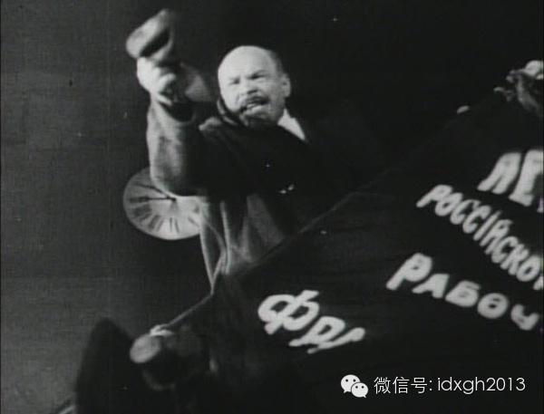

影片《十月》中的列宁

  

该片中，不但有列宁，还有斯大林等布尔什维克领导人的正面形象。在影片技术尚不成熟的20世纪20年代，人们能在荧幕上见到领袖的“真容”，其宣传效果不言自明。不过
，该片原来是1927年十月革命节的献礼片，后因托洛斯基被开除出党，删掉托洛茨基的形象导致该片正式上映晚了半年。

  

1930年代中期，斯大林确立了“社会主义现实主义”的文艺路线，电影也被纳入计划体制之内。1937年和1938年，苏联先后上映了《列宁在十月》《列宁在1918
》两部电影，两片的导演、演员高度重叠，几乎就是“两部片子、一个班子”。

  

事实上，以上都是苏联官方机构莫斯科电影制片厂接受的“重大历史题材影片”的政治任务，斯大林授意苏共中央从全国挑选高水平导演、编剧、演员，并调拨资金和先进设备为
拍摄服务，其中两片中史楚金（饰演列宁的演员）和格洛瓦尼（饰演斯大林的演员）更是由斯大林本人亲自敲定。自这两个人开始，特型演员专职化的惯例便确定下来，饰演过领
袖的演员不得再饰演其他角色。

  

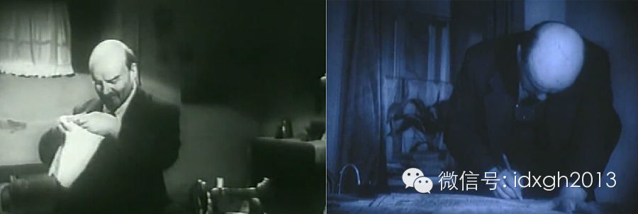

影片《列宁在十月》中的列宁，秃顶发型是其重要标志

  

史楚金堪称特型演员界的良心前辈，他决心把列宁模仿到极致，不光走路、睡觉，连家里聊天也要仿照列宁口吻。列宁的遗孀克鲁普斯卡娅在看过他饰演的影片后赞叹到：“史楚
金演的太像伊里奇（列宁）了！”

  

由于精神高度紧张与长期劳累，史楚金在拍摄完《列宁在1918》后不久便去世，可谓全世界第一个被累死的特型演员。

  

扮演斯大林的特型演员格洛瓦尼在20世纪50年代演了一系列以斯大林为主角的电影，他是唯一一位与所扮演领袖生活在同一个时代的特型演员。斯大林看过格洛瓦尼的样片后
曾说：“真没想到，我这个人还是那么富有魅力。好，很好。”

  

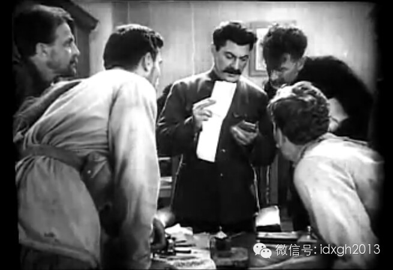

影片《伟大的曙光》中的斯大林

  

在一次为格洛瓦尼举办的庆功宴会上，斯大林当着所有人的面提议：“为人民领袖斯大林，干杯！”周围的大小官员顿时心领神会，纷纷主动上前与特型演员格洛瓦尼干杯。

  

然而格洛瓦尼的风光在1953年斯大林逝世后戛然而止。随着赫鲁晓夫对斯大林的批判，格洛瓦尼的作品被彻底否定，其本人也在三年之后抑郁而终。

  

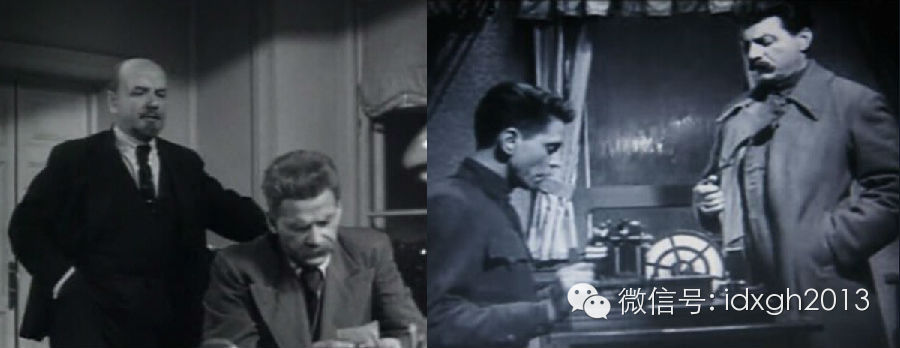

影片《列宁在1918》中的列宁与高尔基、斯大林

  

**【特型的“精耕细作”】**

  

二战后，苏联已不满足只是领袖人物的扮演者像其本人，甚至反面人物和配角同样追求高度相似。由于“社会主义的优越性”，他们很容易动员全国力量找到一整套和历史人物长
得很像的演员。

  

例如在《难忘的一九一九》中，片中时任英国陆军大臣的丘吉尔是以极为夸张的丑化形象出现的，然而，演员在外形上却足以假乱真。同样，1949年上映的《攻克柏林》中，
希特勒的特型演员也让后来者难以望其项背。

  

《难忘的一九一九》中的丘吉尔和《攻克柏林》中的希特勒

  

从影片和特型演员的质量角度来说，1972年拍摄的苏联史诗电影《解放》达到了巅峰。这部以二战为背景的影片，在演员特型化方面不仅覆盖了各国领导人、将军、官员，甚
至连只有很少镜头的施陶芬贝格（刺杀希特勒的德国上校）、斯科尔兹尼（德国党卫军特种部队军官）这样的角色都由专门的特型演员扮演。

  

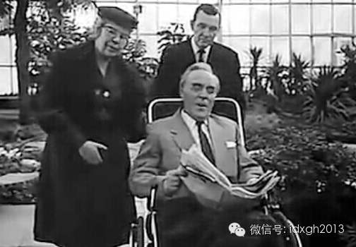

影片《解放》中的罗斯福与夫人埃莉诺

  

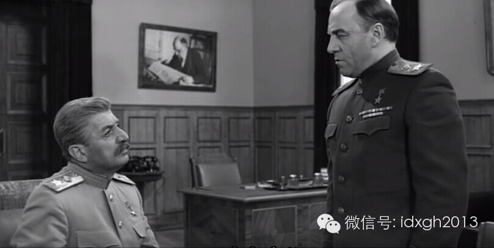

影片《解放》中的斯大林与朱可夫

  

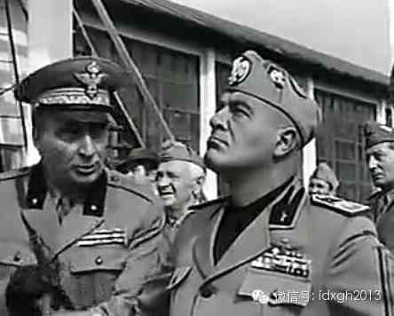

电影《解放》中的墨索里尼（右）和他的女婿齐亚诺

  

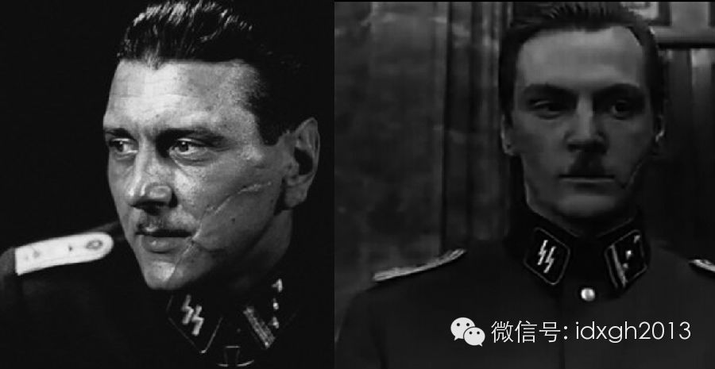

斯科尔兹尼本人与影片《解放》中的斯科尔兹尼，脸上刀疤是其重要标志

  

苏联如此重视特型演员，一方面是其意识形态中的完美主义情结，更重要的是这种“史诗”性质的影片具有如纪录片般的功能，在演员的写实与故事的演绎之间，实现对历史的修
饰与解释，才是特型仿真的意义所在。

  

随着选角的进一步深入和化妆技术的进步，《解放》一片中的斯大林，其与斯大林真人的相似程度甚至远超过1949年苏联宣传片中出现在柏林接受世界各民族代表致敬的斯大
林替身。

  

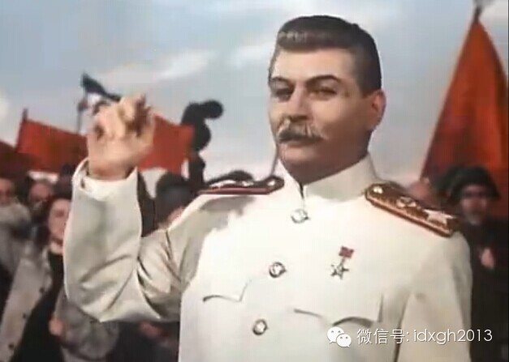

苏联宣传片中接受欧洲各民族代表致敬的“高仿”斯大林  

  

反观欧美其他国家的历史题材影片，由于没有上升到足够政治高度，影片仅是制片人和导演个人的行为，不但缺少全国搜罗特型演员的时间与财力，甚至缺少这种动力，当画面中
出现历史要人时，往往会令看惯了特型演员的社会主义国家观众摇头不已。

  

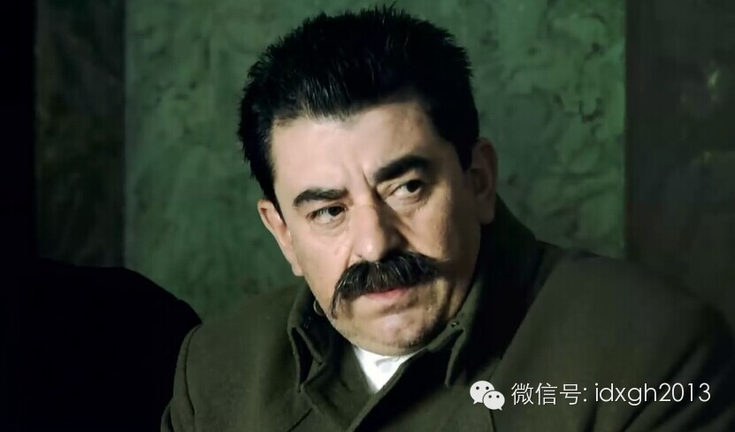

波兰电影《华沙保卫战》中长得有点像萨达姆的斯大林（2012年摄制）

  

虽然西方电影在涉及特定历史题材时，也会尽量让演员与被扮演者外观大略相似，至少是神似，但对外貌相似度基本没有要求，著名电影《国王的演讲》中的丘吉尔形象甚至被有
些观众称为该片“最大败笔”。

  

英国影片《国王的演讲》和《不惧风暴》中的丘吉尔形象

  

社会主义阵营之外的国家从未建立过也不可能出现特型演员的挑选机制。扮演历史名人仅是临时任务而非其终身专职，有时扮演者的票房号召力才是第一考虑。

  

譬如刺杀希特勒的军官施陶芬贝格，好莱坞版由汤姆**克鲁斯扮演，而德国版则由著名影星塞巴斯蒂安**考奇扮演，两者与施陶芬贝格外形相去甚远，尤其是施陶芬贝格的后
人诟病汤姆**克鲁斯身高仅1.73米，与1.85米的施陶芬贝格相去甚远，而苏联电影《解放》中就非常接近本人。

  

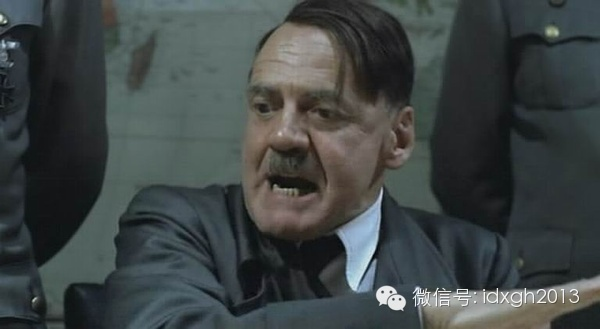

德国电影《帝国的毁灭》中的希特勒（2004年摄制）

  

苏联解体后，由于丧失了举国体制和“主旋律”大片的政治优势，即便是投资高昂的历史大片，在角色选择上也迅速“沦落”到像西方国家一样的水平，甚至由于无所用心，像《
进攻列宁格勒》一片中希特勒的扮演者，多少年轻得有点儿过分。

  

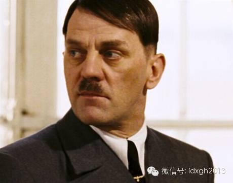

俄罗斯《进攻列宁格勒》中的希特勒（2006年摄制）

  

**【不但外形像，声音也要像】**

  

好在还有中国。在特型演员的选拔培养上，中国是苏联老大哥的高徒。

  

1978年上映的电影《大河奔流》是中共领导人首次亮相荧幕。此前，由于极端的领袖崇拜，模仿领袖被视为政治大忌，毛泽东的形象大多数会用意象化的红太阳、祥云和追光
处理，偶尔会出现背影。

  

中国特型演员队伍的建立要归功于叶剑英。1981年古月首次成功饰演毛泽东后，广电总局对“重大革命历史题材电影创作”的概念做了明确的界定，要求这类作品塑造的人物
应是“担任过或曾经担任过中共中央政治局常委、国家主席、副主席、国务院总理、人大常委会委员长、全国政协主席、中央顾问委员会主任、中华人民共和国元帅”。由此，特
型演员的系列规范被逐步完善。

  

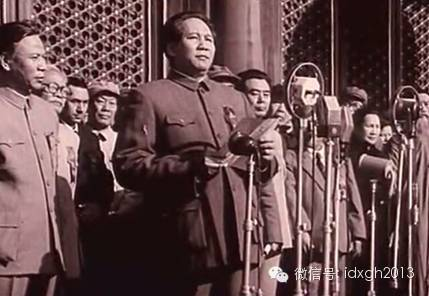

影片《开国大典》中古月扮演的毛泽东

  

自1980年代起，首批特型演员古月（毛泽东扮演者）、王铁成（周恩来扮演者）、孙飞虎（蒋介石扮演者）给观众留下深刻印象，也成为固定符号。他们不仅需要三位以上领
导认可才能正式出演，而且因饰演过“党和国家领导人”，绝不能再参演反面角色，其演艺生涯的角色被固定。

  

首批特型演员在与原型相似上要求极为苛刻。例如，1992年上映的《周恩来》无论是写实程度和开放度至今没有影片能够突破。与苏联电影《解放》一样，影片中不仅毛泽东
、周恩来、陈毅、贺龙等领导人形象与原型极为相似，就连江青、林彪、叶群等“不能见光”的形象也罕见露脸，而且都与原型高度一致。

  

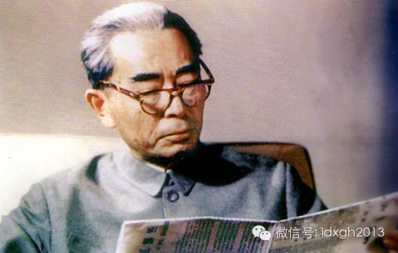

王铁成在电影《周恩来》中的扮相

  
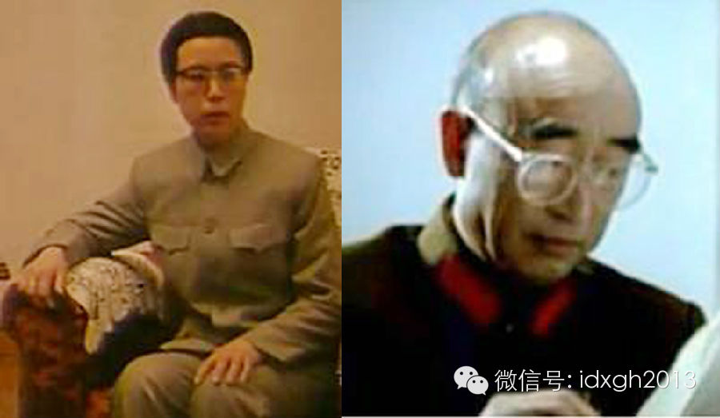

影片《周恩来》中的江青和林彪

  

做到这点当然离不开强大的特型演员选拔机制。据一些演员回忆，20世纪80年代初期，八一电影厂专门成立过一个特型演员选择小组，为特型演员化妆的技术甚至成为评定职
称的重要参考标准。

  

在一些重大历史题材影片中，真名真姓出现的历史人物多达上百位。有些配角如杜鲁门、麦克阿瑟等，为力求相像还要到国外挑选，经过反复造型、试拍后才能出演，这自然是不
计成本“集中办大事”的结果。

  

为使特型演员与领袖更加相像，还让领袖们操起家乡方言。当然，并非所有的领袖都有操方言的待遇，它或许与文革结束前后，领袖们在党内的地位以及大众心中的熟悉程度相关
。

  

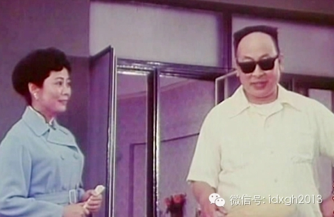

电影《陈毅市长》（1981年摄）

  

譬如刘少奇虽然地位居前，却不像毛泽东、周恩来、朱德一样操方言；而陈毅或许是老帅中最早成为电影主角的缘故——文革刚结束时，老帅中以陈毅为主角的电影最多，他是除
朱德外，唯一操方言的。由于邓小平的地位，虽然他的搭档刘伯承一直说普通话，但邓小平从来都是说四川话的。

  

**【“特型”的转型】**

  

1990年代末至今，唐国强（毛泽东扮演者）、刘劲（周恩来扮演者）、王伍福（朱德扮演者）、卢奇（邓小平扮演者）、傅学诚（刘伯承扮演者）等人作为第二批特型演员，
逐渐包办了几乎所有主旋律影视剧中领袖的角色。

  

这批第二代领袖扮演者让影视中的领袖形象发生了微妙的变化。

  

电视剧《解放》中唐国强与王伍福搭档扮演的毛泽东与朱德

  

最大的变化是对演员特型的追求逐渐淡化，饰演领袖的演员同样可以参演其他角色，演员唐国强便是这一变化的最主要代表。在成功参演《开国领袖毛泽东》后，唐国强不讲方言
，不模仿具体动作，甚至以个人风格的演技改变了主旋律影片以往的“模仿秀”。

  

或许是宣传部门意识到市场与观众的主体地位，《建党伟业》《恰同学少年》中刘烨、谷智鑫等人的加入，更让饰演领袖“明星化”的趋势有所加强。

  

看上去，特型演员就此开始淡出中国历史舞台了。但是，《历史转折中的邓小平》又带来了新转折——当人们纷纷把目光聚焦在华国锋、胡耀邦等人物的“脱敏”上时，“邓大人
”那口不标准四川话的回归，也显得更加耐人寻味了。

  

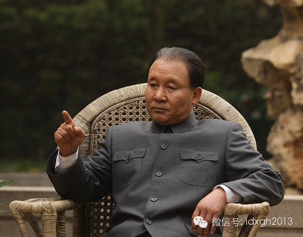

电视剧《历史转折中的邓小平》中马少骅扮演的邓小平

  

> 版权声明：  

> 大象公会所有文章均为原创，版权归大象公会所有。如希望转载，请事前联系我们： bd@idaxiang.org

大象公会：知识、见识、见闻

微信：idxgh2013

微博：@大象公会

投稿：letters@idaxiang.org

商务合作：bd@idaxiang.org

举报

[阅读原文](http://mp.weixin.qq.com/s?__biz=MjM5NzQwNjcyMQ==&mid=204427404&idx=1&sn
=d0de838acfb32a49e04dff5e7af71285&scene=0#rd)

