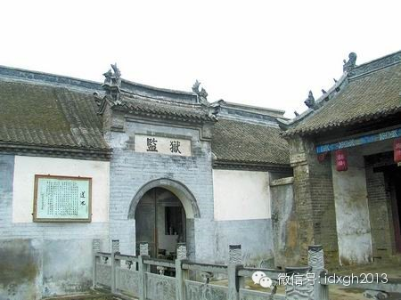
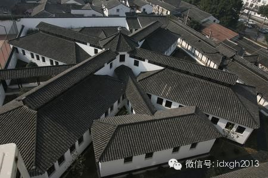
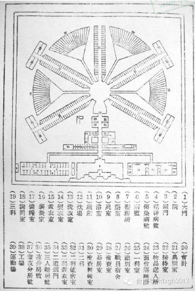
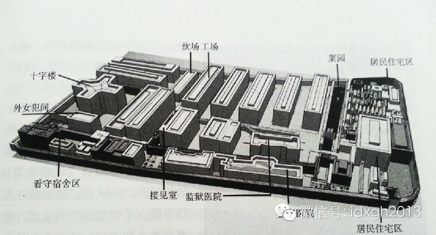
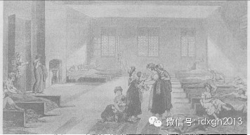
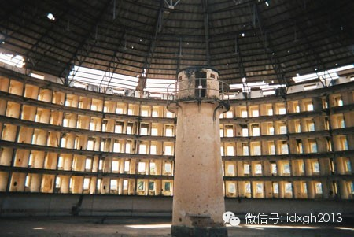
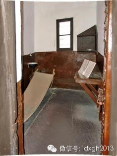
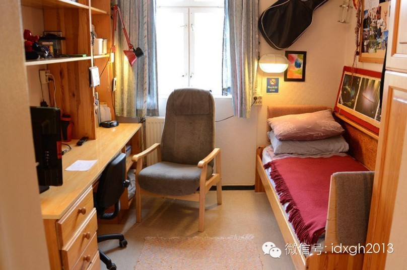
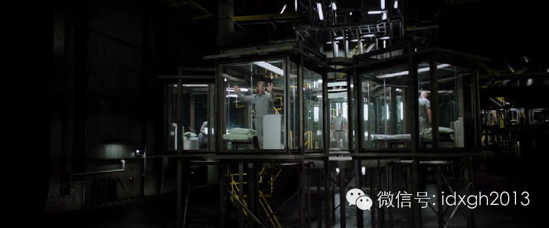

**从酷刑到监禁再到挪威的豪华监狱，体现的是刑法观念和人性的进步，但若砖石纪律的进步始终不会忘记其根本：监控效率。**

  

文/李晓璇

  

2014年5月9日母亲节，重庆永川市监狱邀请15名服刑者的母亲走进高墙帮扶改造服刑者，高潮环节是母亲节为母亲洗脚尽孝，现场泪水狂飙。这种中国式的攻心，效果或
许要好过挪威的豪华监狱。  

****

**【从肉刑到自由刑】**

1876年，清朝代表团来到费城参加世博会，期间随行秘书李圭前往费城监狱参观，李圭惊奇地发现，监狱外部花树重重，林荫蔽道，里面牢房整洁有序，中央暖气、换气装置
一应俱全，这样的配置当时连清廷官员都享受不到。

  

_1860__年清政府代表团曾参观过的奥本州立监狱_

__

李圭将“仁慈”视为美国监狱文明的核心理念，另外，监狱中央用砖块和钢铁建造的哨楼，又让李圭对美国监狱高效的管理称赞不已。

  

当时国内的改良家们早已对清朝的监狱制度怨声载道，呼吁废除苦刑、重刑。其中，用自由刑取代身体刑的呼声最大，也正是这一刑罚观念，才拉开了近代监狱的发展的帷幕。

  

古代监狱多是实施肉刑和苦役之处，并非现在用来限制人身自由的监狱。周以前，“神权治狱”的色彩浓厚，君王和大臣以占卜神意的形式定罪。西周时“明德慎罚”思想出现，
西汉武帝时，儒家又有了“德主刑辅”的观念。汉文帝虽废除肉刑，但苦刑频繁在后世出现。

  

刑法的理念直接影响监狱设计。隋朝时，被誉为“中国监狱之最”的新密县县衙监狱里，围墙、外监、内监、刑房、班房、狱神庙一应俱全。这种四合院式的格局，空间上更强调
的是秩序和威严。

_新密县衙的监狱直到__2003__年还在使用，它应该是我国使用时间最长的监狱_

__

此时监狱中监禁的是待审犯人、家奴、听后处决和流放的犯人。监禁并非法律承认的一种刑罚。不过，为逃避奴役，很多犯人费劲心思越狱。明朝的苏三监狱为了防止越狱，在围
墙上就费了不少心思。围墙被设计成空心墙，中央存放沙子，若有犯人挖掘，沙子就会流出。

  

18世纪，随着人口增长，清政府甚至通过扩大流放制度来缓解牢房压力，而牢狱几乎是拥挤和传染病的代名词。当时牢房外是木栅栏，没窗户，内部常设有地铺、桌子、便桶，
卫生设施极差，随处可见大小便的印迹，清朝《提牢备考》就记载：相传从前，犯多席地而卧，蒸湿最易致病。

  

清末，首轮监狱改革，沈家本被任命为修订法律馆的修律大臣，他极力批评重刑，希望落实儒家的思想。在1904-1910年间，凌迟、戮尸和枭首被一一废止，沈家本甚至
使用“感化”一词来打动犯人。在他动员下，新的刑罚大部分基于监禁或“自由刑”，即死刑、无期徒刑、有期徒刑、拘役、罚金等。

  

改良的第一步，便是改建新式监狱。日本的监狱被视为母本，最典型的当属天津习艺所（也叫小西观监狱）。那里内部设施完善，监房格局呈扇面，各个制高点均有严密的守卫。
为了防止越狱，还采用了高大的双围墙设计，只有正门有出入口。有一次，两个犯人越狱，大量警力搜索未果，第二天却发现他俩被卡在院里城墙上的出水口，无法逃出生天。

  

它最被推崇就是平面是个扇面形——四翼与中央控制塔相连接，并另建有分开的行政楼。这种形式有利通光、通风，并可杜绝各翼间的犯人用窗户秘密联络。北京第一监狱就采用
了扇面形的设计，它从中央增建額外的侧翼房，形成有五、六个监房翼连接着中央控制塔的光线形。

_苏州司前街监狱由著名大师贝聿铭的祖叔贝寿同设计。建筑造型呈米字形，狱道向四面八方伸展，形成许多夹角。楼上平面呈“十”字形放射展开，中为等边八角形看守平台，
看押人员在二楼能将所有关押犯人尽收眼底。_

由于国门渐开，基于人道主义的“卫生观”也进入了设计领域，监狱开始以不受细菌感染作为新的标准。很快，通风系统、管道系统和电线网络，像毛细血管一样贯穿细胞式的狱
房，牢房开始使用个人厕所，以防止臭气从一个监房传到另外一个监房中。

_北洋政府拟定监狱图式通令作为改良监狱的重要内容，由图可见设施十分齐全。图片来自《图说中国监狱建筑》。_

监狱避免建在城市拥挤的场所——倘若犯人听到街道旳喧嚷，就会扰乱自我改造。监狱学家孙雄将“沿着铁路旁边的小城市”视为监狱建筑地的最好场所，既与外界隔离，在交通
上又与整个社会相连。

【从自我教育到批量教育】

民国时，人们相信大部分犯人触犯法律是因为养了恶习或是教育不当：罪犯不是没有道德，而是没有被唤醒。在这种观念的引导下，杂居被视为不好的，而单独监禁则受到了推崇
——当犯人独处一室时，就会安心思考自己的罪恶。

  

但为了感化犯人，一定的劳动量和记分制度可以给予犯人希望，刺激他们道德改造。诸如写信、读书和探视的机会被作为一种奖励在监狱中实行。

  

当时社会学家李建华认为，若借鉴苏联的劳改营（最开始被叫做集中营，它当时并未恶名昭彰的），就能更有效的教育改造——农垦代替了监狱，人们在无监禁的情况下自我改造
。这个想法后来才有机会大规模实施。

  

1949年新政权建立后，大批“反革命”和刑事犯被投入监狱改造，各地监所普遍“人满为患”。监所居住拥挤、大范围的疾病和死亡问题，成为亟待解决的问题。当时沿用下
来的老监狱（如上海提篮桥监狱、南京老虎桥监狱、河北省第一监狱等）大部分监舍破旧不堪、面积狭小、阴暗、潮湿、四壁透风，屋顶漏雨，设施简陋，有的监区没有厕所，犯
人粪便倒在院墙里晒干，室内垃圾遍地，腥味难闻。

  

新建的监狱学习苏联的布局模式。一大批监狱建立交通闭塞、环境恶劣、自然条件差的地区。如河北省第一劳改总队（现为保定监狱）在初建时，看守与犯人都住窝棚。夏不避雨
，冬不避风。冬天迫近，只好先盖“打干垒”。用土砖直接码成墙，里抹一层泥，上盖玉米秸，地上铺柴草。没有高墙、电网和铁门，而是用石灰划警戒线，设置岗哨、壕沟（有
的还在沟里放满水），沟外拉上铁丝网。

_哈尔滨监狱建设时，使用的还是草棚。_

虽然新社会的大量监狱在硬件上极为简陋，但这种动辄关押上万人的监狱却能通过有效的集体教育，最大限度减少逃跑的可能——日复一日高强度集体学习、思想汇报、互相揭发
，形成了一种有效的精神连坐。

  

尤其是“反动分子”，往往会特别乐意接受这种批量思想改造，有些人甚至表现得如痴如醉，以迎合管教干部，心理地位高于他们的刑事犯，会因此表现出一种强烈的不屑。

  

当然，那个时代严格的人口管制，也使得逃犯在高墙之外难寻生路。

  

虽然新中国的监狱在思想教育上卓有成效，但文革后开始认识到了人道主义的不足。1981年，中共第八次全国劳改工作会议（简称“八劳”）上，明确要求改善犯人的生活居
住条件，全国监狱及劳改农场由此掀起了一股建设浪潮。

_著名的上海提篮桥监狱1935年修复后平面图，监狱的西南角是十字形牢房，中央有天井，是圆筒形网状监控区。图片来自《旧监狱寻踪》。_

当时规定，每个罪犯拥有4.66平方米空间。但实际感受远低于此。文革后被关押在提篮桥监狱的朱永嘉在回忆里写道：牢房只有3.3平方米，地板是水泥地，上铺一块木板
，里面关押三个人……狭窄的牢房里没有床，也没有椅子，大家都盘腿坐在地板上，面对着铁门。墙角还要放一个马桶，大小便都在监房内。更夸张的是，到了晚上睡觉，三个人
还得一起翻身。

  

人性化仅是监狱改造的一面，精确的控制同时被写进规定。2002年，由建设部和司法部等颁布的《监狱建设标准》对监狱的硬件有精确的规定：围墙一般应高出地面5.5米
，并达到490毫米厚砖墙，围墙的地基必须坚固，围墙下部必须设档板,且深度不应小于1.5米；岗楼平台应高出围墙1.5米以上，并设于围墙转折点处，视野、射界良好
，无观察死角，岗楼的视野和射界应重叠，间距不应大于150米。

【永无止尽的升级】

身体刑到自由刑的变革虽然最早出现在西方。但中世纪的欧洲，刑罚主要是断头台、绞刑架这类便于公开展示肉体刑的野蛮手段，监狱仅被用来宗教救赎和教化。

_英国最早出现的穷人收容所，后来成为了监狱的前身。_

中世纪中后期，监狱作为惩罚工具的功能才渐渐展现。1166年，英格兰国王亨利二世下令全国兴建监狱，用来关押毛贼和流浪汉。到了都铎王朝时（1485—1603年）
，每个郡都有了自己的监狱。

  

修道院用来关押修道士的“卫星院”成了监狱模板。16世纪，英国的收容和矫正所直接仿照教会监禁修道士的布局改造，牢房内部和教堂的忏悔屋很像，配有单独的窗户和门，
方便狱卒从外向内查看。

  

这种变化大约是因为，公开行刑时，围观群众会嘲笑统治者，罪犯被当成英雄。这种扭转在十八世纪变得日益明显，由于阶级矛盾尖锐，观众认为刑罚不公正，行刑的集会常常混
乱不堪，有时甚至成了民众起义的导火线。

  

1777 年，在英国慈善家约翰**霍华德呼吁下，英国议会通过了《监狱法》。这部里程碑式的法律将拘禁列为和死刑、流放一样的惩罚手段——“关监狱”不再是短暂拘留
，而成了制裁犯罪的标准方式。

  

为防范逃跑，1773年使用的根特监狱，被设计成从中心院子向外辐射的布局。它的单元牢房布局方式，具有良好的安保效果——限制了犯人之间相互接触。而整个建筑群从中
心朝各个方向铺开，中心是一座瞭望塔，正对着叠层排列的单人牢房。对监狱管理者而言，最大好处是应用了逆光效果，使瞭望塔上的监视者能纵观全局，而被监视者不仅处于彻
底被观看状态，同时还无法看到监视者。

_位于古巴的模范监狱内景，依圆形监狱理论建造。该理论来自功利主义哲学家边沁。_

这种改良同样扩散到了美国，1790 年，宾夕法尼亚州的胡桃街监狱对根特式进行了改造：采用了中间走廊、两侧细胞式监房的结构，还在原有监所前加建了一个折线形建筑
，构成一个完整的围合体。它的落成标志着世界上第一所现代监狱诞生。

  

但单独监禁实际上同样残酷：囚犯独自被关在极为狭窄的空间中，只有圣经没有床。他们长时间与世隔离，缺少环境刺激，以致常常无法区分幻觉和现实，出现了很多精神病患者
。

  

_19__世纪英国亨廷顿牢房只有一张吊床和木架，窗户玻璃为了隔音被设计的很厚，窗外仍然是高墙。_

自杀成了监狱改良后的新问题。20世纪的英国监狱，自杀率飙升，在芬兰，监狱中47%的死亡都是自杀。建造者们发现，大量自杀方式是上吊，器械大多是用来牢房墙上、天
花板上的通风设备和遮盖电灯。美国因而规定：牢房内栅格状物的孔径应小于0.46厘米，以限制布条穿过其中并被打结。

  

由于经费有限，当时的牢房经常被设计的太窄或太低，许多犯人甚至无法翻身或者直立。在人道主义的压力下，囚犯的舒适度得到关注，英国在19世纪将牢房面积的标准设置在
6××8英尺左右——能够富余的摆张铺位。

【监控效率永远是核心】

二战后，北欧成为富裕且有保障的社会，以人为本的观念很快体现在监狱上。在挪威，监狱系统和整个国家一样享受着高额福利，其中，哈尔登监狱被认为是世界上最人道的监狱
：每间牢房不仅有平面电视、冰箱，还有直立式窗户，让阳光射进房内，甚至连家具都是设计师出品。

_挪威的哈尔登监狱的监舍。_

  

就算被誉为最人性的监狱，也不会因“涉嫌偷窥了嫌犯的隐私”而取消摄像。2011年奥斯陆枪击案行凶者安德斯•布雷维克的在监狱健身阅读的同时屋中也被安置了三个摄像
头，其他监舍也同样如此。

  

在欧洲，从上世纪60年代开始，探头就已被应用。而在中国尽管智能化系统（诸如视频监控系统，红外报警系统等）还未被写进《监狱建设标准》中，但电子设备早已在监狱中
被大量应用。

  

1990年代末，中国监狱也安装了探头，在部分省份，探头的终端连通至监狱管理局，局里可以随时调看各监狱的情况。倘若服刑者有违规行为没被制止，监视者就会被上级通
报批评。

_ _

_电影《金蝉脱壳》中的监狱不仅被设计成全透明的，还有全方位的视频监控。_

摄像头的出现并未撼动老式监狱建筑格局的核心地位。开办于2012年的私营监狱泰姆塞得，主体侧翼亦采用从中心辐射开去的布局结构，呈星形，楼内的牢房围绕中庭安排—
—典型的维多利亚时期的设计。

  

《经济学人》杂志报道，维多利亚时期的监狱正在复兴，以弥补新式监狱的设计缺陷。

  

建于上世纪六七十年代的新式监狱天花板低矮，犯人能刮花摄像头的镜头甚至拽下摄像头的金属外壳当作武器。狭窄的走廊有着危险的摄像盲点。在莱斯利监狱（开办于1964
年）的一次暴乱中，电梯中途停止，人们被困在旋转楼梯和楼梯平台之间。

  

在建筑学家们看来，老式监狱也更容易管理，更好的视线意味着侧翼不需要那么多的工作人员，使监狱运营经费更低廉。新式监狱的缺点则在于更厚实的绝缘材料使得囚犯闷热难
耐，而公共餐厅意味着需要大量的工作人员控制局面。

  

对于现代建筑行业来说，复古的设计在人道主义观念普及的今天听上去不可思议。但监狱设计的最核心理念——监控效率，恒久未变。

  

[大象公会所有文章均为原创，版权归大象公会所有。如希望转载，请事前联系我们：bd@idaxiang.org ]

———————————————  

**大象公会订阅号的自定义菜单上线了，左边是官网文章精选，右边是大象公会官方微社区，点击进入来吐槽发帖吧！**

**  
**

  

[阅读原文](http://mp.weixin.qq.com/s?__biz=MjM5NzQwNjcyMQ==&mid=202119777&idx=1&sn
=6543b2a228f346234d8e830ac6190059&scene=1#rd)

