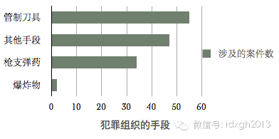
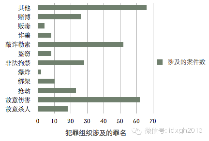
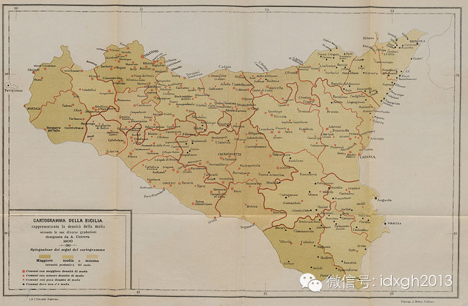
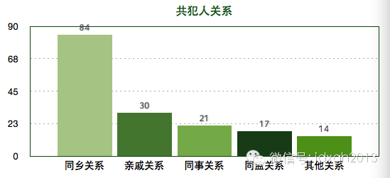
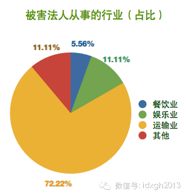
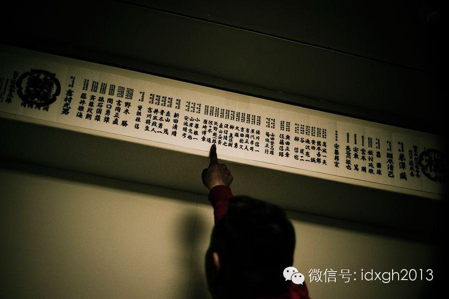

**黑社会组织为什么通常会在特定行业滋生，中国的黑社会性质组织在经营上有何中国特色？黑社会组织用什么方式解决自行火并和权力交接？**

**  **

文/吴致远

  

凡是痴迷于暴力的黑社会都是愚蠢的黑社会。

  

前公安部新闻发言人武和平先生认为，“黑社会”有三个发展阶段：初级阶段是靠暴力非法获得利益的原始犯罪团伙，容易被发现消灭；中级阶段有自己的经济企业，组织紧密，
手段多元，对利益相关的政府部门进行隐形控制。其头目常以企业家、慈善家身份出现；高级阶段是发展出独立于官方的社会秩序，具有政治游戏规则，推出自己的政治代理人，
形成影子政府，维护自己的利益。

  

一个被广泛认可的结论是中国现在尚未出现黑社会，只有大大小小的黑社会性质组织。武汉大学刑事法研究中心有组织犯罪课题组的实证调查也证明了这一判断：该调查统计湖南
、湖北、河南三省近年76个案例，发现从组织方式、获利方式、相互关系、武装化程度上看，与国际有组织犯罪集团相差甚远。

  

  

_数据来源：武汉大学该课题研究的统计结果_

_  
_

_ _

_数据来源：武汉大学该课题研究的统计结果_

  

而刘汉团伙标志着中国黑社会性质组织发展到中级阶段，其近20年的经营刷新了同类组织的存活纪录。从官方历年公布的资料看，中国涉黑组织存续时间多不超过15年，这使
其难于发展到较高阶段，而较大涉黑团伙多有地方保护伞，甚至一些政府公务员和警察甚至自行组织，充任老大。但他们仍难长期存活，或许与中国定期换届导致地方权力重组有
关。

  

刘汉涉黑案告破后，舆论出现一个有趣对比：一方面是官方大力宣扬“广大群众拍手称快、放鞭炮庆祝”，另一方面，大众流行文化中黑社会题材却经久不衰，描写东北黑社会的
《黑道风云20年》犹在火爆，另一部黑老大题材小说《坏蛋是怎样炼成的》改编成的电视剧《谢文东》即将上映。

  

崇黑心理或许是中国过去将黑社会视为民间反抗精神的自然延伸——杀人越货的江洋大盗往往被视为“好汉”，被一厢情愿赋予“替天行道、劫富济贫”等道德属性。

  

【遍及中国】

  

黑社会被认为是个现代性现象。无论全世界范围内都可看到黑社会团伙与现代化转型的关联。19
世纪初期，意大利城市化迅速拓展，著名的黑社会组织黑手党诞生；上世纪60
年代中期，台湾由传统经济转向加工出口型，单一、封闭的社会转向多元、开放，十大黑社会犯罪组织中有4 个在此时期形成。

  

_1900年西西里岛有黑手党活动的城镇被标记成红点，多集中在西部。_

  

上述武汉大学的调查显示，自上世纪90年代中期以来，犯罪组织数量激增，而2005年是近年有组织犯罪发展的高峰时期，当年成立的犯罪组织是2004年的两倍，是20
03年的近3倍。

  

从官方披露的材料来看，黑社会性质犯罪组织已遍及中国绝大多数城乡。较活跃和猖獗的主要有两类地区：一是历史上帮会组织盛行的地区，如湖南、四川、贵州、河南等省份。
二是东南沿海经济发达地区，如上海、福建、广东、海南等省市。

  

黑社会组织成员多有相似的出身，这是其天然的情感纽带，最典型的是意大利黑手党（Mafia），最早是由带有阿拉伯血统的西西里人组成。又如美国五大黑帮家族，其创始
人都来自意大利，而台湾的竹联帮、四海帮、福州帮、西北帮等最大的帮派，皆为外省籍子弟，很多人出身眷村，较之本省籍黑帮组织，他们规模大，组织严密。

  

中国内地情形与之相似，大城市犯罪团伙多来自外地同一地域，而同类组织中，由厂矿子弟组成的团伙又较一般同乡构成的团伙组织更紧密。

  

_数据来自：上海社科院《上海地区有组织犯罪调查报告》___

  

有组织犯罪团伙的“生意”有极大共性。受政府管制但又无法被消灭的行业是全世界犯罪组织最喜欢的金矿，全世界犯罪组织都喜欢涉足黄赌毒就是这个原因。而上世界初美国禁
酒运动，造就了一个巨大的地下私酒业，现代意义上的美国黑社会由此发端。一般来说，管制越少的社会，适合黑社会“专营”的领域越狭窄。

  

从经营行业看，中国犯罪组织有强烈的中国特色，除高利贷、游戏厅、歌舞厅、洗浴中心等娱乐场所外，中国犯罪组织最喜欢插手主要是劳动密集型的民生产业、矿产能源、运输
业、建筑建材和房地产业等新兴领域。近十年来，中国破获的涉黑组织全部集中在这些领域。

  

这些行业特征是进入门槛低，但利润和回报很高。黑社会性质组织成员大都素质不高，此类行业便于他们以暴力方式垄断经营。比如，目前全国各地的砂石料场大都为黑社会性质
组织所控制。只要他们能保证价格平稳、供应到位，不影响各项重点工程的建设，地方政府也基本不予干涉。

  

_ _

_数据来自：上海社科院《上海地区有组织犯罪调查报告》_

  

上世纪80、90年代矿产资源允许私人经营后，各矿区均出现大规模的黑恶势力火并，政府难以整治，导致矿场主几乎都有私人武装。早年间，著名的亚洲第一金矿玲珑金矿被
地方黑社会团伙盗挖盗采，一度举步维艰，迫使招远市政府组织800人的防暴队弹压。

  

再以“带车”为例，运输业超载超限对道路、桥梁及交通安全危害极大，但因为中国特色，不超载超限就无法保本。在此前提下，交管和稽查人员要将权力变现，除罚款外，就需
要以黑恶势力为中介，向过路车辆收取保护费，然后分成。公安部门打击此类黑恶势力时，因牵扯行政人员和地方利益，往往无力深入。

  

另外，1990年代房地产业初兴，为推进城市化，各地纷纷大规模拆迁，引发了激烈的矛盾冲突。为规避风险和加快进度，地方政府将拆迁工作交给涉黑组织去做，引发暴力冲
突之后，再通过处理涉案组织成员来平息事态。

  

著名的“东北王”宋永佳（乔四）即通过承揽市政拆迁工程起家。他们利用暴力手段和对居民的心理威慑，帮助处理拆迁问题。沈阳刘涌团伙也曾多次参与暴力拆建。

  

上世纪90年代，处于混乱无序状态的还有期货市场。中国证券业早期普遍存在内幕交易、操纵股价、不正当竞争。1996年，刘汉在成都炒钢材期货，导致北京富豪袁宝璟损
失9000万，刘汉借此完成资本积累。而袁宝璟雇凶刺杀刘汉未果，将枪手汪兴灭口，2006年被执行死刑。

  

中国涉黑团伙业务经营范围奇广，很大程度上是因为中国是政府主导型社会，社会资源和行业准入权都掌控在政府官员手里。自上而下的寻租行为最易瞄准的是通过暴力完成资本
积累的黑社会组织。在这方面与中国较为相似的是俄罗斯。

  

【以和为贵】

  

黑社会被认为是全世界面临的共同问题。但各国情形却有很大区别，有些国家和社会不但黑帮肆虐，甚至向外输出黑社会组织，典型如意大利和华人社会，而有些国家却只有街头
暴力团伙，却始终无法诞生真正意义上的黑社会，典型如德国、瑞典等西北欧国家，这些年才开始活跃的黑帮势力多为外籍移民。

  

一般认为，始终没有成型黑社会组织的国家，是因为其政府廉洁和高效的治理能力，或者因为特殊制度，造就严密的社会控制能力以及可以动用超常规手段打击黑社会。前者，各
国政府廉洁排行明显可以看出两者之间高度的相关性，而后者，则有典型的计划经济时代的社会主义国家，以及墨索里尼治理意大利黑手党的案例。

  

但是，日本、美国的案例则证明，廉洁的政府和卓越的社会治理能力，并不能完全杜绝黑社会组织的存在，日本的山口组等黑社会，其规模之大、组织之严举世闻名。

  

日美与西北欧国家的最大差别，或许在于，后者是工会力量极为强大的社会，强大且无所不在的工会组织以及各种民间同业协会，不但遏制住了黑社会组织经营的空间，而且构成
了政府之外的社会秩序力量。譬如在美国，黑社会完全无法渗透被纳入工会组织范畴的行业，黑社会是无法渗透的。

  

_日本帮派等级严格，成熟，图中一名成员指出其在帮派中的排行。_

  

在中国，由于商贩的流动性和缺少自我组织能力，很容易成为犯罪团伙的敲诈对象。不但流动商贩易被敲诈，自由市场中海鲜等利润较高的固定摊位也往往难于避免被敲诈命运。

  

发展到较高阶段的黑社会组织，虽然会继续依赖暴力维持其经营地位，但为了获得更多阳光下的生存空间，多半会大幅减少其暴力行为。譬如刘汉集团制造的人命案多集中在20
00年以前，而美国黑帮家族动用速射武器甚至炸弹打打杀杀，也是其第一代家长早期打江山的时代。

  

由于存续时间较长，国外黑社会组织与仍处于初级阶段的中国同行相比，往往更倾向于各自分工、互相协作，形成完整的地下经济链条，而不是互相火并。为避免不同势力争夺地
盘时无畏的自相残杀，最终会在各组织之上形成更高一级的联合协调机制，因国情和文化不同而各成特色。

  

东亚的日本、台湾、香港更像是间接的民主选举制，而欧美以意大利裔的黑帮，因为其以家族为组织纽带，故其更像寡头共治的政治协商制。

  

其实，黑社会“以和为贵”发展到最高级，出现选举并非现代现象，中国明清时代的帮会组织，历时几代后，都演进出最高掌门由某种选举方式产生的制度，这大约是东亚地区最
早的民主选举吧。

  

[大象公会所有文章均为原创，版权归大象公会所有。如希望转载，请事前联系我们：bd@idaxiang.org ]

[阅读原文](http://mp.weixin.qq.com/s?__biz=MjM5NzQwNjcyMQ==&mid=201221137&idx=1&sn
=899bd09f2b57f3cba71bca52a80e6a2c&scene=1#rd)

