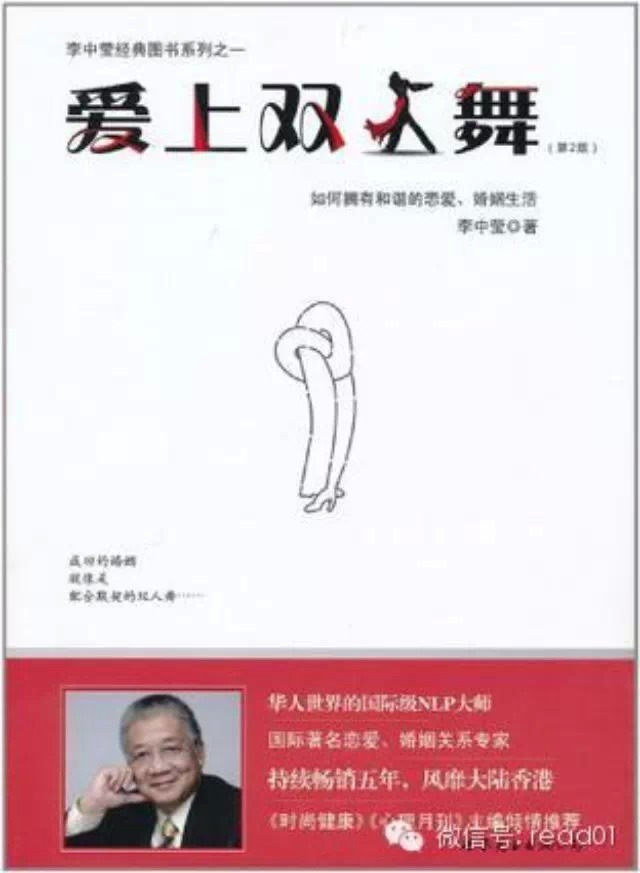

##  100天行动之家庭沟通：因为有爱，每句话都要好好说

_2015-01-26_ warfalcon

收到一些读者询问家庭沟通的问题，有的是学生放假回家，很容易就跟家人吵起来，有的是夫妻之间，沟通出现问题。

前段时间看到一组台湾远传电信的公益广告，以广告公司试镜的名义，将镜头对准六组家庭，进行了一次真实的测试。对片中的一段对话印象深刻：**家人，是我们最亲的人，
也是我们最熟悉的陌生人。我们可以轻易地对别人说我爱你，却很难开口对家人说爱；我们面对别人时拥有无限的忍耐力，对家人却无缘无故地发睥气。**

很多时候，我们在跟家人沟通时，无意就会伤害到家人，而自己完全不知道，就像片中那个女孩说的：“**站在自己的角度想问题，没有办法顾到别人的感受，所以当你真的看
到的时候，你会很难过，因为你不想伤害她**。”

特意找了一本书，专门讲家庭沟通的--
李中莹的《爱上双人舞》，从中摘录一段，**千万要注意，****没有诚意光用技巧是不会有效果的，这只会使对方感到你在敷衍他。**

有家庭沟通问题，建议从现在开始一个100天家庭沟通行动：**不对家人发脾气、不嘲笑、不抱怨、不指责、不喋喋不休、不讨价还价**，如果没办法坚持100天，那就
是坚持过完寒假、过完年，一定要多赞美对方。输入：【赞美】

夫妻的沟通问题还可以输入：【**100天爱情行动**】

远传电信的广告可以在视频网站上搜索：因为有爱，每句话都要好好说

推荐花上几分钟去看一下，希望这篇文章能对你的家庭沟通有帮助。

## 正文

作者：李中莹

出处：《爱上双人舞》

### (1)要谈就要有诚意地谈

每个人都想保持一个权利:无论面对何种情况，只要当时不想沟通，就有不沟通的权利。这个权利人人都想有，包括你自己。所以如果在那一刻你不想与对方沟通，你可以行使这
个权利，但是，需要懂得采用适当的表达方式。你要明白夫妻必须维持沟通，现在不谈，应该给对方什么时候谈的承诺，而且是要明确的承诺，而不是“等我心情好了再说吧”这
样的承诺。

你可以说:“我现在有点心烦，不想用这个态度跟你谈话，所以我想明天早上吃早点的时候才谈论这件事，可以吗?”带着烦躁与愤怒去谈任何事，很容易导致争吵冲突，使事情
更难处理。带着焦虑担忧去谈任何事，会使配偶也有这个情绪，但是这样共同被一件事困扰，却是两人“甘苦与共”的表现，配偶会愿意接受的。而且，这远远比让配偶看到对方
忧愁但不知何事，因而要强颜欢笑、不断猜疑担心来得好。

### (2)支持配偶，就算他/她做得并不完美。

在众人面前，当配偶说错了，不要马_卜更正他/她。应该等到回到家里，只有两个人，并且两人都在正面的情绪状态中时，才告诉他/她。在恋爱和结婚阶段，两人都会保证无
论什么事，都支持对方，这些情况正是显示这个承诺的机会。在绝大部分这样的情况里，都不会是些什么大不了的事，所以，让配偶的错误没有得到更正，也不会有什么大问题出
现。

反之，让配偶感觉到你的支持，他/她会很开心，这是不容易找到的“事小效果大”便能提升两人关系的机会。更进一步，当配偶在某些情况里做一些决定或者行为，只要不是会
引起严重后果(例如犯法)或者代价太高的(例如大量金钱的损失)，支持他/她。在每天的生活里，很多事其实有很多不同的选择，而相差不会很大，例如走在马路的这边或那
边、他/她想买一件喜欢的物品等。当两人在一起时若你总能支持他/她的选择，他/她也会以支持你作为回报。

有时，他/她没能做出最好的选择，你可以告诉他/她怎样才会更好。如果他/她不接受，不要坚持你的看法，全力帮助他/她实行他/她的决定。当结果证明你是对的，他/她
便心服口服，同时感受到你对他/她的支持了。

### (3)避免批评抱怨对方。

没有人喜欢听到批评抱怨的话。与一个总是抱怨的人生活在一起是一件极不愉快的事，没有人能够这样过一生的。这就是很多感情关系变坏的起点，而总是批评抱怨的人会活得很
辛苦，没有快乐，同时没有什么朋友(除了一些也是喜欢批评抱怨的人)。

感情伴侣如果还没有离开，肯定就是“貌合神离”，人仍在身边，而心则常开小差。这份关系只可以用虚伪、诺言和敷衍维持下去。经常批评抱怨的人是没有充分成长的小孩，他
们希望世界的人、事、物改变(批评)，不满意这些人、事、物没有如他们愿地改变(抱怨)。小时候有父母去满足孩子这些希望，现在则要求感情伴倡去继续这份不可能成功的
工作。因为不可能成功，所以感情伴侣感到很辛苦。充分成长的人用“接受”的态度去面对所有的人、事、物，然后思考怎样做才能使情况更有利于自己的发展。

这是自己改变，而不是希望世界改变。有这个习惯的人，我建议用以下的方式去改善：

  * 给自己每人只能批评抱怨一次的配额。当配额用完了、当天便不能再说批评抱怨的话。

  * 每当对什么事不满意的时候，停下来想出三个方法去处理然后选择你最愿意、效果可能最好的一个去付诸实行。

  * 把批评抱怨的话写在一张纸上，然后用另一张纸，针对每一句的批评抱怨，写下一句开解的话。

批评抱怨总是把焦点放在自己没有的东西上，开解的话就是去注意自己拥有的东西，和可以有的不同选择。

### (4)避免嘲笑伴侣。

感情关系中的两个人，必须有平等的地位才能发展出快乐满足的感觉。嘲笑对方是最直接的方式说:“我比你好!”对方会产生被压低了，失去平等地位的感觉，是十分难以接受
的。被伴侣嘲笑的人，心中产生愤怒，和报复的动力。他/她会把握第一个出现的机会去扳回平手。

这时，这一边便也感到愤怒，和再报复的动力，找出其他嘲笑对方的机会便放肆地嘲笑对方。这样，两人的关系出现了延续不断的斗争，两人的关系便会因此而紧张、疏远了。很
多嘲笑的动机本来只是开玩笑。我建议是用说说笑话去代替这样的开玩笑，因为言者无心、听者有意，往往说的人不知道听的人对那些话的敏感程度。要特别避免的是关于一个人
的生理特征或个人资料的玩笑。

### (5)避免喋喋不休。

说话的效果不是来自说了多少个字或者重复了多少遍。很多人看见说了没有效果便再说，就好像自动售卖机吞噬了你的硬币却没有吐出饮品，你再放硬币进去不是很笨吗?喋喋不
休不会增加效果，而只会减少和谐，破坏感情。NLP有一句关于沟通的至理名言:沟通的效果决定于对方的回应。你说了而对方没有给你预期的回应，便是没有效果。重复没有
效果的方法只会继续没有效果，而其他的问题却产生出来。

所以，应该做的是改变方法。沟通的效果由对方决定，但是由你控制，因为你可以改变沟通方法。有些人就是有喋喋不休的习惯。他们多数是惯用内听觉的人(这并不意味着听觉
型的人就一定是喋喋不休，但是听觉型喜欢说话，是不变的事实)。一个这样的人有视觉型或感觉型的伴侣，便特别容易使关系紧张，出现争吵。有喋喋不休习惯的人需要决定:
维持这个习惯和与伴侣维持和谐关系之间哪样更重要。

想改变这个习惯，可以同样的话只说一次。若对方听不明白，可以问问他/她。每当自己不自觉地喋喋不休了，叫伴侣提醒你。要说的事，预先想想如何只用三句话说出来。三句
当然不能包括所有的资料，但应该包括最重要的资料。三句之后，若对方感到兴趣，自然会请你说多一些，这时你才说出其他资料。若三句后对方不感兴趣，你便应该停止。经常
提醒自己多看、多听、少说。这能使一个人观察更多、掌握更多、更受人欢迎。

### (6)避免盘根问底。

伴侣不愿说的，不要逼他/她说，无论涉及的是什么事，你都要尊重对方的空间，而没有控制对方的权利。细心想想，你会明白:你有权利离开他/她，但是你没有权利要他/她
说出来!若你用什么事相威胁，逼对方一定要说什么出来，这份感情关系的基石出便已经碎裂了。对伴侣或任何人的事情，很多人会以“好奇”为借口去盘根问底。所有的“好奇
”其实只不过是想控制对方的表现、原因是自已的安个感不足。特别是当对方做了一些自己不认同甚至不允许的事情时，自己便得到一个比对方优越的地位:他/她做错了，他/
她不如我好。

这样，便有了“教”对方，或者“原谅”对方的机会。对伴侣不信任，事事要坦白交待，报告清楚，那是不给子伴侣平等地位的表现。如果伴侣需要事事向你交待，必然会使你的
身份高于他/她。不要以为你同样愿意对伴侣这样地交待便是公平、平等，这只不过带给你们更加复杂和无法处理的双重身份:一方血是你高他/她低，同时又是你低他/她高。
当你要伴倡坦白交待时，伴侣若持着他/她高于你的身份，两人便争吵了。事实上，这就是最常出现的情况。若伴侣想做你不允许的事，你永远无法控制他/她不做出来。所谓道
高一尺，魔高一丈，他/她总会找到机会去做。两人的相处变成猫鼠游戏:每天不断地一个躲、一个捉，感情关系已经荡然无存了。必然是两人之间出了问题，伴侣才会目险想去
做那些你不允许的事。还是从根源着手，放过表面性的问题吧。

### (7)避免讨价还价。

感情关系不是贸易买卖，如果用贸易买卖的态度去处理两人之间的争执，将会难以成功，而必然造成对感情关系的创伤。最大的问题是:物质世界里什么东西都可以给予一个金钱
上的定价，但爱和爱情是无法以金钱衡量的。我曾听过有这样的事:太太逼丈夫给她买一件名贵的东西，在未买回来之前，不跟他上床!这个太太愚蠢之极，丈夫在这件事情之前
也许对太太的爱没有金钱的标准，在这事之后，他有了!

爱能推动一个人去做很多的事，甚至为伴侣而受伤、死亡。爱给一个人的唯一权利就是为对方做些事，而且真心爱着对方的人都很愿意为对方做事，并且当对方接受白己为他/她
所做的事时，自己会很开心、很感满足。更因为这样，当对方有需要而向自己开口要求时，自己会很乐意得到这次为对方做事的机会。从这点来看，两人关系里没有给“讨价还价
”存在的空间。事情可以有该不该做的讨论，但是讨价还价是另一回事:事情应该做，但是因为给我的报酬不够，所以我要求更多的回报。这样便给对方一个讯户息:我对你的爱
已经不足以支持我去为你做这件事了。

## 100天行动读者反馈

**@一只草莓味蘑菇**

下一个百天行动就从好好说话开始，不知道您能不能看到分享，一个台湾通信公司广告，对五个家庭进行测试，看不好好讲话对家人的伤害，看了之后很内疚，从今天开始一定要
改。

**@总之。**

从上大学开始，坚持每天与妈妈通电话。大一大二是在每天中午下课，随说是妈妈打过来，但也总是做好准备空出这一段时间。隔一段时间周末也会和爸爸妈妈一起通电话。本身
是不太会聊天和表达的人，所以会试着每天先准备好一些话题当作一次简短的交流。让父母安心真的很重要，而且抛开代沟等等问题，爸爸妈妈总能在我遇到困难的时候给我最真
诚的建议。大三交换来英国，这半年也坚持与爸爸妈妈视频。为了找一个合适的时间，放假的时候晚睡等等妈妈起床，上课的时候早起。这算是大学以来坚持的最好也最久的事情
。

今天看我是歌手古巨基唱给爸爸妈妈的歌，觉得自己真的养成了一个很好的习惯。从以前被动的接受关系变成主动去联系，说出心里话去交谈。绝对不想因为时间和距离的隔膜，
再回到家里变成“亲密而得体的客人”。身在远方不能时时陪伴在家人、爱人身边的人，只要够坚定，距离的障碍虽不能完全被消除，但是每天即使只抽出十分钟，也是与之相伴
的回忆。

  

阅读

__ 举报

[阅读原文](http://mp.weixin.qq.com/s?__biz=MjM5NjA3OTM0MA==&mid=204879214&idx=1&sn
=982105d3cad1762709984b38dd2db1e2&scene=1#rd)

