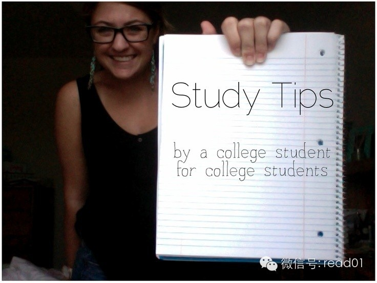

  

在豆瓣上看到有人总结的100多条的学习小技巧，这种学习技巧Blog（www.read.org.cn）上更多一些，积累个300、400条问题不大。有些技巧，看
起来很简单，但想理解和掌握要花上很长时间。

**对这类文章应该如何吸收和整理？**

**第一步分类。**把不同的技巧，按用处或类型，从新整理一下。放上关键字，收藏起来。  
**第二步删除。**对你帮忙不大或暂时用不了的技巧。  
**第三步挑出少数几条实践。** 选择一些能解决你当前问题的技巧，从现在开始尝试。可以列个清单。  
**第四步记录。**每尝试完一条之后，记录一下心得，想想是否有可以改变的地方或者直接放弃。  
**第五步总结。**积累5-10条实用小技巧之后，写篇文章总结一下，找机会分享出来，你会发现在写的时间，会考虑一些以前想不到的问题，分享也能让你印象更深刻。

试试这几个步骤，看看你能找出多少条对你有用的学习方法。

## 正文

出处：豆瓣  
作者：未知

达尔文说过：一切知识中最有价值的是关于学习方法的知识。

  1. 读得慢，长期下来读得少

  2. 阅读中有30%～50%都是没用的

  3. 敲打节拍来避免大脑阅读出声，以刺激皮层，但不可依赖过多

  4. 情绪是可以操纵的，尽量往好的方向引导，行为才会改变

  5. 预习学会20%，上课学会50%，回顾学会100%，复习时应无新知识

  6. 写下问题，越清楚，得到的答案也就越透彻

  7. 先背佐证或例子，有些抽象概念是要一定积累才能理解的

  8. 跟同伴一起学，讨论能减少偏差

  9. 给大脑0.5～9小时来处理信息，再回顾才会有新收获，不要在难点上停留

  10. 锻炼左手

  11. 随身携带相机或小本子，记录灵感，如音乐写作或绘画

  12. 把大事化为小步骤写在to-do list上，会更有成就感，效率也更高

  13. 长时间学习后立即睡觉，大脑才能在睡眠中处理和加深知识

  14. 倾听微弱的声音能提高注意力，每天练习3分钟

  15. 新词用了7次才真正算自己的

  16. 学会寻找情绪高昂的物质来驱动自己

  17. 利用空闲的等待时间来做事，随身携带书籍，手工或电话单

  18. 每天做件不愿做的事

  19. 多敲打手指，刺激神经，延缓大脑衰老

  20. 自己跟自己对话

  21. 要学一本书，20%是书的观点，能延伸80%的知识是真正的学习

  22. 提前粗略自学2年后的知识，能让现在的学习轻松不少

  23. 灵感往往不是新的，它只是几个旧点子的合成品

  24. 紧张时肾会积尿，身体供水不足会导致大脑发挥失常，考前试着喝点蔬菜汁或水果汁

  25. 学会腹式呼吸

  26. 养成记关键词的习惯

  27. 多总结

  28. 做思维导图/心智图

  29. 从整体上记忆和理解

  30. 大脑有忘记痛苦的特征，学习时要保持良好心态

  31. 多说话，并提高话语的质量

  32. 带病用脑会对大脑造成损害

  33. 小学课文里列宁和椅子的故事，暗示的正是列宁会速读，而且记忆力惊人

  34. 利用吸引力法则  
a）你生活中所发生的所有事情，都是你自己吸引来的  
b）你会成为你心里想的最多的那种人，你也会拥有你心里想的最多的东西。相似的吸引相似的  
c）你在心中见到的，将会成为你手中得到的

  35. 学会速读：阅读就像骑自行车，骑到一定速度才能骑得好，骑得顺畅

  36. 高速大量的输送知识，俗称吞鲸式读书法，长时间集中注意力会让大脑更灵活

  37. 众多技巧之一，去“做”，绝不要期待任何 “结果”

  38. 一时一事，花5分钟也好10小时也好，一口气做完

  39. 优柔寡断是严重的浪费时间，不要超过60秒

  40. 把工作分成小部分做，会有分心的危险

  41. 工作越努力，工作的能力就越强，休息就越有效果

  42. 摄取肉类容易分散精力

  43. 勤于模仿，如手段，技术和语言，别人做事时不要躲得远远的

  44. 自我讲授，像老师教学一样把资料概述出来，疑点会变得清晰

  45. 每天学习更深一点，而不是更广一点

  46. 漩涡效应：错误往往会接二连三地犯，保持平稳心态

  47. 持续分析，反馈，突破

  48. 读书分类，读法也分类，如细读，浏览等

  49. 对生活观察入微

  50. 不要问：“为什么我失败了？”，而应该问：“我做了什么？”

  51. 将不类似的事物联系起来思考

  52. 技能不是持久的，不练习，它每天都在退步

  53. 大脑更喜欢图像

  54. 晚上9点到早上3点是最好的休息时间

  55. 起床后做做数学题或别的钻研游戏，能使大脑迅速清醒

  56. 容易走的路都是下坡路

  57. 把思考内容画下来

  58. 自己说话录音，倾听不足

  59. 每天做件没做过的事

  60. 想得复杂，概述简单

  61. 与潜意识交谈的最佳时间是睡醒后

  62. 回忆细节

  63. 做日程表，缩短工作时间让大脑产生压迫感来提高效率

  64. 学习时间随着年龄增加会越来越少

  65. 把问题用另一个角度重复一遍

  66. 记单词时记不起来就看答案，不然大脑会“习惯性”忘记

  67. 物归原位，井井有条的生活不会让你被琐事困扰

  68. 加速形成概括力

  69. 闭眼在屋里走

  70. 用双重目标，最低目标和理想目标

  71. 思考弦外之音

  72. 翻扑克牌锻炼运算

  73. 不熬夜

  74. 每天喝水至少1500毫升，许多头痛都是缺水引起的

  75. 每天认识一位不同的人

  76. 慢慢做，但要做得精确

  77. 画效率/时间曲线表

  78. 转移注意力是拒绝诱惑的根本

  79. 思考因果，关联，相对关系

  80. 反拖延技巧之一，做什么都要有一个理由

  81. 外向即人格魅力

  82. 阅读时区分知道和不知道的，避免浪费时间

  83. 记知识点比理解概念要简单，知识点记多了潜意识便会逐渐形成概念

  84. 想到就做，不要延缓

  85. 累了立即休息

  86. 用字母简写作笔记，加快速度

  87. 把重要的课程录下来或照下来

  88. 上课时端正坐姿，打开书本暗示潜意识保持开放状态

  89. 坚持，专注，重复

  90. 感受身体讯号

  91. 饮食健康，早有蛋白质晚有纤维

  92. 趁精神饱满先解决难题

  93. 每天花10分钟写随笔，不要停顿

  94. 去了解习惯体系

  95. 不要压制欲望，化解它

  96. 微笑释放的化学物质对紧张和愤怒极有效

  97. 意志力=精力=可以强化

  98. 多问为什么

  99. 推迟情绪，立即行动

  100. 善用表格

  101. “同意”即“相信”

  102. 记下你所知道的

  103. 四个约定：心灵自由  
a) 用诚心说话，勇敢清晰地表达你的意愿  
b) 不评断自己和他人，不下定论  
c) 不要把任何问题私人化，这是他人的选择与你无关  
d) 总是全力以赴，因为你最好的一面每段时间都不一样

  104. 交流是人的本能

  105. 自信来自对挑战的渴望

  106. 从别人的错误中学习，脑中犯的错越多现实中越少

  107. 人在恐惧中会立即行动且做出错误决策

  108. 不断地在大脑中演练，直到遇到状况能反射性回应

  109. 大部分人需要30分钟进入高效的做事状态

  110. 1小时x360天=360小时 或 10小时x36天=360小时

  111. 正确估算做事时间：定下每个任务时估计完成时间，再对比实际完成时间，逐步提高效率

  112. 随身记录分客观和主观的随记

  113. 意识部分只占10%左右，一个人学得越多，他的意识便被迫产生更多神经元，一旦密度提高，神经元会自然而然的跟别的神经产生连接，便是所谓的融会贯通

  114. 知识简化简化再简化

  115. 追求摸清规律/模式

  116. 阅读速度越快就越有利于提取信息，综合概括

  117. 学习时手边有纸

  118. 找到适合自己学习的时间段

  119. 在每一天的结尾而不是开始列出计划

  120. 如果你不舍得扔掉一本书，那它对你是很有用的

  121. 每天运动一刻钟

  122. 培养快的习惯

  123. 大时间做大内容，小时间干小任务

  124. 随身带一面镜子，当你情绪发生变化、心境不同时，照镜子看看自己的模样

  125. 留意不同的口语表达

  126. 自编笑话

  127. 用如果....如何...？的假设方式思考

  128. 2分钟能搞定的事情立即做，不拖延；用时2分钟以上的放在to do list里

  129. 学习受阻时找内行/高人指点

  130. 随时调整自己

  131. 区分抱怨，停止抱怨

  132. 成绩A跟B有着天壤之别

  133. 把抱怨变成请求；把抱怨变成不断的请求

  134. 兴趣是天分的一部分

  135. 淡定，不要生气

  136. 管理精力

  137. 找办法督促自己执行任务

  138. 熟能生巧，捷径也是要积累才能找到的

  139. 紧张时提醒自己放松面部肌肉，深呼吸压制体内升起的不悦感，微笑，转移注意力

  140. 牢固的基础知识比一味地做题有用

  141. 学习时旁边要有纸，遇到有答案的题可以主动推理

  142. say what you mean and mean what you say

  143. 做计划不要太满，给意外和懈怠也留出时间

  144. 一年是很长的时间，重复就是力量

  145. 身体的能量之源：氧气和葡萄糖/ 呼吸和饮食

  146. 好的倾听者会放低声音说话

  147. 每工作90~120分钟便需要休整，再全力以赴

  148. 经常跳动视线可使大脑更加清醒

  149. 遇到不懂的要立即弄明白，反之内容会变得乏味无聊

  150. 说表达意愿、精准的话，不然精力会在闲语中浪费

  151. 世界不是被最聪明的人占领着，而是精力最旺盛的人

  152. 为了纠正错误

  153. 只要注意到了，就能为我所用

  154. 举反证

  155. 为每堂课写个人日记

  156. 问，什么？为什么？如何？如果...？

  157. to-do-list: 1.想事件 2.估算所需时间 3.用abc按事态紧急排序 4.划掉完成事项 5.评估与检讨

  158. 问自己，愿用2小时把事情做到80%还是4小时做到100%？它需要做到完美吗？

  159. 整出条理可按时间、地点、连续统（难~易）、种类和字母排序

  160. 为每页笔记作出简要总结，方便日后抓住重心

  161. 创造力即发现灵感再及时记录它们

  162. 密集的学习同一学科内容，看大量相关书籍，能在短时间内对这门学科的框架有所掌握。

  163. 读书要系统，纸笔帮助思考。

  164. 觉得再难的，只要你能静下心来反复练习，就会有进步。

## 100天行动读者反馈

@花儿  
减肥对于女生来说是一个老生常谈的话题，每当我暴饮暴食之后就会发誓要减肥，可当下一次面对美食的时候，还是依然抵挡不住诱惑。直到7月中的一天，和老公去楼下遛弯，
正赶上小区附近的健身房做优惠活动，我们就毅然决然的办了两张健身卡，我想花了钱就不容易放弃了吧。从8月1号开始了每天至少90分钟的有氧运动，除去期间有7天由于
一些原因没去，剩下的时间我们都坚持下来了，当然效果也是显而易见的，经过半个月的锻炼，我的体重已经从60kg降到了57kg。在坚持锻炼的同时，在饮食方面我也加
以控制，逐步减少饮食量。现在想想，减肥其实也很简单，就是管住嘴迈开腿。我会坚持下去，为了让大家监督我，我会定期汇报我的成果的

@郭郭  
跑步第4天：今天6点闹钟响后贪睡5分钟，6:05起床，洗漱，6:30——6:50跑步。6:55——7:10压腿、放松。总结一下这两天感受：一，似乎有些缺觉，
所以闹钟响后总是好像没睡醒一样的，虽然前一晚基本都能保证23点睡觉；二，一周7天都跑，似乎会让人产生疲惫感，失掉运动的本意。所以决定调整：一周跑步6天，周日
休息，可以多睡一会儿补补觉，同时每次运动的时间从15分钟延长到20分钟。故明天不跑步，休息。

  

举报

[阅读原文](http://mp.weixin.qq.com/s?__biz=MjM5NjA3OTM0MA==&mid=201615274&idx=1&sn
=71921530a0f43f11ab2fe8d99033ecc6&scene=0#rd)

