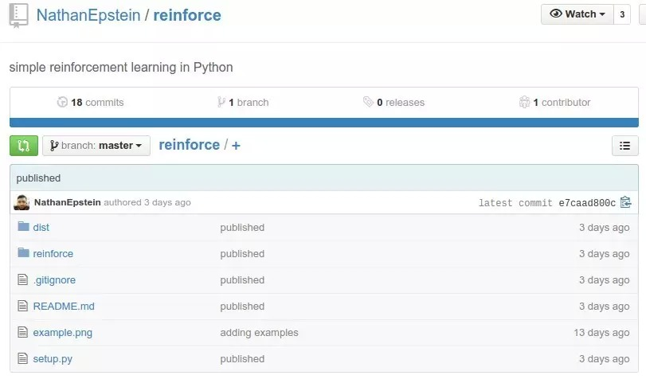
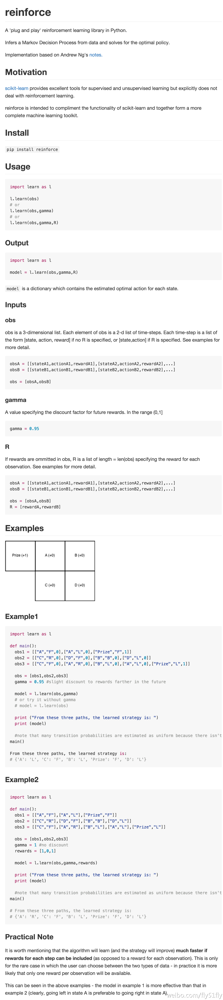
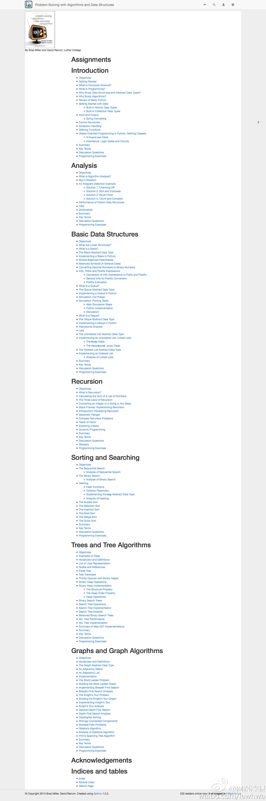

##  Python日报 Python强化学习库

_2015-02-27_ 好东西传送门 好东西传送门

**好东西传送门**

awesomeport

“好东西传送门”为您精选专业知识，提供大数据，机器学习，Web技术等方面的前沿精华信息。

__ __

### Python日报 2015-02-26

  * Python强化学习库

  * 用Python讲解算法和数据结构

  * iOS程序员如何使用python写网路爬虫

  * Python进阶课程

  * Python Web框架Django 1.7.5更新

  

@好东西传送门 出品, 过往目录见 http://py.memect.com

订阅：给 hao@memect.com 发封空信， 标题: 订阅Python日报

  

**爱可可-爱生活** 2015-02-26 08:38

库 数据科学 Andrew Ng 代码 机器学习

[开源] reinforce —— Python下“即插即用”型强化学习(reinforcement learning)库
GitHub:http://t.cn/Rw0G3pI其实现基于Andrew Ng的noteshttp://t.cn/Rw0qVLu
以及另一篇关于强化学习实现的文章《Reinforcement Learning》http://t.cn/Rw0GFdc

  

* * *

  

**网路冷眼** 2015-02-26 22:21

书籍 数据结构

【免费电子书：使用Python语言以算法和数据结构解决计算问题】http://t.cn/RZGPNXe 用Python讲解算法和数据结构的，转需！

  

* * *

  

**慕课网iOS学习小组** 2015-02-26 17:33

数据库 爬虫

#慕课网分享# 【iOS程序员如何使用python写网路爬虫】你如果想自己弄个app,例如每日精选美女之类的app,你服务端总得有图吧,怎么弄?自己用爬虫爬
啊,爬到链接了塞到数据库里,传个json,app直接sdwebimage就好了.多爽!全文：http://t.cn/Rw0FniV （via：@叶孤城___
）

  

* * *

  

**慕课网** 2015-02-26 17:00

基础 进阶 资源 函数式编程 课程

#慕课网#新课首发【Python进阶】千呼万唤始出来的Python进阶课程上线咯！[鼓掌]在本次课程，我们依然跟随@廖雪峰 老师进行Python的修炼。老师
将详细介绍Python强大的函数式编程、面向对象编程以及Python定制类，带大家掌握Python高级程序设计的方法。快来学习咯！[耶]课程地址：http:
//t.cn/Rw0DwY1

  

* * *

  

**开源新闻发布台** 2015-02-26 08:26

Web 库 Django 框架

Python Web框架Django 1.7.5更新。2015-02-25 修复了5个Bug.上个版本是2015-01-27的1.7.4
1.7需要Python 2.7以上版本。(不再支持2.6,同时支持了3.4) 遗留产品线1.6.10 1.4.19 开发版1.8
Beta1.下载http://t.cn/Rw0GiDf 发布声明 http://t.cn/Rw0GiDV

  

* * *

  

关注“好东西传送门”，可以添加公众号awesomeport

  
点击【阅读原文】或【Read more】查看链接可点击的在线版  
↓↓↓↓↓↓

  

阅读原文

阅读

__ 举报

[阅读原文](http://mp.weixin.qq.com/s?__biz=MzAwNDAxNTg4NA==&mid=209850986&idx=3&sn
=6af1d2988a7a8f78b48d926f054cffef&scene=1#rd)

