##  “中国红”是什么红 | 大象公会

_2015-02-27_ 大象公会 大象公会

**大象公会**

idxgh2013

知识，见识，见闻。最好的饭桌谈资。知道分子的进修基地。

__ __

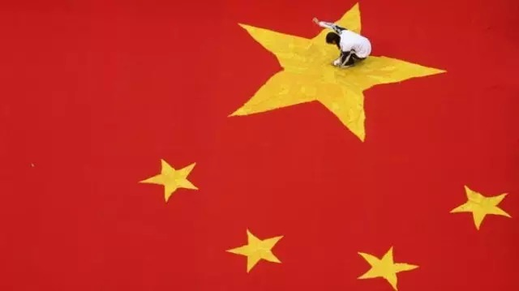

**“中国红”已成为中国的象征色，它既是意识形态上的“革命红”，又是传统文化上的朱砂红，还是故宫宫墙的赭红。中国红到底是什么红？**

**文/刘大可**

春晚，你看到的最多最醒目的颜色一定是红色。不过，今天它有了一个新名称：“中国红”，不但春晚，政府宣传、商业包装、各种纪念品、礼品，它都是最常见颜色。按百度百
科对“中国红”的溢美赞颂，“中国红”贯穿了整个中国历史，就像龙一样是“中国人的文化图腾”、“中国人的魂”。

不过，如果追溯历史，中国不但有中国红，还有中国黑、中国黄、中国白。

**【循环的颜色革命】**

“中国红”来自对传统文化的符号提炼，是现代人的作为，但将某种颜色作为国家象征并受官方推崇，却是中国自古就有的传统。

我们不仅有中国红，还有过“中国黑”、“中国绿”、“中国黄”、“中国白”——那就是自战国末期以来的“五德终始说”。

齐人邹衍（约前305年—前240年）是阴阳家的创始人，他以《尚书•洪范》中的阴阳五行和上古传说为基础，推出了一套解释阐述君权神授的学说：五行不但涵盖世间万物
，更寓意五种德性，五行相生相克的循环就是五种德性的此消彼长，所以称作“五德终始”，在此基础上，每个政权都对应着五德之一。这是天意，总有种种征兆示人。

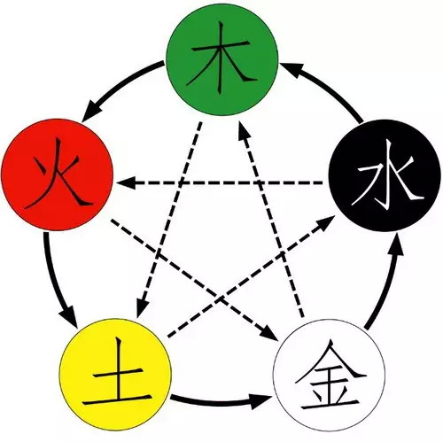
**五行变化图，实线表示相生，如“木生火”；虚线表示相克，如“火克金”**

这套说法非常巧妙，不但解决了朝代兴衰的问题，而且是事后才去解释原因，政治家们很快嗅到了其中的好处。

首先应用的是吕不韦，他在《吕氏春秋•应同》里分析到，黄帝曾见“大蚓大蝼”，自己说“土气盛”，自然是土德；大禹时秋冬“草木不杀”，所以是木德；商汤时“金刃生於
水”，这是“金气盛”，是金德；周文王的时候，又有“赤乌衔丹书集于周社”，可是火德的征兆——这一套下来，可不就是木克土，金克木，火克金？所以下一个朝代自然得是
水德，方能克住周朝的水德，偏偏秦文公打猎打中过黑龙，黑就是水，看来大秦真是神膺天命。那句从秦朝传下来的“奉天承运”，“天”自然是“天意”，“运”就是水德的“
德运”了。

既然承蒙天意，那就要以德治国，秦朝不但将黄河改称“德水”，更宣布全国服色尚黑，从皇帝到朝臣都穿黑衣服，张艺谋拍《英雄》到处黑色，确是还原了这一部分历史。

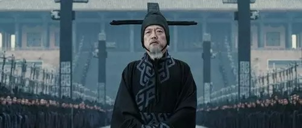
**电影《英雄》中秦丞相李斯官服**

秦朝虽然短命，这招“先打枪后画靶，自然百发百中”却被历朝历代所青睐，纷纷寻来方士高人推演自己是什么德行，再依着德行推崇贵色，朝代更替也就伴随着一次次颜色革命
。

不过，在暴秦废墟上建立的汉王朝是少数反复经历颜色革命的王朝。

首先是汉高祖刘邦攻入咸阳，见秦朝祭祀青、白、赤、黄四方天帝，便自封黑帝补全五行，定汉室为水德，尚黑色。为了不与既有的秦朝水德矛盾，又宣称秦朝残暴不是德国，自
己才是上接武周火德的水德正统。

不过，汉文帝时的贾谊根据儒学和五行，推算汉朝应该是土德，主张“改正朔、易服色、制法度、兴礼乐”，结果被宗室老臣弹劾，贬去了长沙，此后几次正朔易色的主张都没有
成功；直到汉武帝时期，司马迁上书修订历法改正朔，才正式确定汉为土德，尚黄色。

然而代汉自立的王莽采纳了刘向、刘歆父子的意见，又认定汉朝为火德，还将五德演化从相克改成相生，自己以土德自居，尚了黄色；汉光武帝兴复汉室后竟承认了这种说法，已
火德自居，即所谓“炎刘赤汉”，官服的颜色也由黄改红。

而东汉末年那场“苍天已死，黄天当立”的黄巾起义也和像王莽篡汉是一个思路，想要“火生土”取而代之，于是系了块黄布。

在凡事需求“天意”的古代中国，它成为堪比年号、谥号、正统、避讳的正经事。中国最后一个王朝被推翻后，中华民国祭出青天白日旗，林语堂还调侃说清朝是水德，如今撑起
青天，自然是木德，水生木，刚好；但很快后来祖国山河一片红，大约是木生火的缘故。

拿颜色做政治文章，倒真是中国人的老本色。

**【西来的烈士之血】**

**
**

时至21世纪，“五德终始说”上不了台面，但任何政权都不能没有合法性，天命的说辞过时了，民意的支持取而代之——“中国红”虽然不是火德的象征，却同样是统治合法性
的宣扬——红色是国际共产主义运动的象征，既然以无产阶级红色政权得天下，红色当然要登上格外的高度，所以，“中国红”还有另一半来自西方的“血统”。

没错的，红色给人最直接的联想，除了火焰就是血液了。谈到血液就会让人想起战斗，13世纪末的北欧舰船通常会在战斗中挂起一道红色飘带，称为“Baucans”，表示
“誓死不屈”，即便王室也无权拿走船上的财物。

**这红色表示有载以来第一条Baucans ，它长30码（24.5米），宽2码（1.8米），出现于1293年**

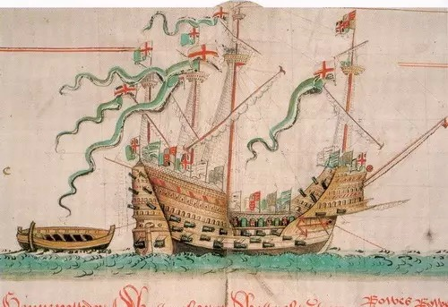
**16世纪初英国都铎王朝的玛丽玫瑰号，Baucans与桅杆上的绿色飘带（三角旗）悬挂位置相同**

这种红飘带到17世纪就演变成象征反抗的红旗，当城市或要塞被军事包围时挂起红旗，即示意战斗到底，与投降的白旗刚好相反。18世纪法国大革命，雅各宾派在煽动爱国热
情时扛出一面红旗象征“烈士的鲜血”，他们获得政权后，更将红旗当作非正式的国旗，几乎与法兰西三色旗并尊。后来的革命中，红旗成为“烈士鲜血”的象征，源头就在这里
。

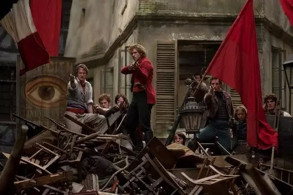
**2012年电影《悲惨世界》剧照，表现巴黎共和党起义，又称“六月暴动”**

1848年的法国二月革命，激进的社会主义者们强烈呼吁用象征革命的红旗取代三色旗，这个愿望最终在1871年的巴黎公社实现，他们用一面纯红的旗帜作为自己的国旗。

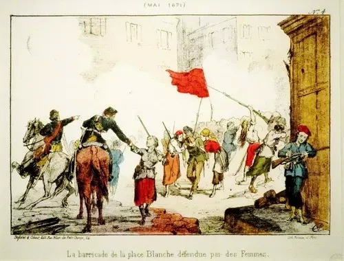
**一副18世纪的版画，描述巴黎公社在“流血周”中的情景，高举的红色旗帜是他们的国旗**

巴黎公社建立的政权虽只存在两个多月，却获得了国际共产主义运动的高度赞誉， 1923年苏联制定第一面国旗时，将红色用作国旗的背景色，一方面红色在斯拉夫文化中有
诸多美好寓意，更重要的是向巴黎公社致敬。至此，红色开始成为共产主义运动的象征。

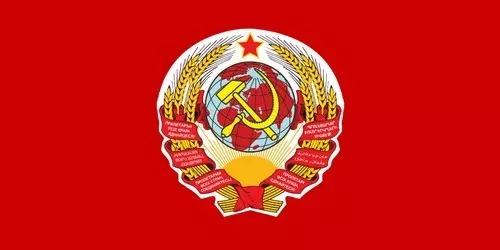
**第一面苏联国旗，1923年7月到11月使用，中央是苏联国徽**

随着红色浪潮席卷世界，中国共产党登上历史舞台，红色非常适合颠覆旧秩序的宣示。经过半个多世纪的宣传强化，今天红色在中国人的大脑中逐渐形成了稳固的条件反射：红色
就是革命、就是祖国、就是共产主义、就是无产阶级。红色风暴在文化大革命时被推向极致，鲜血、烈火、革命融为一体。

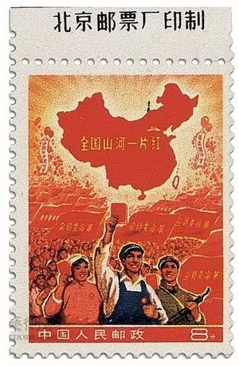
**1968年为纪念文化大革命发行的“全国山河一片红”邮票，后因版图轮廓错误停发，2012年以730.25万人民币的价格嘉德春拍成交，创国内单枚邮票拍卖纪录**

文革后，中共在由革命党向执政党的转变过程中，其合法性也逐渐转向经济发展和民族认同，红色又成了扭结前后两层合法性的最佳符号。发掘中国传统文化对红色的偏爱，并大
力渲染其繁荣富庶的寓意，在2008年的北京奥运会上有了最集中体现，“中国红”这个词终于流行起来。

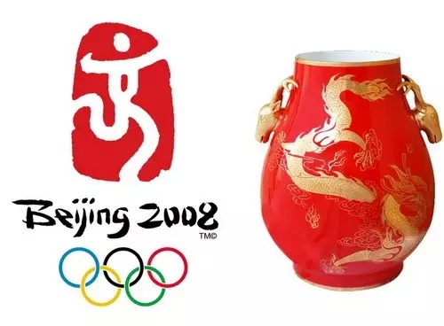
**北京奥运红色会徽和同时发行的中国红奥运礼品瓷**

“中国红”虽未获得官方正式认证，却已悄然如荷兰的橙色、意大利的蓝色，法国的红白蓝三色一样，成为国家象征。——不过，红色在是个笼统说法，对现代人来说，合成染料
和显示技术足以让我们轻易地指明一种颜色是什么样子，但古人并没有这样的便利，那么，古代的中国人用的是什么红？

**【古代的中国红是什么红？】**

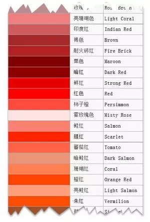
**部分被称为红色的现代颜色列表**

人类最早使用的红颜料是风化后的赤铁矿，表现为深沉的红色，中国称为“赭”，从西周的金文中就出现了这个字，但赤铁矿极易脱落，不能用做稳定的染料，好在古人早就发现
了两种良好的植物染料，红花和茜草。

菊科红花属的红花汉代称胭脂，盛产于甘肃河西走廊的焉支山。这种花富含红花苷，是一种能与各种生物纤维紧密结合的直接染料，同时也可作药，即红花油。

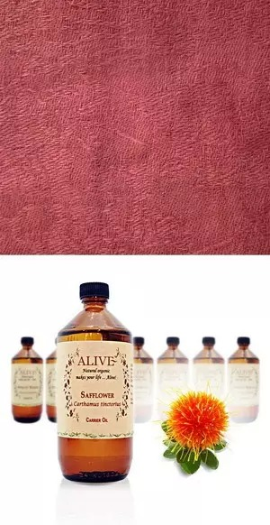
**胭脂、红花油、胭脂染的布**

在汉代，这种植物就已是重要的红色染料，从织物到化妆品都有应用，匈奴人甚至用它的名字称呼妻子为“阏氏”，这就有了霍去病伐匈奴，使匈奴人悲悼“失我焉支山，使我妇
女无颜色”的典故。汉光武帝改汉德为火德，官服用红色，胭脂花必定大有用处，于是这个词本身也成了红色的代称，但胭脂染色并不固定，从很深的橙色到鲜艳的红色都有。

另一类植物染料是茜草科茜草属的几个物种，它们的根部富含茜素红及红紫素，需要媒染剂才能染得牢靠，但胜在分布广泛，“茜”字在汉语里同样也有红的意思。

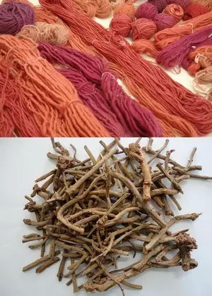
**茜草根和被茜草染色的毛线**

红花和茜草直至近代都是服饰中最重要的红色来源，但由于工艺不佳常常带有橙黄色，欲求更红，就需要后来的苏木了。

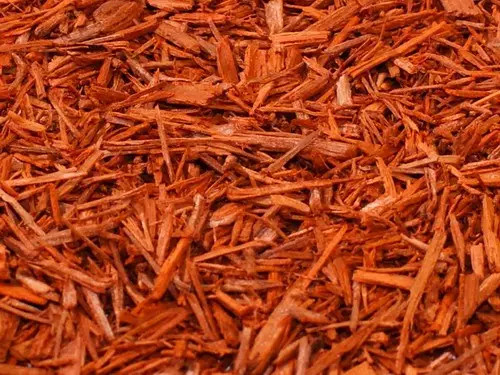
**苏木的心材**

苏木是豆科苏木属的植物，原产中国南方和东南亚，其芯材富含巴西苏木素，通过不同的媒染剂，可以染出从肉色、红色到紫色甚至绿色来，在15世纪前后几乎是世界唯一的深
红染料，是大航海时代重要贸易开发对象，“巴西”就是因为人们在那里发现了大量的同属植物巴西苏木而得名。

绘画和建筑涂料同样要用到红色。

中国古代绘画最重要的红颜料非朱砂莫属。朱砂即硫化汞，是汞在自然界最常见的化合物，从鲜红到暗红都有，由于产量丰富，中国早在6000年前的河姆渡就有应用，后来的
中国画中深浅不同的红色，几乎都是用纯度不同的朱砂调配而成，它还被用做印泥、漆器、化妆品。

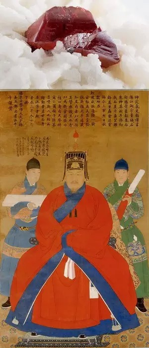
**朱砂矿和大面积使用朱砂的明代工笔画《杨洪像》**

朱砂在中国高雅艺术中被广泛应用，但纯正的朱砂在西方非常昂贵使用不多，所以仅从文化考虑，朱砂的朱红色应该是“中国红”最好的代言，但是，朱红非常接近橙色（见前文
颜色列表截取的最后一项），与“革命红”相去甚远。

不过，尽管维基百科上“China red”词条正确定向到“朱红”上，但百度百科却巧妙地将之定向到了“大红色”——也就是从巴黎公社一脉相承下来的“烈士的鲜血”
，奥运会那枚印章形的会徽也是用了国旗的大红色，而非印泥的朱红色。

除了植物染料和朱砂颜料，建筑涂料也是“中国红”的历史源头之一：我们知道对“中国红”的赞颂中，一定少不了紫禁城红色的宫墙。

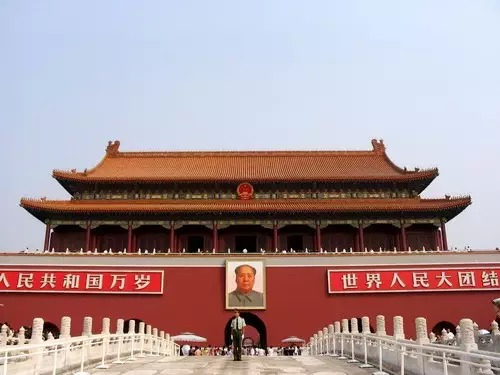
**天安门的红墙**

这种端庄厚重的红被称为“广红”，最初就是古老的“赭”，亦即风化后的赤铁矿，可惜它有矿物颜料吸附能力差的缺点，很容易被风雨剥蚀，所以在1983年的大修中，它被
换成了新研制的“815型古红漆”，颜色近似而稳定性极强，成为古建筑维修专用漆。

是的，随着历史演进，总有一些看似恒定的颜色悄悄变了成分，如今的朱红颜料大都是用镉红和硒或锌的混合物制成，衣服上的红色也已经变成了化工合成的染料——然而我们需
要一个有力的符号证明自己，这一点却持久的很，古今中外都没有变过。

