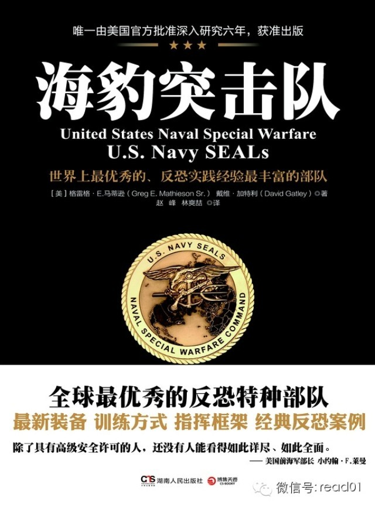

  

昨天看到一篇不错的文章，介绍一本新出版的图书，看完之后对这本书产生兴趣，过几天会把这本书读完，不知道是否象看起来那样有吸引力。
不知道大家读完这篇文章有什么心得？

《海豹突击队》美版原名《United States Naval Special Warfare》（《美国海军特种战争》） 美国官方独家授权美著名记者、摄影师
格雷格•马蒂逊，以长达6年的时间，深入海豹突击队的作战部队，从训练基地到战争前线，用900多张从未公布的照片，完整的揭秘了海豹突击队的武器装备、新兵训练、日
常培训、后勤保障、指挥系统等绝密内容，以独特的角度探析了美国海军特种作战部队这一领域。

## 正文

  

作者：刘宇敌

  

出处：点击文章最下方的【阅读原文】

  

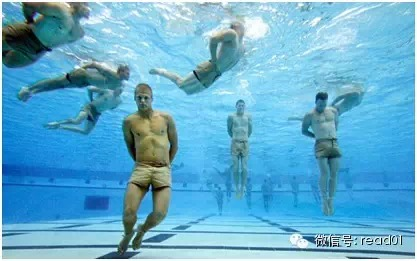

  

（突击队员双方被反绑在身后，自动沉到泳池底部，他们的任务就是仅用牙齿，来为自己戴上放置在池底地板上的面罩。在他们冷静地完成这项任务之后，他们接下来的任务可能
更具挑战。这就是海豹突击队士兵一天的训练。）

美国海军海豹突击队(Navy Seals) 是世界上最为神秘、最具震慑力的特种作战部队之一。

进入海豹突击队，学员要通过被认为是世界上最艰苦最严格的特别军事训练，而且有时训练完全是真枪交火，学员们在超常的困境中培养锻炼毅力和团队作战的能力，最后70%
的学员要被淘汰出局。因此成为海豹突击队的战士是一名美国军人的最高荣誉。

以下内容节选自美国特种作战指挥部(U.S. Special Operations Command)第九指挥官威廉•H•麦克雷文(William H.
McRaven)海军上将在得克萨斯大学毕业典礼上的讲话，主要谈论了海豹突击队训练给人们带来的启示，最早由华尔街日报发布。

我相信这些内容会让阅读它的人有所收获。

———————————————————————————————————————

这一切始于我离开得克萨斯大学，前往加利福尼亚州科罗纳多市(Coronado)接受海豹突击队基本训练(Basic SEAL training)。

海豹突击队基本训练就是在为期六个月的时间里，在柔软的沙滩上痛苦地长跑，午夜在 迭戈(San Diego)近海寒冷的水中游泳，障碍越野训练，无休止的健美操，连
续数日不睡觉以及成天都在寒冷、潮湿和痛苦中挣扎。那是不断被受过专业训练的勇士骚扰的六个月，他们试图找出身体和心灵上的弱者并将其从海豹突击队淘汰。

对我来说，海豹突击队的基本训练是把一生的挑战浓缩到了六个月的时间里。

下面就是我在海豹突击队基本训练中学到的经验教训，希望于你们在人生中前进之际对你们有价值。

### 【1、如果你想改变世界，从整理你的床铺开始】

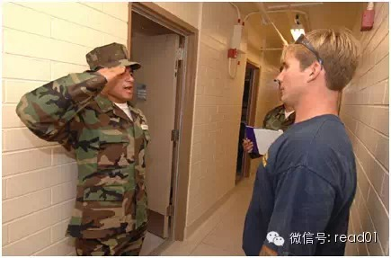

在海豹突击队基本训练中，每天早晨，教官们会来到我的营房宿舍，他们要检查的第一个东西就是你的床。如果你做好了，被子四角就会是方方正正的，床单拉得平平整整，枕头
放在床头的正中，多余的毯子整齐地叠放在搁物架下面——这就是海军所说的床。

这是一项简单的任务，充其量可以称为平凡。但是每天早晨，我们都必须把床整理得完美无缺。

如果你每天早上整理床铺，你就完成了一天中的第一项任务。它会给你小小的一点自豪感，鼓励你再去执行一项又一项的任务。到一天结束的时候，完成了的那一项任务就变成了
多项已经完成的任务。整理床铺也会进一步证明一个事实：生活中的小事很重要。

如果小事都做不好，你永远也成就不了大事业。如果碰巧有一天你遭遇了痛苦，你回到家会躺到一张整理好的床上——这床是你整理好的——整理得井井有条的床铺会给你鼓劲，
让你相信明天会更好。

如果你想改变世界，那就从整理你的床铺开始。

### 【2、如果你想改变世界，一定要找人帮你划桨】

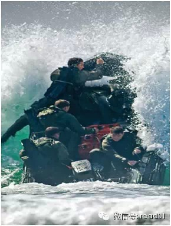

在海豹突击队训练期间，学员被拆分成多个皮艇小组。每个小组有七名学员——小橡皮艇的两侧各三名以及一名帮助导航的舵手。每天，皮艇小组在海滩上整队集合，接受穿越激
浪地带的指示，沿着海岸划上好几英里的船。

冬天的时候， 迭戈近海的海浪可达8-10英尺（约合2.4-3.1米）高，除非人人挥桨，否则划船穿越猛扑过来的海浪极其困难。每一支桨必须与舵手发出的划桨指令保
持同步，每个人必须用相同的力气，否则船会转向，与海浪迎面相对，毫不客气地被扔回到海滩上。

要让船到达目的地，每个人都必须划桨。你一个人无法改变世界——你会需要一些帮助——要真正从你的起点到达你的终点，你需要朋友、同事、陌生人的善意以及引导他们的一
个坚强舵手。

如果你想改变世界，那么一定要找人帮你划桨。

### 【3、如果你想改变世界，以人们内心的大小，而不是他们脚蹼的大小来衡量他们】

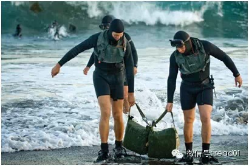

经过几周的艰苦训练之后，我们这个开始有150人的海豹突击队训练班人数减少到只有42人，现在的皮艇小组有六个，每组七名成员。

我与高个子们在同一条船上，但我们最好的皮艇小组是由小个子成员组成的——我们称他们为小家伙皮艇组，他们没有一个人身高超过5.5英尺（约合168厘米）。

小家伙皮艇组里有一名印第安人、一名非洲裔美国人、一名波兰裔美国人、一名希腊裔美国人、一名意大利裔美国人和来自中西部的两个健壮小伙子。虽然每次游泳前，其它皮艇
小组的大个子总是会善意地打趣小家伙们穿在脚上的小小脚蹼。但他们划船、跑步和游泳都赛过了其它所有皮艇小组。

海豹突击队的训练是一个伟大的均衡器，除了你的意志以外，别的东西都不重要。你的肤色、你的种族背景、你的教育程度和你的社会地位都无关紧要。

如果你想改变世界，请以人们内心的大小，而不是他们脚蹼的大小来衡量他们。

### 【4、如果你想改变世界，克服沦为“砂糖曲奇”带来的影响，继续前进】

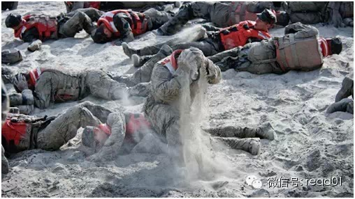

  

一周好几次，教官会让全班列队检查军容风纪。检查内容格外全面。你的帽子必须非常硬挺，你的军装必须熨得平平整整，你的皮带扣必须油光亮，没有任何污迹。

如果军容风纪检查不合格，学员就得穿戴整齐地跑到激浪地带，然后在从头到脚湿透的情况下在海滩上滚翻，直到身体每一个部分都被沙覆盖。这种效果被称为“砂糖曲奇”(s
ugar cookie)。你在那一天剩下的时间里都要穿着那身军装——冰冷、潮湿、满身沙粒。

有时，不管你准备多么充分，或者表现多么优异，你最终仍然会变成一个砂糖曲奇。有时生活就是这个样子。

如果你想改变世界，就要克服沦为“砂糖曲奇”带来的影响，继续前进。

### 【5、如果你想改变世界，就不要害怕马戏】

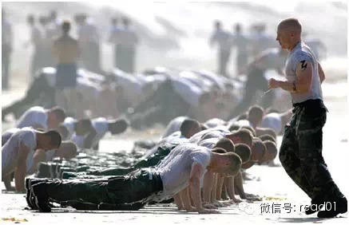

每天的训练之中，你都面临多项体力活动的挑战。长跑、长距离游泳、障碍越野、数小时的健美操——旨在测试你耐力的东西。如果你未能达标，你的名字就被张榜公布，等到这
一天结束的时候，那些榜上有名的人就会应邀表演一场“马戏”。

马戏就是额外两小时的健美操训练，目的是耗尽你的体力，击垮你的精神，迫使你知难而退。没人想表演马戏。马戏意味着那天你没有合格，意味着更加疲惫，而更加疲惫意味着
第二天会更难熬——那就有可能会有更多的马戏。

每个人——每一个人——都上过马戏名单。不过，随着时间的推移，那些额外加练两小时健美操的学员变得越来越壮。马戏的痛苦练就了内功——练就了身体的柔韧性。生活中充
满了马戏。你会失败，你很可能经常失败，那是件痛苦的事，让人灰心丧气。有时，它可以考验你的内在本质。

但如果你想改变世界，就不要害怕马戏。

### 【6、如果你想改变世界，有时候你必须以头朝前的方式从障碍上滑下】

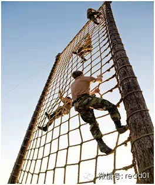

至少一周两次，受训学员要按要求跑障碍越野。障碍越野的跑道上有25处障碍，但是最具挑战性的障碍是逃生滑绳。障碍一端有一个30英尺（约合9.2米）高的三层塔台，
另一端是一个一层的塔台，两个塔台之间是一根200英尺（约合61米）长的绳子。

你必须爬上三层高的塔台，爬到顶端后，你要抓住绳子，吊在绳子下面，两手交替着向前移动，直到你到达绳子的另一端。

障碍越野的记录已经保持了多年，好像那是一个无法打破的记录，直到有一天一名学员决定换种方式过滑绳——以头朝前的方式。他没有让身体吊在绳子下面一点一点向前挪，而
是勇敢地攀到了绳子的上面奋力向前行进。

那是一个危险的举动——看上去有点愚蠢，充满了危险。一旦失手可能就意味着受伤并从训练中淘汰。那名学员毫不犹豫地在绳子上滑了下去，险象环生，但很神速。他花的时间
不是几分钟，而是只用了一半的时间，到最终跑完全程的时候他已破了记录。

如果你想改变世界，有时候你必须以头朝前的方式从障碍上滑下。

### 【7、如果你想改变世界，在鲨鱼面前不要退缩】

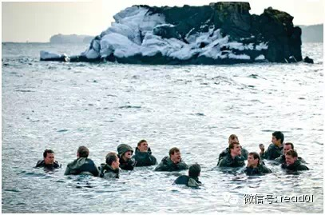

在陆战训练阶段，学员们坐飞机被带到 迭戈附近的 克利门蒂岛(San Clemente Island)。
克利门蒂岛近海水域是大白鲨的繁殖区域。要通过海豹突击队的训练，必须完成一系列的长距离游泳科目，其中之一是夜间游泳。

你会得到指导，如果一条鲨鱼开始围着你转，那请呆在原地，不要游开，不要露怯。如果这条鲨鱼想吃夜宵，向你冲了过来，那你要使出全身力气猛击它的鼻子部位，那样它会转
身游走。

世上有很多鲨鱼，如果你希望完成游泳，你就必须要去对付它们。

因此，如果你想改变世界，在鲨鱼面前不要退缩。

### 【8、如果你想改变世界，你必须在最黑暗的时刻把自己的能力发挥到极致】

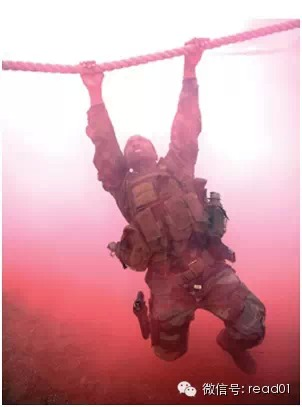

作为海豹突击队员，我们的任务之一是从水下袭击敌人的舰船。我们在基本训练期间大量练习了这种技术。执行袭击舰船的任务时，海豹突击队的一对潜水员在敌人港口外下水，
然后游两英里（约合3.2公里）多的距离——潜在水下——仅仅利用一个深度计和一个指南针抵达目标。

在整个游泳期间，当你靠近绑在码头上的船只的时候，光线开始减弱。船的钢结构挡住了月光，挡住了周围的路灯光，挡住了所有的环境光线。可是龙骨也是整船最暗的一部分，
在那里你伸手不见五指，船的机器噪音震耳欲聋，你很容易迷失方向，从而致使行动失败。

每一名海豹突击队员都知道，在龙骨下面，在整个任务最黑暗的时刻，你必须沉着冷静——那种时候你得使出你所有的战术技巧、你的体能以及你全部的内在力量。

如果你想改变世界，你就必须在最黑暗的时刻把自己的能力发挥到极致。

### 【9、如果你想改变世界，当泥浆没及你的脖子时，开始唱歌】

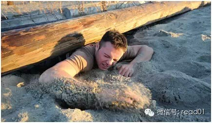

海豹突击队训练的第九周被称为地狱之周(Hell Week)，六天不能睡觉，不断遭受体力和心理上的骚扰，还要在泥滩(Mud
Flats)度过特别的一天。就在地狱之周的星期三，你要划船进入泥滩，在随后的15个小时里尽力从冰冷刺骨的泥潭、呼啸的狂风以及教官不断让你放弃的压力中熬过来。

就在那个周三太阳开始落下的时候，我们这个训练班因“严重违反纪律”而被命令跳进泥滩。淤泥淹没了每一个人，最后除了脑袋什么都看不见了。教官告诉我们只要五个人放弃
，我们就可以离开泥滩——只需五人，我们就可以摆脱这难以忍受的寒冷。

环顾泥滩，很明显有些学员打算要放弃了。距离太阳升起来尚有八个多小时——八个多小时的刺骨寒冷。学员们牙齿颤栗和颤抖的呻吟声音之大，很难听到其它任何声音。然后，
一个声音开始在夜色中回荡——一个唱歌的声音。歌曲的调子跑得离谱，但唱得极富激情。声音从一个变成两个，两个变成三个，没过多久全班每一个人都唱了起来。

我们明白，如果一个人能够从痛苦中超脱出来，那么其他人也可以做到。教官威胁我们说，如果继续唱歌，我们就得在稀泥中呆更长的时间——但是歌继续唱了下去。不知怎么搞
的，泥潭似乎变暖和了一些，风变得柔和了一点，黎明也不再那么遥远。

因此，如果你想改变世界，当泥浆没及你的脖子时，请开始唱歌。

### 【10、如果你想要改变世界，永远不要敲那个钟。】

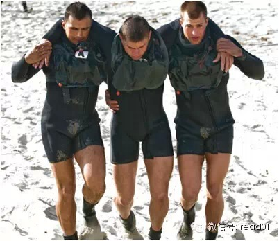

最后，在海豹突击队训练中有一口钟，一口挂在训练队大院中心让全体学员都看得见的铜钟。

如想放弃，你要做的唯一一件事是敲响这钟。敲钟之后，你再也不必早上五点醒来。敲钟之后，你再也不必在冰冷的水里游泳。敲钟之后，你再也不必参加跑步、障碍越野、体能
训练——而且你再也不必忍受训练的艰苦。只需敲钟就行。

但如果你想要改变世界，就永远不要敲那个钟。

最后我想说，

开始改变世界——让世界变得更美好，这并非易事。

但是每一天都要以一件完成的任务开始，在人生途中找人来助你一臂之力，尊重每一个人，明白人生是不公平的，你经常会遭遇失败，但如果在最艰难的时候你担当风险、勇敢向
前，惩恶扬善、救人于水火，而且永不放弃——如果你做到了这些，那么下一代人以及其后的世世代代就会生活在一个远比今天美好得多的世界里。在这里的起步真的就会改变世
界，让它变得更加美好。

————————————————————————————————————

**【拓展阅读】震撼人心的海豹突击队真实训练：**

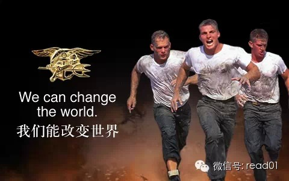

美国海豹突击队(Navy
Seals)作为世界上最神秘、最具威慑力的作战部队，一直不为外界所知。1993年经由美国官方批准，摄影师、记者格雷格•马蒂逊（Greg Mathieson）
深入海豹突击队内部六年，跟踪记录海豹突击队的历史、新兵训练、日常培训、后勤保障、指挥系统等内容，在这一过程中他被深深震撼了，此后他将这段珍贵的经历完整地记录
在了《海报突击队》一书中：

海军特种作战部队的真谛就是训练、训练、再训练。无论是作为一名基础学员，还是一名作战分队负责人，抑或经验丰富充当教官的老前辈，海豹突击队和特种舟艇部队队员都是
一年在训练，一年在部队正常服役，他们在整个军人生涯期间都是如此。海豹突击队基本水下爆破训练的课程要持续27个月。

最基础的是第一阶段，主要训练内容是强化学员的生理机能，将持续7个星期。而第一阶段训练中最为“臭名昭著”的部分就是所谓的“地狱周”，“地狱周”持续5天，被认为
是所有军队训练项目中最为难熬的5天。“地狱周”被认为是学员接受后两个阶段训练的基础，但即便你完成了“地狱周”，也不意味着你能够完成整个第一阶段的训练。

第二阶段是“潜水阶段”，这一阶段的强化课程也是海豹突击队水下基本爆破训练区别于其他类型训练的重点所在。在这一阶段的水中强化训练中，学员们要在开阔的海面上深潜
。在圣迭戈湾的水下，学员们戴着开放式循环呼吸器（压缩空气）和封闭式循环呼吸器（纯氧），依靠罗盘的指示潜泳，对模拟舰艇进行攻击使得紧张的水中训练更为充实。不是
每一个人都能通过这个要求苛刻的阶段。也正是在这一阶段，学员开始领到潜泳津贴。

第三阶段的训练内容则包括陆地作战训练、小组战术训练以及爆破和武器训练。这一阶段的训练要求仍然很高，在步枪和手枪各自的射程内，学员们必须获得令人满意的射击成绩
，展现出对军用炸药和其他军械（包括手榴弹、聚能装药）高超的知识水平，并且要在一系列小组战术问题中表现卓越。训练地点在科罗纳多海滩和沿岸的圣克利门蒂岛进行，这
是一个环境恶劣、布满岩石、狂风呼啸的岛屿，距离加利福尼亚州南部海岸线超过80英里。20世纪90年代初期，在那儿建了一座新型训练设施，与先前的设施相比，新设施
是一个巨大的改进。尽管训练设施有所改进，但圣克利门蒂岛上严酷的训练环境没有任何改变。

## 100天行动读者反馈

**@茶花花世界**

习惯看不喜欢回复，按道理应该早就和您汇报百天，分享实际行动。11月份开始跑步，12月参加一场半程，1:40:20完赛。体重从153减到140，跑步已成为习惯
。同时养成记笔记，阅读习惯。感谢！将持续关注，尝试新的项目，提高生活品质

**@D.C.**

德尔塔推荐的app非常好用，atimelogger2。就是涨价到18块了，治疗拖延症必备利器，可以统计时间。android上有爱今天好用，免费。

这是昨天一天的学习时间，完成了别人一个星期的任务……还是有点小骄傲滴！

**@罗斯洋Rose**

Hi战隼！与你分享一下我的100天挑战。我同时开始挑战每天1小时阅读，和每天半小时慢跑，另外还配上拉伸。每天半小时跑步现在跑下来已经毫无压力。今天是第五天。
整个人的精气神都不一样了！焕然一新，充满了活力和对生活的力量，也更加自信了！好像身体里藏着一股力量酝酿着随时可以爆发。而阅读是个积累的过程，也不急知道还有很
长的路要走，但才5天就给我带来这样的惊喜，我已经迫不及待看到变得越来越好的100天后的我了！谢谢战隼，这个活动让我不再停留在阅读/道理上，而是真正实践在行动
上！

@warfalcon

做的不错，但注意好休息，跑步别每天跑，一周最好休息1-2天，一般来说，初学跑步时最好是跑一休一，注意跑步姿势，做好拉伸。

阅读可以适当放短时间，别一开始给自己太大的压力，一般来说，每天一小时很容易被打断。

这两个被打断的时候，别放弃，坚持记录下去，加油，期待你完成100天的反馈。

  

  

阅读原文

阅读

__ 举报

[阅读原文](http://mp.weixin.qq.com/s?__biz=MjM5NjA3OTM0MA==&mid=204289885&idx=1&sn
=ee6268761c342360ca1854d2fa609e61&scene=1#rd)

