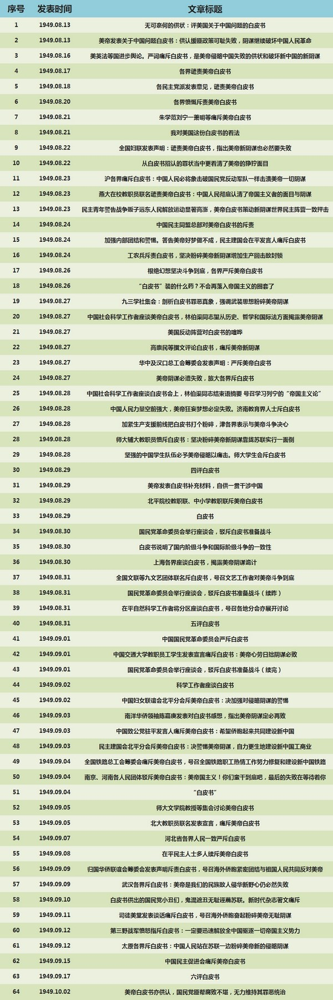
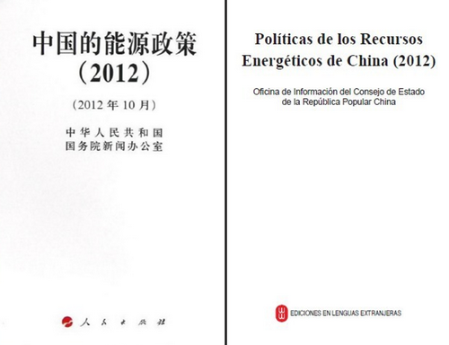

##  “白皮”有风险，使用需谨慎 | 大象公会

_2015-01-29_ 大象公会

**中国人民的感情被白皮书伤害过，是最恨白皮书的国家之一。朝鲜和委内瑞拉也是如此。在中国，政府白皮书由中华人民共和国国务院新闻办公室统一发布。**

  

**文/郑子宁 杜修琪**

  

现代汉语中，“白皮书”是一种奇特的词汇——虽然不知道具体含义，但每次读到都难以自拔的吓了一跳——像突然听到新闻联播中极为严肃、郑重的外交通牒。

  

  

近日，国家工商总局网络商品交易监管司发布《关于对阿里巴巴集团进行行政指导工作情况的白皮书》，瞬间成为新闻焦点，连带着让白皮书也红了起来。

  

政府的“白皮书”一向形象权威，更多涉及对外援助、一国两制等重大问题。在外交史上，各国通过发表各自的白皮书大打出口也屡见不鲜，比如朝鲜与韩国。

  

这次，“白皮书”却被用来针对一家企业，荒谬感不言而喻。为什么白皮书是极为郑重的政府文件？它的历史或许能提供解答。

  

**【带封皮的文件】**

  

和很多政治规范一样，现代意义上的白皮书起源于英国。

  

不过，近代以前的英国并没有白皮书，只有蓝皮书。确切的说，是一种带封皮的文件，装饰精美，颜色恰巧为蓝色。

  

15世纪开始，英国议会发布年鉴和重要统计资料，用贵重的蓝色丝绒作封皮，被称为蓝皮书。

**15世纪英国的蓝皮书**

  

近代，英帝国事务增多，定期发行蓝皮书外，重要事项发行单行本的需要强烈起来。相比于之前规模庞大、资料繁多的蓝皮书，单行本只关注某一方面内容，更加简短。

  

这给了吝啬的英国人节俭的理由——谁舍得用费时费力费钱的蓝色丝绒封皮装帧一个单行本呢？

  

于是，虽同为政府报告，这类文件装帧档次骤降——封面和内页一样，均使用白色纸张，无特别装饰。“白皮书”（White Papers）称呼就这样流传下来。

  

后来，英国议会也对白皮书的定义和用途做出解释：白皮书是由政府制作就某一议题的未来政策列出详细信息的文件。

  

真正将白皮书发扬光大，成为重要外交手段的人，是丘吉尔。

  

1922年，时任英国殖民事务大臣的丘吉尔主持修订了一份重要的文件，以“白皮书”形式发布。它阐述了英国对1917年贝尔福宣言的态度——第一次以白皮书形式，实质
上的表现了国家对待某重要事务的意见、态度。

**贝尔福肖像与《贝尔福宣言》。《贝尔福宣言》宣布了英国支持锡安主义者在巴勒斯坦建立犹太人“民族之家”，条件是不伤害当地已有民族的权利**

  

这份不到两千词的重要文件中，英国政府明确原则上支持犹太人在巴勒斯坦建立国家，但也提供了现实建议——将巴勒斯坦变为纯犹太国家并不现实，应作为犹太人和阿拉伯人和
平共处的统一国家。

  

丘吉尔主持的白皮书已经具备了现代版本的各项特点：相对简短、直奔主题；关注一项特定政策议题；通过资料，支持某一主张、阐述立场；说明解决问题的方案及其理由。

  

虽然，英国后来几乎违背了该文件的所有承诺——这个开端非常能说明白皮书的性质，就像现今一样，它义正言辞，却并不具备法律约束力。

  

白皮书很快被国际接受。根本上，它满足了现代政治的需求：提供指导性文本，作政府之间必要的信息沟通。

  

英联邦国家一般都沿用了白皮习惯。法国、意大利、西班牙分别使用过黄皮、绿皮、红皮作封面，但二十世纪英美的强势地位，让白皮习惯牢牢占据了国际主流。

  

实际功能上，中国最贴近白皮书的应该是红头文件。1949年之后，很长一段时间并没有白皮书形式，直到1991年的《中国的人权状况白皮书》，回应外交质疑。

**《中国的人权状况》是《中国政府白皮书》的内容，于1991年由中华人民共和国国务院新闻办公室发布**

  

这也是为什么白皮书在中国显得尤为郑重的原因，一开始，它就以强硬外交回应的形象被中国人认知。

  

为什么中国长时间没有白皮书？

  

**【“司徒雷登走了，白皮书来了，很好，很好”】**

  

非常简单——中国人民的感情被白皮书伤害过，是最恨白皮书的国家之一。

  

1949年8月，美国《中美关系白皮书》(The China White Paper)，让毛泽东非常生气，激发出罕见的创作热情，愤而写下《无可奈何的供状》《丢
掉幻想，准备斗争》《别了，司徒雷登》《为什么要讨论白皮书》《“友谊”，还是侵略?》《唯心历史观的破产》6 篇文章。

  

主席用深入浅出的语言，表现了难以自抑的受伤感：

  

“司徒雷登走了， 白皮书来了，很好，很好。这两件事都是值得庆祝的。”

  

中国人民历来在这样的事情上反应灵敏。《人民日报》两个月间发布了64篇文章，纷纷鞭挞“白皮书”：

  

于是，“白皮书”一词就进入了心照不宣的黑名单，宁可用红头文件、官方声明，也要绕开这一国际通行的文件称呼。

  

改革开放之后，情况发生变化。虽然，也是出于对美帝伤害中国感情的回应。伤害的点今天仍旧非常熟悉：人权。

  

1990年底，美国“肯尼迪人权中心”致信中国科学院院长周光召:
若中国人权状况不改善，世界各国科学界人士将断绝与中国往来。国新办于是组织人手作出回应。出于国际宣传考虑，最终的文本形式命名为“白皮书”。

  

最终，邓小平拍板:“这是一篇大文章，一篇好文章!”

  

这开启了中国现代白皮书的先例。90年代，中国政府级别的白皮书主要针对外交问题，作出解释、回应。包括《西藏的主权归属和人权状况》白皮书、《中国知识产权保护状况
》白皮书、《中国的粮食问题》白皮书等。

  

人权话题也同样是国际白皮书的富矿。朝鲜和韩国是另一对围绕此产出白皮书的冤家，已持续多年。

  

21世纪后，中国白皮书也开始有了主动宣传的类型，但回应外交质疑仍占主流。

  

**【白皮书的泛滥】**

  

当中国开始适应了半个世纪以前的外交规则时，白皮书的性质却开始起变化。简而言之，白皮书数量增多，不那么值钱了。

  

中国中央级别的白皮书就显示出了剧增趋势——从最恨白皮书的国家，变为最爱白皮书的国家之一。

  

截至2013年10月，中国政府在20余年间共发布88册白皮书，接近加拿大70余年的总和（92册，1939--2013），远超同期欧盟委员会（39册，1993
--2014）。

**中国政府的白皮书不仅以中文呈现，还翻译成多种语言发行**

  

尤其近年，2011年中国政府发了九册，2012年也有六册之多。

  

白皮书一词也更加频繁的被人们使用。以谷歌搜索“White
papers”，2002年就可搜得大约280万条结果，2012年居然有3950万条，现在更是逾1亿1100万条。

  

这和白皮书发布部门增多有关。现在，白皮书不再是中央政府的专利，许多部门、地方政府都可以发布。以澳大利亚为例，北领地政府会发布《北领地白皮书》，国防部则自行发
布《国防白皮书》。民主国家的议会在提交议案之前，也会以白皮书形式发布相关信息，供人们参考。

  

至此，白皮书界已鱼龙混杂，分辨其中的权威性尤为重要，稍不注意，就容易闹出笑话。

  

2009年，委内瑞拉前总统查韦斯在南美洲国家联盟峰会上，突然拿出一份美国的秘密计划，大加抨击。

**2009年，在南美洲国家联盟峰会上的查韦斯**

  

据他称，这是由神秘途径拿到的美国秘密白皮书。

  

似乎他说的没错，这本白皮书符合了大部分经典特征。其中，美国希望将整个南美洲变成自己殖民地，更对委内瑞拉丰富的石油资源垂涎三尺。

  

人们惊愕异常，又不禁怀疑——如此匪夷所思、庞大严密的计划，怎么就泄露到了查韦斯先生手里呢？

  

原来，它实际上是美国国防大学网站上一个公开的未分类文档，题目为《空中行动指挥白皮书》（《White Paper. Air Mobile
Command》），作者不详，自然远远没有查韦斯宣称的权威性。闹出了外交笑话。

  

尽管中国近年白皮书发布数量相对较多，但仍然只有涉及大方针政策的议题才会进入白皮书，如2012年的六册分别为《中国人权事业的进展》《中国的能源政策》《中国的司
法改革》《钓鱼岛是中国的固有领土》《中国的稀土状况与政策》《医疗卫生事业》。

  

也因此，发表政府白皮书是相当正式的行为。在中国，政府白皮书统一由中华人民共和国国务院新闻办公室发布，还没有形成国外一样各级议会、政府都有发布惯例的局面。

  

可见，白皮书的使用，还是谨慎为好。

  

**版权声明**

****大象公会所有文章均为原创，****  

****版权归大象公会所有。如希望转载，****

****请事前联系我们：****

bd@idaxiang.org

****知识 | 见识 | 见闻****

阅读

__ 举报

[阅读原文](http://mp.weixin.qq.com/s?__biz=MjM5NzQwNjcyMQ==&mid=210364777&idx=1&sn
=1b1ce96ccb3d3d256a4382d1b494a533&scene=1#rd)

