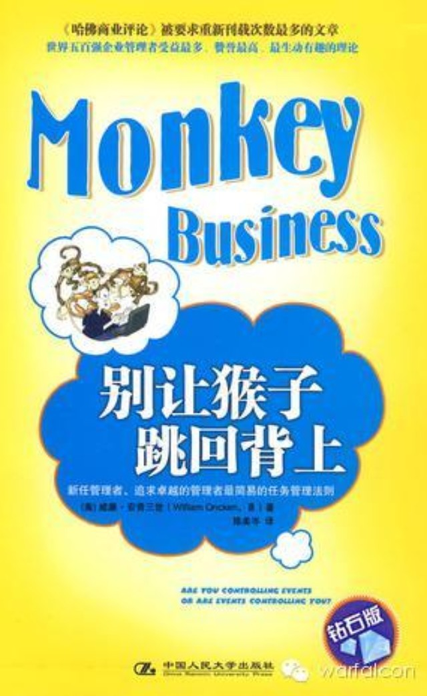

##  《别让猴子跳回背上》读书笔记

_2015-03-11_ warfalcon warfalcon

**warfalcon** 

read01

想每年读完100本书吗？想在100天内培养一个好习惯吗？想搞定拖延和注意力不集中吗？关注我，让你成为一个行动者，跟几十万读者一起成长，欢迎参加100天行动

__ __

  

花些时间总结一下《别让猴子跳回背上》，本书是从的《哈佛商业评论》的一篇同名文章扩充而来，这篇《哈佛商业评论》重印需求最高的文章

猴子定义：两人谈话结束时的下一个步骤；

猴子理论：主管的工作是将适当的猴子放在适当的部属身上，部属的责任是喂养猴子。 管理者可以运用的5个任务层次：

（5）独立行动，例行性报告；

（4）行动，但需要立即请示（意味着报告频率超过例行性报告）；

（3）建议，等待裁示再行动；

（2）请示要做什么；

（1）等待指示（最低级别）。

整本书就是讲要努力把下属提高到第五级，独立行动。核心内容是要从你的老板那里接受猴子，而不是从你的部属身上，让你的部属具备独立行动的能力。

备注：这书谈的就是时间管理中非常实用一个技巧，学会委托，有效的利用别人的时间，（呵呵，有些不道德，但非常有用）

部分书摘：

### 喂养猴子的六大规则：

（1）喂养或射杀它们，千万不要让它们活活饿死； （2）只要你找到需要喂养的猴子，你的部属就要找出时间喂养它们，但猴子数量千万不要过量：与其遍地分派猴子而不管
结果，不如对每只关注的猴子都有喂养计划（约定沟通的时间、频率和内容）。 （3）按照喂食进度表上的时间和地点喂养猴子是部属的责任，主管不必再沿途追逐即将饿死的
猴子，胡乱的喂食：把临时发现的猴子归入系统性工作的猴子之中，不能做救火队员，不告诉他如何去喂，让部属自发的拿出系统性全局性的解决方案和实践行动。过细、过于频
繁的后续追踪是骚扰。 组织实务上的基本原则便是，资深管理者不该在未知会直属部下之前，便绕过部属直接对后者的部属宣布指示（明显的例外是，攸关生死的情况）。这项
原则一旦遭到破坏，便会导致所谓的越级监督，混淆了任务的优先次序，使管理者本人和接到指示的部属都费力不讨好。
违反喂食时间是很严重的问题，可以将一个部属发生此类错误的情况作为集体学习的机会，在集体会议上不点名批评，并强调重要意义，好过个别提醒的效果。
（4）如果有冲突发生，预定喂食猴子的时间可在任何一方的提议下做出变更，但不被视为延误；事情毫无进展不能作为重新安排喂食时间的借口。
无进度的喂食方式：应该达到什么进度，目前进展情况，为什么产生此情况及相关建议等内容。职责总是以时间为优先，而非准备就绪。总裁没有权利向股东要求更改喂食时间。
（5）无论何时，尽可能面对面地喂养猴子，否则便使用电话，绝对不要用信件。备忘录、电子邮件、传真和报告可以使用于喂食过程，但不能替代面对面的对话。 书面内容可
以使人更加慎重和认真，但也是将猴子转移的有效工具和不透露真相的掩饰，因此，将书面内容作为辅助和谈话大纲，保持面对面的对话和及时产生结果，确保真正的沟通和了解
，以及猴子不会转移。 即使下一步骤应该由管理者完成，也应当与猴子的主人共同完成，避免猴子以此为契机更换宿主。

### 其它

1、猴子归属于谁，谁就要至始至终负责，不能推卸，不能跳跃。
2、领导可以给下属方向，可以提出建议，但猴子还是他的，如果没有及时可以给予答复，让他主动去找寻问题的答案，因为猴子在他的背上。
3、高效有序执行，需要人们主动或被动的维护遵守现有的规则，领导不能违反，下属也是。
4、领导不要直接对非直属下属给予指令，容易造成组织结构混乱，如有问题找到最近一级高级领导，让其决策、监督、执行，效果将更好。 5、领导要与下属面对面一同确认
猴子数量、喂养时间、轻重缓急。以确保最佳的猴子还活着，适时放弃无效的猴子。上级不必在过程中进行督促管理。如有问题要当面解决不要遗留，不要等待下一次。
6、当领导接下下属身上的猴子，后果就是：1）让员工来监督你2）让他们不必做分内的事情。加重他们的挫败感

7、教练的目的在于培养部属自力更生的本事。自力更生是每个人经过自制、耐性与坚持，才能获得的后天特质。

8、内容再繁复也应该在一页的摘要中写清楚，以便展开立即的对话。

9、报告应该由主人保存，内容可以通过基于摘要基础上的对话来了解并探讨，避免管理者的延迟。

  

## 100天行动读者反馈

@蔡大葵 fighting

老师，您好，上回给您发过信息，目前为止已经坚持了11天， 我每天23点前睡觉，不超过7点起床。
为了让自己不把时间消耗在手机上，午餐时间不带手机，公交车上除了正在看的连载小说有更新，只用手机安排日程，记账，写随笔等。
在办公室如果不忙会稍微玩一会游戏，看看书，练练字。 工作时候的专注度高了，但是拖延症还没有好的改善。
下班回家也基本是稍微的玩一会iPad，天气好了会散散步，睡前看半个小时以上的书，然后大约22:30左右伴着冥想音乐入睡。

@Payton

关注您的微信已近一年有，把每天看您的文章也作为每天必做之事之一。 目前每天坚持做的事有以下几项，死守坚持的是两个，一是每天30个仰卧交替抬腿，二是早起。

  

阅读

__ 举报

[阅读原文](http://mp.weixin.qq.com/s?__biz=MjM5NjA3OTM0MA==&mid=206095384&idx=1&sn
=1107e176018c2ad462768a2dd0da22e4&scene=1#rd)

