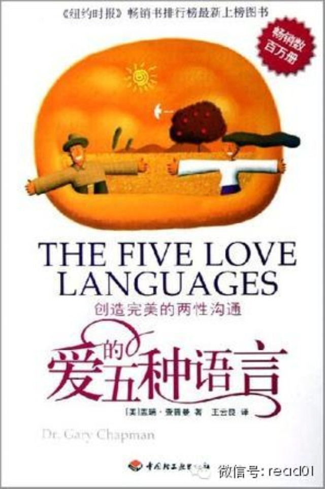

**微榜发起的2014年最有价值微信公众号的评选正在进行中，感谢大家的帮助，目前投票暂时排名第一，期待还没有投过票的读者帮下忙，投我一票。**

**点击文章最下面的【阅读原文】就可以投票**  

**  
**

****

  

推荐一本非常喜欢夫妻沟通的书籍，《爱的五种语言》，作者是位牧师，从事了二十年的婚姻辅导工作写出这本书。

热恋的时候会觉得一切都美好，甜蜜。专家提到热恋的保质期平均两年，那么如何在热恋期过后保持彼此的那份爱， 不至于像很多的夫妇，
那份爱被生活的磨碎了、枯竭了。这会是一个很有效的工具去观察对方的语言， 满足对方， 毕竟爱是要给予， 双方共同的成长。

与人交往首先要学习的是对方的语言，学习他们表达情感的方式和方法，这比做任何努力都要事半功倍。当然，很多的语言是我们与生俱来的和从小被耳濡目染养成的，虽然是很
难更改的本性，但是还是可以被习惯和改变的。

每一个人都有一个情绪的爱箱，只有当这个爱箱填满了的时候，才能给予他人爱或者自然而然的照亮别人。然而，不同人的爱箱需要用不同的语言来填满。基本上有五种爱的语言
：肯定的言词、精心的时刻（完全的同在一起）、接受礼物、服务的行动、身体的接触。

可以按下面的建议给你的另一半。

### 如何找到自己的爱语

　　 我建议了三种方式，来发现你自己的主要爱语：

　　 一、你的配偶做什么事或者不做什么事，伤害你最深？跟这件事相反的，可能就是你爱的语言。

　　 二、你最常请求你配偶的是什么？你最常请求的事，可能是最能使你感觉到爱的事。

　　 三、你通常以什么方式向你的配偶表示爱？你表示爱的方法，也许显示它会使你感觉到爱。

## 爱的方言有五种：

### 一、需要肯定的语言

　　 　　 此类型的人，其它的方言对他无效，而只有给予其肯定的语言，他才会有反应。现实生活中，有许多事业型的人大都属于此类方言的主儿。如果你在生活或事业中遇
到了特别喜欢被别人肯定和赞同的人，那么他们就属此类方言世界的人。 　　 　　 肯定的方言中还需要你做出五个方面的努力。
一是赞赏。赞赏要真心，要具体，不是溥衍。人都是有思想有灵魂的动物，是不是真心很容易就能辩别出来。如果赞赏心不诚、意不切的话，效果会适得其反。
二是鼓励。鼓励要有针对性。如果对方愿意去做的话，鼓励就是正面的，积极的。如果对方不乐意去做的，鼓励就是一种强迫，是要求，效果自然不好。
三是仁慈和爱。要带着仁慈与爱去做表达地话，肯定就是有积极意义的。
四是要谦逊。肯定对方还不能以教训的口吻。同样一个“我们需要帮助”意思，“帮我一下”和“你可不可以帮我一下？”就会得到不同的结果。

#### 爱情练习

请参考 【爱情行动】

如果你配偶的爱的语言是肯定的言词：
一、用一张3××5的卡片，写下面列出的短句。把它贴在镜子上，或者你每天都会看到的地方，来提醒自己，你配偶主要爱的语言是「肯定的言词」。

言词是重要的！言词是重要的！言词是重要的！

二、保留一个记录，写下你每天对配偶所说的肯定言词，持续一个星期。在一个星期结束后，跟配偶坐下来，看看你们的记录。

星期一，我说：「这餐饭，你做得真好。」「你穿这件衣服真好看。」「很感谢你收了晾好的衣服。」 星期二，我说：……等等。
你可能惊讶，你说肯定的言词，说得很好，或是说得很差。

三、定一个目标：连续一个月，每天给你的配偶不同的赞赏。如果，「一天一个苹果，可以免于生病」，可能，每天一句赞美的话，则可免于看心理医师。(或许你要把这些赞美
的话写下来，才不致过于重复某几句。)

四、当你在看报纸、杂志和书籍；或者，看电视、听广播的时候，留意其中所用的肯定言词。而观察人们交谈时，则把那些肯定的字句，记在笔记本里。(如果那是漫画，剪下来
，贴在笔记本上。)不时地翻阅这些本子，挑选一些适合你配偶的句子。当你用了一句，就在上面注明使用日期。你的笔记本可能会因此成为爱的小书呢！请务必牢记，肯定言词
的重要！

五、写一封情书、一段爱的短文，或是一句爱语给你的配偶；含情默默地给，或是打锣吹号热情地给！(很可能，在他离世以后，你会发现你的情书被藏在什么特别的地方。)言
词是重要的。

六、在配偶的父母和朋友面前称赞他，你将会得到加倍的功劳：配偶会感受到你的爱，而他的父母则会觉得很幸运，能有这么好的一个女婿(或者媳妇)。

七、寻找配偶的优点，并且告诉他(她)，你多么欣赏那些优点。很可能她会更努力以求名符其实。

八、告诉你的孩子，他们的母亲或父亲有多么好。当着配偶的面要这么说，而在他(她)的背后也要这么说。

九、写一首诗，描述你对配偶的感情。如果你不是诗人，就选一张能表达你心声的卡片。划出特别的字句，并在最后加上几句你自己的话。

十、如果，你发觉说「肯定的言词」对你而言太难了，在镜子前面练习。如果你需要，用一张备忘卡。请记得，字句是重要的。

### 二、关注精心时刻

　　 　　 此类型的人，十分注重细节。可能他比较关注你们在一起做事；或者是关注你与她一同聊天对话。。假如你与关注精心时刻的朋友或爱人在一起，你就一定要注意给
足时间在对方身上，不要冷落了对方。否则对方就会认为你不关心他的需求。 　　 　　 对待关注精心时刻的孩子，如果他希望你与他一起玩，就认真专注地陪伴，他会非常
地高兴，哪怕只是在玩毛线球。否则孩子也了无兴致，甚至会不再相信你，行为举止更加判逆和不可理喻。

#### 爱情练习

如果你配偶爱的语言是精心的时刻：

一、一起在你们之中一人生长的邻近地区散步。问一些有关你配偶童年的问题。例如问：「你童年最有趣的记忆是什么？」再问：「你童年中最痛苦的是什么？」

二、到市区公园去，而且租自行车。骑车直到你们觉得累了，然后坐下来，观赏鸭子。听累了鸭叫，再骑车到玫瑰花园去，分享彼此最喜欢的玫瑰花颜色，以及喜欢的理由。

三、在春天或者夏天，跟你的配偶约定共进午餐。跟他碰面，然后开车到附近的墓园。铺条桌布，一起吃三明治，并且感谢上帝，你们仍然活着。告诉彼此，你喜欢自己在离世前
所做的一件事。

四、请你的配偶列一张单子，写上他喜欢跟你一起做的五种活动。计划在接下来的五个月，每个月做一种。如果金钱是个问题，就在负担不了的理由之下，安排一些免费的活动。

五、问你的配偶，当她跟你谈话的时候，她最喜欢坐在哪儿？在下星期的一个下午，打电话给她：「这星期的一个傍晚，我要跟你约会，坐在黄沙发上谈话。哪个晚上，几点钟对
你最合适？」(如果她最喜欢的地方是三温暖浴缸，就不要说「黄沙发」！)

六、想一种你的配偶喜欢、却极少带给你乐趣的活动：橄榄球、交响乐、爵士音乐会、或者看电视睡觉。告诉你的配偶，你尝试拓宽你的见识；这个月什么时候，你希望跟她一起
参与这种活动。订一个日子，并且全力以赴。在休息时间问有关的问题。

七、计划在接下来的六个月中，来一次周末的离家出走，只有你们两个人。确定那是个周末，你不必打电话到办公室，或者每三十分钟看一次电视报告。专注于一起轻松地做些你
或你们喜欢的事。

八、每天找些时间彼此分享一些当天的事。当你们看电视新闻所花的时间，超过听彼此说话的时间时，最后你会关心波士尼亚超过关心你的配偶。

九、每三个月有一次「让我们回顾个人历史」的夜晚。专为你们个人的历史，保留一小时。选五个问题，你们分别回答。比如：㈠谁是你在学校里最好和最坏的老师？为什么？
㈡什么时候，你觉得你的父母以你为荣？　㈢你母亲所犯最大的错误是什么？　㈣你父亲所犯最大的错误是什么？
㈤有关你童年的宗教光景，你记得哪些？每一个傍晚，在分享之前，先选好你们同意的五个问题。在结束五个问题的时候，就停下来，决定下次要问的五个问题。

十、在壁炉前，或者橘红色的灯前露营。在地上铺条毯子，放好枕头。准备好可乐和玉米花。假装电视机坏了，像你们以前约会时那样谈话。如果地上太硬，回到床上。你决不会
忘记这个晚上的。

### 三、喜好接受礼物

　　 　　 此类型的人是视觉型的人，一定要看到实物才相信你对他是重视的。对付这类型的人只要记得常送小礼物就可以，而不论礼物是否轻重，关键是否精致。也许这对于
一个理财型的人就不太妙了，他认为花这些小钱根本不值得。男人讲求实际，而女人讲浪漫和情调。
尤其要注意的是，对于此类型的人非常重视节日和生日，如果没有礼物送给对方，那可是会耿耿于怀的。 　　 　　 当然，他们回馈你的方式也喜欢用小礼物来表达。

#### 爱情练习

如果你配偶爱的语言是接受礼物：

一、尝试一次礼物的大游行：在早晨留一盒糖给你的配偶(如果考虑到健康，就用酸奶糖)；下午派人送花(除非你的配偶对花过敏)；晚上送他一件衬衫。当你的配偶问：「这
是怎么一回事？」你回答：「只是试着填满你的爱箱！」

二、让大自然引导你：下回你在住家附近散步时，睁大眼睛，为你的配偶找一件礼物，那也许是一块石头、一根短棒，或者一朵花(如果花不在你的院子里，确定得到你邻居的许
可)。你甚至可以在你的天然礼物上加上特别的意义。例如：一块圆滑的石头，可以象征你的婚姻，曾经粗糙，现在已经磨滑了；一朵玫瑰花，可以提醒你，你在配偶身上所看到
的美。

三、开发「手工原作」的价值。为你的配偶做一件礼物。也许，你需要报名参加一个艺术或手工艺班：陶艺、银器、绘画、木刻等等。你上课的主要目的，是要为你的配偶做一件
礼物。一件手工制造的礼物，时常会成为传家之宝。

四、找一个星期，每天送你的配偶礼物：不需要是一个特别的星期，任何星期都行。我保证，那将会成为「那唯一的礼拜！」如果你精力充沛，你可以使它成为「那唯一的月份！
」不会的——你配偶不会期待你一生继续这么做的。

五、保存一本「礼物点子笔记本」。每一次你听见你的配偶说：「我真喜欢那个」，或者「哦，我真喜欢有一个那样的东西！」把它写在你的笔记本里。注意地听，你会有一张相
当象样的单子。当你要送礼物的时候，可以用它做为指南；如果，你想要刺激经济的成长，你们还可以一起翻阅购物目录。

六、「帮助我，我迷糊了！」如果对于如何为你的配偶选择礼物，你真的没有任何线索，就请你配偶的亲友帮助你；多数人喜欢替朋友买礼物，而使他们快乐；尤其，如果那不是
用自己的钱买的。

七、提供「亲自陪伴」为最好礼物。对你的配偶说：「这个月我要为你喜欢的事情或场合，提供我亲自相陪的礼物。你告诉我什么时候，我会尽全力陪在那儿。」准备好往好处想
。谁知道你也许会喜欢交响乐或者曲棍球。

八、给你的配偶一本书，并且同意你自己也要阅读那本书。然后提议每星期一起讨论一章，不要选一本你想要对方看的书，而要根据你配偶有兴趣的主题选书：性教育、橄榄球、
针织、金钱管理、养育孩子、宗教、或者登山旅游等。

九、送一份长存之爱的纪念品。在你配偶的生日、你们的结婚纪念日、或者其它的情况，以他(她)的名义送一份重礼给他(她)的教会，或者他(她)喜欢的慈善机构。并请那
个慈善机构寄一张回执卡片；那么教会或者慈善机构会很兴奋，而你配偶也会同样的兴奋。

十、送一份有生命的礼物。买和种一棵树、或者一棵开花的灌木，向你的配偶致敬。你可以把它种在自己的院子里；在那儿，你可以浇水、施肥：或者把它种在公园或林园里，在
那儿，别的人也可以享受。这样一来，每年你都可以因此而得到夸赞。如果，那是苹果树，在你有生之年也许可以吃到苹果。不过警告你：可千万别种山楂树(野苹果树)！

### 四、需求服务行动

　　 　　 希望对方能为自己做很多事的人就是需求服务行动的人。如果对方表达好感的方式就是主动为你做点点滴滴的事的话，就告诉你，他也希望你以此来回报他。
如果你让孩子去做事，他很乐意为之的话，那么也可以判断出他也是这类型的人。

#### 爱情练习

如果你配偶爱的语言是服务的行动：

一、把过去几星期中，你配偶对你做的请求列一张单子。每星期选做一件，把它当做爱的表示。

二、剪出一些心形的卡片，写上：「今天我会借着……表达我对你的爱。」以下面的行动之一来完成这个句子：剪草、用吸尘器吸地、洗碗、溜狗、清理金鱼缸等等。在一个月中
，每天给你的配偶一张爱的短笺，伴随着服务的行动。

三、请求你配偶做一张单子，列出十样事情，是他或她希望你能在下个月做好的。 然后，请配偶以数字1至10，标示它们的优先级。1代表最重要的，10代表最不重要的。
用这张单子为一个爱的月份，计划你的策略。(准备好跟一位快乐的配偶一同生活吧。)

四、你的配偶不在家的时候，要孩子们帮助你，为他做一些服务的行动。当他走进门，跟孩子们一起喊「大惊喜！我们爱你！」然后告诉你的配偶，你的服务行动。

五、哪样服务的行动，是你配偶唠叨不休的？为什么不决定把唠叨当做标示？由于你的配偶正标榜着，这是对他或她真正重要的事。如果你选择去行出来，做为爱的表示，那就比
千朵玫瑰更有价值。

六、如果你配偶对服务行动的请求，常常是唠叨或令人难堪的字句，不妨试着用缓和的字句把它写出来，跟你的配偶分享这个改写过的请求。例如：「亲爱的，我很爱你。你是一
个努力工作的人，我真的很感激你。我想预先谢谢你，在这个星期四玛丽和巴勃来吃晚饭以前，修剪草地。」你的丈夫可能会说：「剪草机在哪儿？我等不及了！」试试看。

七、做一些主要的服务行动，像是洗车子、做一餐饭、粉刷卧房、或者清洗地面，然后贴一张告示：「送给(配偶的名字)之爱的礼物。」然后签下你的名字。

八、如果你的钱比时间多，雇请一个人做那些你的配偶希望你做的服务行动。像是修整草地、清理房子、洗车子、洗衣服。如果你负责把它完成，即使你不在家，你也在表达爱。

九、请你的配偶告诉你，哪些是真正能对他或她表明爱的日常例行服务行动。那些可能包括了把脏衣服放进洗衣篮，把洗脸池里的头发拿出来，在晚上把衣服挂起来，出去的时候
把门关上，准备一餐饭，还有洗碗。试着把这些排进你的例行日程表。因为「小事情」的确重要。

十、定时地问你的配偶：「如果这个星期，我能做一个特别的服务行动，你想要的是什么？」如果可能，去做它；然后看着你配偶的爱箱满起来。

### 五、喜欢身体接触

　　 　　这类型的人通常喜欢与人有身体上的接触。他们表达亲密的方式就是拍拍你，摸摸碰碰，他们喜欢被拥抱。通常活泼型的人就是喜欢身体接触的人，当然也有少数有洁
癖的人除外。而正好相反的是，大多数完美型的人都不太喜欢被人随意触碰。 　　 　　 需要注意的是，对于喜欢身体接触型的人，如果你的反应过激，不接受，他们就会有
被人污辱的感觉，那对他们而言是一种极度不被尊重的表现。对于此类型的人，当他们需要被呵护和关怀时，你千言万语也比不上一个轻轻拥抱。

#### 爱情练习

如果你配偶爱的语言是身体的接触：

一、当你们从停车场走到购物中心的时候，伸出手握着你配偶的手。(当然，除非你们有三个很小的孩子。)

二、一起吃晚饭的时候，慢慢移动你的膝盖或是脚，来触摸你的配偶。小心，你不是在触摸爱犬。

三、走向你的配偶说：「最近，我告诉过你，我爱你吗？」搂着她，拥抱她，抚揉她的背，继续说：「妳最了不
起！」(抗拒想冲进卧房的诱惑。)设法脱身，继续做下一件事。

四、当你配偶坐着的时候，走到她背后，开始按摩她的肩膀。持续五分钟，除非你的配偶要求你停止。

五、在教堂里，如果你们并坐在一起，当传道人领祷告的时候，就伸手过去握住你配偶的手。

六、以按摩你配偶的脚来开始性接触；再继续到身体的其它部分，只要是那样真能够带给你的配偶快乐。

七、在三温暖浴缸里放水，然后对你的配偶宣布，你正在找一个同伴加入。

八、一起开车兜风，一边将手伸过去，抚摸你配偶的腿、肚子、手臂、手、或者……。如果他或她说「停止！」当然马上刹车。

九、当家人或朋友来访时，当着他们的面前以身体接触你的配偶。在你们站着说话的时候，一个拥抱、抚摸她的手臂、挽着他的手臂，或者只是把你的手放在她的肩头，可以得到
双倍的情绪分数。那表示：「即使有那么多人在房子里，我仍然看见你。」

十、当你的配偶到家的时候，比平时早一步去迎接他或她，然后紧紧地拥抱你的配偶。如果你们通常在门口碰面，到车房去迎接。然后，当车子转进车道时，要你的配偶停车，弯
腰探听车窗内，给他或她一个亲吻。如果你们通常在路边碰面，躲在停车处附近，当你配偶开门的时候，走出来给他或她一个拥抱。在你拥抱你的配偶前，要确定他或她看见了你
。

### 最后

　　 对此认识对我们很有必要。如果您有孩子和爱人，我们所能做的就学会不断地将爱填满对方的百宝箱。也许对爱人还难点，可是，对待孩子是你务必做到的，除非你不希望
孩子将来满怀爱心，不希望孩子更加有同情心。事实证明，没有快乐童年的孩子，没有爱心陪伴成长的孩子是不太容易有被爱的感觉的，他们也不能给别人更多的爱，因为他们爱
的百宝箱中总是空的。其实孩子4岁时就已经是一个心理专家了，他明白你的善意，他也明白基本的是非了，你只需做一个发怒状，孩子就立刻用害怕和哭泣来回应你。
在爱情的国度里，我们需要认清自己和对方的爱的语言，学会他们的语言才能让爱更有能力和意义。也许你还不能确定你是属于哪种爱的语言模式，在热恋中，五种语言模式会同
时具备在你和对方的身上；如果你一项都没有，那么先要恭喜你，你发现了你身上还可以挖掘的最宝贵的宝藏。掌握了这五种语言，将会助你一臂之力，让你收获你从未发现的原
本就属于你的幸福。

## 100天行动读者反馈

@潘美蓉

到平安夜正好完成了第一个百天行动:早起一百天，跟读奶爸推荐的ESLPOD。三月份有开始过一次白天行动，慢跑33天之后放弃，稍下的体重开始反弹。之后的几个月想
再开始也是没几天就放弃，终于9月份下定决心直到现在。一百天行动中明显自律，状态也更好，没有之前那样浮躁。其实是证明了自己可以坚持做一件事情。在11.8号W老
师的分享下知道S，马上跟着S行动起来了，也是在14年的最后两个月开始进入正循环（朗读计划已经37天，口语发音在昨天被伙伴说有进步），懂得去拒绝一些成长路上的
诱惑。感谢W感谢S，在成长路上的帮助。

@yhfly917

3月关注的微信，前面健身，早起，自学，练字各种断断续续，现在还在行动。不过调整了一下，回学校这学期坚持每天记账，百词斩背单词34天，口语练习22天，为知晨间
日记有120多篇，晚上也手写当天日记。一直不好意思发消息，因为行动力不够，但是快年底了，感谢2014能遇见您，让我不只是想想而已，而是开始行动，虽然现在效率
依旧低，还有拖延症，情绪管理不到位，还是在改变和提高就有希望遇见更好的自己！

**  
**  

  

点击文章最下面的【阅读原文】就可以投票

阅读原文

阅读

__ 举报

[阅读原文](http://mp.weixin.qq.com/s?__biz=MjM5NjA3OTM0MA==&mid=203743536&idx=1&sn
=140b92caf97dc6fe91bbc2a7f789e614&scene=1#rd)

