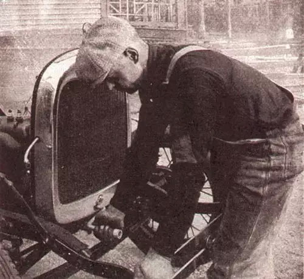
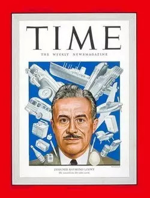
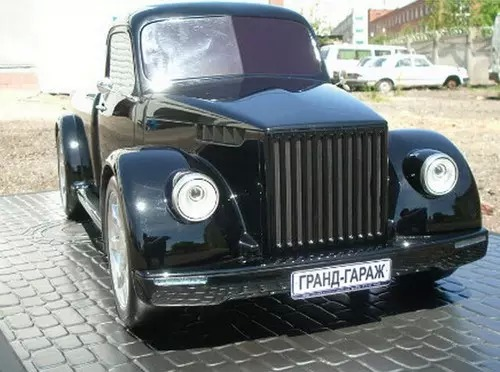
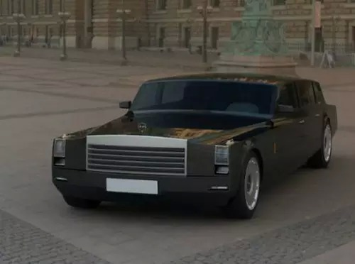
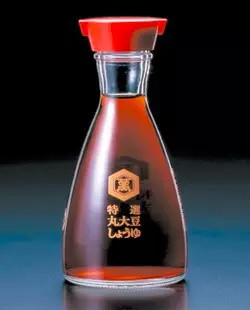
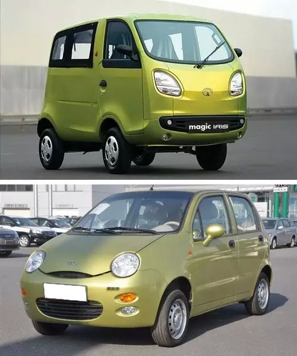
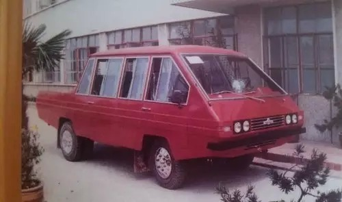
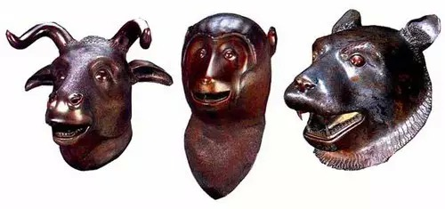
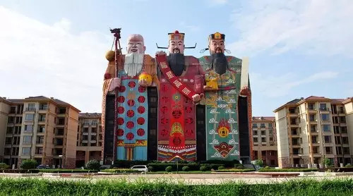

##  【推荐】为什么国货的设计这么烂

_2015-03-04_ 大象公会 大象公会

**大象公会**

idxgh2013

知识，见识，见闻。最好的饭桌谈资。知道分子的进修基地。

__ __

**文/杨晓涡**

  

羊年春节，大批赴日扫货的中国人盯上了智能马桶盖，竟使之一度断货。中国游客抢购日本大众消费品已算不上新闻，另外一款长期被中国游客青睐的日货是电饭锅，较之价格低
廉的国货，它的一大优势是由于米饭加热均匀、锅壁不粘米。  

  

其实，日本马桶盖在中国使用会有颇多问题，譬如两国民用电压不同，而且中国洗手间和淋浴间普遍设在一起，对日产马桶盖的防潮也是个大考验。讽刺的是，据说最热销的那款
马桶盖是中国产的出口日本款。

  
**日本商店外“可使用银联卡”的中文招牌**

  

中国是世界第一工业制造大国，中国企业最善于借鉴他人经验，但国货的工程设计无论功能、体验还是美学始终处于较低水平。

  

**【工业设计是怎么修炼的】**

  

工业设计水平，首先是经验积累问题。若以国外为参照，1990年代前的中国制造，几乎与二战后发展起来的现代工业设计完全无缘，近20年中国才开始有工业设计，经验和
意识刚刚才开始起步。

  

中国工业设计短板，首先是计划经济体制的结果。苏联模式的计划经济，工厂生产是完成上级的计划指令任务，不可能站在消费者角度去考虑基本功能之外的问题，甚至连基本质
量都无法保证。更重要的问题是，工业设计本身是无法被纳入指令计划系统的。

  

计划经济的鼻祖苏联，工业品以傻大黑粗著称，而在上世纪初现代工业设计诞生前夜，俄国曾在世界设计思潮中占有相当地位，但它只让苏联早期在建筑、城市规划和电影上有过
短暂的惊艳表现。

  

而中国较苏联还要逊色一筹。以汽车为例，1990年代前中国最著名的解放、东风中型货车，司机座位都是不可调节的——它无需考虑司机的身材差别，而黄河牌重型卡车的司
机在粮食紧缺的年代，其岗位的粮食定量是每月54斤，仅次于每月57斤的煤矿工人——因为没有方向盘助力，它是个重体力活工种。那个年代，中国每年有无数司机在使用手
摇曲柄发动汽车时，因发动机启动瞬间未及时抽出曲柄被打伤。

  
**手摇发动汽车引擎是一种古老的汽车启动方法，1911年，美国人Charles F. Kettering便已经发明出了电子点火装置**

  

而西方世界的生产是市场营销导向，遵从的是竞争法则，必然会逐渐发展出一套完备的工业设计体系。所以，虽然现代工业设计最早的理论探讨和思潮都源于欧洲，但美国却于1
920年代率先开启了在生产中的大规模实践运用，首先完成了工业设计的职业化。

  

另一个原因，是社会富裕程度的问题。西方国家普遍在战后进入丰裕社会，只具备基本功能的消费品很难满足社会需求，而中国1990年代后才真正摆脱匮乏。在短缺社会，工
业设计通常会处于一个较次要的位置。

  

譬如二战刚结束时的日本，工业家们依然保持战前以最低廉的方式实现简单基本功能的观念，日本后来能生产被西方社会接受的工业品，很大程度上得益于观念转变；美国著名工
业设计师雷蒙•罗维1951年赴日传授美国工业设计经验，对改变日本工业界的观念起过相当作用。

  

**雷蒙德**罗维，他的设计从飞机、轮船、火车、宇宙飞船和空间站，到邮票、口红、标志和可乐瓶。纽约时报曾评论他“塑造了现代世界的形象”**

  

近二三十年的市场竞争，让中国企业在功能性设计方面也积累了一定经验，尤其是在对中国本土市场的理解上，这是除了价格外，它们能逐渐将进口货逐出中国的重要原因。

  

譬如海尔为中国农村用户设计出了水管管径大，功率强的可洗土豆的洗衣机。而中国的DVD、VCD设计更是引领风气之先，不但解除了锁区，让中国人民能看到世界各地的碟
，而且还通过增大激光头功率，牺牲画质和寿命的方法获得了超强纠错能力，促进了劣质盗版碟市场的蓬勃发展。

  

不过，中国工业设计在功能性方面的经验积累，依然带有明显的短缺社会的特征。譬如深圳华强北是世界山寨手机的集散地，这里有各种低价格高配置高性能的山寨手机。可惜这
些诸如双卡双待的四核山寨机表面上性能优秀，但却不在意耗电量和散热问题，使用二十分钟后，电池耗光自动关机或者烫到根本不能抓握的事比比皆是。

  
**四卡四待的豪华山寨机**

  

在工业设计上，只要不涉及到审美，工业设计水平就是经验和积累的问题，很大程度上只要是开放、充分竞争的市场，中国与国外的差距可以迅速缩短。但是，涉及到审美，问题
就要复杂得多。  

  

最明显的是中国与俄罗斯的对比。中国是世界最大制造国，中国设计师比全球同行更多的机会，而俄罗斯在现代工业设计经验比中国更不足，但是，涉及到审美，中国同行较之俄
国明显有相当差距。

  

**80年前的GAZ车被俄国作坊改装成酷炫跑车**

  

  
**俄罗斯顶级豪车吉尔ZiL，明显比中国人更能捕捉到暴发户的审美口味**

  

**【长期领先的欧洲设计美学】**

  

汽车是能最集中体现一国工业设计综合水平的产品。虽然日本、韩国在质量可靠性、工程学等领域已经超越欧洲，但最顶级的汽车几乎都产自欧洲，而所谓的顶级，很大程度上日
常功能性让位于心理需求的产品，而实现这种心理需求价值最大的因素是审美。

  

在造型审美上，欧洲遥遥领先于日本、美国。欧洲车都有非常符合其定位、一眼可辨的外形；美国车虽然同样风格清晰可辨，但浓郁的美式土豪风，逼格远逊欧洲车；日本车虽以
卓越的可靠性和细节考虑著称，但始终未解决平庸、缺少个性的短板，韩国车较之差距更大。

  
**日本丰田旗下的豪华车品牌——雷克萨斯，其设计更偏美国风格，这也让它在北美备受欢迎**

  

欧洲的领先地位并不意外，它一直是世界美学相关领域理论突破和先锋实验的最前沿，最直观的是其当代艺术的发展水平。它们是工业设计中关于平面视觉、材质、造型艺术等领
域的探路先锋。

  

当代艺术的水平，甚至是各国工业设计中美学水平的直接呈现。它对工业设计的美学影响，相当于理论物理水平之于工业技术。今天工业设计中运用的美学，大都可以从现当代艺
术家那里找到源头。

  

现代设计的理论和教育体系都诞生于德国，1920年代的包豪斯设计学院之于现代设计甚至相当于耶路撒冷之于基督教，但纳粹上台后，扼杀了德国的现代设计，而战后德国的
工业设计长期秉承高度理性化的审美，在战后丰裕社会很快丧失了执牛耳的地位。

  
**包豪斯设计学院，她的成立标志着现代设计的诞生，对世界现代设计的发展产生了深远的影响，是世界上第一所完全为发展现代设计教育而建立的学院**

  

今天，欧洲工业设计中表现最杰出的是北欧和意大利。北欧温和、含蓄、优雅的审美风格，深刻影响了世界家居日用工业品的美学，而意大利人则始终引领着高端消费品的审美，
两者在各自生态位上都具有世界性的领导地位。

  

美国虽然是世界最成熟完备的市场，也是世界最早拥有完备工业设计体现的国家，但美国一直不像欧洲有众多设计理论和哲学，在先锋艺术上始终较欧洲逊色一筹，其实用主义的
设计观念在欧洲人看来就是浅薄和没文化，它确实在创新和探索上乏善可陈。

  

日本有卓越的美学传统，而且对西方美学产生过重要影响。但其在当代艺术的创新和探索与欧洲人有相当差距。日本工业设计美学中，最擅长的部分来自其文化传统，即呈现天然
材质肌理和巧妙将产品骨架结构变成美学的一部分上，但在处理现代材料的美学沉淀上，则较欧洲有明显差距。

  
**日本设计大师栄久庵宪司设计的龟甲万酱油瓶（全球销量已过4亿件）**

  

**【中国人的审美……】**

  

我们只要看一下印度人的日常审美偏好，就大体能想象印度人的工业设计水平。因为一国工业设计中体现出的美学，其实是一国整体审美水平的集中呈现。

  
**这种卡车集中体现了印度人民的审美**

  

不过，印度人的审美虽然似乎有些反现代工业审美的倾向，但中国人的审美水平与印度其实只在伯仲之间。  

  
**印度丑车塔塔Magic Iris（上）与中国奇瑞QQ**

  

中国或许是世界上最重视教育的国家，但却是最不注重美学教育的国家。一方面，中国应试教育体制在大程度地压缩与审美相关的课时，另一方面，很多中国父母却又愿意在子女
的音乐、绘画上技能培养上不惜血本，而此举培养的是一种重复和熟练性的技能，它或许能提高审美能力但却无关创造力。

  
**上世纪八十年代中国生产的春洲牌SL130GJ轻型货车**

  

而且审美能力和素养并不仅仅体现为美术、音乐的知识和技能，还体现为全社会生活态度、生活方式，以及哲学和精神等形而上的文化偏好、习惯。我们可以类比一下中国和日本
在突然成为世界上最有购买力的人群时的异同。

  

中国与日本在突然有钱时，有些表现是高度一致的：普通中产蜂拥到发达国家后，先在著名旅游景点前留下到此一游的影像记录，然后到奢侈品店疯狂扫货，甚至给人留下了东亚
人特别喜欢箱包之类奢侈品的印象。特别有钱的人则到西方国家购买各种不动产。

  

但在西方各大拍卖会上的中日企业家们的表现则有很大不同，中国富豪高价追逐的是中国文物，尤其对圆明园兽头之类价值可疑的东西喜欢一掷千金。而日本企业家最青睐的是西
方当代艺术品，1970年代日本兴起的西方当代艺术收藏热，导致除少数经典外，西方印象派绘画很大部分被转移到了日本。

  
**2000年，索斯比和佳士得拍卖圆明园大水法前十二铜兽头中的虎头、牛头和猴头。被中国保利集团公司以总价3000万港元购回**

  

今天典型的中国看法是，日本人对艺术品的狂热相当于被西方人劫了浮财，对日本而言，则相当于一次对西方文化的深切拥抱，大幅提高了全民的现代艺术审美水平。

  

当然，中国有钱人也兴起了收藏热，当然被收藏对象是祖国传统文化宝藏，诸如各种石头、木头以及被各种仁波切们开光的小物件，它当然会影响中国精英人群的审美，但与世界
当代审美而言，是在深山里自开了一条方向不同的小道。

  

中日在有钱后追求上的差别其实并不令人意外。

  

戴季陶在《日本论》中就对比过中日两国在审美上的巨大差别，为不得罪爱国青年，这里只摘录戴氏最温和的一句话“日本民族一般比中国人审美的情绪优美而丰富，这恐怕是的
确的批评罢。”嫌不过瘾的请自行谷歌。

  
**位于河北廊坊的天子大酒店体现了戴季陶所批评的中国式审美**

  

如果中国人在艺术和审美上存在传统文化因素的短板，或许陈寅恪老先生总结的最精当，他在1919-1921年留美期间曾对吴宓讲过这样的观点：

> 中国之哲学、美术，远不如希腊，不特科学为逊泰西也。但中国古人，素擅长政治及实践伦理学，与罗马人最相似。其言道德，惟重实用，不究虚理，其长处，短处均在此…
…此后若中国之实业发达，生计优裕，财源浚辟，则中国人经商营业之长技，可得其用；而中国人当可为世界之富商。然若冀中国人以学问、美术等之造诣胜人，则决难必也。

陈的话用在这里或许可以这样解释概括，美学、艺术归根到底决定于一个文化中形而上学的传统，而中国近两千年来，从来没有发育出西方那种形而上学的体系和传统，即使较之
日本也明显逊色。

  

或许可以打这样一个比方，一个热爱歌舞的非洲部落或许可以诞生今天看来非常优秀的乐感和音乐形式，但它永远不会诞生伟大的巴赫。因为巴赫献给上帝的音乐，是一整套数学
的逻辑，它的出现绝非偶然，是西方音乐在宗教等形而上学指引之下一层层进步的必然结果。

  

**【中国会有卓越的现代设计吗】**

  

中国会有卓越的现代设计吗？当然会有。

  

我们今天常常把工业品的设计与建筑设计分开，但在设计界却并不这么看，因为两者同源，最早开启现代工业设计思潮的就是一群欧洲建筑师。在德国，建筑设计师与一般工业品
设计师的分离甚至到了1960年代才完成。

  

所以，谈到现代设计，现代建筑与现代工业制造是一体的。如果把建筑算在内，中国从1980年代开始，就有了一批卓越的现代设计。而且今天中国甚至是卓越的现代建筑最多
的国家，因为中国是世界上少数花得起大价钱能请西方设计师建造一流建筑的甲方。

  

但是，一件卓越的工业产品要比一桩卓越的建筑难得多。因为单个建筑虽然造价高昂结构复杂，但它能为了实现审美效果可以忍受很大幅度的预算支出。譬如1980年代北京请
贝聿铭设计香山饭店时，为了增强铺地装饰效果的小鹅卵石，每个价格超过一个鸡蛋，这在当时的中国极为奢侈。但最终资本向艺术做出了妥协。

  
**香山饭店**

  

但工业消费品则不然，对一辆汽车来说，几美元的成本变动就需要反复考虑。相对建筑设计，工业消费品在基本功能外的使用体验上，必须做出非常大的妥协，至于审美就更为奢
侈，在审美上极端任性、偏执的老板必然会付出极大的商业代价。

  

只有在生态位上占据高端位置，并且有品牌号召力的工业消费品才敢于在审美上下本钱，最典型的是豪华跑车，如果它在追求上冒险获得了成功，则可用品牌和审美上的溢价来弥
补销售量的损失。

  

前面谈到，中国工业设计整体上的水平决定了本土设计师很难拿出设计卓越的工业消费品，但中国企业发展到今天，在资本实力上倒是具备了拿出卓越工业设计的能力。

  

但是，两大因素使得中国工业消费品很难出现卓越的工业设计：1、中国品牌的工业消费品占据的都是市场低端生态位，拼的是性价比，不可能在基本功能外有过多追求；2、中
国企业老板的整体低下的审美能力和品位，决定了他们在面临利润和审美的选择时，会自动选择前者。

  

这两个掣肘决定了中国企业即使有钱请国外的设计团队，也很难拿出卓越的产品。所以，虽然中国制造业世界第一，但世界著名设计奖的榜单上，很难见到中国品牌的名字。

  

没错，刚刚揭晓的2015年第62届iF国际设计奖，锤子科技出品的SmartisanT1智能手机，获得该奖项的最高级别奖项——iF国际设计奖金奖。iF国际设计
奖是世界设计最权威的榜单，而SmartisanT1是自iF设计奖成立以来，唯一获得该奖的中国大陆智能手机。

  

你只需要知道SmartisanT1战胜的对手中有赫赫有名的Iphone6/Iphone6 plus和索尼的Xperia就知道它的含金量了。但是，它并不意味着
中国工业产品自此经常有机会成为这个最高该奖的获得者，某种程度上，它依然是个小概率事件。因为在中国，一个企业的最高决策者在拥有卓越的审美能力同时，还是任性、偏
执的，这种事情并不容易发生。

  

阅读

__ 举报

[阅读原文](http://mp.weixin.qq.com/s?__biz=MjM5NzQwNjcyMQ==&mid=211173844&idx=1&sn
=c5328318063b3453238680e530c08fa7&scene=1#rd)

