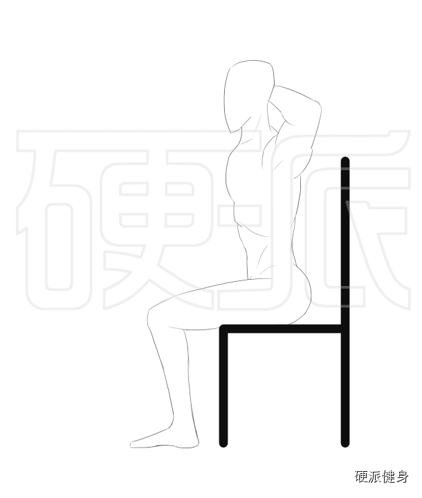
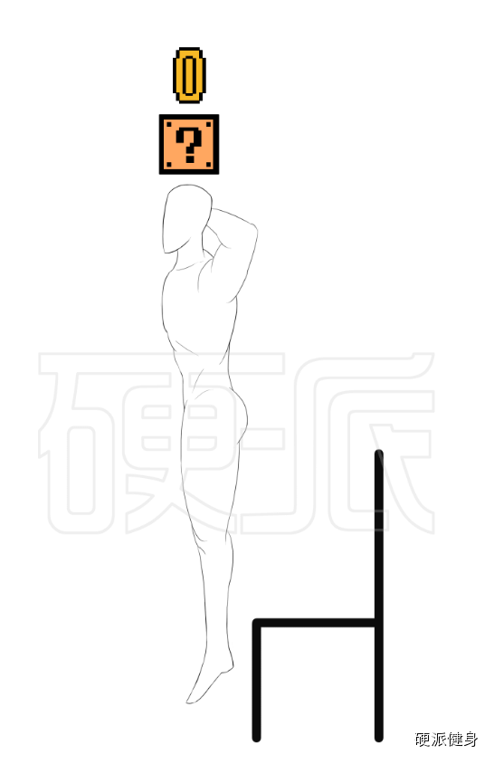
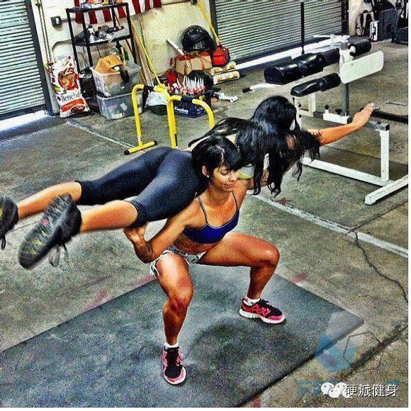
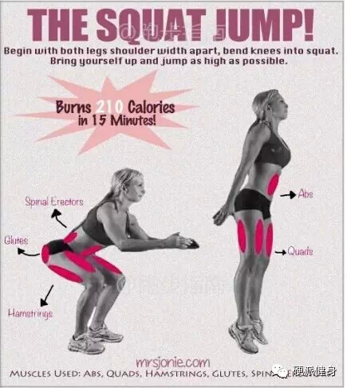
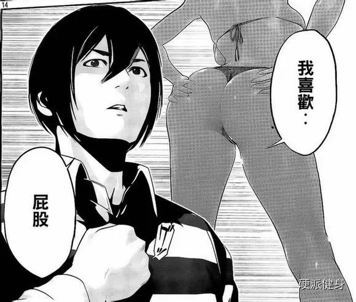
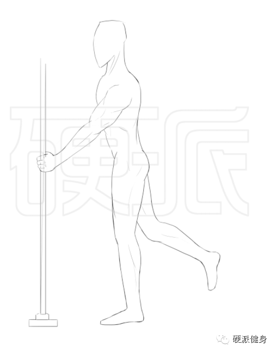
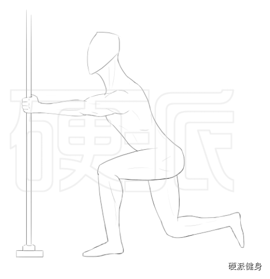
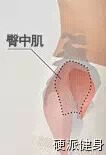
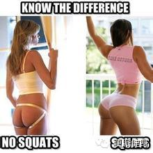
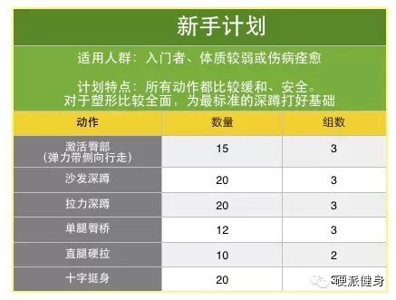

点击上方蓝色的硬派健身，或者右上角三个点可以关注我呦~~~

  

小伙伴儿们，看了上次深蹲有图有动作有真相的一贴。你们好好训练了吗？

  

不要FACE的自夸一句……不少朋友都表示，沙发深蹲和拉力深蹲两种改良方式不要太给力。多年没找到深蹲练臀的感觉，一次就能掌握了。

  

今天算是这回专题的最后一期。介绍两种基于上次深蹲的进阶版本。有了这两种深蹲，你就能组合成一套完美的居家徒手深蹲动作啦~

  

****沙发深蹲跳：极限燃脂，极限塑形。** 

“感觉上回介绍的三种深蹲都太温和了。不给力呀老湿”

“嫌温和？这回来个减脂和塑形都超给力的！”

  

  

沙发深蹲跳动作要点：

1.与沙发深蹲前两步一样。从站立姿势慢慢坐在沙发上，双手置于脑后。

2.背部挺直微反弓（重要）**，把臀部往沙发深处挪移！就是往深处坐，坐得非常靠里。**

** **

3.臀部发力至后脚跟！用爆发力让自己**跳起来**！落地时要柔和，用肌肉做缓冲。

  

在居家训练中，很多训练水平比较高的朋友，常常会觉得徒手动作一点都达不到训练效果。就算找一些负重，一般男性怎么也能蹲到50+Kg以上。然而家里哪儿来的100斤
重物呢？难不成扛着女友练吗？

在这种情况下，用“跳跃”这种爆发力的**等动收缩**动作，会能更好的塑形并且燃脂。

  

等动收缩是什么意思？和平时深蹲有什么差别？等动收缩就是指，在整个运动过程中，所有肌肉都发挥了自己最大力量的一种收缩形式①。

  

举个不算精确的例子。比如平时深蹲，当你能负重深蹲100公斤，那么你空手深蹲，目的只是蹲起来的时候，实际上是发挥不了自己最大的力量的。

  

但如果你进行空手深蹲跳时，由于你的目标是让自己尽可能跳得更高。实际上在运动过程中，你会发挥自己接近100%的力量。

  

在实验中，研究者也发现，进行等动训练，比起传统训练提高肌肉力量和塑形的效果要高得多①。而且这类跳起、落地的动作（等动与超等长收缩），也可以让你消耗更多的脂肪
和热量！塑形减脂的朋友，一定不能错过！

  

****单腿拉力深蹲：不仅翘，更显腿长。**

“完美的屁股，不光要‘挺’（臀大肌），还要‘翘’（臀中肌）。”

“翘的臀部，还能显腿长哦~~~~”

  

单腿拉力深蹲动作要点：  

1.双手置于胸部以下，跟肚脐差不多高度。**单腿向后抬起。**握住一个固定的支点（一定要结实啊！别拉断你家什么管道柜门儿。寄给我账单我也不认。）。

2.整个身子向后下方坐，上半身挺直（微微反弓，就是挺胸挺肚子的感觉），头部正视前方。双手拉住固定点防止自己向后摔。**虽然叫拉力深蹲，但其实双臂不要使太多劲
儿！只有自己要摔倒的时候才稍微拽一下。**

臀部的曲线，尤其从侧面看。不光是由臀大肌决定的，臀部上部的臀中肌，更能决定身体中部的曲线走向。也就是说，翘不翘，是臀中肌发展程度决定的。

  

而臀中肌发展还有另一项好处，就如同我经常说的“**胸大显腰细，臀翘衬腿长**”。腿的长度在你成年以后就很难变化了。然而，腿看起来长不长，可以是由臀部翘不翘决
定的。

  

_哪个显腿长，一目了然~_

  

我们一直介绍的深蹲，都是着重发展臀大肌的动作。而发展臀中肌的动作，大多数都是单腿进行的。在健身房里，我们有很多特定的器械，可以有效训练到臀中肌。然而在家庭中
，很难进行比较稳定的单腿臀腿训练。

  

不过，缺的不就是左右和前后的重心稳定吗？正好，拉力深蹲可以解决所有的问题。既然臀腿不能稳定，那就让手扶着什么稳定好咯~~~

  

单腿拉力深蹲，可以有效地训练臀大肌和臀中肌，是很好的针对性翘臀动作。请塑形的朋友不要错过哦~！

**深蹲翘臀**简易计划表

  

最后是两个计划表，分为新手和进阶两种。请大家放到自己的健身计划**臀腿训练中。有关健身计划制定，回复：**训练计划** 了解更多。

  

文内的动作可以回复那个动作的名字查看。比如回复**：激活臀部****。**  

**  
**

激活臀部可以当做热身组。如果没有弹力带，也可以慢跑5分钟热身。

  

减脂的同学，可在训练后加15-30分钟HIIT的有氧训练。

  

**~~~****喜欢的话，请分享到自己的朋友或朋友圈，谢谢大家****~~~**

**  
**

**恩恩****……****求多分享啊**

**  
**

**觉得本文有用的朋友可以给我点个赞（最底下）**

**  
**

**  
**

①陆葵 短期等动训练对肌肉力量增长影响的思考 1996

阅读

__ 举报

[阅读原文](http://mp.weixin.qq.com/s?__biz=MzA5NjQwMTQxOA==&mid=203726053&idx=1&sn
=abdbca7316b76596dab8479781f4e2b3&scene=1#rd)

