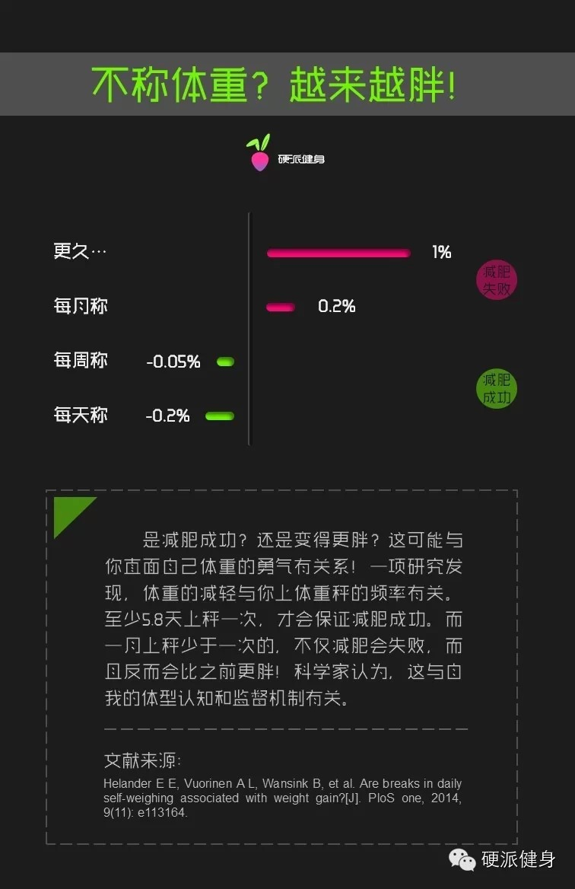
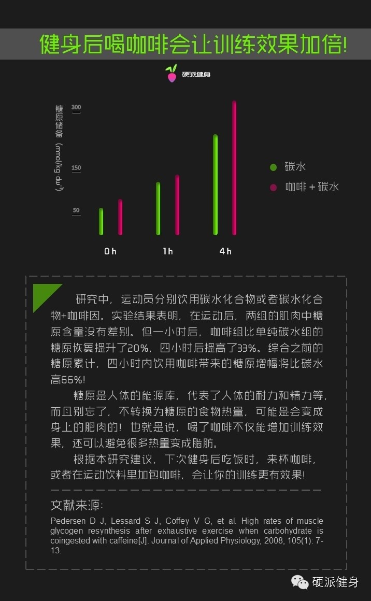
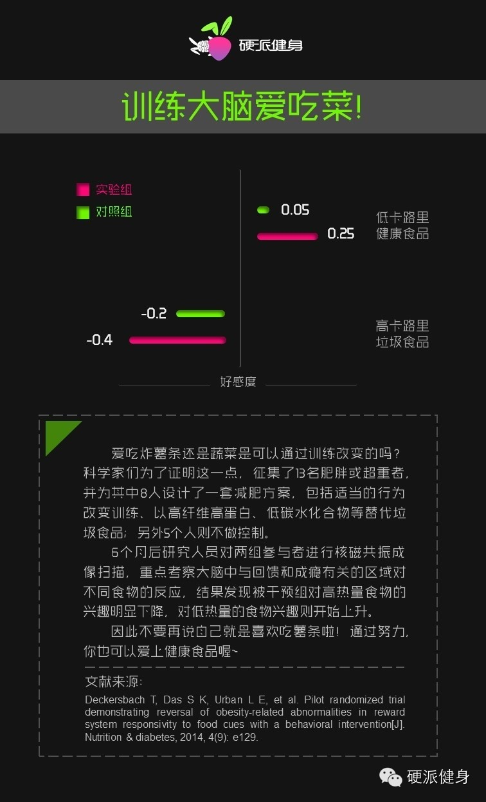
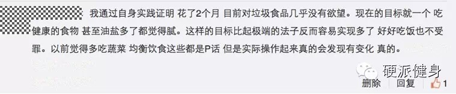
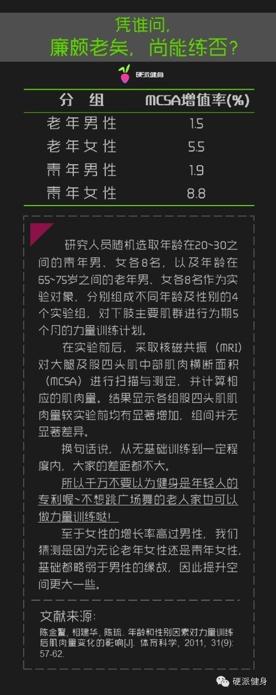
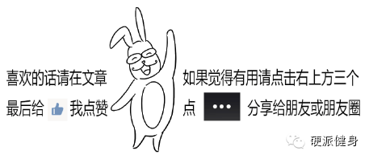

##  【硬派健身】本周微博精选：小知识

_2015-01-18_ _斌卡_ 硬派健身

　　从上周开始我们装死了很久（……）的微博重新活过来了哟！有不少细心的死忠粉已经发现了，但还有不少新读者还不知道，所以我们特意为没有看到微博的读者盆友们做了
一个精选。

　　微博内容跟微信不同，是一些短小有趣的健身小科普、单一知识点 & 趣闻，本篇是单一知识 & 科普类。由于是精选，有一些微博内容我们舍去了。

****

1

**　　减肥时，每天称体重可以让你更瘦！**一项研究发现，在减肥过程中，体重的减轻与你上体重秤的频率有关。在美国康奈尔大学实验中，科学家发现与每天上秤的人相比，一月不上一次秤的人不仅减肥会失败，而且体重反而会增加1%左右。（PS:此实验证明称体重和体重减轻是弱因果关系，不是正相关。由于自己对体型认知的修正等，导致了减肥行为的改善。）  

　　看到这条你是不是忍不住立即去称体重了呢？小声告诉你们：周三时体重最轻喔~

  

２

　**　健身后喝咖啡会让训练效果加倍？**《应用生理学》上的一篇文章似乎是支持这个说法的。科学家们进行了一次双盲实验，实验结果表明运动后摄入咖啡因可以提高机体耐力，相比那些只摄入碳水化合物的人，同时摄入咖啡因和碳水的人肌肉多产生66%的糖原。而糖原可以在人运动时提供能量，增强肌肉力量和持久性。

　　但是要注意，这里说的咖啡可是不含糖和奶的黑咖啡，可不是奶油满满的卡布奇诺什么的~

３

　　**天生爱吃垃圾食品？别给自己找借口啦！**美国塔夫茨大学等机构做了一组实验，证明人类的饮食是可以通过训练来改变的。他们征集了13名肥胖或超重者并分为两组，一组加以控制，另一组放任自流。6个月后对两组参与者做了核磁共振成像，发现被干预组对低热量食物的兴趣明显增加，对垃圾食品的兴趣下降。

　　评论里很多小伙伴纷纷表示的确是这样，在控制饮食X个月后看到高热量垃圾食品就不高兴了呢！

　　只能说，我们的读者实在是太赞了！

另外，注意我们说的是【高热量“垃圾”食物】，而不只是【高热量食物】！像三文鱼、坚果这种虽然热量高，但又健（hao）康（chi）的谁说是垃圾食品我跟他拼命啊！

　　(ˉ﹃ˉ)

４

　　**害怕因为年龄让健身效果大打折扣？你想太多了！**一组实验表明，结果显示力量训练后，年龄和性别均不会对人体肌肉量的变化产生影响。实验召集了16名志愿者，按照年龄和性别分成不同的小组，对下肢进行为期5个月的力量训练，结果显示不同年龄性别在对肌肉量变化的影响上并无显著差异。

　　看完这个你是不是想说服自己的父母一起去健身了呢？我们之前也有写过关于父辈们健身的文章哟，回复 中年 了解更多。

  

　　好啦，关于小知识类的微博就是这些啦～ 想第一时间知道这些消息的话请关注我们的微博 @硬派健身 哟～

　　请点击今天的第二条推送查看趣闻类微博～

阅读

__ 举报

[阅读原文](http://mp.weixin.qq.com/s?__biz=MzA5NjQwMTQxOA==&mid=205172523&idx=1&sn
=cec7090fb4e82692d3efdf1b07192459&scene=1#rd)

