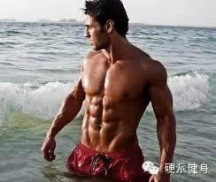

点击上方蓝色的硬派健身，或者右上角三个点可以关注我呦~~~

  

肌酸可能是大家听说最多的增肌补剂了。很多初入门者或非运动人士，都可能会对肌酸产生一定的误解，甚至会与兴奋剂、类固醇等混淆。认为肌酸是一种能增肌增力，但伤身伤
体的禁药。

  

其实不然，肌酸是比较安全的运动补剂，而且经过一个多世纪的实验（人体和动物都很多了，至少有数百实验）验证。今天我们就来谈谈肌酸的效用和安全性。

  

和以前一样，不要问我买什么牌子哦，有质量保障的都可以。

肌酸简述——天然可补充

  

肌酸是一种天然的在肉类和鱼类中大量存在的营养物质（所以人们总说吃肉长劲儿嘛，相关的一些，回复：猪牛鸡肉
了解更多）。同时肌酸也可以被我们的肝脏、肾脏、胰脏天然合成。95%的体内肌酸都存在于骨骼肌里，其他部分含量最高的是心脏、脑、睾丸和米青液……

  

一般来讲，食用红肉等就可以获取比较足够的肌酸了**。但问题是，肌酸很容易在烹饪过程中由于高温或过水等丧失。**比如牛肉猪肉，肌酸含量都不错，但是国人比较喜欢
红烧和罐焖呀……温度又高，烹饪时间又长，肌酸被破坏的很严重。

**  
**

** 另外，膳食中过高的脂肪也会减低肌肉对肌酸的摄取，降低肌肉中肌酸的可用率。**所以现代人的饮食习惯很可能会导致肌酸摄取不理想。

  

肌酸的作用——增力、促恢复、长瘦体重。

  

肌酸是最常见、最安全、最有实际作用的健身补剂之一。肌酸可以比较明显的提升训练者的运动表现和恢复能力。肌肉、心肌、平滑肌、脑、眼、神经器官等都通过肌酸来增加能
源。提升细胞内肌酸的水平，可以增进这些器官在运动中的能力。肌酸可以比较明显的增加单次和重复高强度运动中肌肉的的ATP浓度①，增大力量并使人体不会过早疲劳。

  

另外，肌酸可以促进身体的恢复和肌蛋白合成。肌酸可以促进身体对能源的使用，所以相应的可以促进瘦体重（肌肉）的生长和身体的恢复。研究表明肌酸会在短期内促进瘦体重
的增加，但不会影响体脂水平②。

  

**肌酸增加瞬间爆发力和最大力量。**对于进行健身训练，增肌训练的童鞋来说，这个可能是最看重的啦~肌酸和磷酸肌酸的储量增加，可以维持高强度运动时ATP的水平，并促进反复高强度运动间歇期，体内CP的再合成。一项研究中，被实验人员服用肌酸后，最大用力时，肌肉收缩能力和最大力量、单次冲刺能力增加5%以上③。

  

放到我们实际训练中的意思就是，肌酸可以比较有效的提高你单次动作的最大力量。比如以前你深蹲100kg，在服用肌酸后，可能会能提升个5-10kg。

  

另外，**肌酸还可以比较明显的增加无氧耐力。**研究者对比了3组青少年专业游泳运动员。最后发现，中长期补充肌酸训练（9周）的研究者，重复冲刺能力有明显增强。

  

放到实际训练中，重复冲刺能力其实就接近无氧耐力。比如你深蹲100kg，平时一分钟休息后只能再蹲90kg。服用肌酸后，可能还可以深蹲98kg，或者可以缩短一定
的组间休息时间。

  

一项研究综述了大量文献和数据，**最后认为训练期补充肌酸1-2个月，可以提升冲刺能力（爆发力）5%-8%，最大力量5%-15%，瘦体重1%-3%④。**

  

另外，在近些年的研究中也发现，肌酸也可以使运动员提升长跑等有氧运动的耐力⑥。

  

肌酸的安全性——百年研究，安全、无副作用。  

在给人体使用肌酸，并进行安全性实验一个多世纪后，瑞典的Balsom博士在一篇综述性文章中提到：“在我们知识体系中最好的一件事就是，肌酸在目前所被证实的副作用
只是增加机体的质量。⑦”

  

几乎所有研究都认为，肌酸是一种有效和安全的营养补剂⑧。健康成年人每天较大剂量（20g）服用肌酸5周，肾、肝、血液等都未产生副作用，所有测试指标均健康正常⑨。

  

人体的肌肉肌酸含量上限为160mmol/kg干重肌肉。当肌酸超过上限，人体会通过肾脏将肌酸排出体外。有人可能会担心这对肾脏有副作用。**不过研究发现，肌酸是
小分子量物质，其由肾脏以弥散的方式排出，无需能量，所以肌酸的补充对于没有肾脏疾患的人是不会产生危害的**⑩。

  

下一期要解决的问题……

  

肌酸如何服用？

补剂商和私教常推荐的冲击期（短时间，大剂量吃肌酸）是对的吗？

外源肌酸是否会抑制人体自合成肌酸？

肌酸服用有什么注意问题？

  

**~~~****喜欢的话，请分享到自己的朋友或朋友圈，谢谢大家****~~~**

**  
**

**恩恩****……****求多分享啊**

**  
**

**觉得本文有用的朋友可以给我点个赞（最底下）**

  

① Kreider R. B. Creatine, the next ergogenic supplement. Sportscience Training
& Technology. lnternet Society for Sport Science 1998

② Mitchell T, Almada A, and Earnest C. Safety report on creatine.

③ Kreider R.B.Creatine supplementation:Analysis of ergogenic value,medical
safety,and concerns.JEPonline Vol.1,1998.  
④ Grindstaff P. D, Kreider R, Bishop R, Wilson M, Wood L, Alexander C,and
Almada A.Creatine improves swim-sprint performance.lnternatiional J.Of Sport
Nutrition.7,1997  
⑤Kreider R.B.Creatine supplementation:Analysis of ergogenic value,medical
safety,and concerns.JEPonline Vol.1,1998.  
⑥ Grenhaff P. Update-Creatine, ingestion and exercise performance,Coaching
Focus 1993,  
⑦Kreider R.B.Creatine supplementation:Analysis of ergogenic value,medical
safety,and concerns.JEPonline Vol.1,1998.  
⑧ Sewell D,Robinson T,Casey A,and Greemhaff P.No health risk for acute creatin
e supplementation.

⑨ Ziegenfuss T,Lemon P,Roger M,Ross R,and Yarasheski K. Acute creatine
ingestion: effects on muscle volue, Anabolic power,fluid volumes,and protein
turnover. Med. Sci. SportsExerc 1997;  
⑩ Grenhaff P. Update-Creatine, ingestion and exercise performance,Coaching
Focus 1993,  

阅读

__ 举报

[阅读原文](http://mp.weixin.qq.com/s?__biz=MzA5NjQwMTQxOA==&mid=203895711&idx=1&sn
=41297577107d374afa61134ae4d4ed8a&scene=1#rd)

