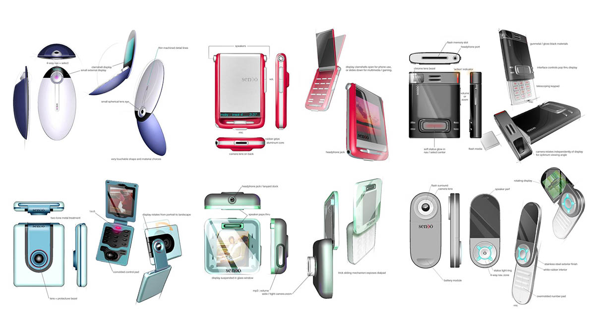
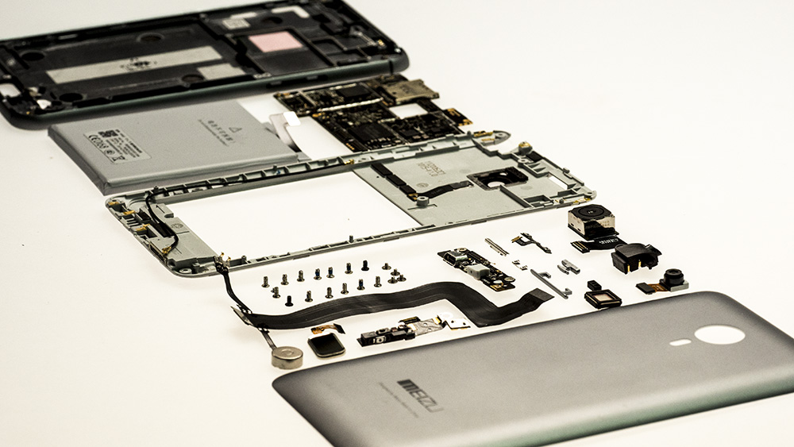
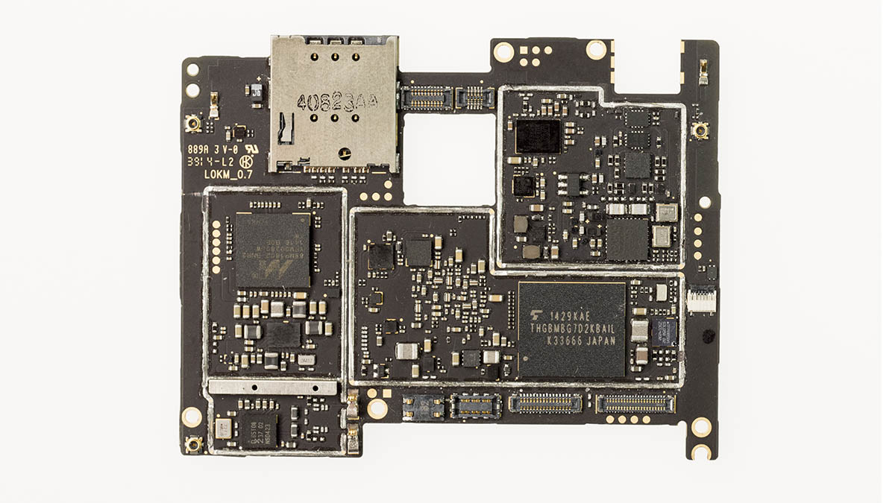

「这是一个最好的时代，也是一个最坏的时代。」用这句话来形容现今炙手可热的智能手机行业再好不过，在这短短十几年的发展中，智能手机可谓雨后春笋般，全球涌现除了近
百个手机品牌，设计生产了高达一万多款，有些产品甚至有着工艺品级别的评价，不仅在当时备受追捧，现在回过头来看，也足以经典。  

  

在这些光鲜时尚的智能手机背后，厂商们又是如何在实验室去设计打磨这些手机的呢？

今天，笔者试着以简单而总结性的描述来还原一款手机的诞生过程。

  

一部手机的诞生，需要大量工程师们的参与，划分为类别的话，就有如下 6 个：

  

  * ID(Industry Design) 工业设计

  

  * MD(Mechanical Design) 结构设计

  

  * HW(Hardware) 硬件设计

  

  * SW(Software) 软件设计

  

  * PM(Project Management) 项目管理

  

  * QA(Quality Assurance) 质量监督

  

**ID(Industry Design) 工业设计 **

  

手机的工业设计（ID）包括手机外观、手感、材质、颜色搭配，手机上看得见摸得着的地方都是属于 ID
设计的范畴，例如边框用金属还是塑料，背面是弧形的还是直面，用哪几种颜色来搭配等。

  

工业设计（ID）首要考虑的是视觉效果，它的好坏直接影响着一部手机是否漂亮、经典。产品立项后工业设计师们就开始各种天马行空的构思，甚至轮番的头脑风暴，重绘成百
上千张草图也不是没可能。

  

有些作品由于太超前，终究只能留存在设计师们的电脑里，最终方案敲定后，要想实现它，就得靠接下来要说的结构设计师。

  

****MD(Mechanical Design) 结构设计** **

  

  

  

如果工业设计（ID）追求的是视觉感光的效果，那么结构设计（MD）就是力求将这种效果真实还原的方式。ID 设计确定手机的外形后，MD
就来一步步去搭建这个手机内部的所有零配件。

  

例如做成一体还是可拆卸后盖、框架选用金属还是塑料、后壳如何固定在框架上、电池怎么放、主板做成长的还是方的、屏幕用全贴合还是框贴等等，还有所有零件的尺寸把控。

  

这就好比搭建一所房子，ID 完成的就是房子的主体框架，MD 则是给房子内部改造装修，然后置办的家具摆设好丰富起来。

  

如果 ID 给的外观设计太难实现，这时候 MD 跟 ID 设计师们就要坐下来好好谈谈了，光有天才 ID
设计师还不够，往往还需要结构工程师来把这个天才的设计去付诸实践，这两者是相辅相成的。

  

MD 设计在手机设计过程中的重要性不言而喻，它的设计不合理，就会造成设计缺陷。

  

****HW(Hardware) 硬件设计** **

  

  

  

硬件主要设计电路以及天线，实现手机的配置需求。  

  

电路部分先根据配置参数制作一个放大版的 PCB 主板，进行各种调试，方案可行后再浓缩做成手机主板。

  

主板的设计又分单面布局和双面布局，单面布局意味着主板上的所有零件全部排布在一面，背面没有零件；双面布局则是两面都有零件，而双面布局的主板相对单面会厚一点，但
是单面主板的面积就会比双面大，用单面还是双面的主板这就要看结构是怎么设计，所以说硬件设计（HW）设计的过程也是跟结构设计（MD）协商的过程。

  

硬件设计（HW）还有一个重要的一个部分就是天线设计，手机支持的频段越来越多，天线设计就越考验硬件设计（HW）工程师们的智慧和经验，天线必须离电池远，并且附近
不能有金属器件，可以说为了兼顾天线的设计，ID 设计和 MD 设计都要为硬件设计（HW）的天线设计让路，明显的例子就是 iPhone6/Plus
上备受吐槽的天线条，这就是为了兼顾信号问题所做的妥协。

  

**SW(Software) 软件设计 **

  

  

软件设计（SW）这个很好理解，就是在手机上运行的系统。

  

在主板硬件和操作系统之间，又有一个叫做 BSP（Board Support Package)
的东西，是板级支持包，也可以说是属于操作系统的一部分，主要目的是为了支持操作系统，使之能够更好的运行于硬件主板。

  

软件设计（SW）是一个无底洞的工程，硬件部分的东西可能一次开发定稿就完成了使命，但是软件开发必须不停的迭代更新，开发新功能、修复
Bug、完善稳定、开发新功能……这样一个无限循环的过程。

  

软件部分在智能手机中的地位日益凸显，智能不仅要体现在硬件配置的强悍上，更多功能的实现还需要软件层面的创意，软件设计的使命就是让现有的硬件的潜能发挥到极致，这
也是软件设计的伟大之处。

  

**(Project Management) 项目管理 **

  

PM 也分技术和非技术型，分工也比较细致，制定项目规划和进度，同时也是对外部门的发言人，如果 MD 的设计要兼顾 HW，就需要 PM
出面进行沟通协调，寻求双方可以接受的解决方案。

  

当然，研发的老大也是一个大 PM，各部门的 PM 需要定时向大 PM 汇报成果和进度，以及开发过程中遇到的难题等。

  

**QA(Quality Assurance) 质量监督 **

  

中国质量管理协会对 QA 的定义是：「企业为用户在产品质量方面提供的担保，保证用户购得的产品在寿命期内质量可靠。

  

QA 在手机制作中担当着质量把关的工作，项目是否可行，质量可靠性怎么样，每一个创新都需要经过 QA
的测试审核，如果发现生产难度太大良品率低或者通过不了测试环节，那么这个方案就会被否决了。

  

生产一部手机不是在实验室内做实验那么简单，一旦生产就是成千上万部，要保证每一部产品的优质绝非一件简单容易的事，生产一部手机的样品和生产 10
万部手机完全是两码子事。

  

制造一部手机，简单点说就是这几大流程，每个公司的实施方案根据自身的经验习惯可能不尽相同。

  

**手机制造是一个庞大的系统工程，在这个过程中需要各部门的不断配合、协调和磨合，有时也不得不做出妥协，但共同打造出一部优秀的手机是不变的追求。**

  

阅读原文

阅读

__ 举报

[阅读原文](http://mp.weixin.qq.com/s?__biz=MzA3OTQzNzAxMg==&mid=204526740&idx=1&sn
=3870b8f52a98c00a3ed21f8f7876c9ad&scene=1#rd)

