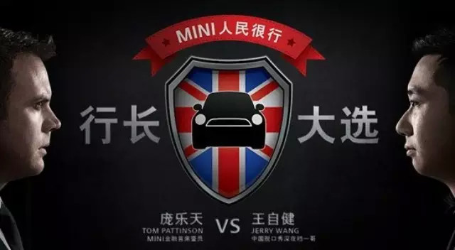
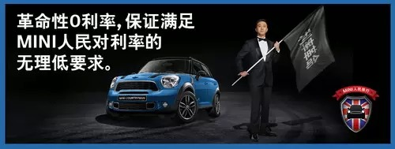
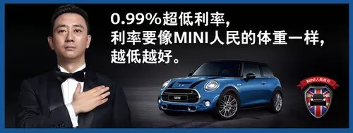

##  一个相声演员的金融方案

_2015-03-07_ 大象公会 大象公会

**大象公会** 

idxgh2013

知识，见识，见闻。最好的饭桌谈资。知道分子的进修基地。

__ __

**“相声是一门语言艺术，讲究四门功课——说、学、逗、唱。”**

  

**近期，平日在舞台上习惯了说学逗唱的相声演员王自健摇身一变，当选为MINI人民很行的行长，他甚至还淘汰了一位MINI金融选派的专业人士。由一个相声演员为消费者提供购车建议？难道相声的四门功课真的无所不包，还要有金融知识打底？这当然是MINI中国一场博人眼球的营销秀。**

**  
**

**  
**

**  
**

**当王自健面对“选民”侃侃而谈，阐述自己支持的购车金融方案时，“汽车金融”的概念才第一次清晰、主动、带有诱惑力的走到了消费者跟前。  
**

  

**如果说余额宝、理财通等互联网金融产品是将人们储蓄卡里的钱转移出来创造更多财富，那么汽车金融服务则是为人们提供了各式没钱的买车办法。**

  

**没钱还想消费，不就是贷款么？即使是在消费观念得以解放的今天，贷款买车依旧被人们认为是“打肿脸充胖子”的虚荣行为。说来也对，疯狂蹿升的房价刚让人们在心惊胆战中对残酷的贷款买房有了适应性，现在又要用贷款买车来蚕食本就剩不下多少的收入，这就说明自己真心买不起，根本没这个必要去惦记。**

  

**“要买就全款，否则就不买”的想法也因此得到了绝大部分人的赞同。当土豪用现金一掷就是几套别墅的时候，贷款买车的确显得是有几分辛酸。**

  

**不过在熟悉了用贷款来提前享受生活的乐趣之后，为什么买房可以、刷信用卡可以，而偏偏买车不行呢？答案很简单——利息。银行高额的利息会让你在好不容易还清贷款之时，无奈的发现自己还的利息都够再买一辆车。**

**  
**

**   
**

**  
**

**“都是利息逼的。”这本该是余额宝、理财通们的台词——几乎可以忽略不计的银行利息让人们想都不想便把卡里的钱存入了各式各样的理财产品；而在近些年，银行贷款利息过高也成为了更多人选择成长迅速的汽车金融服务解决买车问题的最大因素：  
**

  

**2014年年初，四大商业银行汽车贷款存量为400亿；而到了2014年年底，这个数字已经缩水至300亿。与银行汽车贷款的萧条正相反，截至2014年11月末，中国的汽车金融公司已由2004年的3家发展到18家，资产规模也从十年前的不足百亿元发展至超过两千亿元。**

  

**数据显示，目前中国汽车行业的金融渗透率为20%，预计到2015年年底，这个数字将稳稳的达到25%，多元化的汽车金融产品不仅丰富了那些决心买车消费者的购买方式，也让更多原本持有“打肿脸充胖子”心态的人想法慢慢得以改变。**

  

**其实，由于之前融资成本的差异，汽车金融公司的成本是高于商业银行的，这也让汽车金融服务在很长一段时间里处于竞争劣势。而如今随着业务的发展壮大，汽车金融公司的融资渠道也活跃了起来：**

  

**出售汽车贷款应收款进而资产证券化，这一新方式已经收获了良好的反馈，随着互联网金融的强烈冲击带动，汽车金融的多元化融资更是指日可待。这也是我们在新闻联播中常听到的“国内外经济形势复杂多变，汽车产业结构调整进一步深化，金融领域创新步伐加快，新兴金融业态迅速兴起，对汽车金融的发展将产生深远影响”的朴素解读版。**

  

**除了实实在在利息上的差别，另有一点汽车金融得天独厚的优势不得不提，那就是汽车金融在处理买车资金上，显然比商业银行更加专业。汽车金融公司可以灵活地根据实际情况进行“简化手续”、“降低门槛”、“增加还款方式”；而且因为了解汽车业的发展、清楚自己品牌下具体车型的特点，汽车金融服务还可以全方面的为消费者提供专业意见及配套服务：“保修”、“旧车收回”、“定期保养”等都可以被纳入金融服务的范畴。**

  

**说回MINI，用相声演员代替专业的金融人士向消费者讲述分期与利率的话题反映了MINI对自家汽车金融产品的强大自信——无需和其他产品的精细比较，即使王自健信口开河，MINI也可以提供与之对应的诱人实惠方案：“20%低首付”、“0.99%利率”、“首付40% + 0利率”……这或许真的像是个相声演员才能说出的话。**

**  
**

** **

** **

**  
**

**不过既然王自健已经当选了MINI人民很行的行长，去到“MINI人民很行”的微信公众账号让他再想出几个“耸人听闻”的实惠购车方案也就变得非常靠谱了。**

**   
**

阅读

__ 举报

[阅读原文](http://mp.weixin.qq.com/s?__biz=MjM5NzQwNjcyMQ==&mid=211253565&idx=1&sn
=ad0200e77de0d2f45a0ee50535a44840&scene=1#rd)

