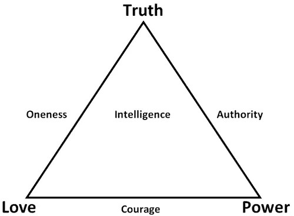

##  一分和十分

_2015-01-29_ _史蒂夫**帕弗利纳_ 聪明人的个人发展 聪明人的个人发展

**聪明人的个人发展**

stevepavlinachina

个人成长，与你同行

__ __

  

当向世界呈现自己时，你是否有修饰个人公共形象的倾向？你是否会对他人，尤其是对陌生人，首先展示自己最感安全，和最易被社会接受的那些方面？你是否发现回避被人评判
的风险是个明智选择，这样才能更易融入社会？

  

在认识了解别人时，你是否也会从接触他们被修饰过的公共形象开始？你是否会在讨论时有意选择那些最被社会接受的话题，从而回避任何大的风险，免于制造冒犯问题？

  

当第一次探索一份潜在的浪漫关系时，你是否也采用安全玩法？你是否会一直谈论像工作、学校，以及过往经历这种安全话题？你是否在深入讨论任何有潜在争议的话题前，会试
图先建立一份轻松的交往关系？

  

  

**社交上的安全玩法**

  

若你的目标是和各种人建立松散的人际联系，那么安全玩法就是个有效的社交策略。当你坚持进行礼貌的交谈，一直隐藏自我最惊人的差异性和古怪之处，并尽最大努力避免争议
，你很可能就会在表面上拥有良好的社交结果。

  

这本质上就是像戴尔**卡耐基《如何赢得朋友并影响他人》这类书中提出的思维心态。

  

这种策略很受欢迎，因为它确实管用。若你采取这种做法，就会被人视作朋友并邀请进入他们的社交圈。你肯定能用这种方式获得某种程度上的欢迎，还有影响力。

  

假如这种结果对你来说很重要，就请自由自在地使用这一总体策略。礼貌待人。谦逊随和。回避评判。把自我最惊人的差异性留在心底。

  

我在孩童时期原本非常害羞，所以这种发展策略对我来说，就是向外拓展社交并结识更多朋友的好方法。最终我发现结交并维持大量朋友十分容易。

  

一开始这样做还很有趣，但经历这条道路几年后，我对自己体验的交往关系逐渐厌烦起来。这些关系很轻松友好，但也大都流于表面。

  

18岁时，我考上了加州大学伯克利分校（美国顶尖学府之一。译者注），并且常会到各个学生宿舍闲逛玩乐。那是我在学校里混日子的一段时期（最终在第三学期被正式开除）
，但在头两个学期，我花了大量时间提升自己的社交技巧。我住在一栋八层宿舍楼的顶层，很多晚上我都会闲逛到不同楼层的宿舍走廊里，以便认识其他学生和结交更多朋友。

  

伯克利的学生通常都很聪明，我很享受跟他们探讨各种话题。但给我印象最深刻的，是遇见其他在交谈中甘冒社交风险，勇于直言的学生。

  

有天晚上，我与一位学友在走廊上展开了一段随意交谈。她告诉我她自己是个无神论者，并开始分享其观点强烈的信念，认为宗教是多么愚蠢，以及没了宗教世界会有多好。我当
时也是个无神论者，对她分享的内容深感共鸣。但最让我吃惊的是，她在交谈过程中很早就分享了这些言语，尤其是周围还有其他学生来回走动，可以很容易听到我们的谈话。伯
克利大学有着鼓励这种思想交流的良好氛围，这是我很喜欢的一点，但我依然对她能够如此开放地表达个人信念感到印象深刻。她并没像其他很多人那样，采用安全玩法的策略。

  

当她讲话时，我感受到一种和她建立的特殊联系。她向外敞开分享个人感受，并从内心对之深信不疑。我们只不过在那晚进行了一次简短交流，但25年后，我对她依然记忆犹新
。

  

你可以说我拥有此种特殊的联系感觉，是因为她当时分享的内容确实让我感同身受。大多数学生都会谈论他们的课程、自己的家乡、最喜欢的音乐。她却甘冒风险并找到我这个观
点匹配的人，但如果她当时遇到的不是我，就有可能碰上不匹配的交谈对象。

  

  

**七分 vs. 一分和十分**

  

那种“赢得朋友”的社交方式，就是在面对所有人时，获取从1到10匹配程度中的7分匹配度。由于你没有冒大的社交风险，就不太可能成为任何人的9分或10分匹配对象，
但你可以在6-8分匹配度的范围内舒服地浮动。

  

当不冒大的社交风险并隐藏自己最惊人的差异性时，你可以安全地避免冒犯大多数人。因此几乎所有人和你在一起时都感觉很舒服。只要不给他们讨厌你的理由，许多人都会在表
面之上喜欢你。

  

但要是你永远不冒社交风险，也将妨碍自己吸引那些，能与你体验深层亲密感的9分和10分匹配对象。获得这种关系需要你冒些风险，比如分享并不受大众欢迎，以及不被社会
接受的那部分自我。

  

为拥有这些9分和10分匹配对象，你必须甘冒风险，制造一些1分和2分的匹配对象。很多人对1分和2分匹配对象的恐惧，甚至比他们对9分和10分匹配对象的渴望还强烈
，于是他们就安于7分的最好结果。

  

不过若你安于7分的匹配对象太长时间，就必然感到 — 且最终觉得 — 自己生命中缺失了某些东西。你可能发现自己身处满是朋友的房间，却依然感到孤独或内心空虚。你
可能觉得宁愿一个人待着，也不想和朋友外出聚会。因为你知道那些交往关系只会在表层满足自己，而内心更深处的渴望依然毫无着落。你可能会在想要有人陪伴，与只想一人独
处之间犹豫徘徊，但这两种选择都无法让你心满意足。

  

  

**亲密感**

  

那缺失的要素，就是真正的人类亲密感。你一部分的自我依然渴望有机会与另一个人，共同分享内心最深处的想法、感受和信念，并获得认可、欣赏和支持。

  

不仅仅是这种分享才让人大感快慰。而是与这些懂你、理解你和赞同你的9分和10分匹配对象的交往，最终使你心旷神怡。这些人，就是所谓跟自己“处在同一波长”的人们。

  

这些人确实存在，但你如何能找到他们？他们又如何能找到你？

  

若你总是尽最大努力回避社交风险，而且你生活里的大多数人也同样如此，你就很难找到跟自身较不受欢迎的性格品质相匹配的交往对象。你的社交生活将充满一系列部分匹配的
对象，那些真正深入的交往关系却一直在你的触及范围之外。

  

例如，我是个有道德感的纯素主义者，并相信为了娱乐、体育或食物用途，去囚禁、折磨与杀害动物完全错误。对于这一事实，我本可选择隐藏自己或保持低调。这种做法更易照
顾到那些泛泛之交的友谊，但同时也让我在最佳匹配对象面前隐而不见。

  

若你想要更多表面性质的友谊，采用“赢得朋友”的策略途径就更合乎情理。不过，若你想体验更深入的亲密感，那更明智的做法，就是公开分享自己最与众不同的想法、感受和
信念，从而提高自己在最佳匹配对象面前的可见度。

  

如果采用亲密感优先的路线，即使大多数人会给你更低的交往评分，但实际上你又真正需要多少9分和10分的匹配对象？当在生活中找到并增加一个10分匹配对象时，你又认
为这有多大价值？若制造几十甚至数百个会很快抛弃你的1分和2分匹配对象，同时意味着有机会吸引一个9分或10分的交往对象，并在未来几年，甚至自己余生，拥有一位令
人惊叹的最佳朋友或爱人，这种做法值得你一试吗？

  

  

**找寻9分和10分匹配对象的挑战**

  

对一些人而言，找到9分和10分匹配对象并不难。但是，如果你和大多数人相比，更远地背离了社会常规，找到这种高质量的匹配对象就极具挑战。

  

即使像我这样广为人知的博客作家和国际演讲者，找到匹配度为9分或10分的对象也很罕见。我遇过很多8分匹配对象，但9分和10分的匹配对象仍极为稀少。

  

对于一位9分或10分的匹配对象而言，此人需要匹配许多我最重视的核心品质。这些品质包括纯素主义者、无宗教信仰、对生活有无比强烈的好奇心，对个人成长拥有长期追求
，对开放感情关系持开放态度，热爱探索和试验，非常诚实，并能勇敢追随忠于内心的道路。

  

在上月举办的“清醒生活工作坊”中，有些参加者问我，Rachelle和我是否已探索过三人感情关系，因为我在2013年2月的博客里谈过这个想法。Rachelle
和我还没找到一位匹配这种探索的好对象，所以我们还未经历这种体验。我们愿和非常匹配这种探索的人一同探索，但我们没有兴趣只是为了做此事，就和匹配度较弱的人选这样
做。若我们最终碰到了好的匹配对象，那很美妙 — 我们就能共同探索。但如果没碰上，我想最好就不必强迫它发生。

  

  

**部分匹配对象的训练作用**

  

有时当9分和10分匹配对象无法立刻显现时，你也能对他们的样子获得更清晰认识。即使只在生命里拥有一位像这样的匹配对象，也将是一种强烈人生体验。因此你也可能发现
，自己由于缺乏良好准备，而一直在排斥这样的理想匹配对象。这种做法的一个表现就是，你总对部分匹配的对象说是。

  

当设定一个新意愿时，尤其是社交方面的意愿，我常注意到会首先出现一系列部分匹配的对象。我将他们视作用来辨清最终答案的修正性问题。每一个部分匹配的对象，都在修正
我对真正渴望的对象的准确理解。

  

当碰上部分匹配的对象时，你可能识别出某些地方不对劲。但到底怎么不对劲？这份关系缺少什么？有什么不完美的地方？仔细回答这些问题，用你的答案来辨清自己的渴望。然
后放手这些部分匹配的对象，再次设定你的意愿。

  

当一个部分匹配的对象出现时，而且你意识到这是以往类似模式的重复出现，请自由自主地婉拒这种交往并对其放手（除非你就是想一再体验同样的经历）。之后你或是会遇见不
同类型的部分匹配对象，带来新的经验教训，或是终将迎来自己渴望的交往对象。

  

高品质的人类感情关系，是人生的伟大喜悦之一。一份美好的感情关系足以完全转变你。要启动这趟感情旅程，请从内心深处萌发大胆意愿，公开分享你的渴望，并与部分匹配的
对象一起探索，通过时间来不断修正你的渴望。当你发现了如何表达自身渴望，不是将其作为一种静止形态，而是一种成长道路上的动态延续时，真正的转折点就将到来。

  

  

Steve Pavlina

2014.09.22

  

www.stevepavlinachina.com

  

  

阅读原文

阅读

__ 举报

[阅读原文](http://mp.weixin.qq.com/s?__biz=MzA3NzIyNTQ3NA==&mid=204857676&idx=1&sn
=bbf2d78054ba3068973f270e5e1a8c3c&scene=1#rd)

