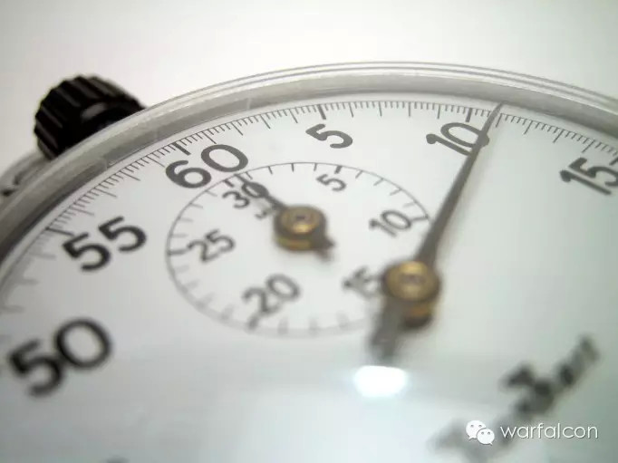

##  七条建议帮你立刻提高工作效率

_2015-03-01_ warfalcon warfalcon

**warfalcon**

read01

想每年读完100本书吗？想在100天内培养一个好习惯吗？想搞定拖延和注意力不集中吗？关注我，让你成为一个行动者，跟几十万读者一起成长，欢迎参加100天行动

__ __

  

过年后，开始面对大量的工作，这时提高时间管理能力是效果最明显的时候，最容易坚持下去的方法就是立刻行动，先做一些可以立刻看到效果的事情，会让你在行动的过程会不
断获得成就感，就非常容易坚持下去，然后慢慢建立一个适合你自己的时间管理系统：

**1．首先，彻底“清空”大脑。**

列出所有目前在你大脑里的未完成项目——不管大事小事。大脑在记住这些项目时会浪费大量时间和精力。要使“清空”大脑的清单有效，就必须确保清单的完整性。先列个总清
单，不管需要花费多少时间，

**项目清单——所有正在进行的项目。 

**下一步行动清单——把完成所有有效项目所需的下一步骤列出来。

**等待清单——记录下所有必须依靠他人完成的项目。 

**日历——具体行动的日期、时间。 

**某天／可能事项清单——所有还需考虑的任务。

以后可能还会想到别的项目，只需把它们简单添加到清单上即可，不要担心主次排序。

**总清单的规则：**

  * 总清单每周写一次即可

  * 笔记要记得详尽而简短，以便你能一眼就分清优先次序。这样就能保证清单的灵活性，因为你每天的工作和相应的优先次序经常会发生改变。

  * 清单中每项任务最好有个截止日期

  * 记录的第一个词要指明是什么活动，比如电话、邮件、写作、谈话，便于进行批量处理

  * 每天早上上班时的路上，就可以设设好当天任务的优先次序即可

  * 接受现实，你不可能今天把所有事情都做完。

  * 每周将你的总清单归档

**2．控制好上班后的第一个小时**

一个人每天最重要的时间段就是上班后的第一个小时。事实上，根据现在的情况来看，这一个小时可能是你最好的时间，可以利用它来完成一些重要的工作。

最坏的情况就是完全忽略掉第一个小时，比如上班的第一件事就是和同事聊上几句的习惯、看看新闻、收邮件，在QQ和微信上聊上一小会。

**3．随时应用两分钟法则**

检查任务清单，每次遇到两分钟内可以做完的事，请马上去做。

**4、尽可能延迟处理紧急要求**

要根据实际情况对要求做出判断。收到一个任务之后，应该问问自己：我必须马上处理这个要求吗？我遇到最坏的情况就是每一项任务都是紧急的，需要立刻完成。因为紧急任务
一多，就会发现一整天都在不停地从一个工作转移到另一个工作，最终一事无成。

对于别人的紧急要求，别立刻接受，而是提出一个近期内更合理的时间，以便完成他/她手中的工作后处理新要求。然后将这个要求同其他相同的要求合并进行批量处理。

**5、将类似的任务或活动批量处理**

为了完成更多的工作，我每天都将类似的任务合并处理，使工作更加有序。这是提高工作效率的有效方法。

**6．彻底清理书桌**

准备几个文件夹，迅速浏览每份文件，并立刻做出决定，原则上桌面上只放当前需要的文件和物品

**如果是待做的项目，确定好行动日期，在右上角注明，并且放到“待办”文件里。 **如果是要归档的文件，放到“待归档”文件袋内（而不是放在书桌或总档案里）。 **如果那是别人的文件，放到别人的书桌上去。 **如果是不确定的文件，把它丢开。

扩展阅读：输入：【**办公桌**】

**7、尽管减少干扰，一次只完成一件要事。**

扩展阅读：输入：【**番茄工作法**】

上面的每一条规则都是老生常谈，也都单独写过文章，很多读者也都知道，但问题是大多数人只停留在知道而已，并没做到，当你把这几条最基础的规则变成习惯，你的工作效率
会加强不少。

## 100天行动读者反馈

@maldives

一直想对您说声谢谢，warfalcon！自从关注您的微信，收益颇多，100天行动中一直坚持的是锻炼身体，没有可以去达到什么目的，身体变得强壮，心态变得更加积
极，尤其自己情绪低落或是没有动力时习惯跑上一个小时或是跳个insanity虐一下，自己爱好健身和阅读，健身行动可能超过100天。

阅读呢一直不间断，2015年阅读书籍目标在100+，不同类型都有，1、2月份已阅读10+本书，包括您推荐的时间管理的书。入门并不断完善自己在GTD方面的知识
，实践和理论并行，相信自己会有质的飞跃！庆幸在这个年纪看到您推荐的《20岁光阴不再》，于己还为时不晚，根据本书的建议对自己有了更为清晰的认识，对未来也有更为
明确的目标，谢谢您！作为正能量般存在，让我每天能更积极地面对生活、工作和学习！

@李冬

每天至少一小时的英文原著阅读，已经成为了习惯，也成为了爱好。除却单词和语感的增强，每天能有这样专注的时间是一件让人安心的事。每天都知道自己在学习在进步，安稳
的勤奋的心静最是难得。

* * *

觉得文章对你有帮助，可以赞赏支持一下

长按图片，点击【识别图中二维码】

  

  

阅读

__ 举报

[阅读原文](http://mp.weixin.qq.com/s?__biz=MjM5NjA3OTM0MA==&mid=205789449&idx=1&sn
=3e2dfb31a12381a31abc458ddabc88a6&scene=1#rd)

