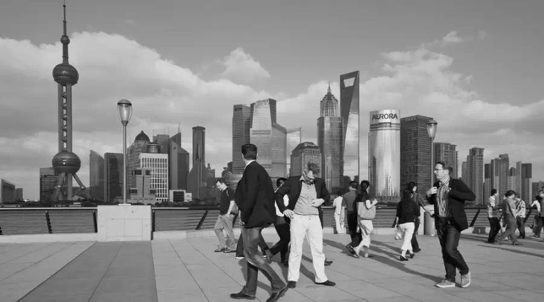
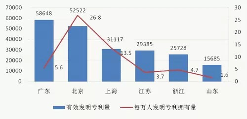
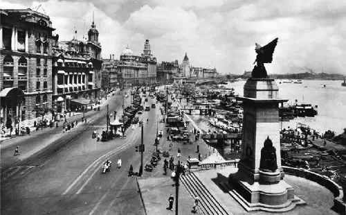
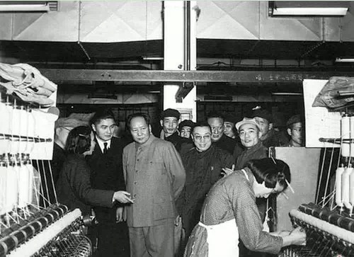
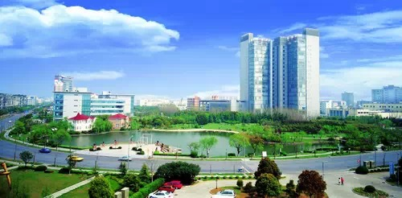
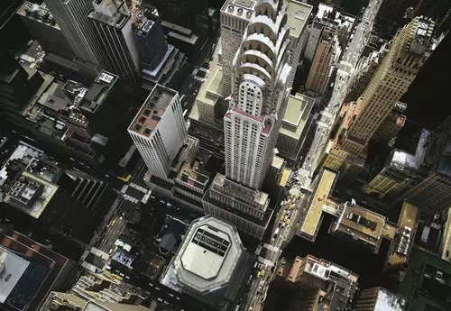
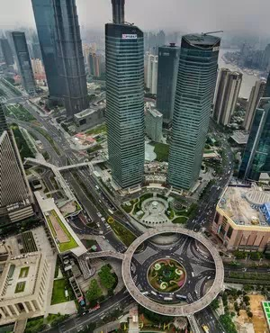
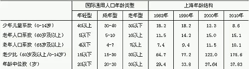
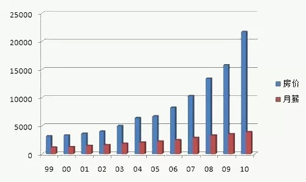
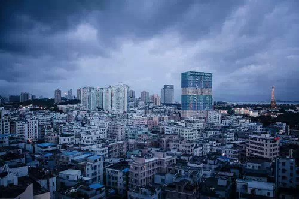

**上海是中国政府管理能力、效率和服务意识最好的城市，而且也是人才引进奖励制度最完善、规范的城市，但这些优点，有事恰恰妨碍出现创业者。**  

  

**文/高利民**

  

你能想起几个最近十年在上海崛起的民营企业品牌？

  

几乎没有。如果换做北京、广东、福建、浙江，许多人都能至少说出一些。

**2014中国民营企业500强各省区市企业数量**

  

这是令上海倍感尴尬的一点：作为一直以来中国内地的经济中心，上海聚集了大量跨国企业、著名国企、民营企业的中国区总部，几乎能找到所有世界知名企业。但却极少有本土
的创业企业，也很少生长著名的品牌、专利。

  

上海规模民营企业，大都集中在传统制造业和商业领域，极少有高科技型企业。以专利数量论，北京专利数仅次于广东，但每万人拥有的有效专利数则高居全国第一，接近上海的
2倍。即使刨去其中国家科研院所的成分，其绝对领先也不容置疑。

  

那么，水面下的冰山呢？截止2013年末，中国各地注册商标数排名是：广东（112.7 万）、浙江（86.4 万）、北京（46.7 万）、江苏（45.9
万）、福建（40 万）、上海（36.4万）。人口多于北京的上海却被北京拉开了相当大的距离。

** **

**截止2011年部分省市有效发明专利量及万人发明专利拥有量情况**

  

然而，在中国城市中，上海却是公认政府管理最精细、效率最高、服务意识最好的城市，为吸引人才、鼓励创新不遗余力。或许，正是这种强烈反差，才会有2008年时任上海
市委书记的俞正声著名的俞氏一问：上海为什么不出马云？

  

**【缺乏空间的土壤】**

  

其实，早期的上海也曾是创业家的乐园。

  

19世纪中期后，上海先后设立了英、法、美等国租界，逐渐形成了脱离于清政府权力，又享有国际交往的独立空间，最早接触到了近代化的经济组织形式。

  

此后，上海逐步成为远东的经济、贸易中心之一，无数冒险者来到这片十里洋场，虽然当时的人们并不将此称为“创业”，但许多工厂、商行都在此产生。

** **

**1928年的上海公共租界外滩一景**

  

真正的变化产生于1949年以后。由于上海出色的经济基础，被作为公私合营、货币改制等新政的重点地区。上海和工业基础同样雄厚的东北一样，建立了远比其他地区更完备
的公有制体系。

  

这时的上海经济到底比其他地区高出多少？

  

即使经历了“三线建设”等为中西部输血的过程，上海仍在改革开放前占全国工业总产值的三分之一左右。它在计划经济中的地位，使之今日依然保有强大的国有经济体系。

  

熟悉上海的外地人应该注意到一个现象：上海今天的国营商业企业依然无处不在。以超市为例，上海的社区型超市主要是联华与华联（现已合并为一家），两者均为商业局下属，
比它们更小且遍布街巷的国字号超市还有可的、好德等。

  

中国几乎不会有第二个城市，国营超市占据如此重要的地位。与超市毗邻的，还有很多国营饭馆甚至理发馆——有些饭馆严格坚持每天8小时劳动，午后有两小时午休。不可思议
的是，有些民营餐馆会让你觉得是国营的，里面的服务人员不是外地小姑娘，而是一群本地阿姨。

  

这当然是50年代后公有制改造的后果，但其格局延续至今，还有赖于上海在经济体制转型中对就业问题的出色解决——它几乎没有经历过其他相似城市那种剧烈的下岗社会镇痛
。其他地方转轨过程中常出现的国有资产流失问题，在上海引起的争议也非常小。

** **

**1956年，毛泽东在荣毅仁陪同下参观上海中新纺织厂**

  

与其鲜明相对的是重工业盛极一时的东北。这很大程度上得益于上海市政府官员卓越的管理能力。

  

不过，这却日渐显示出了另一面的效应——给新企业、新经济势力留出的空间太小了。

  

中国民营企业具有强大创新能力和社会活力的地区，无一例外都是国营企业不成气候，计划经济体制薄弱的地方。中国国企比重较大的地区，国企多仰赖银行低息贷款及国家特许
政策等优惠维系，而上海则仰赖高昂的地价，这使它们相对更理直气壮，拥有无处不在的话事权。

  

为谋求稳定的市场地位，它们很容易通过政府制定各种细密的管治措施，构建维护垄断地位的堤坝。而创业行为，本质上打破行业格局的洗牌行为，它当然为地位稳固者所不容。
像“滴滴专车”最近被上海市交管局叫停这种事发生在上海，其实并不意外。

  

**【五道口与张江科技园】**

上海并不是没有意识到这一点。

  

1980年以后，上海经济增长速度放缓，其经济中心的地位受到浙江、广东、福建的挑战。直到九零年决定开发浦东新区，上海才在接下来的十多年保持了10%以上的增长，
重新确立了自己在全国经济中的地位。

  

这也给上海市应对创业问题提供了思路——典型的例子就是精心规划设计的张江高科技园区。

  

为了形成像北京海淀区那样的人才集聚效应，科技园区与新大学园区被安排得很近。这里的马路极为宽阔，马路两旁是整齐、漂亮的园区建筑，但几乎没有生活气息，看上去很像
一块北京的飞地。

**上海张江高科技园区**

  

问题是，这块精心设计的园区，只适合已成规模的企业入驻，而不是在这里创业。一般的创业者很难在此找到合适的低成本住房、餐饮等条件。

  

如果类比北京海淀的五道口，这种精心的规划其实是不利于创业的。

  

五道口之所以成为怀抱IT创业梦者心中的“宇宙中心”，除了周边高校和IT企业云集外，附近多为小而老旧的小区，少有大规模的高档社区，一到晚上满街摊贩。热闹、拥挤
而富于生活气息的五道口，是最不像北京的地方，倒像是老上海在北京的一块飞地，但可为梦想家们提供就近且便利廉价的栖息条件，如果实在没钱，他们甚至可以混进学校宿舍
。

  

如果中关村和五道口像张江高科技园区一样，宽阔的马路两旁只有敞亮巨大的办公室，街道上看不见闲杂人员，一到下班时间，大家就一哄而散赶路回家，它断不会像今天这样每
天诞生无数的创意和新企业。

  

上海浦东陆家嘴金融中心的街道规划方式，也被批评为大而无当——华尔街摩天大楼之间的街道非常狭窄，临街密布着咖啡馆之类的谈话场所，两栋写字楼里的生意人突然有想法
时，可以非常便利地约谈碰撞，而陆家嘴那些写字楼里的人，要和对面大楼的人当面交流，必须横过极为宽阔的马路，是绕远路，还是打出租车，颇费思量。

**从纽约曼哈顿东部的克莱斯勒大楼向下看，纽约的街道与上海浦东新区相比十分狭窄**

  

好在上海市政府注意到了这个批评，于是有了一个可以不用横过马路的补救措施，在几栋摩天大楼之间修了一个巨大的陆家嘴天桥。可惜辽阔的张江科技园就很难照此办理了。

  

创业者需要的往往是一种宽松的环境，成本低廉，又在空间上充满联系，容易沟通。这是规划者最不擅长的事情——历史上，没有几个创业中心是规划出来的。

  

而且，也并没有哪些人从出生起就带着创业者的标签。创业企业、创业者往往诞生于复杂的交汇之中，新增的城市移民、高校毕业生中创业比例都很高。

**陆家嘴天桥**

  

上海自然知道这些人的重要性。它们也有着全国最优秀的人才引进制度，其积分方案、居住证福利在全国绝对属于一流。

  

但这种优秀制度反而引起了一些负面效果。

  

**【被“格式化”的上海梦】**

  

1992年，上海常住人口是1280万，到2013年底，上海常住人口为2415万，11年净增了1100多万人，新移民占总人口数的47%。

** **

**上海市人口年龄结构与国际通用年龄结构的对比**

  

但是，深圳同样新增1000万移民，里面出现了任正非、马化腾等登上世界级舞台的创业者。而上海新移民中，却没有同等量级的创业家。

  

如果对上海、北京、广州、深圳新移民做一项奋斗梦想的问卷调查，或许“上海梦”最单调实际，那就是房子。北京、深圳的梦想就要五花八门得多。

  

上海是引领中国房价的龙头，并且是中国第一个因住房价格高涨出现全民炒房现象的城市。“炒房”重塑了上海人的观念，它不但是上海人日常交流的必谈话以甚至成为衡量成就
的重要标签。

  

房价贵使得1980年代以前普遍有房的上海人突如其来地享受到了“存量涨停”的福利，这笔意外的财富保障使得老上海人和老北京人、老广州人一样不思进取。

**1999—2010，上海房价与人均月薪走势图**

  

对上海新移民来说，2008年前后，则是一条分界线。2008年前成功买房落沪的人，是“房产红利”的最大得利族群，他们许多人通过买房攒房完成了真正意义上的“原始
积累”。2008年之后来沪的人，“落户”一夜之间变成了“为房子而活的战争”。

  

对新移民来说，上海住房问题的影响来得远比广州、深圳甚至北京严重。深圳、广州有大量城中村，北京虽然较少城中村，但其市政、社区和小区物业管理远不如上海精细，虽然
近年开始学习上海整治群租以及在住宅区办公司的现象，但死角比上海要多得多。

  

这让新移民的个人发展受到极大限制——没有低价栖身的空间。当然，人们也可以认为，没有低价住房，筛掉的大多是素质不那么高的人才，上海需要的是高素质人才。

** **

**白石洲，深圳最大的城中村，多年来成为了来深打拼人员的聚集地**

  

为吸引外地高素质人才，上海推出了提供留居上海的各项激励措施，按2002年相关规则，获得居住证七年后可申请上海户籍。相比其他城市的粗放简单，上海人以其特有的精
密、认真，拿出一套“国内人才申领《上海市居住证》打分表”，使规则变得更清晰、透明，能极大程度地消灭作弊空间。这使得只有上海的居住证才是被外地新移民积极认真对
待的。

  

但是，上海金融与法律研究院在承接《户籍的成本》课题时，仔细研读这个打分机制对人才的激励作用，他们得出这样一个结论，它实际上鼓励的是外来人才安心打工，而不是创
业。

  

譬如，受聘的薪水、岗位级别、纳税数额、社保缴纳越高，得分越高，它当然是“甄别人才”的合理衡量标准，但却会让一个积分很高的人在面临创业机会时，陷入选择困境——
在离居住证、上海户籍只有一步之遥时，创业往往意味着前功尽弃，毕竟白手起家创业期间，在薪水、纳税额、社保缴纳的得分都会大幅下降。

  

虽然《上海市居住证》打分表中，有“人才在沪投资创业附加分”，但它的打分奖励全部是以投资额和雇佣本地人数来计算的，实际鼓励的是外地资本在上海办企业，而不是在上
海白手起家创业。这与通常人们说的创业完全不是一回事。

**某上海教育机构打出的招生广告**  

  

有趣的是，《上海市居住证积分办法细则》中“职称”依然占了很大权重，除了特殊技术岗位，职称对民营机构组织来说，没有任何价值，但这套打分体系，会使得不在国营单位
的新移民，为了居住证去浪费时间报考“经济师”这类毫无用处的职称。

  

前面提到的房子，同样是打分项目，买房加分，它起到了与房价上涨的相同作用——有钱立即买房。

  

所以，我们一点不难理解，新移民的“上海梦”是高度格式化的：房子。至于创业，最好还是到北京、深圳去碰碰运气吧。

  

**版权声明**

****大象公会所有文章均为原创，****  

****版权归大象公会所有。如希望转载，****

****请事前联系我们：****

bd@idaxiang.org

****知识 | 见识 | 见闻****

阅读

__ 举报

[阅读原文](http://mp.weixin.qq.com/s?__biz=MjM5NzQwNjcyMQ==&mid=209551190&idx=1&sn
=ce028395392990019b94830e4860da77&scene=1#rd)

