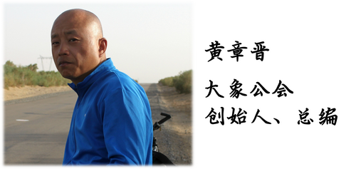
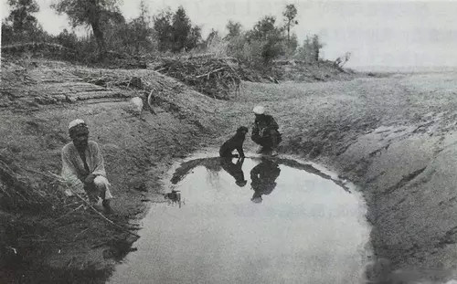

##  世界远比我们想象的更广大

_2015-03-13_ 大象公会 大象公会

**大象公会** 

idxgh2013

知识，见识，见闻。最好的饭桌谈资。知道分子的进修基地。

__ __

我是一个功利主义的阅读者，读书多是对某个问题好奇，如果有闲暇阅读时间，我会选择非虚构类作品，因为除了展现人与人之间复杂精妙关系和人类丰富心灵外——这恰好是我
不关心的，书斋中的作家建构的世界远不如上帝的作品更伟大。  

  

在非虚构类作品中，我最喜欢的是十九世纪到二十世纪初西方探险家们的作品，因为我觉得他们的作品最能满足我对阅读的审美体验。此前的探险家，靠的是勇气和体力，缺少知
识和理性的魅力，此后的探险家，他们背后的科技力量太过耀眼，几乎不给他们任何个人英雄主义的表现机会。

  

只有这个时间窗口的探险家，才是最具魅力的。他们有伟大的雄心、意志、勇气以及超人的体力，还具有广博的专业知识和技能，那个时代的探险家，除了受过系统的地理、地质
、气候、语言学等专业训练外，探险事业还使他们成为博物学家和人类学家。

  

他们不但要一路把自己经过的山川河流绘成地图，还要收集各种标本，描述记录当地民俗或宗教活动。有些偏好人类学观察的探险家，会留下表现旅途中当地人身体特征的图像资
料，有些人竟然能说服当地人一丝不挂，不知道他们是如何做到这一点的。

  

——在没有照相机的时代，探险家们是用素描方式替代相机，来记录自然景观、当地人的外貌着装、屋宇、生活器物甚至民俗或宗教活动的。很可惜，中国出版的这类书，绝大多
数基于成本考虑，他们绘制的附图绝大部分都被删除了。

  

他们是无往不至的，譬如中国人熟悉的斯文•赫定，在他之前，伊朗的达马万德峰无人登过，塔吉克人也没想过涉险登上喀喇昆仑山的群峰——他之所以能在无人迹处留下脚印，
并非天生体力超人、意志力过人，而是理性和训练的结果。

  

对他们的偏爱，我甚至会觉得他们当中多数人的文字也是世界一流的。譬如阿普斯利•彻里-加勒德的《世界最糟糕的旅行》，是我这些年来读过的最了不起的文字，虽然该书的
中文版充斥着骇人听闻的错漏，光数据错误就足以让人发狂，但不妨碍它能给我带来难以言传的体验。

  

该书讲述的是1911～1912年英国的斯科特南极探险队在争夺第一个到达南极的荣耀中败给挪威的阿蒙森团队，归途中斯科特等5人不幸罹难的全部经历。关于斯科特与阿
蒙森竞争的这段历史，传播最广泛的是作家茨威格的作品。茨威格文笔流畅、华丽，非常容易打动读者。

  

而《世界最糟糕的旅行》的作者阿普斯利•彻里-
加勒德则是探险队成员，还参与了搜寻罹难队员遗体。比起茨威格的华丽和长于抒情，在我看来，即使在渲染悲剧时，他冷静、克制、精确的文字无疑有更强的张力和感染力。

  

更难能的是，作为参与者，必须介绍整个团队历程的全景，而不是聚焦在一个英雄身上，要介绍从团队组建、抵达南极大陆到分头行动到最后收尾，线索极为复杂，理清千头万绪
并能以清楚、准确、简洁、完整的文字呈现出来，需要卓越的文字驾驭能力。我把它当成最好的新闻写作教科书。

  

新华社记者唐师曾也大力推荐过这本书，但唐的中东“冒险经历”系列图书是完全不同的风格，唐的书中有非常好的镜头感，任何场景你都可以看到他没有忘记亿万中国读者正以
崇拜的眼光看着他。

  

我很好奇，如果他是斯文•赫定在1895年5月6日的处境，他会怎样写？当时斯文•赫定在塔克拉玛干沙漠断水7天后，终于在月色中找到和田河干涸的河床中的一个水坑，
但他没有急着喝水，而是先摸脉搏，当时他的血液已粘稠到近似糖浆，摸不到脉搏，他边喝水边数脉搏……几分钟后脉搏变为56，像羊皮纸一样硬化干脆的皮肤逐渐变软……

  

斯文赫定准确记录了这个水坑的位置，1900年9月，探险家马尔克•斯坦因根据斯文赫定的描述也找到这个水池。1931年4月，尼尔斯•安博特又找到它。这个水坑由此
有了一个名字：探险家水塘。

  

  

真正的历险者大约不会时刻想着远方的粉丝。上海作家杨柳在徒步穿越藏北无人群时，留下的文字非常像一百年前的西方同行。一位同样在网上追着他的文字的朋友说，杨柳文字
中最触动他的，是在一个继续前进就不能做折返选择的地点，权衡继续还是放弃时，做出选择的理由：“今天的心情很中庸。”

  

今天，探险家需要历尽千难万险的地方，大多数都可让普通旅行者轻松抵达，古典意义上的探险已被彻底消灭，它被旅行甚至流浪替代，甚至去人烟稀少的陌生远方，已被认为是
应当挖苦的恶俗举动。

  

我觉得这是了不起的时代进步。

  

当年的探险家虽然是个人英雄主义和科学理性精神的最完美结合，但驱动他们的未必全然是个人对世界的好奇心，因为当他们成功返回故乡，迎接他们的是整个世界的掌声，今天
的旅行者，践行的是最纯粹的个人体验和探索追求。

  

而且，在今天这个地图上几乎没有空白的世界，无论是人迹罕至之地，还是陌生的繁华都市，如果你愿意，可以比当年的探险家对陌生世界有更深入的接触，毕竟后者在追逐填补
空白时，粗浅的猎奇就可以满足探究的好奇。

  

旅行不但是大幅拓展对这个世界认识的最好方式，而且可以深刻改变人。无论多浪漫的文艺青年，都会因为旅行经历的丰富重新塑造自己，当年探险家们才有的技能、知识和习惯
，多数早已在文艺青年们当中得到普及。有位日本旅行者的书，头几页就写他在阿拉斯加路上遇到一位黑人女青年时，满心各种紧张恐惧，看到这里我忍不住把书扔了出去，但翻
到后面，欣喜地发现他已经完全变了一个人。

  

我注意到，中国的教材也悄悄发生了变化，人教版初中二年级的课本上，居然有五篇前后相连的课文是与鼓励探索、冒险、进取精神有关的主题，构成了一个独立的单元。也许该
有足够理由相信，有更多探索进取精神的年轻一代，他们会有更广大的世界。

  

没有人能像亚历山大大帝那样去探索世界，他征服整个当时希腊文明已知世界的主要动力，就是想知道世界是否像他的老师亚里士多德描述的那样大。他在前方不断征服时，不忘
给身在雅典的亚里士多德源源不断地提供动植物标本和其他资料。

  

当他们抵达阿富汗境内的兴都库什山时，返回的探路者告诉亚历山大，他的老师对世界的估算并不准确：“这个世界恐怕比任何人想象的都要广大。”对探索世界的好奇心而非对
财富和人口的占有欲，使他成为独一无二的征服者。

  

他对世界的探求欲是纯粹体验型的：要征服天涯海角，要坐在他们火堆旁，听着他们的音乐，吃他们的食物，穿他们的衣服，和他们的女人在一起。

  

今天，任何人都可以轻易做到这一点，并不需要征服天涯海角。

  

**版权声明**

****大象公会所有文章均为原创，****  

****版权归大象公会所有。如希望转载，****

****请事前联系我们：****

bd@idaxiang.org

****知识 | 见识 | 见闻****

阅读

__ 举报

[阅读原文](http://mp.weixin.qq.com/s?__biz=MjM5NzQwNjcyMQ==&mid=211421445&idx=1&sn
=d15fa7696552271e966d0640222379e1&scene=1#rd)

