**龙最初只是民间符号的一种，被豢养，当作坐骑，即使汉朝之后被升格成皇权象征物，也是与凤、虎、龟等地位相似，并不突出。那么，为什么后来龙成为了皇权的独尊象征物？又从什么时候开始，变为中华民族的图腾呢？**  

  

**文/施爱东**

  

无需强调“龙”符号对于当代中国人的意义。它作为民族、国家的象征，被中外各国广泛认可。

  

人们自然也认为龙的尊贵地位继承于诸朝代的皇族，任何穿越剧中，皇帝不穿龙袍都被认为不体面。如果见到大臣、官员服饰出现龙形象，必然大逆不道、令人震惊。

  

其实，中国传统皇家神兽谱系中，龙并不占有独尊地位，白虎、凤凰等都可视为皇家象征。 更早之前，龙更是平易近人，驾龙者十分常见。

  

这个平凡的神兽能从犀牛、鹦鹉、玄武等复杂的象征体系中脱颖而出，成为皇权、民族、国家的图腾，很大程度上是中西方交汇的产物。如果不是恰当的时间，恰当的地点，遇到
了恰当的人，也许我们会成为凤凰的传人。

  

**【龙的奋斗史】**

  

龙的地位与皇权的大小紧密相连。

  

汉代之前，作为一种想象的动物，龙并没有独尊地位。（**详见大象公会《猪图腾，龙的起源？》**）。据史籍记载，春秋以前不仅有专业的养龙专业户“豢龙氏”，龙还一
度作为人的食物，例如《春秋左传》即有记载“刘累学扰龙于豢龙氏，以事孔甲，能饮食之”。

  

春秋时期，龙的功能才稍有变化，更多以坐骑的形象出现，《山海经》中即有“南方祝融，兽面人身，骑两龙”的描述，屈原《九歌》中也九次提及驾龙者。此外，蛇的形象逐渐
引入，龙也被引申为人神接触的媒介。

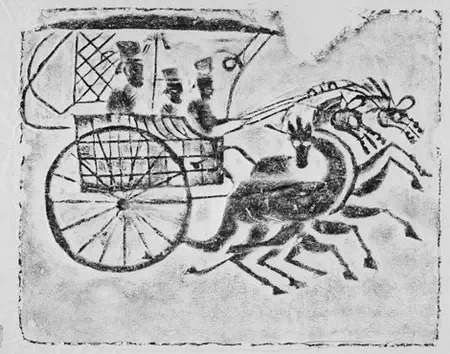

**东汉画像石《乘龙升仙图》**

  

龙被升格为皇权象征，首先要感谢汉武帝。

  

董仲舒“尊儒”后，推崇周礼，其“祭祀”仪式的核心要义，就是使君主成为天神的代言人，这时，作为祭祀符号的龙地位提升，开始有了皇权象征的意味。

  

但汉朝时期，龙并非为皇权的唯一代表，一同进阶的还有凤、虎、马、龟、雀等动物。同时，并未严格限制大臣贵族们对龙纹的使用，公侯的衮服上，同样饰有龙纹。

  

梁武帝时期，大臣周捨提议用凤代替百官衮服上的龙，使龙成为皇家专属，但并未形成定制。唐朝亦有类似提议，但众臣抵制，难以实施。

  

为了拉开皇帝与公侯大臣的差别，礼部官员只得在皇帝衣饰上添加各种金玉珠文，但也使得皇帝衮服冠冕“华而且重”。

  

什么时候龙才真正成为皇权的专属呢？

  

答案略微出人意料——元朝。

  

蒙元成立后，迅速汉化的蒙古人在《大元圣政国朝典章》中规定除官办织造外，民间不许用印有日、月、龙、凤的布匹，首次确立了皇权对龙的垄断。

  

为了显示尊贵，元代商人一方面为了规避惩处，一方面为了满足市场需求，因此将龙纹作了变形处理，但仍然保留了龙的大体形象。元延祐元年，中书省再次颁发规定：龙为五爪
二角，一二品职官许用金妆饰银螭（减角的龙）头。

  

明朝也有同样的困扰。明永乐帝后，太监地位的上升使得太监所着的蟒服、飞鱼服、斗牛服都与皇帝衮服上的龙纹相差不大。明世宗在登基诏中特别强调：近来冒滥玉带/蟒龙、
飞鱼、斗牛服色，皆宦官杂流并各处将领奏启，今俱不许。

  

对龙形象垄断权的争夺战，最终在另一个非汉族王朝得到终结——清朝。

  

龙袍就是清代的发明。清朝将祭祀用的十二章衮服扩充至一个系列，龙袍成为衮服之一。

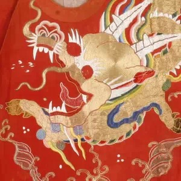

**明代太监的斗牛服，基本看不出龙与牛的差别**

  

皇帝御驾上的龙纹也体现了其使用权的独揽过程：汉武帝时期，龙、白虎、凤凰在车辇上的地位并无差别，南齐时期的御驾上“凤栖于顶，金龙四布于角”，凤的地位甚至比龙还
要高。隋文帝重置五辂后，龙凤地位大致相当。到了元朝，龙在御驾上的地位得到空前提升，几乎占据了所有显著位置。而清代，龙纹在御驾上的比例已提升到93%，而凤则降
到了0。

  

但在传统中国社会中，龙并未实现从皇权上升到国别代表的升阶——传统中国只有混沌的“天下观”，并没有空间维度上的国家“观念”。

  

龙又是怎样成为“国家”的象征呢？

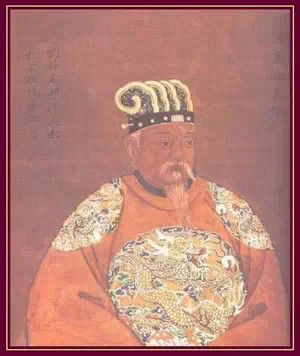

**《乾隆年制历代帝王真迹》中的汉高祖刘邦，在后代人想象中，皇帝都是穿龙袍的**

  

**【从皇帝到中国】**

  

龙成为国家象征，首先要感谢传教士的传教策略。利玛窦之后的来华传教士，放弃了最初广泛发展底层教众的计划，确立了优先感化统治阶层的战略。此后，他们热衷于与文人士
大夫，或者皇帝身边的达官贵人打交道。

  

这是一个关键节点——传教士大量进入中国时正处明朝 ，龙已经确立皇家神兽中的首要地位。所以，在传教士接触的上层阶层中，龙形象至高无上；而在传统社会“普天之下莫
非王土，率土之滨莫非王臣”的观念体系下，传教士很容易形成“龙=皇帝=中国”的观念。

  

17、18世纪，西方对于中国普遍存在美好的想象。英国汉学家约翰•韦伯（1611-1672）甚至希望通过龙在中西之间的相似形象，证明中国与西方同根同源，同时期
的西方瓷器、家具、建筑上，龙也大量出现。

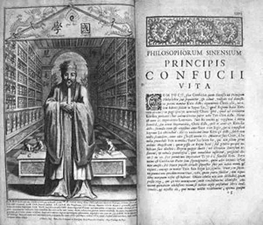

**1687年传教士绘制的《中国传教士孔子》可以看出中西融合的特征，但龙纹依然是重要元素**

  

可是，这一切并没有持续多久。鸦片战争后，西方震惊于清朝的落后与愚昧，龙也迅速成为腐朽、邪恶与丑恶的象征。

  

这在19世纪发展迅速的西方漫画上尤为明显。鸦片战中后期，在欧洲最有影响力的英国画刊《笨拙》登出的“满大人”形象画中，龙纹只是众多中国元素的一种，并没有成为国
家象征。而在第二次鸦片战争后，“征服中国龙”则迅速被融进西方原有的“勇士屠龙”母题，成为漫画创作的新主题。

  

美国在义和团之前与中国并没有摩擦，但龙在美国仍然没有逃脱被丑化的命运。1870-1900年代“排华主义”兴盛时期，华人劳工被画为猥琐的人头龙身的形象。

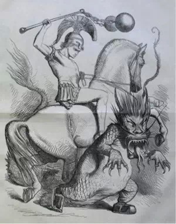

**《笨拙》漫画 ：《我们在中国应该做什么》 **

  

甚至曾经崇拜龙的日本也发生了变化。甲午战争时期，日本抛弃了对龙的崇拜，同样将龙作为颓靡中国的象征。义和团运动后，著名的法国明信片《肢解中国龙》中即有了日本人
的身影。

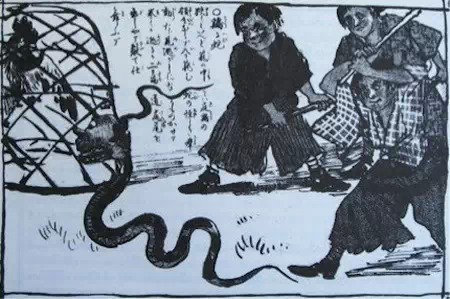

**1984年日本的《团团漫画》：《鸡与蛇》**

  

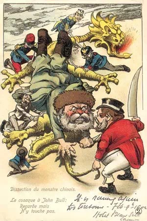

**法国明信片《肢解中国龙》，断龙首者为日本**

  

**【进阶：从国家象征到民族象征】**

  

16世纪以后，将龙作为中国象征的说法仅在欧洲传播，中国普通民众对龙并无归属感，更不会将其视为本民族象征。

  

从1840年开始，中外海军在通商口岸有不少摩擦，但因中国商船与军舰并无明显标识，吃了许多哑巴亏，最为典型的即为第二次鸦片战争导火索“亚罗号事件”。

  

随后，曾国藩提出：“各处师船，仿照外国竖立旗号之列，概用黄色龙旗，使彼一望即知（为皇家水师），不敢妄动。”但因黄色龙旗与八旗中的正黄旗比较接近，曾国藩将黄色
龙旗割去一角，避免僭越之嫌。

  

真正意义上的国旗确定则要到1888年，在李鸿章等人的主持下，《北洋海军章程》“武备”章特列“国旗”条：“应将兵船国旗改为长方式，照旧黄色，中画青色飞龙。”但
这一国旗并未飘扬多久就在辛亥革命后被替换为五色旗。

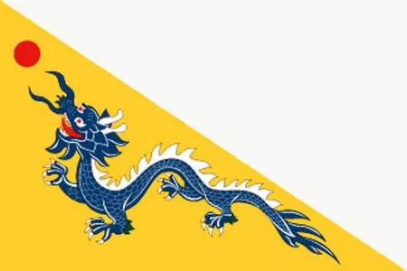

**1888年之前的大清军舰龙旗**

  

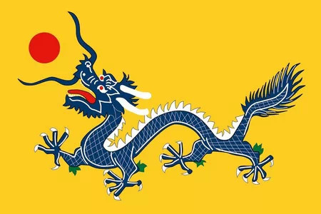

**1888年之后的**大清军舰**龙旗**

  

帝制时期结束后，龙因具有封建皇权色彩而被冷落。其再次普遍出现在中国人的视野中则要等到1931年后“图腾主义”研究的兴起：外压之下，学界认为需要一个符号来区别
于其他民族，有利于团结统一，形成民族认同，抵御外来侵略。

  

学者认为“图腾主义”不仅可以作为民族国家的代表符号，还可以借以追溯民族起源，给中华民族带来民族自信，用以抵御外族侵略分化。

  

龙当然能得到众多图腾学者的关注。

  

首先是在论证中华悠久历史的层面，考古上无法证实的夏朝，图腾学者则可以通过龙图腾提出新的证明。文献学家姜亮夫首先系统论述了龙的图腾意义：“‘夏’字本义一定是个
爬虫类的东西，原来一种民族的传说，总要有些物质根据，而洪水的传说和考古学家在北方一带（即夏民族栖息之地）发现多量爬虫二事，即以说明夏民族时以鳞介属为其崇敬之
物，因而自命为龙族子孙，是无可疑的了。”

  

此外，闻一多等人还认为，龙形象的包容性特征恰好符合了上古氏族相互融合，形成统一的中华民族的历史逻辑。龙由“虾眼”、“鹿角”、“牛鼻”、“狗嘴”、“鲶须”、“
狮鬃”、“鹰爪”、“鱼鳞”、“蛇尾”九种动物所组成——正是以鹿、牛、狗等其他动物作为图腾的民族相互融合后的图腾，由此提供了中华民族共处一脉、相互团结的证据。

  

闻一多认为：“只有先让民众知道他们有共同的来源，民族意识才能产生；近代史学就是善用考古学和民俗学的新方法，发现整个民族和全面文化的事实，并将这一事实用文艺的
手段讲述出来，从而达到激发民族情绪的最终目的。”

  

为了实现这个目标，在《伏羲考》中，闻一多首先罗列一批伏羲女娲人首蛇身的交尾像，并相信在这一半人半兽的时期之前，一定有一个全兽时期作为之后神话创作的母题，而交
龙、螣蛇、两头蛇的创作来源就是荒古时代图腾主义的遗迹——龙。

  

闻一多激情而富于感染力的诗性文字，省去了繁琐的论证过程，深得青年读者喜爱。在论证“龙图腾的优势地位”时，闻一多自豪地写到：“龙族的诸夏文化才是我们真正的本位
文化，所以数千年来我们自称为‘华夏’，历代帝王都说是龙的化身。总之，龙是我们的立国象征。直到民国成立，随着帝制的消亡，这观念才被放弃。然而说放弃，实地里并未
放弃。正如政体是民主代替了君主，从前作为帝王象征的龙，现在变为每个中国人的象征了。”

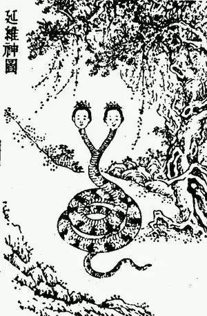

**人首蛇身之伏羲女娲交尾神象**

  

但当时闻一多的说法并没有引起广泛关注，直到1949年后《人民日报》将闻一多定义为“中国现代史上伟大的爱国主义者、坚定的民族革命战士”，才为其学说提供了强力的
政治支持。

  

此外，1980年代对外开放后，增强中华民族的历史自信再次成为刚需，《伏羲考》由此开始受到众多关注，被视作中国图腾学的经典著述，其中“龙是中华民族的象征”的观
点也成为学界共识。

  

比闻一多更加幸运的是郭沫若，虽然在龙图腾的构建上论述不多，但郭沫若早在1950年代即已成为中国历史学的学术旗帜，郭沫若在图腾主义相关论文的被引用率上，远非闻
一多所能比。 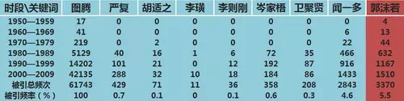

**“图腾”及早期图腾学者的被引频率**  

  

真正让中国人认识到自己是“龙的子孙”的，还是侯德健的歌曲《龙的传人》，不过，这首歌最早是有反共背景的。

  

1978年美国与台湾断交后，为了舒缓台湾的悲情气氛，侯德健以台湾本位为导向写出了《龙的传人》。之后，《联合报》全文刊发歌词，并由当时的台湾新闻总署署长宋楚瑜
亲自改写歌词，将“四面楚歌是奴才的剑”改为“姑息的剑”，以便鼓舞士气。好景不长，1983年侯德健叛逃大陆后，《龙的传人》在台湾成为了“禁歌”。

  

《龙的传人》于1985、1988、2012年三次登上央视春晚舞台，成为仅次于《难忘今宵》的高频春晚歌曲，由此成为“中华民族意识下一切华人身份认同的重要资源”
。

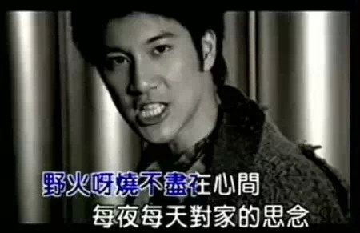

**让年轻一代意识到自己是“龙的传人”的，无疑是美国人王力宏**

  

不只是歌曲，香港在1981年就有了《龙的传人》的同名电影，并由周星驰主演。台湾在1991年也推出同名政宣电影，以强调台湾人的“国族认同”。

  

而在大陆，《龙的传人》则成为小学五年级语文课本中的重要篇幅。我们作为“龙传人”的观念，也在一代一代的青少年心目中牢牢地树立起来。

  

**关于中国龙，更多内容详见专著《中国龙的发明》，作者施爱东：**

**_ 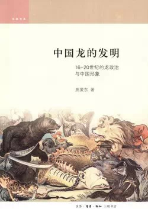_**

  

**版权声明**

****大象公会所有文章均为原创，****  

****版权归大象公会所有。如希望转载，****

****请事前联系我们：****

bd@idaxiang.org

****知识 | 见识 | 见闻****

阅读

__ 举报

[阅读原文](http://mp.weixin.qq.com/s?__biz=MjM5NzQwNjcyMQ==&mid=209762230&idx=1&sn
=8e6c434ef37943af851a7d2b50737454&scene=1#rd)

