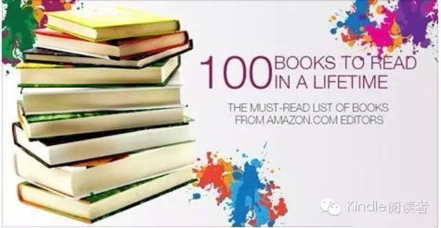

##  书单 | 亚马逊推荐人生100本必读

_2015-03-11_ Kindle阅读者 Kindle阅读者

**Kindle阅读者** 

kindlereader

原汁原味，最真实的世界在Kindle上为您呈现。

__ __

100 Books to Read in a Lifetime (P1)

亚马逊网去年底发布了它的一生必读一百本书清单。所列书目从1813年的《傲慢与偏见》到1925年的《了不起的盖茨比》，到2013年的《生命不息》，跨越了两百年
的文学时间。

这是一份手作的推荐清单，没有用到点击率分析等技术手段；希望选的书有代表，能引领读者通往更多的书。而仔细读完这份清单会发现，它最大的亮点在可读性，它肯定不是一
份西方正典清单，但它接近阅读本身，接近风土和人情，因此，这份清单书值得一看。

100本书，不可能一下子全部提供，会作为系列逐步分享，首次先来6本，大家经典阅读愉快！

Meet Big Brother

1984

by George Orwell

READ01

1984是一本杰出的

政治寓言小说，

大兄弟在看你，

更适合目前这个时代

Explore the Universe

A Brief History of Time

by Stephen Hawking

READ02

时间简史

探索时间本质

和宇宙前沿的

科普里程碑作品

Memoir as metafiction

A Heartbreaking Work of Staggering Genius

by Dave Eggers

READ03

怪才的荒诞与忧伤

是回忆录

还是人生荒诞剧

读懂人生

  

A child-soldier's story

A Long Way Gone

by Ishmael Beah

READ04

童兵自传

震撼世界的战争回忆  
  

Wicked good fun

A Series of Unfortunate Events #1: by Lemony Snicket

READ05

雷蒙**斯尼奇的不幸历险

同名电影原著

三个孩子的奇幻旅程

The 60s kids classic

A Wrinkle in Time

by Madeleine L'Engle

READ06

写给孩子的童话书

六十年代生人的经典

捐助支付宝账号，反馈及其他留言或邮件kindle.juniper@gmail.com

帮助系统

书籍订阅回复DY  
畅销书榜回复NY  
热门榜单回复BD  
原创书评回复RE  
音频点播回复TE  
更多帮助回复HELP  

微信号：

  

阅读

__ 举报

[阅读原文](http://mp.weixin.qq.com/s?__biz=MjM5MjM2OTc1NA==&mid=204597752&idx=1&sn
=34e512c217b360fef78abda8c4cd3033&scene=1#rd)

