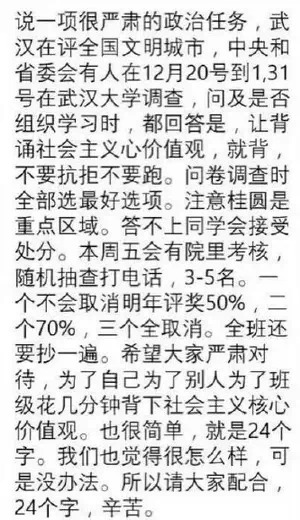
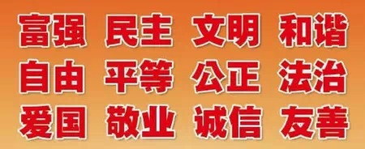
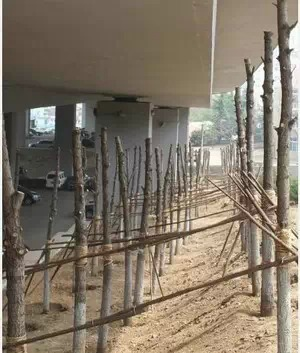
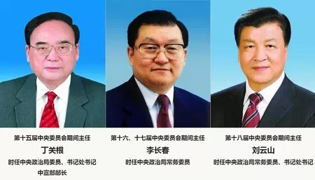
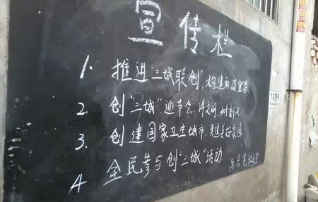
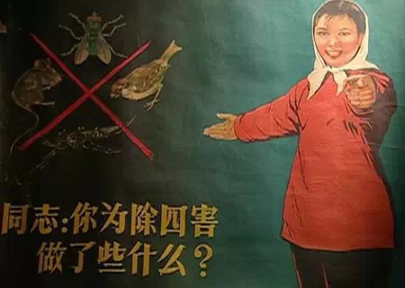
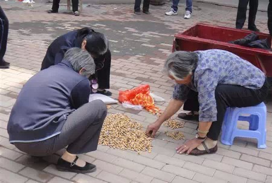
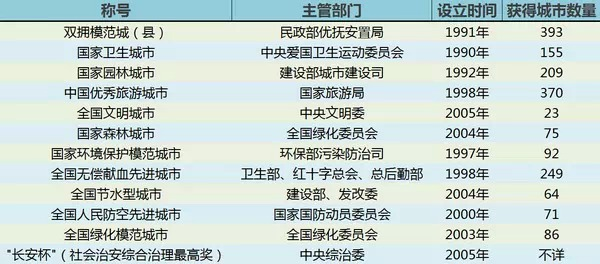
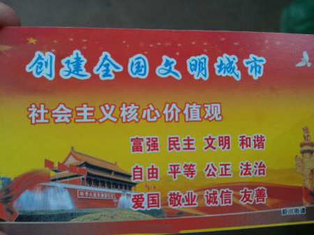

**为什么武汉无论大学、中学、小学甚至幼儿园都要求会背诵24个字的社会主义核心价值观，为什么中国城市这么热衷于争取文明城市、卫生城市的头衔？**

  

**文/杜修琪 郭子健**

  

热干面和黄鹤楼以外，武汉又多了一张城市名片：社会主义核心价值观。

  

居委会的阿姨，高校的辅导员，机关单位的领导……武汉调动了可能的所有人力，来应对中央文明办、省级文明办等的暗访。最为人津津乐道的，是背诵社会主义核心价值观的要
求。比起四川虎头蛇尾的中国梦办公室，武汉的行动力、抗压能力堪称一绝。

**武汉某高校学生在微博上晒出学院下达的通知短信**

  

**武汉市人人“争相”背诵的社会主义核心价值观24字基本内容**

  

武汉无疑是最努力的创文明城市，它也应该着急。15个副省级城市中，只有武汉、西安、哈尔滨、沈阳、济南不是文明城市，这5座城市都在准备第四批全国文明城市的考核。
但是，西安拥有国家卫生城市称号，这对其他四城是个巨大的优势。

  

武汉并不是没有国家级荣誉称号——历史文化名城、优秀旅游城市、国家园林城市、国家森林城市、全国双拥模范城市。但是，这些称号的含金量有限，历史文化名城、优秀旅游
城市属于文化领域，重要性较低，何况后者的数量超过300个。

  

相对来说，难度最大的当属国家森林城市，截至2014年，只有75个城市当选。薄熙来主政重庆时期，提出建设“五个重庆”，森林就是其中之一，但重庆市冲击首个省级国
家级森林城市未果，只有下辖的永川区获得该称号。

  

青岛申请国家森林城市的故事应该能让武汉更感欣慰。作为副省级城市，青岛坐拥全国文明城市、国家卫生城市等称号，偏偏在森林城市上折了跟头。2012年，青岛市宣布投
资40亿元，突击“植树增绿”，但由于势头过猛，一些树苗栽到了立交桥下，还有的除掉旧草皮，为将来的森林腾出空间。

**青岛网友拍摄的位于高架桥下种植的树苗，官方回应称“暂时性”种植**

  

不幸的是，2012年到2014年，全国绿化委员会、国家林业局授予了44个“国家森林城市”，青岛一直都没入选，都落在了同省淄博、枣庄之后。

  

“国家森林城市”的安慰效果毕竟一般。其主管部门为国家林业局（副部级），略低于国家园林城市（建设部）、国家先进科技城市（科技部）、全国无偿献血先进城市（卫生部
，中国红十字会）。

  

主管部门的级别高低，是城市称号等级的最直接衡量标准，也是决定一个城市有多大热情去争取这一称号的直接原因。森林城市固然获得难度高，但相比之下，全国文明城市才是
称号王冠上的明珠。

**中央精神文明建设指导****委员会历任主任**

  

这从主管该评选的政要级别就可以看出。1997年，中央精神文明建设委员会成立，事实上主管党的意识形态工作。其主要日常工作，由下设的中央文明办（正部级）承担。

  

历任中央文明办的主任，都是中宣部的常务副部长。而三任中央精神文明建设委员会主任，除第一任为中宣部部长外，后两任都是政治局常委。也就意味着，从2002年的中共
十六大开始，该委员会的级别提升了。

  

这也体现在了地方对文明城市的重视程度上——极少数领导会为了创新城市、旅游城市、献血城市而调动全部机关，但一旦迎接文明城市检查，都会开足马力，居委会阿姨、中小
学教师、机关企事业单位全部上阵，如临大敌。

**开封在推广“三城联创”（全国文明城市、国家卫生城市、国家环保模范城市）时，某社区板报标语不仅口号学习了宜昌的先进经验，连城市名称也一并“学”了过来**

  

中央文明网的公告也明确的表示：“全国文明城市”是反映城市整体文明水平的综合性荣誉称号，是全国城市综合类评比中的最高荣誉。

  

“文明”一词也极具特殊性。什么是“文明”？对于此词的理解，远不如森林、园林、献血那样简单。这让评选标准具有非常强的可塑性。

  

根据中央文明办的文件，其评价标准为以下八点：

**组织领导坚强有力，创建工作机制健全；**

**思想教育深入细致，道德建设扎实有效；**

**创建活动蓬勃开展，人民群众广泛参与；**

**党政机关廉洁高效，社会风气健康向上；**

**科教文卫体稳步发展，社会事业全面进步；**

**社会治安良好，社会秩序井然；**

**基础设施较为完善，生态环境优良；**

**经济持续快速健康发展，居民生活水平稳步提高。**

  

涉及到政府工作几乎全部方面。综合各种地方流传的具体指标，简而言之，“文明城市”就是先进城市。评选文明城市，相当于中小学流动红旗的城市版本。

  

因此，尽管评选标准是所有城市评比中最抽象的，但文明城市的具体操作流程，却异常具体、严格。大量运用往往高级别考评才会出现的手段——暗访、复查。并且对申报资格有
着严苛的限制：

**1、获得并保持全国创建文明城市工作先进城市荣誉称号；**

**2、申报前连续两年人均GDP高于全国平均水平；**

**3、申报前12个月内市委、市政府主要领导无严重违纪、违法犯罪；**

**4、申报前12个月内未发生有全国影响的重大安全事故、重大刑事案件；**

**5、申报前完成国务院下发的节能减排任务；**

**6、未发生非法出版、制黄贩黄、侵权盗版的恶性事件。**

  

所以，在申报之前，必须先过了创建文明城市工作先进城市这一关。然后由市文明办向省文明办递交申请，由省级部门协调名额，才能再申报到中央文明办。

  

这无疑是市级主政者要极为严肃对待的事情，实际上，这对当地宣传部门、文明办的官员更为重要。

  

**第一批全国文明城市市（区）委书记**

青岛市 杜世成 严重违纪

厦门市 郑立中 国台办副主任

大连市 孙春兰 天津市委书记

宁波市 巴音朝鲁 吉林省委书记

深圳市 黄丽满 广东省人大主任

包头市 邢云 包头市人大副主任

中山市 崔国潮 澳门中联办秘书长

烟台市 焉荣竹 省政协副主席（中央委员）

和平区 刘琨 市政协秘书长

浦东新区 杜家毫 湖南省长

西城区 吕锡文 北京市委副书记

张家港市 曹福荣 苏州市政法委书记

  

**第二批全国文明城市市（区）委书记**

成都市 李春城 严重违纪

南京市 罗志军 江苏省委书记

南宁市 马飚 全国政协副主席

惠州市 黄业斌 省总工会主席

南通市 罗一民 省政协副主席 统战部长

苏州市 王荣 深圳市委书记（明星官员）

东莞市 刘志庚 广东省副省长

马鞍山 丁海中 省委副秘书长

大庆市 盖如垠 省人大党组书记 副主任

库尔勒市 赵青 博尔塔拉蒙古自治州党委书记

静安区 龚德庆 1115大火受处分

东城区 王学勤 中国思想政治工作研究会秘书长

**当选全国文明城市的市（区）时任市（区）委书记升迁情况**

**（红色表示升迁迅速，绿色表示没有升迁，其他为升迁正常）**

  

按官员的升迁轨迹，一般在第一批和第二批获得全国文明城市称号的地方政府主政官员（一般为兼任市文明委主任的市委书记），除去因违纪问题受到处分和年龄过大的因素外，
大多在近十年之内获得了一级甚至更高的行政提升。

  

最耀眼的便是孙春兰、巴音朝鲁、罗志军和马飚。省会城市或特大城市自然受到重视，但那些获得文明城市称号的普通地级市，其市（区）委书记也多数实现了从厅局待遇到省部
待遇的艰难跨越。这不能不说是文明城市给他们带来的胜利。

  

因此，市委书记亲任抓手，为获得文明城市称号动员全市之力，也就顺理成章了。

  

所有城市称号中，重要性唯一能够堪比文明城市的，就是国家卫生城市。多数情况下，人们会将二者连起来，结成一个特有名次：“创文创卫”，并列为城市的战时口号。

  

卫生城市的独特地位，在于其历史因素。组织上，国家卫生城市由中央爱国卫生运动委员会评选，这是一个与当前的行政体系无法兼容的“议事协调机构”，但历史上曾拥有过极
大权力。稍微上年龄的人，应该会懂得其历史地位：“除四害”的指挥者。

  

这个从政治运动中诞生的机构，至今仍继承着当时的组织方式：

  

直接由党、国务院领导，由军委、计委、建委、农委、科委、工交、财贸、农业、水利、冶金、化工、宣传、文化、教育、卫生、环保、体育、公安、民政和工、青、妇等部门领
导组成，还可以根据实际情况，搭配其他同级部门。

  

各省市都有其分支机构，形成上下级关系。一旦调动，它有着超越狭隘部门的动员力量，当然，作为城市称号，它的影响力也非同一般。

  

现在，中央爱国卫生运动委员会办公室已在机构上被调整，成为卫生部疾病预防控制局，但是仍然有极强的动员潜力。

  

所以，创文创卫就成了所有称号中超然独立的两大桂冠，其余的称号即使挂在各部级主管单位，也只有作点缀二者的绿叶。

  

如果你到某个城市，突然发现这个城市很多临街小餐馆关门了，各种流动摊贩不见了，城市街道变得整齐干净冷清了，而到政府机关办事则往往发现找不到人，那这个城市一定是
在创文创卫验收期。有些北方城市行政机关见不到人，是因为他们正在街上忙着消灭烟头、落叶甚至苍蝇。

**2011年济源市为推进全国文明城市创建工作，决定在市区范围内开展为期一个月的 “捡烟头状元”评选活动。一时间全城烟头抢手，甚至有“烟头贩子”出现**

  

——几乎全国每个申报城市，在临近验收期间，都会自动进入“5+2”和“白加黑”模式，令基层公务员苦不堪言。所谓的“5+2”，即周六周日照常上班之意，所谓“白加
黑”即不分上下班之意。  
  
申报城市如此重视创建工作，是申报规则使然，譬如“创建卫生城市”，过去评审周期是两年，单数年申报、双数年命名，后改为三年，第一、二年申报，第三年的第四季度命名
，而书记、市长通常只有一任，五年的任期内实际只能申报一次，错过便再无机会，这“一步之遥”，当然使得书记市长们必须成功。

  

许多称号，其诞生之初，就带有强烈的目的性——作为重要政策的配套措施。1997年，中国无偿献血法制定之后，第二年就由卫生部、红十字总会、总后勤部发起全国无偿献
血先进城市，截止到现在已颁发给249个城市。

  

不过，目前大部分的城市称号，都开始于20世纪90年代以后。听起来十分古老的称号，如双拥模范城，也从1990年开始评选，没有改革开放之前的城市称号。

  

为什么会这样？

  

其实很简单：不需要。改革开放之前，中国是一种全能型的社会控制模式。无需以称号评选来调动地方的组织力量，直接用行政命令，效率奇高。即使领导人认为行政命令被消极
抵抗，只需发动政治运动，显然比颁发称号更有效。

  

但80年代以后，政党和政府的控制领域、范围、能力都在缩减，社会恢复了部分弹性，尤其在经济领域，人们得到了前三十年所未有自由度。这时候行政命令的可控范围就缩小
了，也无力再发起广泛的政治运动，以完成创建任务的形式，替代以往的全面的行政管控，无疑更为合适。

  

因此，武汉的行为才让一些人觉得费解——都已经什么时代了，居然还要求市民像背毛主席语录一样背社会主义核心价值观，即使当年也没有搞这样的随机抽查。

**武汉市民近日收到的“圣诞卡片”**

  

但人们也并没有更好的办法，舆论反应再大，武汉人也只好继续背诵下去。还好，只用背社会主义核心价值观，而不是十八大报告。

  

**版权声明**

****大象公会所有文章均为原创，****  

****版权归大象公会所有。如希望转载，****

****请事前联系我们：****

bd@idaxiang.org

****知识 | 见识 | 见闻****

阅读

__ 举报

[阅读原文](http://mp.weixin.qq.com/s?__biz=MjM5NzQwNjcyMQ==&mid=209380751&idx=1&sn
=c687a96db69c5cfedc3fe66a5af68d54&scene=1#rd)

