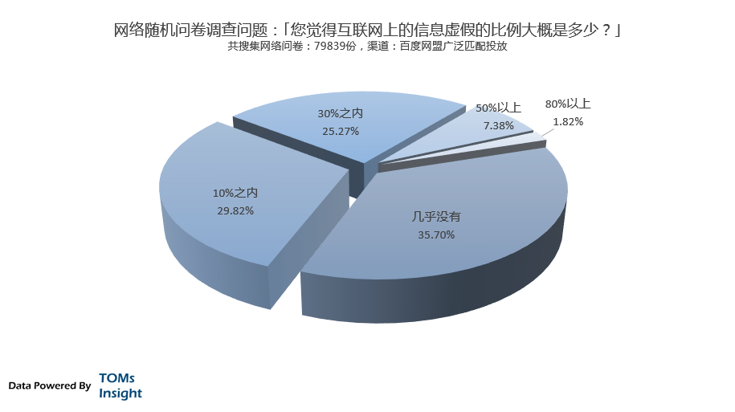
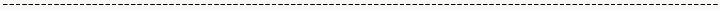

##  互联网黑市分析：虚假运营手段

_2015-03-06_ TOMsInsight TOMsInsight

**TOMsInsight**

TOMsInsight

专注于中国互联网的深度数据分析洞察，发布独家原创报告。

__ __

我国有句古话叫｢文无第一，武无第二｣，古人简简单单的一句话，却说出很多行业的潜在运行规律，也是中国大多数行业的背后法则：公平简单规则下的竞争会推动竞争者个体
的提高，而复杂的规则下，竞争者更多的反而去在争夺竞争规则的资源，或者在游戏规则上做文章。简单的说就是，如果竞争规则不是简单客观公平的，｢专业性｣就没那么重要
。

  

比如说从学校走向社会，对人的衡量就不仅仅是相对客观公平的考试成绩，而是各种复杂的游戏规则；比如在行业浸泡越久，就越发现影响成功的因素永远比想象的要复杂，靠学
习和努力根本无法逆袭的；再比如在一个行业没进入到核心圈子，就很难了解真正潜规则。这是我国几千年文化和传统作用的结果，也是大多数行业的运行规律法则。

  

这种意识形态也在潜移默化的影响着互联网，但在互联网这个法则是逆向作用的并且被放大：由于行业快速的发展，规则在不断的变化，几乎所有的创新者眼中的｢创新｣都会聚
焦在｢新规则｣上，占据了新的规则就占据新一轮的发展的机会，投机的回报要远大于积累。行业也越来越浮躁，充斥着｢我的想法能改变世界，就差找个技术合伙人给我做ap
p｣的声音。

  

就好比是比武，既然每一轮都会变一次规则，既得利益者和大玩家都会在这个上面做文章并获利，而规则变得越来越愚蠢和搞笑。可能大家都记得八十年代电视剧《霍元甲》里面
的武状元，根本不会武功，但是由于比武比的是各种｢才艺｣，加上银子使然，就真的成天下第一了。这并不是完全虚构而有一定是历史事实成分，清末的武举制度的规则，已经
让武举成为笑话。

  

虽然主流互联网圈子｢擂台比武｣已经成为讲故事、唱首歌、拉选票、比颜值、贴海报，秀招式的闹剧，但并不是说武艺已经失传，在互联网黑市的快速变现的要求与目的驱动下
，一些武师和武艺朝着另一个极端的方向发展：长期的内功磨练、对一招致命的极致追求、阴劲、下毒、暗器，无所不作，只是为了保持在黑市中的生存本能。

  

TOMsInsight继续互联网黑市的分析报告系列，今天的主角是：虚假运营手段。

  

**什么是虚假运营**

  

虚假运营，简单的说就是有目的的给网络用户营造一个假象，这种假象利用一些网络规则和心理技巧，让我们难以识别，信以为真，从而获利。

  

如果用现实社会对比，我们可能会遇到雇佣一些群众让售楼处看起来非常火爆的情况、会遇到购买东西时候的各种托、或者拍卖会的时候有自己抬高价格。但由于成本问题和构造
虚假环境的经验，所以在现实社会应用并不多，但是在互联网上就是完全另外的一种情况了。

  

中国社会的特殊性，让其传统的人和人的信任逐步弱化，但与此同时互联网却在此方面的表现恰恰相反：总体而言，反传统社会的信息对等的产品概念和相应的用户体验、除去了
直接的沟通避免了更多信任损耗，更好的视觉体验，以及更强的社交属性都让互联网享受着与线下社会交易相反的信任红利。

  

我们从下图的调研结果可以看出，虽然网上充斥着大量的相互攻击和对舆情怀疑的论调，但是仅仅是少数群体，90%以上的网民还是觉得互联网虚假信息仅仅在30%之内。

  

  

  

这种红利，再加上网络展示出来的仅仅是抽象的数据和信息，营造一个虚假的氛围环境的成本极低，都给虚假运营带来了极大的空间。

  

举个最简单的虚假运营手段，就是淘宝商家的刷单，通过刷单的方式让顾客觉得自己生意或单品火爆，从而带来从众心理的消费。但是淘宝刷单仅仅是虚假运营手段一个最简单的
例子。近些年来，虚假运营进入地上主流互联网的运营世界，比如大家访问微博，会发现僵尸粉，有的僵尸粉还会自动评论；随便访问一个招聘网站，就充斥大量的假职位，还有
假猎头给你发消息留言，但是得交钱加入会员才能看到留言；婚恋网站总有一些漂亮的姑娘，但是注册会员后反而找不着了；任何一个交友app查看附近的人都有大量的美女，
哪怕你在深山老林沙漠；刚刚上线3天的p2p网站，就弄到了几百万用户，等等。

  

但是对于黑市上的虚假运营手段来说，上述都是完全的可笑的小儿科，黑市上的虚拟运营模式早已经在十几年的｢内功磨练｣中达到一层层的门槛高度，顶级的虚拟运营可以构建
一个完整的网络世界副本，而这个世界副本仅仅是为了一个用户定制化，看上去有种｢楚门的世界｣的虚幻感，但是却完完整整的发生在我们所访问的互联网的每一个角落和每一
块重要的流量变现地带，让虚幻的互联网中，再次嵌套了一层虚幻。

  

**虚假运营手段**

  

我们把虚假运营手段分成5个阶段，这5个阶段并不是按照时间发展的顺序，而是手段的深度和技术水平来划分，对大多数虚假运营来说，都停留在前两个阶段。而每一次的突波
，带来的不仅仅是对虚假运营水平的提高，更多的是对互联网产品生态的认识，用户的心理的把握以及变现的节奏感的整体提升。

  

与此同时，我们也用小a举例，对每一个阶段的手段进行具体的分析。小a的故事纯属虚构，仅为分析例证，不代表任何互联网实例，请不要对号入座，更不要询问相关内容真假
。

  

**马甲阶段**

  

马甲阶段是虚假运营的第一个阶段，也是最常用的。这不是互联网黑市专利，在主流的互联圈子也是非常常用的手段。几乎所有的UGC平台的运营开始，都会采取马甲虚假运营
，这也成为中国互联网一个约定俗成的规则和不是秘密的潜规则。大量的地下产业链的人海组织，利用一些四五线城市的廉价成本，让马甲虚假运营更快速的发展。

  

在这个阶段，常用的手段就是大量的虚假用户和虚假信息。比如之前举例的微博上的僵尸粉、招聘网站的虚假职位、虚假猎头信息，婚恋网站的虚假用户照片、交友app的虚假
位置信息等等。另外一种情况，就是专业化的虚假信息：这些信息一般带有一定程度的门槛，而把用户包装的有一定的权威性，信息有一定的指向性来变现。比较典型的就是各种
疾病信息平台上的医生回答，有些平台搜集大量的医生的信息进行构建虚假用户，后台大量的根本没有任何医疗知识的键盘手根据话术，引导提问的病人到指定的民营医院就医，
获得暴利。

  

\----------------

  

小a是85年生人，北京某著名大学社会心理学和计算机双学位毕业，极其热爱互联网，聪明有余沉稳不足，不喜欢按照规则约定俗成顺应着发展。小a毕业后不想去大公司当个
屌丝产品经理和程序员，开始独自闯荡，成为一名网络自由创新者，并利用自己的优势，在虚假运营上专门做文章。

  

小a早有所闻莆田系民营医院的暴利性和与之对应的互联网医疗广告的变现，最早做的是一个医疗知识平台。小a找了一个网络问答的免费程序，用了好几周的时间，把全国所有
的三甲医院的医生信息全搜集抓取起来，生成几千个名医用户，再用各种爬虫去抓取全网的医疗知识问答信息，加入自己的广告，SEO优化，发现一个月也变现2-3万的广告
费。适当的给自己的平台投放些网盟广告和关键词广告，长尾词，蓝海词，SEM优化，再引入了一些民营医院的客服CPA，发现做的好一个月也能5-8万净利润了。这个时
候的小a，还处于虚假运营的马甲阶段。

  

**模拟阶段**

  

模拟阶段是第二个阶段，更注重整体氛围的营造，在马甲阶段的相关手段上更进一次。如果我们从理论上分析，马甲阶段的手段一般都是离散的，信息之间耦合度比较低，但是到
了模拟阶段的手段，就变得高明的多，更像是一个真实的世界的模拟。黑市上对这种手段有个比较形象的称呼叫｢说相声｣。

  

这种虚假运营手段更常用在电商而不是UGC的平台，因为电商变现更直接，而UGC只能通过流量分发变现而不能直接接触变现终端利润率相对更低。比如很多朋友圈电商或者
微商都是此道高手：明明是一个新开了几天的店，什么银行卡流水记录，发货邮寄单，成堆的发货现场，看上去异常火爆；明明是一个新淘宝店，刷了五颗钻打着冲冠的名头减价
，什么用户好评用户反馈用户和掌柜的聊天记录看上去好像已经是百年老店的感觉，等等。

  

\----------------

  

小a做了一段的医疗知识平台觉得没意思了，由于自己没法掌握变现终端，只是流量分发渠道，简单的说只能通过广告赚钱，到了一定程度会被压价，甚至被｢吃量｣。看来还得
自己掌握变现才是王道。小a开始做电商，小a很理智的没有选择什么火爆的朋友圈电商什么微店，也不去淘宝凑热闹，小a知道如何自己占据主动不被恶意竞争困扰。

  

小a开了一个独立的单品电商，专卖高端充气娃娃，再挂一个论坛。各种虚假运营手段：什么银行卡流水记录，夸张的用户反馈，成堆的发货现场，疯狂的男粉丝自拍，论坛里面
各种虚假用户间沟通，女用户来骂老公事件，男用户购买20个娃娃的群p事件等炒作。小a默默的利用自己社会心理学的优势模拟积累了几个月后才上线，上线后直接购买流量
引入，卖的那是相当的火爆，月入10w+轻松愉快。这个时候的小a，处于虚假运营的模拟阶段。

  

**数据阶段**

  

前两种虚假运营的手段没有多少门槛，只要用心钻进去，多积累一些经验，都能玩的转，所以也可以说并没有到达真正的高手阶段，而到了数据阶段，会有一个比较质的飞越。数
据阶段的虚假运营，是指通过数据的虚假，构建一个虚拟的世界，欺骗用户达到最终的目的。

  

在这个阶段，对数据的策划能力和平衡能力是最关键的点，纯粹用数据就可以模拟出来一个虚拟的繁荣假象，和相对于的用户体验。这个阶段比较常用于游戏的运营，虽然用户很
少，但是在数值策划上做文章，能模拟出非常多用户同时在线的效果和体验，以及与之对应的付费冲动。另外在一些信息不平等的中介平台上，这种手段也运用的很多，例如比特
币交易，p2p金融等。

  

\----------------

  

小a胃口越来越大，已经不满足一个月10几万的收入。小a把盯上了最近比较火热的德州扑克。小a比较收过高等教育，知道国家对棋盘类游戏管理很严，稍有不慎就成为了赌
博，但是只要自己不去做check out的环节，就没有风险。小a的战略方针是，大筹码，玩的爽，把网游的那些激励因素引入，并不check
out，鼓励pk，引入秀场似的诱惑竞争机制。

  

在数据上，小a请了大学数学系好友操刀数值策划和算法，自己操刀用户心理。模拟成一派火热攀比的竞争态势，激发用户的冲动。虽然仅仅只有几千个真实用户，但是玩起来的
感觉就和几十万上百万的赌徒狂欢一样，做到这个份上，小a已经可以月入50万以上了。这个时候的小a，处于虚假运营的数据阶段。

  

**副本阶段**

  

副本一次最早是从游戏中来，在著名的游戏｢无尽的任务｣中出现，在｢魔兽世界｣中被发扬光大。在游戏中，一个副本就是一个专为你和你的团队的特殊拷贝，是一个虚拟世界
的复制，这个世界仅仅为一个用户或者一组用户准备。简单的说，用户甲进入副本，看到的是一个独立的世界，用户乙进入，看到的也是这个独立的世界。用户甲乙，在不同的独
立空间中。

  

副本阶段的虚假运营是一种非常高超的技术，不论从技术角度讲，还是对产品的理解，设计，用户体验的把握，最终运营目的的实现上。在副本阶段的虚假运营中，用户相对独立
，所以也需要非常高超的数据虚假运营能力，和利用人工智能或者大量深入用户心理的话术，对环境进行模拟和打造真实体验。这种虚假运营手段，最常见的是运用到赌博性质的
游戏中。

  

\----------------

  

人心不足蛇吞象，很快小a对每月几十万的收入也并不满意。单纯的棋牌游戏和赌博仅仅有一步之遥，很容易捅破那个隔层。但小a还是不敢突破那条红线，却一直想办法创新。
在和数学系的同学无数个不眠之夜探讨，深入的数学模型分析，以及对社会心理学深度应用后，小a摸索出来了新的模式。

  

跟踪玩家行为，通过数学模型给用户分组，不同的组别的用户进入到不同的副本。不同的副本有着不一样的数据虚假运营氛围和规则。简单的说，玩小a的游戏，玩着玩着，大家
看到的游戏都不一样了。例如玩家甲是土豪，看到的是一种土豪规则和炫耀氛围；玩家乙是屌丝，看到是屌丝规则和逆袭气氛。不同用户进入不同的虚假世界，看到量身制定的规
则和氛围。在这样的用户行为建模后个性化虚假运营手段下，小a月入终于破了百万。这个时候的小a，处于虚假运营的副本阶段。

  

**脚本阶段**

  

副本阶段不断的优化，势必给用户的分组越来越多，最极端的方式，每一个用户都获得一个副本。但是在实际建模过程中，不会有那么多数据维度，能给每一个用户都分一个副本
进程的。一方面是同样的应用中用户的同质化比较严重，另一方面也是没有足够的结构化数据的支撑。

  

但是没有关系，可以利用黑市的社工库进行获取用户的全方位的结构化数据和信息，几乎能包括用户所有的社会上的留下的足迹数据。（关于社工库相关信息可以参考TOMsI
nsight之前的深度分析报告《互联网黑市分析：社工库的传说》）。利用社工库数据，给每一个用户设定一个场景，完全符合该用户的特点，这在黑市上叫做：｢脚本｣。
一般运用在金融诈骗，大额度赌博等方面。

  

\----------------

  

小a一直不敢突破赌博的红线，但是副本阶段积累几年，有着足够的经验和积累。一直到2014年，p2p金融平台的火爆和相对于的监管不足产生的所谓的｢监管红利｣，让
小a看到了机会，小a成为了比较玩进入但是是胆大心细技术高玩的最好的那一批人。

  

同样是虚假的副本运营，在黑市上大量采购社工库数据，包含用户的征信数据，各种酒店机票数据、网络的各种足迹数据、爱好、特长、工作、甚至一些往来邮件和聊天记录等等
，给小a的建模足够大的空间和结构化源数据。针对特定的大客户，把游戏中的心理映射到真实社会，完全按照用户需求心理特定打造的p2p模式，个性化的各种提醒和匹配性
客服，几乎和赌场无异，风险几乎为零，吃掉几个大客户，甚至都不用跑路，至此小a的月收入终于突破了200万。这个时候的小a，处于虚假运营的脚本阶段。

  

**与主流互联网的对比**

  

｢其实我一直感谢那些主流的互联网从业人员。｣ 小a 在和我们TOMsInsight分析师聊天的时候，总是说自己不是主流的互联网从业人员。｢主流的互联网从业人
员，他们总是浮在水面上，每天刷几个小时微博，几个小时的微信文章，嘴里说着各种用户心理，用户体验，用户行为，却总是臆想、臆断、臆x、从来没看过任何的一本心理学
经典著作，更别提系统的学习了，甚至连基本的计算机科学抽象原理都不懂。是他们给了我机会，其实不是我武艺强悍，只是我用心去练了练而已。｣

  

我们很难反驳小a的话：这种非常深入的虚假运营手段，是完全不可取的，但是我们也确实很难在主流的互联网圈子中，寻觅到如此深入的研究运用和如此巧妙的设计模式。在主
流的互联网产品运营中，如果有一些个性化的功能差异，都已经被追捧成神级作品了，少之又少。

  

从另外的角度来思考，这样的虚假运营手段，远远超出主流互联网圈的认知，我们又如何的去防范，如何的去保护用户的利益呢。猫鼠游戏，如果鼠的速度快到猫根本看不见的地
步，那是不是猫应该反思反思，也许不应该专注于扮萌讨主子开心，也该花点时间磨练磨练捕鼠的技能了。从整个行业出发，如果鼠越来越潜心修炼，猫越来越扮萌讨主子开心，
最后真正损害的还是用户的利益和整个行业的信誉。

  

**给我们的启示**

  

有时候，我们太想完成目标，反而忘掉了目标是什么；有时候，我们太想成功，反而忘掉了成功是什么。有时候，我们制定了层层的标准，制定了层层的游戏规则，最后在这样的
规则下结果，已经失去了本来的意义，成为了一个符号或者一种标志，或者一种虚假。

  

同样，我们很聪明的给我们找出各种理由来诠释我们的进步和成功，只是夜深人静的时候，扪心自问，这些真的有意义么，还是只是我们为了满足各种而设定的借口。有时候真的
不知道是虚假运营手段更真实，还是我们的标准更真实。也许都是一种虚幻，就如互联网世界一样。

  

> **( TOMsInsight仅发布独家原创报告，拥有全部内容及数据版权。****欢迎个人分享，但媒体或商业转载必须联系我们并获取****邮件授权***
*，违者必追究法律责任。 )**

  

**这是TOMsInsight报告**  

  

**专注于中国互联网的深度数据分析洞察**

**微信号：tomsinsight**

  

阅读

__ 举报

[阅读原文](http://mp.weixin.qq.com/s?__biz=MzA3NTcwOTIwNg==&mid=204363853&idx=1&sn
=cd0af868a824c97bd2a5475a53f0cb30&scene=1#rd)

