##  五角星之美国的崛起  | 大象公会

_2015-01-27_ 大象公会

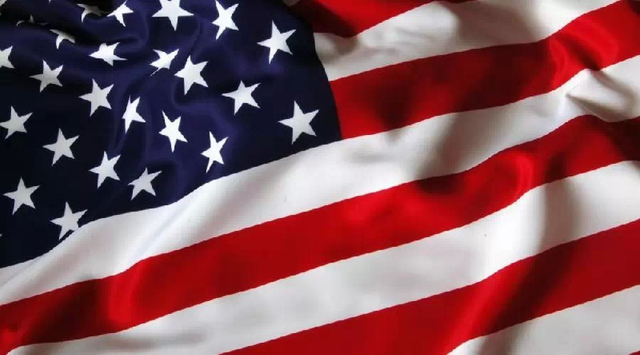

**为什么殖民地国家国旗喜欢用五角星？为什么“星级”成为评定的代名词？为什么用五角星指代“明星”？**  

  

**文/刘大可**

  

作为超级大国，美国的影响极为深远，包括不少令人惊讶的细致领域——当人们习惯用“星级”评定酒店、餐饮，习惯于国旗上出现的白色五角星，美国的影响力就已经显露出来
。

  

五角星能够在大众文化领域兴起，几乎就是美国的功劳。

  

**【星条旗与殖民地旗】**

  

1783年9月3日，北美13个英属殖民地正式独立，成为近代第一个获得主权的殖民地国家。

  

这个极具开创性的先例，一切举动无疑带有着示范、带动作用。

  

它们选择的国旗是星条旗——如之前两篇文章所述，星条旗最初的设计并没有非常确切的解释，通常认为修改自英属东印度公司的米字横条旗；五角星有可能来自国父华盛顿的家
族纹章。

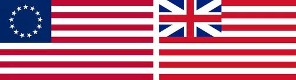

**左侧是第一面星条旗，1777年启用，右侧是当时的英属东印度公司旗帜，注意当时爱尔兰尚未加入联合王国，米字旗与现在的不同**

  

美国独立后成长迅速，国土不断增加，星条旗也因此成了版本最多的国旗——左上角代表联邦各州的星星从最初的13颗一直增加到现在的50颗，美国陆军如今正操心如果美属
波多黎各也成了一个州，51颗星的国旗该怎么安排。

  

美国是近代历史上第一个独立的殖民地国家，获得了极大的成就，其国旗设计影响了之后诸多脱离母国的殖民地独立国家。五角星用来代表行政区划数量的做法，也被广泛继承。

  

英联邦国家最为突出。它们的旗帜大都修改自英国政府蓝船旗——米字旗占据左上四分之一，空余的蓝色部分添加自己的标志图案。它们模仿了美国国旗的五角星符形——图瓦卢
国旗用了9个五角星象征构成图瓦卢的9个岛屿；库克群岛用了15个星星表示群岛中的15个岛屿。

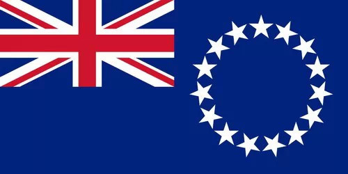

**库克群岛国旗，1979年8月4日启用**

  

除了像美国一样用星星数量代表行证区划，新西兰还用了4个五角星象征南十字座，表明自己是个南半球国家；晚6年启用的澳大利亚国旗设计几乎与新西兰一样，只是南十字座
用了5颗星，而且多了一个联邦之星，而且用的是七角星。

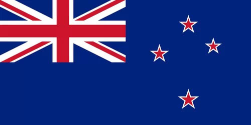

**新西兰国旗，1902年正式启用**

  

即便非英国殖民地的巴西，也受此影响——巴西联邦共和国的前身是葡萄牙亲王佩德罗一世于1822年建立的君主立宪国家，国旗是绿色背景上有一个黄色菱形，那是王室的标
志色；中央一个王室纹章，环绕着20颗星星，代表20个省。

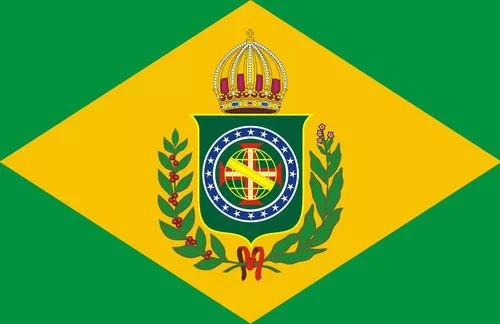

**巴西帝国在1870年到1889年的国旗**

  

1889年11月15日，这个专制政府被革命推翻，新政府立即启用了一面黄白绿版的星条旗作为临时国旗，连条纹的数量都没变，大有建立南美版美利坚的架势。

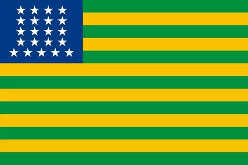

**巴西联邦共和国临时国旗，使用于1889年11月15日到19日**

  

然而，这面临时国旗只用了4天，之后启用的正式国旗修改自巴西帝国国旗，保留了原有的绿色和黄色，但重新诠释为巴西广袤的森林与丰富的矿产，中央的文章换成了国旗设计
史上最浪漫的五角星——那是一幅革命胜利当天夜里，首都里约热内卢上空的星图，撷取了当时全天最明亮的21颗星分别代表首都和全国20个州，并在银河的位置标有一根飘
带，写着“秩序与进步”。

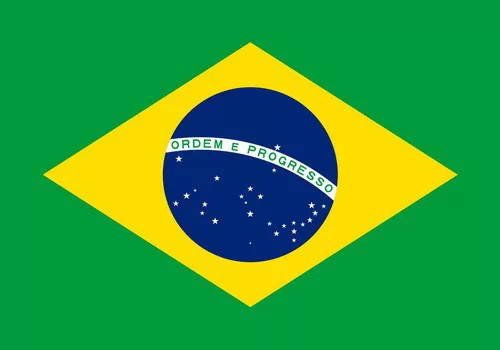

**现在的巴西国旗，1992年启用**

  

100多年来，巴西政局非常动荡，这面国旗却被延续下来，每当联邦中州的数目有所增减，就再次根据那一天的星图改换上面的星星，如今是27颗五角星。

  

更有一些国旗直接修改自美国国旗。利比里亚是从美国回到非洲的黑奴建立的国家，所以国旗与美国十分相似；马来西亚国旗则是星条旗与星月旗的合体，但是改用星星的角数代
表13个州和整个联邦，所以是14角星。

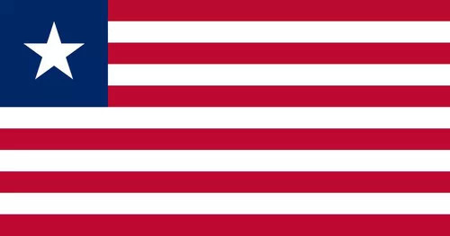

**利比里亚国旗，1847年启用**

  

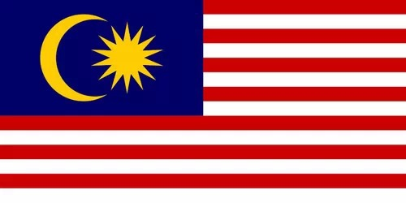

**马来西亚的辉煌条纹器，1963年启用，该国同样曾为英属东印度公司领地**

  

**【五星酒店，四星电影】**

  

五角星符形在民间和商业活动中的应用，同样有鲜明的美国影响。常见的电影星级打分，饭店和旅馆的星级评定，都是美国商业活动的结果。

  

星级评定最早应用于图书出版行业。1915年《美国最佳短篇小说年鉴》（The Best American Short
Stories）创刊，著名作家、诗人、社论撰写家爱德华•奥布莱恩（Edward O'Brien,
1890–1941）用0到3个星号“*”给小说打分，以此来分类、编辑。

  

他的理由非常有说服力——星星象征永恒，而好的文学作品应当历久弥新，所以星星的数量就代表了“文学作品接受时间考验的能力”。

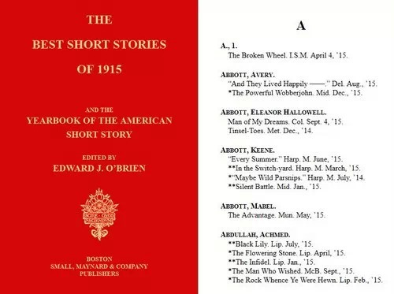

**《美国最佳短篇小说年鉴》1915年版，右边是目录中首字母A的小说，可见“*”评级**

  

当时，图书评论界并没有广泛采用这一创举。1928年，《纽约每日新闻》的电影评论家艾琳•塞勒（Irene Thirer,
）将这种3星评级迁移到了电影评论，并将*换成了五角星——这就是电影史上的第一次星级评价，很可能也是五角星符号第一次用在评级上。

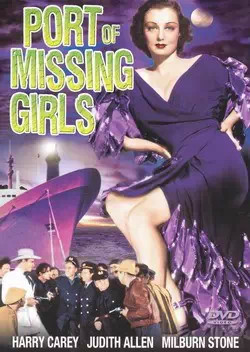

**1928年的无声电影《The Port of Missing Girls》是第一部受到星级评定的电影，不过它只得了1颗星**

  

1950年以后，安德烈•巴赞在法国主办的世界级电影期刊《电影手册》（Cahiers du Cineema）中，用投票的方式统计电影评论，折合成星星，最多可以
获得五颗，五角星用作星级评定的功能由此被人们重视——这本杂志对现代电影史的影响极其深远，现如今几乎所有电影网站都沿用了它。

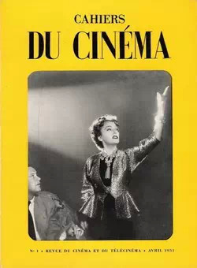

**1951年的《电影手册》封面**

  

当然，如你所知，星级评定也扩展到了整个消费行业——饭店、旅馆等等也采用星级评价。

  

1958年，美孚石油创立美国第一本旅游指南手册《美孚旅游指南》，也就是今天堪称权威的《福布斯旅游指南》。它的主要内容就是给美国各地的旅馆和饭店评星，影响颇深
。

  

如今，世界各国都有了官方性质的酒店评级系统，且往往都用五角星作为计量方法，五角星也因此有了投票评价的功能。

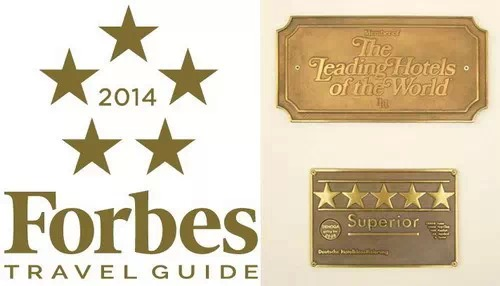

**左侧是《福布斯旅游指南》2014年的标志；右侧是德国的五星级酒店，凯宾斯基四季饭店的五星铭牌**

  

**迪拜阿拉伯塔饭店，又名帆船饭店，六星级已经不足以形容，所以用了七颗星**

  

**【明星与五角星】**

  

一个多世纪以来，美国是对流行文化影响最大的国家，尤其是电影业。美国人并不是流行文化的开创者，也不是流行文化载体技术的发明者，其最大的推动力来源于美国独一无二
的商业化历程。

  

20世纪初，当时的电影还只是1小时以内的黑白默片，便宜的几分钱看一场。相比今日大红大紫的明星，那时候的电影演员都不公开名字，绝没有今日的演职人员表——当时的
电影公司非常担心演员混出名声后，像百老汇名角身价倍增，索要更多片酬。

  

然而，追逐偶像是人类无法回避的天性，一些出色的演员很快速被观众冠以绰号，追捧起来。

  

1909年，人称“比沃格拉夫女孩”（Biograph
Girl）的佛罗伦撒•劳伦斯，被商业嗅觉敏感的独立电影公司挖走，以真名出演电影，她被公司包装宣传为“美利坚第一电影明星”（America's
foremost moving picture star），头顶华盖出现在灯光闪烁的名牌前——这就是人类历史上的第一个电影明星。

  

Star在美国语境中，就是五角星的代称。之前的五角星系列文章曾提及，欧洲的纹章体系中直边的星形符号事实上是“小齿轮”（Mullet），它在英国纹章里更多见，
这个符号不久之后就与星星混同起来，被称作“Star”，

  

不过，19世纪之前，西方的星星符号仍然以六角星更加多见，但五角星在美国的频繁露面，开始让它取代六角星成为星星的典型画法。

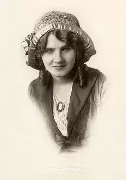

**佛罗伦撒•劳伦斯（Florence Lawrence, 1886-1938)，第一个公开名字的电影演员，也是第一个现代意义上的电影明星**

  

明星运作固然提高了成本，却更大地抬高了票房，立刻成了制片厂的吸金利器。比如好莱坞电影巨头派拉蒙，它曾经规定放映商要想公映某个影星的影片，就必须同时购买派拉蒙
全年的产品，藉此统治了整个二三十年代的美国电影业，而它在此时设计出的Logo就是派拉蒙山上环绕着24颗五角星，象征当时24个签约明星。

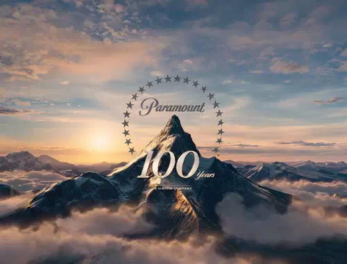

**派拉蒙影业100周年Logo，如今变成了22颗五角星，但仍然位列美国最老的电影标志**

  

随着二战后流行文化蓬勃发展，明星越发受到公众追捧，“明星产业”逐渐扩散到整个娱乐业，1960年洛杉矶市政府在好莱坞大道上镶嵌了2500颗五角星，用来摹印对娱
乐业贡献杰出人士的名字——这就是星光大道。

**2012年5月，美国女影星斯嘉丽•约翰逊赢得了星光大道上的一颗星星**

  

**【国家的荣誉】**

  

五角星与美国的联系是如此紧密，它也直接出现在几乎所有指涉美利坚合众国的场合。

  

美国的两个拟人化形象，哥伦比亚（Columbia）和山姆大叔（Uncle Sam），都充分利用了五角星设计。

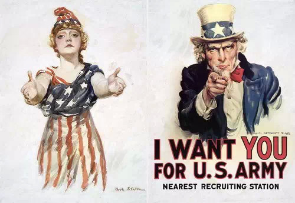

**左侧是哥伦比亚，自独立战争开始直到20世纪初一直作为美国拟人形象，哥伦比亚电影公司就以她命名；右侧为山姆大叔，自1812年美英战争起作为美国拟人形象直至今日**

  

同样，美国三军标志普遍使用五角星，二战爆发以后，美军深入欧亚战场，向盟军大量提供军用物资，五角星图在世界范围内广泛出现。

**美国陆军标志和1943年的美军吉普车——这样的吉普车在二战时生产了近65万辆，兼做物资运输和武器平台，并供给整个盟军使用，包括苏联**

  

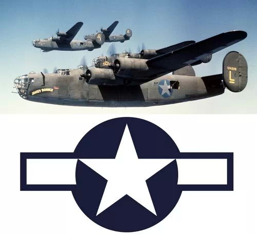

**二战时的美国空军圆标和B-24“解放者”式轰炸机，这种重型轰炸机在二战时大量投入到西线、中缅印战区和太平洋战场，比B-17空中堡垒式轰炸机还要多见**

  

国家的最高荣誉也以五角星为设计灵感。“荣誉勋章”（Honor Medal）是美国最高军事荣衔，该奖章创立于1862年的美国内战，由国会授予那些“在与敌对武装
力量的战斗中冒生命危险并且超越了职责范畴，展现出的超凡英勇行为”的军人。

  

当然，它是一枚五角星。

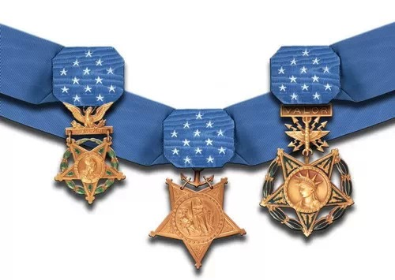

**从左到右是当前版本的海、陆、空三军荣誉勋章，绶带上13颗五角星象征联邦**

  

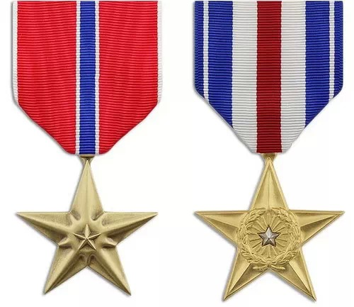

**铜星勋章（左）和银星勋章（右），用于表彰“英勇或富有功绩的成绩或服务”**

  

这些勋章让五角星和荣誉联系在一起，仿佛中国的小红花，美国的幼儿园就常常用五角星作为奖励：

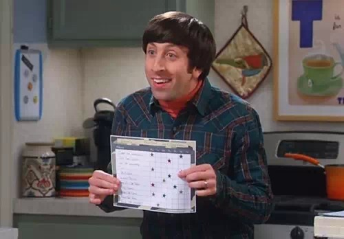

**《生活大爆炸》第8季第6集，霍华德做家务只有赢得小星星才能获得零花钱**

  

五角星与美国的密切联系不胜枚举。和社会主义阵营在政治领域的努力一起，五角星符形被冷战的死敌共同推向日常生活的方方面面，乃至人们非常自然的适应了这一局面。

  

**版权声明**

****大象公会所有文章均为原创，****  

****版权归大象公会所有。如希望转载，****

****请事前联系我们：****

bd@idaxiang.org

****知识 | 见识 | 见闻****

阅读

__ 举报

[阅读原文](http://mp.weixin.qq.com/s?__biz=MjM5NzQwNjcyMQ==&mid=210313528&idx=1&sn
=02516c8fb47b27698a5925ecce4716c2&scene=1#rd)

