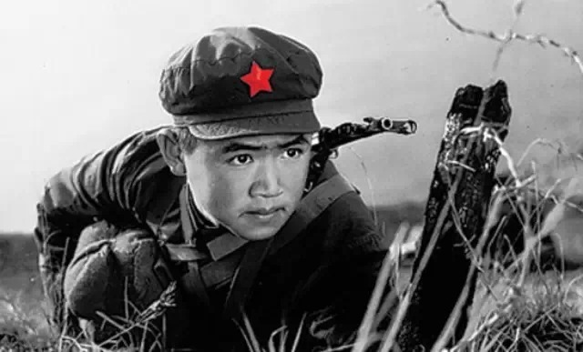

**五角星被染红，成为共产主义视觉系统最普遍的符号，其实源自一次意外。**  

  

**文/刘大可**

  

没有哪个符号比红色五角星更具政治意味——红底黄色、红底白色、纯红色的五角星，是社会主义国家国旗、国徽的鲜明印迹。现实中，红星更是重要的感召符号，资本主义国家
的反叛者，往往也认可红星作自己的象征。

  

正是它如此强烈的意识形态色彩，以至于少数国家根本禁止红星在公共场合出现。如曾经是社会主义阵营的波兰、拉脱维亚、立陶宛等。

  

现在，红星已从所有欧洲国家国旗中消失，国徽中，除了白俄罗斯和极少被国际承认的，亲俄罗斯的德涅斯特河沿岸摩尔达维亚共和国，也都不再有红色五角星符形。

  

然而，它仍然具有强大的政治、文化感召力，中国、朝鲜、古巴、越南自然仍将其作为国旗、国徽重要标志，切•格瓦拉的五星帽等象征物也在文化领域广泛传播。

  

为什么是红色五角星成为共产主义视觉系统的关键象征？它是怎样一步步影响到全世界的？

  

其实，这或许源于一次意外。

  

**【意外的染红】**

  

1917年列宁发动了推翻俄国临时政府的十月革命，建立了全新的苏维埃政权，苏维埃政权建立了一套全新的政治符号，不过，最初这个符号系统中并没有五角星。

  

它最大的特色是抛弃了俄国的象征物双头鹰——俄罗斯帝国的“沙皇”（俄语：Czar），法理上源自罗马皇帝的头衔“凯撒”（拉丁语：Caesar），其皇权标志也来自
东罗马帝国的双头鹰。

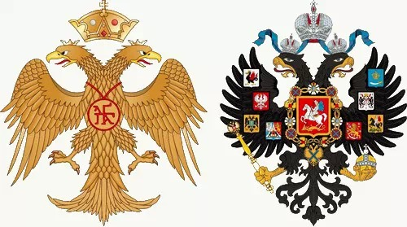

**东罗马帝国1453年灭亡前的巴列奥略王朝国徽（左）和俄罗斯帝国1917年灭亡前的罗曼诺夫王朝国徽（右）**

  

由于双头鹰在俄国的悠久历史，它已被默认为俄国的象征，故二月革命推翻沙皇后建立的临时政权，沿用了双头鹰标志，只是去掉了双头鹰头顶的皇冠，换上了象征革命解放的万
丈光芒红太阳。

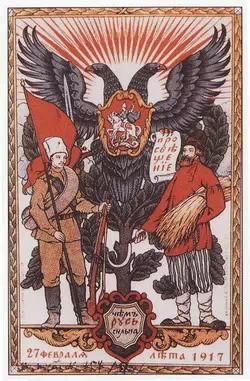

**1917年2月27日，俄国临时政府的军事占领标志，未获得法定地位，但常见于政府公文——另外注意工人阶级在旧俄国力量薄弱，所以持盾的是农民和士兵**

  

苏维埃政权建立后，列宁和他的战友们十分不喜欢充斥旧时代气味的双头鹰。于是，一套高悬镰刀锤头，中间由法西斯支撑的全新国徽出现了。

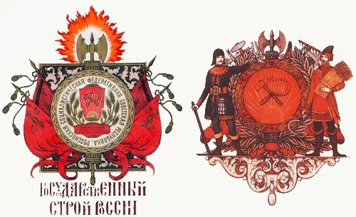

**苏维埃俄国的第一款国徽，左侧为带有花环和铭文的大纹章版本，右侧为有工农持盾的小纹章版本，注意背后的双刃斧紧束在一捆木棒中间——那就是“法西斯”**

  

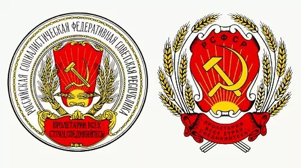

**苏维埃俄国的国徽，左侧启用于1918年，就是大纹章的中心部分，右侧启用于1920年，修改自左侧**

  

它几乎包含了今天中国人所熟悉的一切革命要素：象征革命的红色、麦穗、镰刀、斧头……等一等，这里并没有我们最熟悉的五角星！

  

没错，苏维埃俄国初期，红色五角星还是一个陌生的符号。

  

五角星什么时候进入共产主义符号系统？

  

通常认为这与红军有关。但它并非红军自觉的符号设计，而是从一战俄国散兵游勇诞生的意外。

  

1916年，随着沙俄在对德战场的逐渐崩溃，逃亡士兵越来越多，大批反战士兵成为推翻沙皇政权和推翻临时政府的重要破坏力量。苏维埃政权建立后，宣布退出第一次世界大
战，德奥前线的俄国士兵涌回国内，大量聚集在首都莫斯科。

  

这些士兵非常危险，随时可能出现秩序问题。为避免溃兵推翻政权覆辙，新政权采取了将他们与驻军分开的办法，为便于分别，军官们在归国士兵帽子上统一别了一枚锡质五角星
。选择锡制五角星的理由今天已很难考证，也许是出于材料的便利。

  

很快，俄国内战爆发，头戴五角星的士兵大量充入苏俄红军。为了显示革命军队特色，这些红星又被涂为红色。

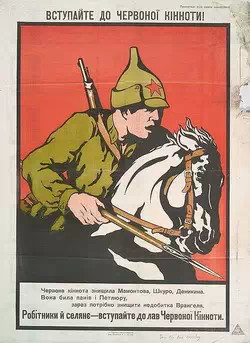

**1920年苏俄红军骑兵海报**

  

相对于白军，仓促组建的苏俄红军缺乏标志、歌曲、制服等有助于强化认同感的系统。醒目、个性、大量存在的红星，很快就成了整个红军的标志。

  

这是红色五角星的意外开端。之后的社会主义浪潮中，红星的五个角被解释成世界五大洲的革命热潮等等，这显然是后来的附会。

  

**【苏联的象征】**

  

1922年，内战基本平息，苏联正式成立。红军的声望如日中天，作为红军的象征物，红星地位自然极高，出现在苏联的第一套国徽和国旗上：

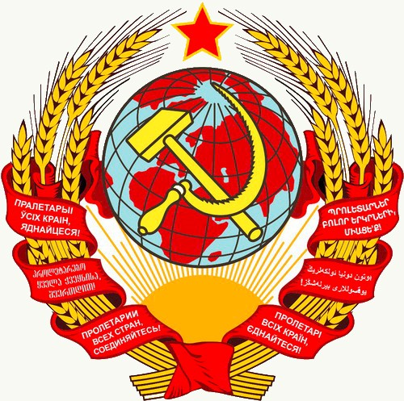

**1923年到1936年的苏联国徽**

**  
**

** 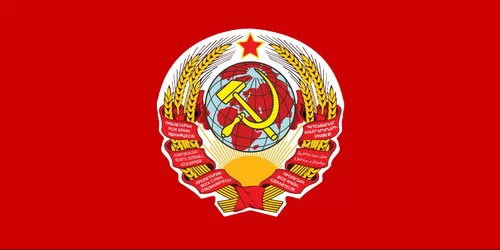 **

**苏联的第一面国旗，1923年7月6日到11月12日使用**

  

苏联的第一面国旗是典型的纹章旗，只用了4个月就设计了出来，要素繁多，稍显堆砌。五个月后，第二面国旗又出现了——镰刀锤子红星旗。

  

这面简洁、抽象的国旗已经带有了自觉的设计意味：红色背景象征工农革命洒下的鲜血，也是向半个世纪前的巴黎公社红旗致敬；黄色，或称金色，是革命光芒的颜色；五角星有
劳动者的五根手指含义，镰刀斧头含义就更为直接。

**苏联的第二面国旗**

  

这时，红色五角星俨然成了共产主义的新图腾。旧的俄国符号系统，譬如双头鹰，自然要彻底退出历史舞台。

  

双头鹰曾作为俄国的象征出现在诸多重要建筑上——最出名的当属莫斯科的克里姆林宫建筑群，它在彼得大帝迁都圣彼得堡之前一度是皇帝住所，宫内五座高塔顶上均铸有镀金双
头鹰。

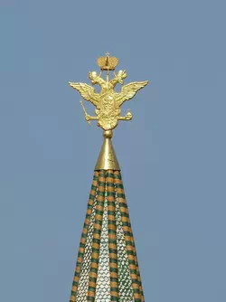

**克里姆林宫建筑群中现存的镀金双头鹰**

**  
**

** 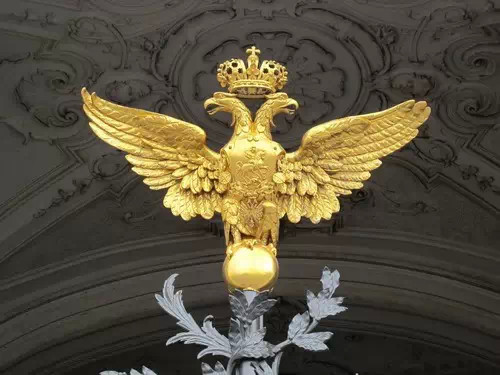 **

**圣彼得堡冬宫正门的镀金双头鹰**

  

但替换双头鹰的工程颇为浩大且成本高昂，很难一蹴而就。直到1935年，苏联人才将双头鹰撤掉，换成5颗巨大的不锈钢镀铜、镶满乌拉尔山红色宝石的五角星，称为“克里
姆林之星”（Kremlin stars）：

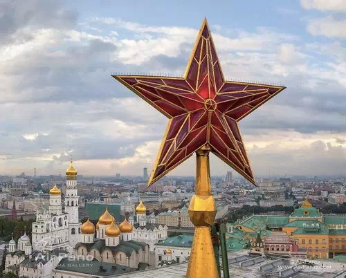

**其中一枚克里姆林之星，左边是莫斯科圣母升天大教堂、天使长大教堂和圣母领报大教堂，右边是大克里姆林宫**

  

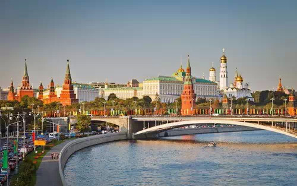

**从莫斯科河眺望克里姆林宫建筑群，五座高塔上顶着五枚克里姆林之星**

  

这是红色五角星符形逐步推广的一个缩影，苏联的克里姆林之星越来越多，作为世界共产主义运动的老大哥，红星自然会照耀在苏联之外的国土上。

  

**【红星照耀地球】**

  

十月革命后，苏维埃俄国周边的沙俄废墟上，社会主义政权纷纷建立，部分加盟进入苏联。

  

这些新政权都与旧制度划清界线，抛弃了原有的国家象征，镰刀锤子、旭日东升甚至麦穗密集出现在它们的新国徽上。

  

然而，五角星同样没有出现在第一批加盟共和国的国旗和国徽上。

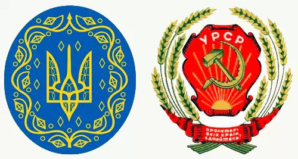

**左侧是1918年乌克兰人民共和国的国徽，从10世纪末基辅罗斯的马木留克王朝印章延续下来；右侧是乌克兰加入苏联后的国徽，直接修改自1918年的苏维埃俄国国徽，使用到1949年**

  

转折出现在第二次世界大战。苏联红军成为抵抗纳粹德国的中流砥柱，赢得全世界的瞩目，红星这个红军的标志，因此获得了前所未有的地位。即便是西方阵营，对闪耀的红星都
有着不错的认可度。

  

到了战后的50年代，五角星和镰刀锤头一道出现在苏联所有15个加盟共和国的国旗上。

**除苏维埃俄国以外苏联14个加盟共和国国旗，从左到右，从上到下，依次是乌克兰苏维埃社会主义共和国；白俄罗斯苏维埃社会主义共和国；乌兹别克苏维埃社会主义共和国；哈萨克苏维埃社会主义共和国；格鲁吉亚苏维埃社会主义共和国；阿塞拜疆苏维埃社会主义共和国；立陶宛苏维埃社会主义共和国；摩尔达维亚（摩尔多瓦）苏维埃社会主义共和国；拉脱维亚苏维埃社会主义共和国；吉尔吉斯苏维埃社会主义共和国；塔吉克苏维埃社会主义共和国；亚美尼亚苏维埃社会主义共和国；土库曼苏维埃社会主义共和国；爱沙尼亚苏维埃社会主义共和国**

  

二战后，大批殖民地、半殖民地国家独立，刚刚崛起为世界两强的苏联成为多数新政权效法的榜样，五角星当然出现在这些国家的国旗和国徽中。它们普遍将五角星当作破旧立新
的符号，被强力推广。

  

中国就是红星照耀的的新国家。

  

传统上，五角星符形并没有在中国占有重要地位。虽然中国有古老的天文观测历史，但并不像两河流域、地中海城邦国家那样崇拜明星和黄道，而更崇拜看上去众星环绕的北极星
，也就是紫微星。

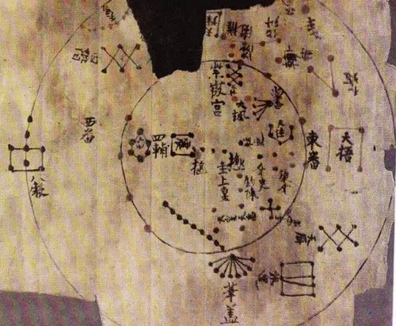

**敦煌残卷《占云气书》中的北天极星图，可见中国的星星习惯上不画光芒**

  

于是，金星的五角星轨迹没有被古代中国人重视，五角星也没有获得天文学上的位置。这不同于西方五角星符形的天文学起源**（参见大象公会《五角星：从维纳斯到后脚跟》
）**

  

中国古代，五角星唯一显著的用途是标记五行相克，但并不像新柏拉图主义那样将其提取成一个单独的符号广泛应用。

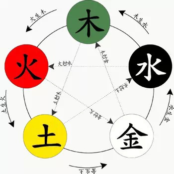

**五行相生相克图，虚线表示相克，实现表示相生**

  

直到近代，五角星在中国文化中都没什么存在感——星星和光芒在20世纪初分别成为中国的国家象征的一部分，但五角星却没有因此沾光。

  

1913年2月至1928年间，中华民国北洋政府制定“十二章国徽”，又称“嘉禾国徽”，由鲁迅、钱稻孙和许寿裳设计。

  

这是星星符形首次进入中国国徽，一个撷取了中国文化里的十二种图案组合成了西式的纹章形状——左侧的华虫（即雉鸡）头顶有长三个圆点，那就是日月星辰里的“星辰”，仍
采用中国传统的原点画法，没有角形光芒。

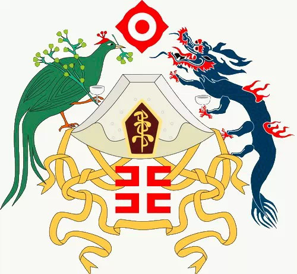

**北洋政府十二章国徽，中心有嘉禾、干、黼、粉米、山、日、黻，左侧有华虫（雉鸡）、藻、星辰、宗彝，右侧有龙、月、火、宗彝**

  

北伐后国民政府的青天白日满地红旗上，主角是太阳，而不是星星。

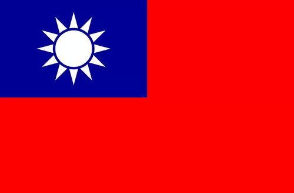

**中华民国国旗1928年启用**

  

什么时候五角星符形才开始成为重要的标识符号？

  

1927年8月1日南昌起义，中国工农革命军成立（翌年改名中国工农红军），其红色军旗上印有一枚嵌有镰刀锤子的白色五角星，红军的帽子更像苏联红军一样带有一枚红色
的五角星。这是五角星符号进入中国的重要开端。

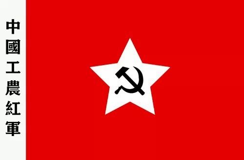

**中国工农红军军旗，1928年启用**

  

这时的五角星为红底白色。之后，红星由红军扩展，逐渐成为共产党的象征，像著名的《红星照耀中国》、《闪闪的红星》等作品，都将红星概括为共产党的象征。

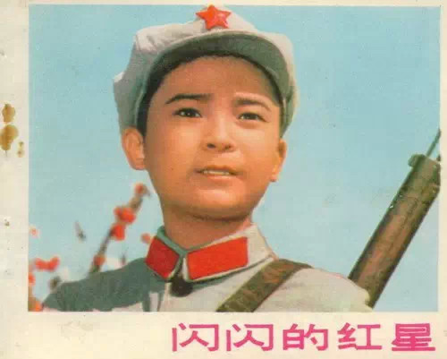

**1974年根据同名小说改编的电影《闪闪的红星》曾风靡一时，或许是为了美观，片中潘冬子头顶的是金属五角星，实际上当时红军的五角星是布制的**

  

与多数社会主义阵营的国家一样，通过政治运动、宣传，中国成功地将五角星这一外来符号纳入了国家认同。

  

但是，共产主义运动并不是五角星符形在全球推广的唯一力量——事实上它的推广，只是使五角星符的运用更多地集中于政治领域。

  

美国的崛起，才令五角星从一个宗教和贵族的符号变成了一个无处不在的大众文化符号。它的影响力贯穿方方面面，国旗、明星、评级……无不带有美国印迹。

  

_请关注五角星系列第三篇**《五角星之美国的崛起》**_

  

**版权声明**

****大象公会所有文章均为原创，****  

****版权归大象公会所有。如希望转载，****

****请事前联系我们：****

bd@idaxiang.org

****知识 | 见识 | 见闻****

阅读

__ 举报

[阅读原文](http://mp.weixin.qq.com/s?__biz=MjM5NzQwNjcyMQ==&mid=210062489&idx=1&sn
=c8f577f422a5a1df2fc79b0194763feb&scene=1#rd)

