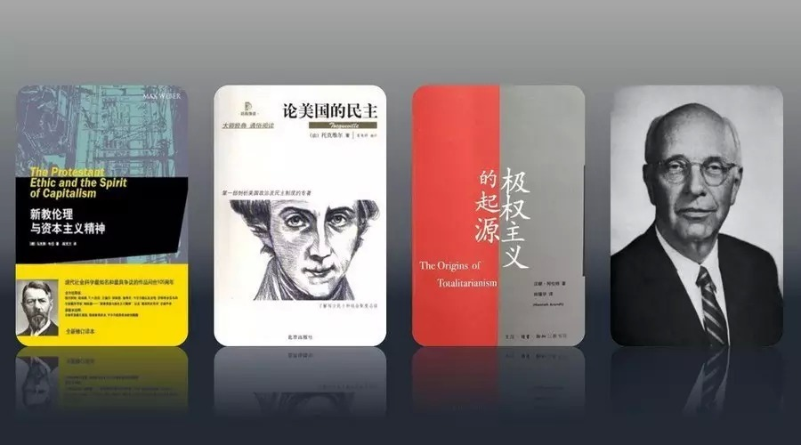
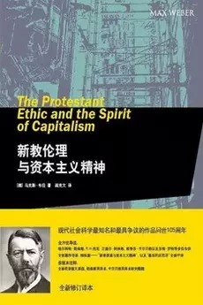
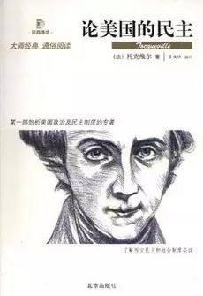
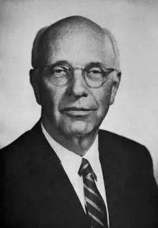

##  从《新教伦理与资本主义精神》到费正清学派  | 不必读经典

_2015-03-12_ 大象公会 大象公会

**大象公会** 

idxgh2013

知识，见识，见闻。最好的饭桌谈资。知道分子的进修基地。

__ __

_编者按：段宇宏，著名媒体人。这次由他介绍一些他认为不必读的“经典之作”。同时也在今天推送的第二条附上段宇宏阐述为何大师不必信、经典不必读的理由。_

  

**1、《新教伦理与资本主义精神》——汉传基督教人群中流行的西方非主流“经典”**

  

  

德国社会学家和哲学家马克斯•韦伯（1864-1920）作为学者，在这本经典中倒没有过于武断地下太多结论，不过在他小心谨慎的表述中，自不难明白他的观点。韦伯的
主要观点是：欧洲在宗教改革后，新教伦理与资本主义精神之间有一种因果关系，对于发展重心从天主教国家转移到西欧和北美新教国家有着决定性作用，很多成功的商界人士都
是新教徒。

  

不过，近年来，中国新近皈依的基督教知识分子对此书倍加推崇，甚至拔高到了无以复加的地步，大有“信此书（我教），才永生”的架势，谈论政治和历史，言必称《新教伦理
与资本主义精神》。他们往往把韦伯的表述无限引申，更加果断地下结论：一个民族如果不皈依新教，自然不可能铺筑起通往政治和经济现代化之路。

  

其实韦伯这本经典的论述从来没有得到过西方主流历史学家认同，他们皆认为新教徒身份与高收入之间不存在什么必然联系，韦伯只是把偶尔和局部存在的关联作为了立论依据，
并且这种“联系”，不仅在过去，在当代也从来没有存在过。

  

现在的读者不需要有多深厚的知识底子，只要稍微查询一些数据和事实即可以证伪韦伯的结论。以韦伯的祖国——今天欧洲的经济、科技发动机德国为例，其天主教徒占人口30
.8%，新教徒占30.3%，天主教徒主要分布在富裕的西部和南部，而新教徒主要分布在经济较落后的东部。韦伯的结论若成立，一个非新教徒占人口达70%的国家，怎么
能成为欧洲经济驱动器？

  

在联合国“人类发展指数”中，把世界上的国家分为极高、高、中、低四档，在极高的50个国家和地区中，前25名堪称高度发达。爱尔兰作为天主教国家（占人口84%），
近几十年发展势头极为迅猛，已跻身于世界第11名，超过瑞典、冰岛，仅在丹麦之后。东亚的日本、韩国、台湾、香港、新加坡，除了韩国的基督徒接近30%（其中新教徒1
8.3%，天主教徒10.9%），其它地区的基督徒都可忽略不计，但它们全跻身于前25名，日本现当代的综合成就，其实超过了绝大部分欧美国家。

  

而非洲的“小美利坚”——利比里亚，一个由美国进步白人帮助自由黑人建立的国家，新教徒占85%，可那是一个失败国家，连基本秩序都难以维系，人类发展指数排名第17
5名，在低档中都属末列，类似的案例还有不少。想要了解各种国家的发展历程，其实有太多当代的政治史、经济史方面的著作可供选择。

  

**2、《论美国的民主》——屌丝翻身高富帅所带红的副产品**

  
  

1831年，法国贵族托克维克赴美国考察了9个月，于1835和1840年陆续后推出了他两卷本的经典之作《论美国的民主》，他的这本经典比《新教伦理和资本主义精神
》显然更有价值。  

  

此书独特之处很多读者未必知晓，它不仅是第一部研究美国政治、社会和民情的著作，而且是那个年代罕见地对美国作出积极描述与评价的学人。

  

要知道，那个时代旅美的欧洲知识分子，极少有对美国留下好印象的，因为那还是个屌丝国家：实行着一种在欧洲看来很另类，也不知前景如何的“闹哄哄”的平民政治：人们酷
爱嚼烟叶，四处飚出发黄的唾沫；地方议会开会时像赶集，果皮纸屑四处乱扔；大家讲一口充满俚语的粗俗英语，言谈举止不似大不列颠风趣，不如法兰西那样优雅，也不像德国
人那么严谨有礼；车厢不分等级，没有隔间，几十个不同阶层的人凑到一起聊天吃喝，令来自欧洲上层社会的游客十足尴尬；首都华盛顿四处泥泞，毫无欧洲都市的富贵气派，像
个超大的村镇。

  

这部书出版以后，借着托克维克的名气在欧美知识圈子红火过一阵子，但接下来就沉寂下去了，它真正的全球走红，被译介成几十种文字不断再版，还得归功于太平洋战争——美
国自此全面介入世界事务，无意中成为世界领导者。尤其在战争期间，美国超强大的工业实力真是震撼了盟友，震惊了敌人——飞机上天像放鸽子，军舰下去像煮饺子；美军屯放
军事物资的地方，坦克和装甲车一眼望去像满地蟑螂。

  

全球的知识分子都渴望了解美国，《论美国民主》就像一本高帅富传记，自此红到发紫，行销全球。假设美国的前景像中南美洲国家一样，可能托克维克这书早被遗忘，今天没有
哪个华人知识分子会把它当经典。

  

托克维克的很多结论在当时看来相当超前，甚至在今天很多文化人也未必有此见识，如他认为美国有着优良的地理条件，且周边无强国，生存压力不大，所以不需要高额税收、庞
大的军队和强大的政府，能够持续发展自由宽松的政治。这已经远远脱离了当时盛行的文学家和和哲学家的气质，有现代历史学者的风范了。

  

但是托克维克也有不少错误的判断，他认为美国的平民政治导致它不会爱好和致力于文学、艺术和科学的发展，托克维克万万想不到百年后的美国在这方面亦成为世界头号强国，
好莱坞的文艺工业可以打遍世界无对手。

  

我对此书的评价是，若有特殊兴趣，仍值一读，只是不必神化，捧到不可超越的地步，亦没必要一谈到欧美政治和历史，不提《新教伦理与资本主义精神》和《论美国民主》就不
会写文章，开不了口的地步。

  

那个年代连英国都刚完成工业革命，今天的美国与19世纪初的美国在各方面都有了天壤之别，若要了解美国的政治、军事、经济、法律、文化历程，有太多更优秀更详尽的当代
著作可选择，当代美国大学里从事这方面研究的学者，比托克维尔能给你提供更靠谱的通识。

  

**3、《极权主义的起源》——缺乏深入见解的入门之作**

  

  

汉娜•阿伦特这本经典长期得到知识圈的推荐，很多人谈到极权主义，已经言必称汉娜•阿伦特。

  

这部经典主要缺陷是成书年代太早，资料与档案相对匮乏，阿伦特也没有在极权体制下生活的经历；这种类型的著作也不宜由哲学家来完成，因为极权体更多依靠军事、组织、宣
传、控制等技术来建立和维系，而非凭借那么多哲学大道理（虽然它需要一套理论体系），更适合历史学家和政治学者依据档案进行深入的研究，所以此书略显单薄与空泛。

  

汉娜•阿伦特把纳粹德国作为极权主义重要标本来研究，本身就有失误，她能看出法西斯与纳粹、布尔什维克的差别，但经常把后两者混为一淡，其实它们仍有巨大差异。纳粹有
民粹主义和民族主义色彩，需要迎合民粹和民族情绪，它确有一定的群众基础，布尔什维克无论组织模式还是决策结构，都是绝对的“精英主义”，阿伦特没有区分清楚。

  

极权主义来自群众，是群众的需要，这是汉娜•阿伦特的重要结论之一，若此论成立，极权体制在全球两百个国家和地区自发产生的机率将非常之高。恰恰相反，极权体制的建立
非常偶然，需要很多国际国内条件机缘巧合凑到一起（甚至绝大多数案例显示，均由外部强力介入才能缔造），一旦建立，除非犯下统治技术错误，或遭遇强大外力摧毁，它也很
难瓦解，一旦瓦解，几无再建的可能。

  

阿伦特缺乏对苏联的深刻了解，若不是50年代末出版了《斯摩棱斯克档案》使她补充了认知上的不足，她对斯大林体制了解程度大概能接近于零。她认为，是斯大林建立了极权
体制，用中央委员会架空了苏维埃，这完全就是错误的史实表述，斯大林登上权力巅峰之前，极权体制的基本框架都奠定完毕，他不过是利用组织机器完成了个人的登顶。书中对
斯大林体制及苏联历史的错误认知比较多，就不一一举例了。

  

《极权主义的起源》作为入门读物，精力充沛的话仍可一看，但也无须过度拔高和神化。同样作为入门读物，欲了解极权经典标本——斯大林体制，阿夫托尔汉诺夫的《党治制的
由来》、《权力学》虽然成书也早，但比阿伦特的作品更加细腻，有更深刻洞察力，因为作者本人是内部流亡出去的研究人员，具备从极权机器内部观察的阅历优势。

  

若对于了解极权主义有浓厚兴趣，我觉得不该依靠一本宏大叙事的著作洋洋自得了。详细知晓苏联和纳粹德国军事、组织、宣传、财政、经济运作，例如从盖世太保、党卫军、纳
粹中央宣传部到各财经部门，可供选择的优秀著作与论文实在太多，遗憾的就是能译介出版的为数极少。

  

**4、哈佛费正清学派的中国现当代史系列——一群无知学者根据二手材料的毒草“研究”**

  

  

前述经典，我觉得精力充沛尚可一读，但这个系列我主张完全放弃。这个系列的“经典”实在是多不胜数，先说费正清本人编或著的，就有《剑桥中华民国史》、《剑桥中华人民
共和国史》、《伟大的中国革命》、《观察中国》……  

  

费正清本人曾是太平洋学会的成员，著名的美国“中国通”，担任过美国驻华大使馆新闻处处长。太平洋学会是苏联在美国的战略型学术统战和情报组织，早年由洛克菲勒基金会
和卡耐基基金会赞助，出版学术刊物《太平洋季刊》。美国在那个时代，真没几个人关心外国的事情，学会由于较早从事东亚研究，太平洋战争爆发以后，美国急需大量熟悉东亚
历史、政治、语言的人才，学会就有了机会为美国国务院尤其是驻远东外交机构大量“荐才”。

  

太平洋学会为了能在美国社会立足与活动，选择成员时都比较谨慎，力避有狂热理念和言行的人物，对苏联有相当好感，或青睐苏联模式的自由左派最佳，最起码也是很温和的马
克思主义者，他们称为“粉色学人”。学会原本由斯大林的两个铁杆粉丝和美共秘密党员范弗比尔特•菲尔德、卡特尔一手操作，但因二人的政治面目太为人知，所以就交由他们
选择的“粉色学人”来打理。

  

考察太平洋学会的出版的论文和著作不难发现，打个比喻的话，是用《纽约时报》文风包装《真理报》的观点；用美国自由派语言来含蓄表述和赞扬苏联的模式与理念。因为它有
着学术的名义，再加上这种巧妙的包装，所以看上去更具“客观性”、“可读性”、“学术性”，一般读者的确看不出。

  

五十年代初，因为美国陆军情报部门意外截获大量苏联电报，发现苏联利用美共和各种统战组织对美国政府、学界、新闻界进行大渗透，所以才建立了专业反谍机关——CIA，
在CIA完善起来前，FBI就暂时承担起反谍重任。加上外交政策的屡屡失败，美国社会普遍质疑下，太平洋学会逐渐走上式微，它一度企图放弃学术面目，公开散发武装暴动
传单，曾遭到美国税务部门取缔了学术组织的免税资格，不过后来又通过打官司要回了资格，但经此打击一路衰败，所幸在福特基金会赞助下，由费正清牵头，在哈佛大学落地为
“东亚研究中心”，也叫费正清中心。

  

费正清以此为基地，借助以前太平洋学会和他本人的名声，培养了大量的学生，吸纳了很多同道，出版了不少著作，形成了费正清学派，其学术活动并不局限于哈佛大学。至少在
1989年和1991年苏联解体前，由费正清学派、白修德和史迪威三方交融互动构成的著作、材料，携着美国地位和哈佛的名声，对欧美和海外华人世界的中国现当代史学影
响深远，甚至影响超出了学界，很多研究中国问题的欧美自由派记者在撰写书稿时，也会参考他们的著作，所以也可叫作“泛费正清学派”。

  

关于中国现代当史，围绕着毛泽东主义、中国革命模式等等问题，五六十年代，以费正清学派为首，与欧美的保守派学者进行过大论战；六七十年代，又与欧洲的西马派（西方马
克思主义）学者、社民派发生论战，史称“自由派”与“左派”的大争论。今天回过头来看，当时的保守派、左派未必都正确，但比号称“自由派”的费正清学派更靠谱得多。

  

1949年后，欧美研究中国现当代史的作品，费正清学派著作，在略作删改后，几乎享有独特的出版优势（最疯狂的年代除外）。1990年后，费正清学派的学者普遍对之前
的观点进行了修正，但都不再引进出版，费正清本人就撰写了人生最后一本书《费正清论中国：中国新史》（未能引进出版）。客观地讲，即便是修正了，也非常糟糕，费正清无
非以前认为“虎”是“羊”，后来修正为“虎”是“狼”。知识体系的陈旧单薄，见识上的愚蠢无法更改，这一点在费正清学派中年纪偏大的那些学人中，体现得尤为明显。

  

常见的泛费正清学派作品不完全列表：

**易劳逸：《流产的革命》、《毁灭的种子》**

**施拉姆：《毛泽政治思想》、《诗人毛泽东》、《一个人与他的学说》、《毛泽东传》**

**陈志让：《毛泽东与中国革命》、《军绅政权》**

**罗斯•特里尔：《毛泽东传》**

**麦克•法夸尔：《文化大革命的起源》**

**史华慈：《中国的共产主义和毛泽东的崛起》、《毛泽东主义的“传说”的传说》、《共产主义与中国：思想和变革》**

**（注：史华慈亦是费正清研究中副主任，有西方当代“毛泽东学”奠基人之称）**

**胡素珊：《中国内战》**

**  
**

排除掉前面所说的太平洋学会学术渊源之类的背景不说，哈佛东亚研究中心关于中国现当代史的作品，90年代之前出版的，又能引进中国的，20世纪前30年出生的那批学者
所撰写的作品，几乎没有什么价值，若某一本中可能有10%的价值，但去受另外90%的毒害，实在不划算。

  

这些作品成书年代过早，大多出自50至80年代，那个时候连可依赖的靠谱二手材料都寥寥无几。可叹的是，像50年代施拉姆、特里尔、迪克•威尔逊等人写的传记，多依赖
斯诺、史沫莱特、爱泼斯坦、路易•斯特朗等西方左翼记者的二手材料，以及官方早年公开发表的文告、消息。

  

当时的学科发展水平非常低，那波学者们的知识结构老旧不堪，施拉姆，号称中共党史和毛泽东研究大家，其实是个半路出家的物理研究员，此前从无共运史和中国文史底子。

  

中国现当代命运与国际历史进程密不可分，甚至地缘政治带来的外因是造成历史演变的重要因素，研究中国现当代史，不具备世界现当代史、苏联史、共运史、冷战史、军事史、
经济史方面的底子，不依托一手档案和文献，不吸纳最新的研究成果，怎么可能靠谱。全球共产主义革命史，从东欧到东亚，从东南亚到西亚，从非洲到南美、从西欧到北美，涉
及到的军事、经济、政治、民族、宗教、情报、组织、宣传、地缘关系……这些远远超出了哈佛费派老头老太们的知识能力，他们都是两眼一摸黑。

  

苏东剧变后，随着东欧、苏联、东南亚、英国、美国档案（如维诺娜档案、米特罗欣档案）的大量解禁，世界史、中国现当代史的研究都飞升了七八个台阶，新研究成果层出不穷
，前述费正清学派作品中错漏百出的史实和观点，很多早就被近二十年的研究所更正。

  

按理来说，一个国家的历史和人物的研究，应该本国学者最靠谱，外国人始终有穿越不了的语言、文化障碍，但可叹的是，国情实在太特殊，前述过气的一堆破书，每隔两三年都
会被重新包装后当作经典隆重推出，热卖一番。影视剧编剧们写作剧本，那也是他们重点参考的材料。

  

罗斯•特里尔写的那本不靠谱传记，每次推出还着重强调“最新全译版”，且不说那书有没价值，与英文原版对照，里面多处被大动手脚进行过篡改，每次看见一堆人读了这类二
次处理的老古董写心得、发感慨、著专栏，甚至以为捡到了稀世宝贝，找到了开启现当代中国史大门的金钥匙，实在忍俊不禁。

  

费正清学派在海外的影响力自苏联解体后逐渐消解，其实新一代知识底子更好，依托一手档案研究的西方学者，其中以剑桥教授方德万为代表（代表作《中国民族主义及战争》）
，还有托马斯•罗斯基（Thomas Rawski）、付大伟（David Faure）、布兰特(Loren Brandt)、安克强（Christian
Henriot）、朱莉娅•斯特劳斯(Julia Strauss)等学人，早就向费正清学派发起挑战，成果颇为丰硕。

  

华人学界虽然在国际视野和研究环境方面仍有缺陷，也无法构筑起清晰的现当代史脉络和正确理论，但诸多优秀学者在不同领域和具体问题研究上也成绩斐然，杨天石、杨奎松、
王奇生、沈志华、黄道炫、陈永发、陈耀煌、郭岱君等人绝对比那些哈佛老费们更靠谱，不过，谁叫那些被吹成了大师和经典。

  

但费正清学派在中国自由派知识分子中的影响力仍然巨大（学术和出版落后的原因）。这些知识分子出于对官方史学的不信任，把目光投向了外面，结果没想到一头扎到了披着自
由女神外衣的苏斯洛夫怀里，还以为在纽约登了岸。

  

**（更多段宇宏对于那些“不必读经典”的吐槽与内心戏，请看今天推送的第二条——段宇宏谈<不必读经典>）**

**  
**

**版权声明**

****大象公会所有文章均为原创，****  

****版权归大象公会所有。如希望转载，****

****请事前联系我们：****

bd@idaxiang.org

****知识 | 见识 | 见闻****

阅读

__ 举报

[阅读原文](http://mp.weixin.qq.com/s?__biz=MjM5NzQwNjcyMQ==&mid=211387104&idx=1&sn
=b98a6e0a097712b1f89f93e49b5a0e99&scene=1#rd)

