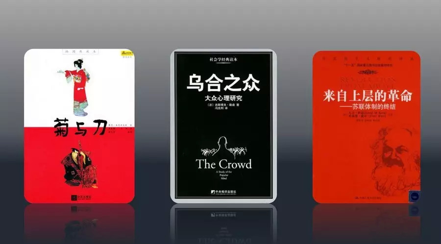
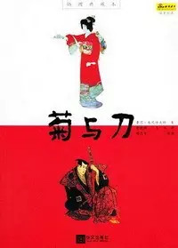
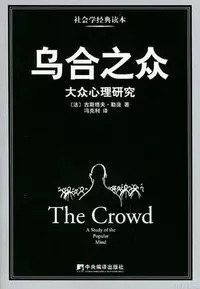
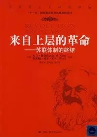

##  从《菊与刀》到《乌合之众》  | 不必读经典

_2015-02-28_ 大象公会 大象公会

**大象公会**

idxgh2013

知识，见识，见闻。最好的饭桌谈资。知道分子的进修基地。

__ __

**文/黄章晋**

  

大象公会微信和微博后台，经常见到这样的留言：推荐几本靠谱的书吧、很好奇你们在读什么书、开个书单呗。

  

这让我们很为难。

  

要说推荐书，豆瓣上多的是书单狂魔。而且，我们团队的成员及作者，在那些书单狂魔们开出的必读经典书单面前，对半会觉得自己像是文盲。

  

我相信很多人和我一样，经典书不断占据家中有限的空间，让你产生持续的挫败感，因为你可能永远不会真正去读它们。以正常读书速度，那些经典你是永远也读不完的。

  

更要命的是，在我认真啃过一些书后，痛苦地发现，除非你是做思想史的研究，否则很多经典书籍，根本不必浪费时间去读。在我看来，如果你真对某个领域的话题感兴趣，与其
去读经典，还不如去下载论文和新著。

  

在涉及到精神层面的成果时，我们很容易高看前人留下的遗产，认为今不如昔，但在学术研究上，今人无论是从方法论，还是大规模社会协作带来的数据、资料的搜集整理条件上
，都比前人有压倒优势。

  

有这种看法的当然并不只是我一个人，但是大家心里虽然这么想，但是否敢于公开说出来，则是另外一回事。苦读过各种经典的人，敢于给人开经典必读书单的人，当然比质疑经
典是否有效的人有更强大的心理优势。

  

所谓经典，我们通常认为是经历过时间检验的人类智慧的结晶。

  

但“时间的检验”其实是非常主观的，经典并不都是因为它获得了学术共同体公认的思想史地位，很多书能成为经典，很大程度上是因为它们曾经热门过。而热门有时带有极大偶
然性，譬如托克维尔的《旧制度与大革命》变成人人谈论的经典是二战刚结束时，其起因并不是人们突然对法国大革命产生了兴趣，很大程度上是因为它当时被列入便于美国人迅
速了解法国这个盟国的推荐书单。今天它在中国再度热门，更是因为高层的推荐。

  

类似的例子还有托马斯•索威尔的《美国种族简史》，这本1981年出版的书，在美国和中国都只有几千的销量，但30年后突然在中国热卖了几万本，不是因为中国今天的民
族问题让人们把眼光投向美国，仅仅是罗永浩无意在旧书店中看到它后大力推荐的结果。

  

刘瑜的《从经典到经验》勇敢地道出很多经典不过是皇帝的新装。正是这篇文章，触发了我们尝试做一个不必读之经典系列，我们组织一批阅读偏好不同的作者，“推荐”各自心
目中不必阅读的经典。——推荐好书，还不如先从“推荐”不必读的经典开始。

  

下面，你将读到的是这个系列的第一篇，由我先“推荐”三本经典。

  

**1.《菊与刀》：早该摒弃的时代局限与偏见**

  

在我看来，排名第一的当属《菊与刀》。作者鲁思•本尼迪克是位人类学家，她的学术身份无疑是本书权威性的背书。但这本书或许对当年的美国人有用，对今天打算真正了解日
本的中国人来说，只会起到相反作用，它不是那种不必读的经典，而是根本就不应该读，读过要排毒的经典。

  

本书让中国人喜欢，除了日本本身外，或许是从头到尾都在谈的“国民性”复合中国人的胃口。改革开放后，反省中国人的“民族劣根性”就是个热门话题，但“国民性”是个过
时观念，在认识论上不但有倒因为果之嫌，而且将个体、集体的某种行为共性视为不变的特质和解释源头。二战后，西方几乎见不到学术界还有人探讨“国民性”，我目力所及，
好像只有两位华人学者在六七十年代还有过国民性的论著。

  

《菊与刀》这本学术恐龙著作在中国获得好评，最不可思议的地方，是中国人居然很乐于接受作者强烈的西方文化中心论：日本文化是没有“罪感”只有“耻感”的，在“耻文化
”下，善行是依靠外部的强制力来维系的，而在“罪感文化”中则依靠罪恶感在内心的反省。这一所谓的“知耻不知罪”理论，几乎总是被中国人拿来解释日本为什么缺乏真诚的
忏悔。

  

问题是：1、所谓的日本文化特征，几乎就是东方文化的共性，中国人与日本人并无区别；2、源于基督教原罪说的“罪感文化”果然就比非基督教文化的社会天然有更强的忏悔
意识吗？不见得。干坏事远比日本人多的那一代德国人，在占领之初，哪见得到他们有更好的悔罪意识。盟国占领军对德国的观念改造远比日本更强烈，曾强制德国人集体观看纳
粹暴行的纪录片，但当时很多人的反应是努力把头别过去或埋着头拒绝接受。

  

以今天的资讯，了解日本非常容易，但遗憾的是，无数人在介绍日本时，依然套用《菊与刀》的论断，如果日本人依然袭用二战前日本各种论述中国国民性的东西看中国，你会怎
么看——那些日本人对中国人的观察，远比从没去过日本的本尼迪克的观察更细致。

  

**2.《乌合之众——大众心理研究》：标题比内容精彩的空洞口号**

  

古斯塔夫•勒庞的《乌合之众——大众心理研究》是各个经典书单的常客，如果把“乌合之众”这个精彩书名去掉，不知它是否还有这样的地位和影响力。

  

如果你希望掌握更多给喜欢鼓吹民主的“公知”打脸的知识，《乌合之众》就是本必读经典，它是本很过瘾的吐槽集，能让人产生强烈的智力上升的快感，合上书那一刻，你会发
现你与民粹分子站在五百米开外的地方，头脑清楚到恨不得抽身拍拍自己肩膀夸自己一下。

  

它甚至对一些有远大理想的人来说也是有用的，如果你想搞传销、成为被崇拜的偶像或领袖，这本工具书或许能提升你的段位。第一次看这本书时，我惊讶地发现希特勒的很多言
论与之似曾相识。

  

如果你果真对大众心理好奇，这本书就该扔在一边。今天大众心理研究已被不断细分为多个领域，按照庸俗的学术套路，勒庞的《乌合之众》不但很难被归类，甚至不能算严格的
学术著作——它基本上没有清晰的概念辨析，也省略了必要的逻辑推理，它是用举例和激情澎湃的价值判断来感染人的。

  

如果你真对革命、对社运这类话题感兴趣，这本书也该扔在一边。这本书无论是在事实性的了解，还是技术性分析上，都没有什么帮助，今天相关的研究专著真可用汗牛充栋来形
容。如果你只是为了巩固自己的成见，本书倒是不错。

  

《乌合之众》对拉丁人“国民性”的批判会让人觉得特别过瘾，因为这会自动被脑补为对中国国民性的批判。而且它又是这样的警句迭出、痛快淋漓，非常适合中国人用来批评中
国人，世界上还有谁比中国人更瞧不起中国人的？

  

更重要的是，它特别符合多数中国人对中国革命、对文革的理解——而且几乎是不分左右的——但这种共同认识的基础，恰恰是对中国历史的普遍误读。

  

我不推荐它的理由是，虽然《乌合之众》是经典著作中比较薄的，但对真正需要它来巩固自己看法的人来说，还是稍嫌太厚，“韩三篇”（韩寒的《谈革命》、《说民主》、《要
自由》）的长度显然更合适，因为可以这样认为，“韩三篇”是《乌合之众》的中华田园版。

  

**3.《来自上层的革命》：中国国情导致的特殊追捧**

  

我要“推荐”的第三本其实算不上经典，因为《来自上层的革命》只是一本新书，但它在今日中国获得的特殊好评和地位，完全有可能成为长盛不衰的经典——有心人应该注意到
，无论是此书还是此书作者，都在中国获得了特殊的追捧。

  

它受推崇主要是因为推翻了关于苏联帝国解体最常见的原因总结：经济难以维系陷入严重财政危机、道义破产被人民抛弃，而是给出了一个异乎寻常的答案，苏联帝国的崩溃，是
苏联高层精英有意识追求的结果——这样他们可以将苏联体制下积累的个人财富合法化并能留给后代。

  

这是一个违背事实和常识的结论。

  

我们且不说苏联七十年代就已变成了一个隐性的权力世袭社会。仅按通常的博弈策略来讲，它也不合基本逻辑：

  

牌桌上的牌手谁更愿意修改游戏规则，是游戏规则对自己有利、且已握有大量筹码的赢家，还是规则对自己不利且手上没有筹码的玩家？常理下，规则对自己有利且握有大把筹码
的玩家，天然会倾向于规避风险的稳健策略，因为他们很难确保新规则对自己更有利，而规则对自己不利且没有筹码的玩家则通常倾向于改变规则。

  

但《来自上层的革命》的作者却告诉我们一个相反的结论。难怪有人根据这本书得出这样一个推论：今天的中国，最希望今天中国体制剧变的，反而是那些整天忙着提醒大众不能
走苏联老路、稳定压倒一切的人。

  

本书为了证明独特观点，在《党-国精英与亲资本主义联盟》一章开头介绍美国高级官员甚至中产阶级享受的物质条件远优于苏联高层，由此做出结论，但接下来罗列成为私营企
业主的大量党国精英，却几乎全是苏联青年党团干部以及科学家和工程师，其实，他们下海获得新身份，已自动放弃了对苏联存续的发言权和决定权——如果他们有的话。

  

我恰好组织过苏联解体的专题报道，我的同事们大量采访了苏联时代的高层旧官僚。事实是，当年苏联的高层旧官僚，整体上被时代抛弃，即使后来成为新贵的那些人，多数也曾
有过一夜之间被扫地出门短暂失意的日子。

  

如何总结苏联帝国的崩溃，或许事关俄罗斯的未来。俄罗斯前总理盖达尔在《帝国的消亡》一书中忧虑俄罗斯的未来，他认为俄罗斯很像希特勒崛起前的魏玛共和国：德意志帝国
瓦解的真相被种种阴谋论掩盖，人们也忘了自己曾多么憎恨旧帝国。盖达尔认为潘多拉的魔盒已在俄罗斯打开：人们的怀旧情绪被用来煽动民族主义、排外、反美、反欧，一切像
是希特勒崛起的再现。

  

《来自上层的革命》这种奇怪的看法，只能认为他们太热爱苏联体制了，事实也正是如此。不过作者不乏真知灼见，譬如作者在中文版序言结尾预言道：“当石油价格回复到更正
常的水平时，俄罗斯将可能重新开始长达十年的衰退”。不过最后一句话显然错得连普京也不能同意：“俄罗斯人美好未来的唯一希望，在于摆脱新自由主义的策略。”

  

**版权声明**

****大象公会所有文章均为原创，****  

****版权归大象公会所有。如希望转载，****

****请事前联系我们：****

bd@idaxiang.org

****知识 | 见识 | 见闻****

阅读

__ 举报

[阅读原文](http://mp.weixin.qq.com/s?__biz=MjM5NzQwNjcyMQ==&mid=211069713&idx=1&sn
=f9b27b22d6bbbca750910fc3055a80a7&scene=1#rd)

