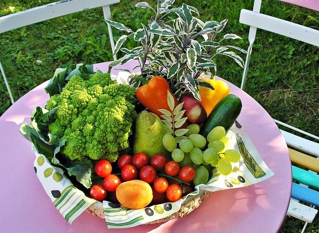

##  你与众不同的饮食选择是个社交优势

_2015-03-05_ _史蒂夫**帕弗利纳_ 聪明人的个人发展 聪明人的个人发展

**聪明人的个人发展**

stevepavlinachina

个人成长，与你同行

__ __

图片来源：avantrend

  

人们感觉在社交环境中吃得跟其他人都不一样时，就会处于社交劣势，好像自己必须要顺从别人才能融入环境。我倒是发现这种想法挺讽刺（还有点笨）。

  

恰恰相反，顺从他人才会将你置于巨大的社交劣势。与众不同是天赐良机。吃得别具一格能极大提升你的社交生活。

  

作为一名17年的纯素主义者和偶尔的原生素食人士（我本月就在吃未经任何烹调的原生素食），我深知和所有人都吃得毫不相同，给自己带来的巨大社交优势。它令人们感到好
奇，频频使大家不知不觉进入食物选择的沟通交谈。

  

这种好奇行为本身对我而言极其无聊（而且它的发生完全预想得到）。不过，这样的开场白很快可以转变为谈论个人成长与探索的其他方面，比如问对方：“那么你又倾向在生活
里哪些方面违反社会期待呢？”之后你就能发现别人的某些极为有趣之处。你们甚至会因各自不同的另类之处而团结联系到一起。

  

最棒的是，人们将更容易记住你。他们会忘掉其他所有吃得和其预想一致的人。但你将被轻松记住。

  

倘若你吃得与自己社交圈中的其他人完全不同，请为之骄傲。骄傲于你清醒自主的选择。看出它真正具备的巨大优势。

  

不要用社交压力作为自己没有改善饮食选择的借口。那样很蠢。也千万别拿你的饮食选择作为回避社交的借口。那样也很蠢。

  

  

Steve Pavlina

2014.01.03

  

  

阅读原文

阅读

__ 举报

[阅读原文](http://mp.weixin.qq.com/s?__biz=MzA3NzIyNTQ3NA==&mid=206119363&idx=1&sn
=d50a963e528d8780acd3d263e3d55977&scene=1#rd)

