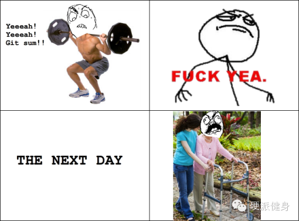
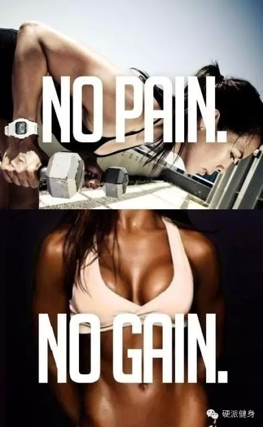
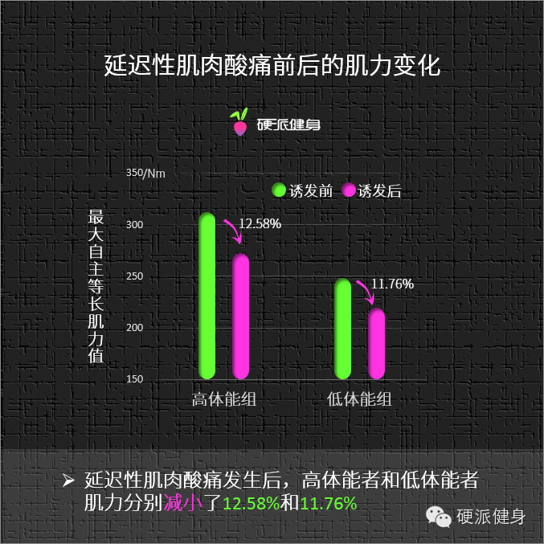
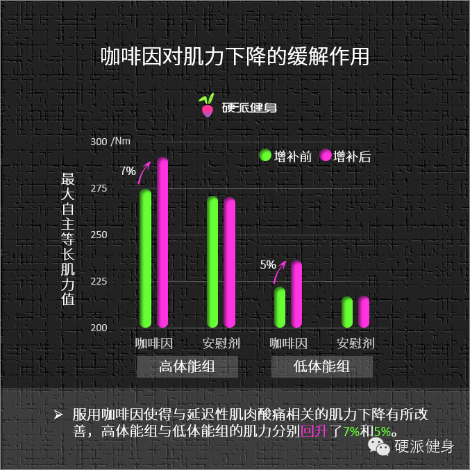
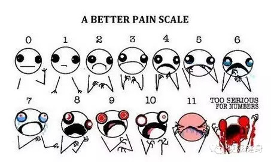
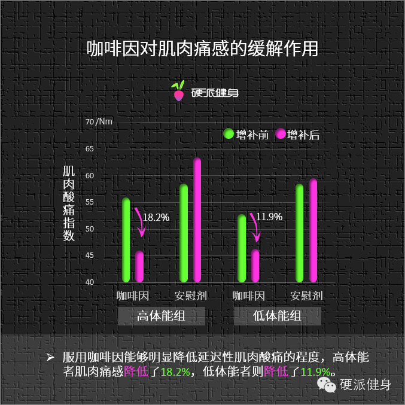
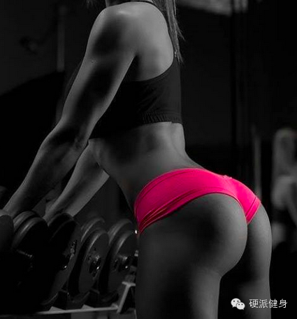

##  健身后，腰酸腿疼训练效果差？

_2015-03-12_ _斌卡_ 硬派健身 硬派健身

**硬派健身** 

oh-hard

最专业  **  靠谱  **  蠢萌的运动健身科普

__ __

  

> #### 内容概要

>

>   * 运动后肌肉酸痛。这酸爽让人难以置信……

>

>   * 肌肉酸痛不仅疼，还会影响训练哦。

>

>   * 喝咖啡，腰不酸腿不疼，训练更有劲儿～！

>

>   * 咖啡，解痛灵药～

>

>   * 喝多少才好？

运动后肌肉酸痛？  

  

春节归来，很多童鞋应该已经积极地开始减肥了。大吃大喝一周胖了三斤，却要花更多的时间来减掉，所谓得不偿失，不外如此。

  

久不进健身房，许多与健身相关的感觉也将重新回来，最典型的，比如第二天醒来的感觉一定是……

  

久违的酸爽……

  

_　__健身第一天：猛似虎～～_

_健身第二天：疼如狗……_

  

在高强度的训练之后，很多人往往会浑身酸痛不已。这种现象被称之为运动后肌肉酸疼，也就是我们常说的DOMS，多在运动后12-24小时出现。

  

虽然产生肌肉酸疼的原因我们目前还不清楚，不过推测多与肌纤维断裂导致的离子过载有关。（回复 DOMS 了解更多）

  

  

  

我们之前说过训练后肌肉酸痛的话，不练只会更痛。但坚持训练，力量又会变小，训练效果也大打折扣。

  

很多人就问啦：有没有什么解决办法呢？

  

上一回，我们说到了咖啡是你手边能获取的最佳运动补剂。不仅能**增加你的运动耐力，还能大大能增加你的减脂效果**。（回复：咖啡01了解更多）

  

那么这一次，我们就来说说咖啡对运动后肌肉酸疼的影响。

肌肉酸疼，让你第二次训练受损！

  

很多训后肌肉酸痛的童鞋可能已经发现了，在那时期训练效果会特别差，这是因为，DOMS的确会让肌力变小。

  

一项研究发现，**无论你的体能是高是低，当出现****运动后肌肉酸疼，你的最大力量都会减小。**  

  

科学家召集了一些人，测量了他们在肌肉酸痛的情况下的运动效果，结果发现，无论受试者的体能如何，肌肉酸痛后的最大力量都有明显减少。

  

  
实验数据表明，在运动后肌肉酸疼的时候，高体能者的肌力减小了12%多，低体能者也减小了11.7%。

  

换句话说，如果你平时1RM的卧推是100公斤，那么酸疼的时候就只能推起80多公斤。如果你力量比较小，平时卧推只能推起20公斤，运动后肌肉酸疼一样会影响到你的
训练，那时候你只能推起17、18公斤。（不过估计初尝酸痛的你都不想去了……）

  

很多人看到这里可能就哭了，心想：我忍痛在练已经这么辛苦了，力量也跟着减小，训练效果变差，到底还让不让人活了？

  

不用担心，这个时候可以祭出我们之前所说的，性价比最高的补剂！

喝咖啡，浑身不疼，训练有劲！

  

一项来自台湾的实验发现，**咖啡能够让受损的肌力得到恢复，并能减轻运动后肌肉酸痛感。**

  

研究者让高体能和低体能的训练者均摄入了10mg/kg体重的咖啡因或安慰剂，并对他们发生肌肉酸痛后肌肉力量进行了测量①。

  

  

实验结果显示，高体能组的被试者在服用咖啡因后，肌肉酸痛引起的肌力下降情况有所改善，最大肌肉力量增长了7%之多，相比对照组增加明显。

  

而对于体能较低的训练者而言，咖啡因对肌肉酸痛导致的肌力下降也同样有所改善，使得肌肉酸痛后的最大肌肉力量增长了5%之多。

  

所以下次当你训练完肌肉酸疼的时候，最好第二天**在训前喝杯咖啡，这样不仅可以提高你训练中和训练后的脂肪和能量消耗，还能让肌肉酸痛导致的最大力量下降能有所改善
，以免影响训练的效果。**

咖啡因的镇痛作用

  

除此之外，**咖啡还可以让你的酸疼缓解哦~！**

  

有一组实验证明了这一点，首先科学家把疼痛分为了十个等级：

  

  

  

科学家们分别测了受试者训练前和训练后对疼痛的感受，结果发现假如受试者练完后有6分疼，摄入咖啡因可以帮助你把疼痛降到4分②。

  

  

  

也就是说，训练结束，如果你觉得肌肉酸痛的话，那么喝一杯咖啡也能有效地降低疼痛的感觉。

  

这一条同样也适用于体力一般的人，如果你因为出差或者别的原因，在久不运动后忽然运动，担心自己第二天醒来会疼痛难忍的话，那么在训练后及时喝一杯咖啡，第二天就不会
那么痛苦啦！

  

至于原因，就要从咖啡因的镇痛效用说起了。

  

咖啡因除了能让中枢神经兴奋外，也一直以止痛功能而闻名于世。在绝大部分非处方止痛药中都含有一定的咖啡因成分，比如治疗偏头痛或集束性头痛的药物。

  

  

也就是说，咖啡不仅能减脂、增加运动耐力。在你平时运动时，还可以缓解你前一天的肌肉酸痛，恢复你的训练力量！（以前提到过运动后饮用可以增加肌糖原储备）

  

这就是为什么我们一直认为咖啡是综合性价比最好的健身补剂的原因。

怎么喝？喝多少？

  

那么咖啡具体该怎么饮用呢？  

  

一般的推荐是，在训练前一小时左右摄入3-5mg/kg体重，比如你体重为50公斤，那么在训练前喝150mg-
250mg左右就差不多了。训练后可以再喝2-3mg/kg体重，增加肌糖原储备。

  

也就是说，你可以在训练前喝杯麦当劳大杯咖啡或两袋速溶咖啡……训后再来杯小红牛或者1袋速溶咖啡就好了～

  

另外除了咖啡之外一般的饮料中也含有咖啡因，我们之前发过一张各种饮料中的咖啡因含量表，读者们可以拿来做参考。（回复：咖啡因含量 可以查看。
表数据来源网络，实际自制咖啡会随品种和制作差异改变哦。）

  

当然，饮料中含有糖分和色素等对健康不利的东西，我们的建议还是自己做啦～不过要记得，千万不要加奶和糖喔！

  

本专题下期预告

oh-hard

咖啡对力量训练有提升吗？

  

  

* * *

①陳厚諭, 王鶴森. 咖啡因增補對不同體能水準之延遲性肌肉酸痛的影響[J]. 臺灣師範大學體育學系學位論文, 2007

②张羽冠, 申乐, 许力, 等. 咖啡因对急慢性疼痛的调控及其可能的机制[J]. 中国医学科学院学报,2014

阅读

__ 举报

[阅读原文](http://mp.weixin.qq.com/s?__biz=MzA5NjQwMTQxOA==&mid=206703365&idx=1&sn
=3e61112302c91e397768fdf4c249b0b3&scene=1#rd)

